# Amar Elaka — Database Schema Design

**Status:** Draft for review. No SQL, no migrations.
**Date:** 2026-09-17
**Target:** PostgreSQL 16 + PostGIS 3.4 (extensions available: `postgis`, `pg_trgm`, `uuid-ossp`, `unaccent`, `btree_gist`)
**Scope:** Logical data model for all ten domains, RLS model, ERD, decisions, open questions.

## Contents

0. Global conventions
1. ERD & table inventory
2. Tenancy & identity
3. Catalog (categories, custom fields, locations)
4. Content (media, posts, places, claims)
5. Stores & sellers
6. Commerce (credits, boosts, subscriptions, invoices, ad inventory)
7. Payments & revenue share
8. Communication (chat, notifications, lead tracking)
9. Trust (reviews, verification, reports, blacklist, trust score)
10. Local information
11. Operations
12. Enum tables
13. Decisions & tradeoffs
14. Open questions
15. Migration, seed & test plan

---

## 0. Global conventions

These rules apply to every table. They are written down once here and not
repeated for each table.

### 0.1 Column shorthands

Column tables below use four shorthands. Each one expands to **exactly** these columns:

**`<pk>`**

| column | type   | null | default              | comment                                                        |
| ------ | ------ | ---- | -------------------- | -------------------------------------------------------------- |
| `id`   | `uuid` | NO   | `uuid_generate_v7()` | Primary key. Time-sortable, so `order by id` ≈ creation order. |

**`<tenant>`**: only on TENANT-SCOPED tables

| column      | type   | null | default               | comment                                                                                                                                                      |
| ----------- | ------ | ---- | --------------------- | ------------------------------------------------------------------------------------------------------------------------------------------------------------ |
| `tenant_id` | `uuid` | NO   | `current_tenant_id()` | Owning tenant. FK → `tenants(id)` ON DELETE RESTRICT. Default picks up the request tenant; if none is set the default is NULL and the NOT NULL fails closed. |

**`<audit>`**

| column       | type          | null | default | comment                                                 |
| ------------ | ------------- | ---- | ------- | ------------------------------------------------------- |
| `created_at` | `timestamptz` | NO   | `now()` | UTC.                                                    |
| `updated_at` | `timestamptz` | NO   | `now()` | UTC. Maintained by a shared `set_updated_at()` trigger. |

**`<audit+soft>`** = `<audit>` plus:

| column       | type          | null | default | comment                                                        |
| ------------ | ------------- | ---- | ------- | -------------------------------------------------------------- |
| `deleted_at` | `timestamptz` | YES  | —       | Soft-delete tombstone. Read paths filter `deleted_at is null`. |

### 0.2 Types

| Concept           | Type                                | Notes                                                                                                                                           |
| ----------------- | ----------------------------------- | ----------------------------------------------------------------------------------------------------------------------------------------------- |
| Primary keys      | `uuid` via `uuid_generate_v7()`     | Our own SQL helper. PG16 has no native v7 (`uuidv7()` arrives in PG18) and `uuid-ossp` only does v1/v4. The helper must be the first migration. |
| Money             | `numeric(12,2)`                     | BDT unless a `currency` column says otherwise. Max 9,999,999,999.99. Never float, and never inside `jsonb`.                                     |
| Credits           | `integer`                           | Whole credits. Never mixed with money columns.                                                                                                  |
| Instants          | `timestamptz`                       | Stored and compared in UTC. The app localises to `Asia/Dhaka`.                                                                                  |
| Calendar dates    | `date`                              | Only where the business meaning is a **Dhaka calendar day** (bazar price day, settlement period, ad booking day). See §13.15.                   |
| Wall-clock times  | `time`                              | Only for recurring local schedules (opening hours, bus departures). See §13.15.                                                                 |
| Points            | `geography(Point, 4326)`            | Distances in metres, no projection maths.                                                                                                       |
| Boundaries        | `geography(MultiPolygon, 4326)`     | Admin-area polygons.                                                                                                                            |
| Phone             | `text`                              | E.164 (`+8801XXXXXXXXX`), normalised before insert, `CHECK (col ~ '^\+[1-9][0-9]{7,14}$')`.                                                     |
| Free text         | `text`                              | No `varchar(n)`. Length limits live in zod.                                                                                                     |
| Slugs / hostnames | `text` + `CHECK (col = lower(col))` | `citext` is not installed. We won't add an extension just for this.                                                                             |
| Percentages       | `numeric(5,2)`                      | `CHECK (col between 0 and 100)`.                                                                                                                |
| Dynamic shapes    | `jsonb`                             | Only for genuinely dynamic data (custom fields, provider payloads, snapshots).                                                                  |

### 0.3 Enum tables

Per the constraint, closed-ish value sets are **GLOBAL lookup tables**, not
Postgres enums. Every enum table has exactly this shape:

| column       | type      | null | default | comment                                                                                            |
| ------------ | --------- | ---- | ------- | -------------------------------------------------------------------------------------------------- |
| `code`       | `text`    | NO   | —       | PK. Stable machine key, `snake_case`, never renamed.                                               |
| `label_key`  | `text`    | NO   | —       | i18n key (e.g. `enum.post_status.live`). Labels live in the i18n bundle, not the DB (hard rule 6). |
| `sort_order` | `integer` | NO   | `0`     | Display order.                                                                                     |
| `is_active`  | `boolean` | NO   | `true`  | Retire a value without breaking rows that already reference it.                                    |
| `<audit>`    |           |      |         |                                                                                                    |

- **PK:** `code`. This is a deliberate exception to "uuid v7 PKs" (§13.2, open question Q1).
- Columns referencing an enum table are named `*_code text` with a normal FK, `ON DELETE RESTRICT`.
- **RLS:** G-REFERENCE.
- **Indexes:** PK only.
- The full catalogue of enum tables is in §12. In the per-table specs below, a
  column typed `text → enum_table` means "FK to that enum table".

Some reference tables carry behaviour (prices, durations), for example `boost_types`
and `ad_slots`. Those are real entities with `<pk>` and are specified in full.

### 0.4 Foreign keys and tenancy

- **Composite tenant FKs.** A tenant-scoped child pointing at a tenant-scoped parent
  uses `(tenant_id, parent_id) REFERENCES parent (tenant_id, id)`. That makes a
  cross-tenant reference structurally impossible, not just policy-prevented.
  Every tenant-scoped table with `<pk>` therefore also has **`UNIQUE (tenant_id, id)`**.
  It is implied and not repeated per table.
- In the **Keys** lines, composite FKs are marked **(T)**, e.g. `post_id → posts (T)`.
- **SET NULL on composite FKs** must use the PG15+ column-list form
  `ON DELETE SET NULL (post_id)`. Plain `SET NULL` would try to null `tenant_id` too
  and fail the NOT NULL. Every "SET NULL" on a (T) FK in this document means the
  column-list form.
- A tenant-scoped table pointing at a GLOBAL table uses a normal single-column FK.
- **`tenant_id` rule (audited, §15.3 A):** a column named `tenant_id` exists **only** on
  TENANT-SCOPED tables, where it is NOT NULL, indexed (leading column) and under RLS.
  The two exceptions are `payments` and `audit_logs`, where it is **nullable** because
  platform-level rows exist. GLOBAL tables never have a `tenant_id` column. When a global row
  needs to _mention_ a tenant, the column is named for its role (`source_tenant_id`,
  `billed_tenant_id`, `collected_in_tenant_id`) and is an informational FK, not a scope.
- A nullable-`tenant_id` table (`payments`) can composite-FK into tenant-scoped tables
  (MATCH SIMPLE skips the check when `tenant_id` is NULL), so it pairs every such FK with a CHECK
  that the referencing column is NULL whenever `tenant_id` is NULL.
- **Every FK column gets an index** (at least as a trailing member of a composite
  index), unless the table's spec says otherwise. Otherwise `RESTRICT` checks and
  cascades seq-scan the child. FK indexes that are _only_ there for this reason
  are not listed per table. **Exception:** FKs to enum tables aren't indexed, because enum rows are never
  deleted (they're retired via `is_active`), so a RESTRICT check never has to scan children.

### 0.5 ON DELETE conventions

| Behaviour  | Used when                                                                                                                      |
| ---------- | ------------------------------------------------------------------------------------------------------------------------------ |
| `CASCADE`  | The child means nothing without its parent and carries no money or evidence weight (attachments, schedule rows, participants). |
| `RESTRICT` | Deleting the parent would orphan money, ledger, legal or trust evidence. **Default for anything financial.**                   |
| `SET NULL` | The reference is informational and the child survives on its own.                                                              |
| _no FK_    | Only on append-only log tables that must outlive their subjects (`audit_logs`, `activity_logs`). Stated per table.             |

Most parents in this schema are soft-deleted, so these rules mainly guard
against operator mistakes and the offboarding runbook. `tenants`, `tenant_members` and `users` are
**never hard-deleted**, and nothing cascades from a tenant: every FK to `tenants` is RESTRICT (audited). Tenant end-of-life is the lifecycle in §13.30.

### 0.6 RLS model

Implemented for the tenancy tables in `infra/migrations/0002_row_level_security.sql`;
rationale in [ADR 019](../decisions/019-row-level-security.md).

**Session context.** At the start of every request transaction the API runs:

```
select set_config('app.tenant_id',        $1, true),
       set_config('app.user_id',          $2, true),
       set_config('app.member_id',        $3, true),
       set_config('app.role',             $4, true),
       set_config('app.is_platform_admin', $5, true);
```

`set_config(..., true)` is the parameterisable form of `SET LOCAL`. `SET LOCAL` itself
cannot take bind parameters, and string-building it would be an injection point.
Every request therefore runs inside a transaction, which also matters for PgBouncer
in transaction mode.

| GUC                     | Meaning                                                                                                                                                                                                                                                                                                                                                                                                                                                                       |
| ----------------------- | ----------------------------------------------------------------------------------------------------------------------------------------------------------------------------------------------------------------------------------------------------------------------------------------------------------------------------------------------------------------------------------------------------------------------------------------------------------------------------- |
| `app.tenant_id`         | Tenant the request acts within. Empty for platform/system work that isn't in a tenant.                                                                                                                                                                                                                                                                                                                                                                                        |
| `app.user_id`           | Authenticated global user, or empty for anonymous.                                                                                                                                                                                                                                                                                                                                                                                                                            |
| `app.member_id`         | The user's `tenant_members.id` in this tenant, or empty. Lets policies avoid a join.                                                                                                                                                                                                                                                                                                                                                                                          |
| `app.verified_phone`    | Set **only** by the public appeal controller after OTP verification. Empty everywhere else.                                                                                                                                                                                                                                                                                                                                                                                   |
| `app.is_platform_admin` | Literally `'true'` only for the `platform_admin` and `system` roles; empty otherwise. Written by `TenantDb`, derived from `app.role`, never from client input. It is a separate GUC so the cross-tenant policies read one cheap flag instead of parsing the role.                                                                                                                                                                                                             |
| `app.role`              | One of `anon`, `member`, `agent`, `moderator`, `tenant_admin`, `partner_owner`, `platform_admin`, `platform_support`, `platform_finance`, `system`, plus two restricted roles: `restricted_user` (an authenticated user under a `restricted`/`banned` ban, in the scope of that ban) and `appeal_public` (the session-less, OTP-verified appeal path, §9.9). Derived server-side from `tenant_members.role_code` / `users.platform_role_code`, never taken from client input. |

**Helper functions.** All are `STABLE` (not `IMMUTABLE`: they read session state,
and the planner must not constant-fold them), `PARALLEL SAFE`, and use
`nullif(current_setting('app.x', true), '')`:

Getters that read a GUC directly are named `current_*`; predicates are named
`is_*` / `app_is_*`. `app_role()` keeps its prefix because `current_role` is a
reserved SQL keyword.

A getter never raises: unset, empty, or malformed input all return NULL (it
uses `pg_input_is_valid(raw, 'uuid')` before the cast, PG16+). A policy
comparing `tenant_id = NULL` yields NULL, which RLS treats as false, so a
request with no context reads zero rows and can insert nothing. **The default is
"see nothing"** — never "see everything".

| Helper                  | Returns                                                                                                                                                                                                                                                    |
| ----------------------- | ---------------------------------------------------------------------------------------------------------------------------------------------------------------------------------------------------------------------------------------------------------- |
| `current_tenant_id()`   | `uuid` or NULL                                                                                                                                                                                                                                             |
| `current_user_id()`     | `uuid` or NULL                                                                                                                                                                                                                                             |
| `current_member_id()`   | `uuid` or NULL                                                                                                                                                                                                                                             |
| `app_role()`            | `text`                                                                                                                                                                                                                                                     |
| `is_platform_admin()`   | `boolean`. True only when `app.is_platform_admin` is exactly `'true'`; `'TRUE'`, `'1'`, `'yes'`, `''` and unset are all false.                                                                                                                             |
| `app_is_staff()`        | `app_role() in ('moderator','tenant_admin','partner_owner')`                                                                                                                                                                                               |
| `app_is_tenant_admin()` | `app_role() in ('tenant_admin','partner_owner')`. **Wherever this document says `tenant_admin`, it means this helper** unless `partner_owner` is named separately.                                                                                         |
| `app_is_platform()`     | `app_role() like 'platform\_%'`: any platform staff role.                                                                                                                                                                                                  |
| `app_is_system()`       | `app_role() = 'system'`: BullMQ workers, webhook handlers, cron                                                                                                                                                                                            |
| `app_is_active_user()`  | `current_user_id() is not null and app_role() not in ('restricted_user','appeal_public')`. **Every policy that grants anything to an authenticated user requires this**, so a banned user's session can do nothing except what §9.8/§9.9 explicitly allow. |
| `app_verified_phone()`  | `text` or NULL                                                                                                                                                                                                                                             |

**Database roles.**

- A **superuser** (`ae_dev` locally, the managed-database admin in production) exists only to
  create extensions, bootstrap the two roles below (`infra/db/bootstrap-roles.sql`) and, for the
  first three migrations, hand ownership over. It never appears in an application config.
- `ae_migrator` owns every table and function and runs migrations. `NOSUPERUSER NOBYPASSRLS`.
- `ae_app` is the only role the API and workers use. `NOSUPERUSER NOBYPASSRLS`, owns nothing,
  has no DDL rights, and gets privileges table by table (no `ALTER DEFAULT PRIVILEGES`), so a
  new table is unreachable until its migration grants access explicitly.
- Every table (global and tenant-scoped) gets `ENABLE ROW LEVEL SECURITY` **and**
  `FORCE ROW LEVEL SECURITY`.

**Why the app must never connect as the owner.** A table's owner is exempt from its
own policies unless `FORCE ROW LEVEL SECURITY` is set, and — whether forced or not —
the owner can always `ALTER TABLE … DISABLE ROW LEVEL SECURITY`, `DROP POLICY` or
`TRUNCATE`. One SQL-injection bug would then be able to remove tenant isolation
permanently, for every tenant, rather than leak one query's worth of rows. Separating
the roles makes isolation a property of the connection, not of the code's good
behaviour. The API enforces this at boot: `DatabasePrivilegeCheck` refuses to start
if the connected role is a superuser, has `BYPASSRLS`, or owns any table in `public`.

**Policy archetypes** referenced per table:

| Archetype         | Plain English                                                                                                                                                                                                                                          |
| ----------------- | ------------------------------------------------------------------------------------------------------------------------------------------------------------------------------------------------------------------------------------------------------ |
| **T-ISOLATE**     | Rows are visible and writable only when `tenant_id` equals the request tenant. `WITH CHECK` applies the same rule to writes, so a row can't be inserted or moved into another tenant. Narrower per-role rules are layered on top and stated per table. |
| **T-PUBLIC-READ** | T-ISOLATE, plus rows in a public state (published/active, not soft-deleted) are readable by anyone in that tenant, including anonymous requests. Writes still follow per-table rules.                                                                  |
| **G-OWNER**       | Global table. A user reads/writes only rows whose `user_id = current_user_id()`, and only while `app_is_active_user()`.                                                                                                                                |
| **G-REFERENCE**   | Global table. Readable by everyone, writable only by platform.                                                                                                                                                                                         |
| **SYSTEM-ONLY**   | Readable and writable only by `platform_admin` and `system`.                                                                                                                                                                                           |

**Platform and system override.** The override is graded by platform role: `platform_admin` and `system` get full access; `platform_support` gets SELECT only; `platform_finance` gets SELECT everywhere plus writes on the payments & revenue tables (§7). Every table additionally has a permissive
policy granting `app_is_platform() or app_is_system()` full access, **unless the
table spec says otherwise**. It is a policy, not `BYPASSRLS`, so it is visible,
testable, and still recorded by audit triggers. Hard rule 1 ("never bypass RLS")
holds: these requests go _through_ RLS with a declared role.

**SECURITY DEFINER helpers.** A few operations must happen before a user or tenant
context exists, or would make a policy recurse into its own table. They are
narrow `SECURITY DEFINER` functions with `SET search_path = pg_catalog, public`.
Each returns only what it must and is listed in §13.5. They are the _only_
sanctioned way around a policy and each needs its own test.

**Tests.** Every tenant-scoped table gets an RLS test proving a session in
tenant A cannot SELECT, INSERT, UPDATE or DELETE tenant B's rows, including via
composite-FK tricks.

### 0.7 Indexing conventions

- RLS appends `tenant_id = current_tenant_id()` to every tenant-scoped query, so
  **tenant-scoped indexes lead with `tenant_id`**. The only exceptions are indexes
  used by cross-tenant `system` jobs (expiry, reconciliation). Those are called out.
- Uniqueness that should ignore soft-deleted rows is a **partial unique index**
  `... where deleted_at is null`.
- `uuid v7` ids are time-ordered, so "latest first" pagination uses `id desc`
  instead of a separate `created_at` index where possible.
- High-volume append-only tables use `BRIN` on their time column.

### 0.8 Naming

`snake_case`, plural table names (except the per-tenant or platform singletons named in decisions: `tenant_credit_liability`, `tenant_billing`, `tenant_final_settlement`, `platform_settings`, `platform_credit_pool`), `*_id` for FKs, `*_code` for enum FKs, `is_*`/`has_*`
for booleans, `*_at` for instants, `*_on` for dates. Constraint names follow
`<table>_<cols>_<kind>` (`_pk`, `_fk`, `_uq`, `_ck`, `_ex`, `_idx`).

---

## 1. ERD & table inventory

### 1.1 ERD: main relationships

Enum tables, audit/activity logs and most attachment links are left out to keep
the diagram readable.

```mermaid
erDiagram
    PARTNERS ||--o{ TENANTS : operates
    PARTNERS ||--o{ PARTNER_PAYOUT_ACCOUNTS : "paid into"
    GEO_AREAS ||--o| TENANTS : "is territory of"
    GEO_AREAS ||--o{ GEO_AREAS : "parent of"
    TENANTS ||--|| TENANT_SETTINGS : configures
    TENANTS ||--o{ TENANT_DOMAINS : "served at"
    TENANTS ||--o{ TENANT_MEMBERS : has
    USERS ||--o{ TENANT_MEMBERS : "member via"
    USERS ||--|| USER_PROFILES : "public face"
    USERS ||--o{ USER_DEVICES : owns
    USERS ||--o{ AUTH_REFRESH_TOKENS : holds
    USERS ||--o{ USER_CONSENTS : grants
    USERS ||--o{ USER_BLOCKS : blocks

    CATEGORIES ||--o{ CATEGORIES : "parent of"
    CATEGORIES ||--o{ CATEGORY_FIELD_SCHEMAS : versions
    CATEGORIES ||--o{ TENANT_CATEGORIES : "enabled as"
    TENANTS ||--o{ LOCALITIES : names

    TENANT_MEMBERS ||--o{ POSTS : authors
    CATEGORIES ||--o{ POSTS : classifies
    CATEGORY_FIELD_SCHEMAS ||--o{ POSTS : "validates"
    MEDIA_ASSETS ||--o{ MEDIA_ATTACHMENTS : "attached via"
    POSTS ||--o{ MEDIA_ATTACHMENTS : shows
    PLACES ||--o{ PLACE_HOURS : opens
    PLACES ||--o{ PLACE_CLAIMS : "claimed via"
    TENANT_MEMBERS ||--o{ PLACE_CLAIMS : submits

    TENANT_MEMBERS ||--o| SELLER_PROFILES : "sells as"
    TENANT_MEMBERS ||--o{ STORES : owns
    STORES |o--o| PLACES : "located at"
    STORES ||--o{ STORE_MEMBERS : "staffed by"
    STORES ||--o{ POSTS : lists

    TENANT_MEMBERS ||--|| CREDIT_WALLETS : "holds"
    CREDIT_WALLETS ||--o{ CREDIT_TRANSACTIONS : "ledger"
    CREDIT_WALLETS ||--o{ CREDIT_LOTS : "holds lots"
    CREDIT_TRANSACTIONS ||--o{ CREDIT_LOT_ALLOCATIONS : "consumes via"
    CREDIT_LOTS ||--o{ CREDIT_LOT_ALLOCATIONS : "consumed by"
    TENANTS ||--|| TENANT_CREDIT_LIABILITY : "owes credits"
    TENANTS ||--o{ CREDIT_CLOSURE_DISPOSITIONS : "closed with"
    CREDIT_CLOSURE_DISPOSITIONS ||--o{ PLATFORM_CREDIT_POOL : "parks"
    CREDIT_LOTS ||--o| PLATFORM_CREDIT_POOL : "parked as"
    TENANTS ||--o{ TENANT_FINAL_SETTLEMENT : "reckoned by"
    TENANTS ||--o{ TENANT_STATUS_CHANGES : "logs"
    TENANTS ||--|| TENANT_BILLING : "billed via"
    POSTS ||--o{ MODERATION_ACTIONS : "moderated by"
    LEGAL_HOLDS ||--o{ MODERATION_ACTIONS : "placed / released via"
    USERS ||--o{ LEGAL_HOLDS : "placed by"
    TENANTS ||--o{ PLATFORM_SHARE_RATE_BACKFILLS : "monthly rate"
    CREDIT_LOTS ||--o{ CREDIT_LIABILITY_SETTLEMENTS : "settled via"
    TENANTS ||--o{ CREDIT_LIABILITY_SETTLEMENTS : "from / to"
    BOOSTS ||--o| BOOST_VOUCHERS : "compensated by"
    TENANTS ||--o{ TENANT_TRANSFERS : "handed over by"
    PARTNERS ||--o{ TENANT_TRANSFERS : "from / to"
    TENANT_MEMBERS ||--o{ BANS : "banned in"
    BOOST_TYPES ||--o{ BOOSTS : "typed by"
    POSTS ||--o{ BOOSTS : "promoted by"
    SUBSCRIPTION_PLANS ||--o{ SUBSCRIPTIONS : "instantiated as"
    STORES ||--o{ SUBSCRIPTIONS : subscribes
    INVOICES ||--o{ INVOICE_LINES : itemises
    AD_SLOTS ||--o{ AD_INVENTORY : "offered as"
    AD_INVENTORY ||--o{ AD_BOOKINGS : "booked as"
    AD_CREATIVES ||--o{ AD_BOOKINGS : runs

    INVOICES ||--o{ PAYMENTS : "settled by"
    USERS ||--o{ PAYMENTS : pays
    PAYMENTS ||--o{ PAYMENT_EVENTS : logs
    PAYMENTS ||--o{ REFUNDS : "reversed by"
    REVENUE_SHARE_SCHEMES ||--o{ REVENUE_SHARE_SLABS : defines
    TENANTS ||--o{ TENANT_REVENUE_OVERRIDES : "overridden by"
    PAYMENTS ||--o{ SETTLEMENT_LEDGER_ENTRIES : "posts to"
    SETTLEMENT_PERIODS ||--o{ SETTLEMENTS : groups
    SETTLEMENTS ||--o{ SETTLEMENT_LEDGER_ENTRIES : closes
    SETTLEMENTS ||--o{ PAYOUTS : "paid by"

    POSTS ||--o{ CONVERSATIONS : "about"
    CONVERSATIONS ||--o{ CONVERSATION_PARTICIPANTS : includes
    CONVERSATIONS ||--o{ MESSAGES : carries
    USERS ||--o{ NOTIFICATIONS : receives
    NOTIFICATIONS ||--o{ NOTIFICATION_DELIVERIES : "sent as"
    POSTS ||--o{ LEAD_EVENTS : generates

    TENANT_MEMBERS ||--o{ REVIEWS : writes
    STORES ||--o{ REVIEWS : receives
    REVIEWS ||--o| REVIEW_RESPONSES : "answered by"
    USERS ||--o{ VERIFICATION_REQUESTS : submits
    STORES ||--o{ BUSINESS_VERIFICATIONS : "verified by"
    TENANT_MEMBERS ||--o{ REPORTS : files
    USERS ||--o{ BLACKLIST_ENTRIES : "flagged by"
    USERS ||--|| USER_TRUST_SCORES : "scored by"

    BAZAR_COMMODITIES ||--o{ BAZAR_PRICES : "priced as"
    BAZAR_MARKETS ||--o{ BAZAR_PRICES : "observed at"
    TENANT_MEMBERS ||--o| BLOOD_DONORS : "registers as"
    BLOOD_REQUESTS ||--o{ BLOOD_REQUEST_RESPONSES : receives
    BLOOD_DONORS ||--o{ BLOOD_REQUEST_RESPONSES : offers
    TRANSPORT_ROUTES ||--o{ TRANSPORT_ROUTE_STOPS : stops
    TRANSPORT_ROUTES ||--o{ TRANSPORT_SCHEDULES : runs
    TENANT_MEMBERS ||--o{ LOST_FOUND_ITEMS : reports
    TENANT_MEMBERS ||--o{ NOTICES : publishes

    TENANT_MEMBERS ||--o| FIELD_AGENTS : "works as"
    FIELD_AGENTS ||--o{ AGENT_VISITS : logs
    FIELD_AGENTS ||--o{ AGENT_CASH_REMITTANCES : remits
    AGENT_CASH_REMITTANCES ||--o{ PAYMENTS : covers
    FIELD_AGENTS ||--o{ AGENT_COMMISSIONS : earns
    PAYMENTS ||--o{ AGENT_COMMISSIONS : "earns on"
    TENANT_MEMBERS ||--o{ SUPPORT_TICKETS : opens
    SUPPORT_TICKETS ||--o{ TICKET_MESSAGES : thread
    BLACKLIST_ENTRIES ||--o{ BAN_APPEALS : "appealed by"
    BANS ||--o{ BAN_APPEALS : "appealed by"
    USERS ||--o{ SAVED_POSTS : saves
    POSTS ||--o{ SAVED_POSTS : "saved as"
    USERS ||--o{ STORE_FOLLOWS : follows
    STORES ||--o{ STORE_FOLLOWS : "followed by"
    USERS ||--o{ SAVED_SEARCHES : "alerts on"
```



### 1.2 Table inventory

G = GLOBAL (no `tenant_id`), G/t? = GLOBAL with a **nullable** `tenant_id` (only `payments`,
`audit_logs`, `roles`), T = TENANT-SCOPED (`tenant_id` NOT NULL + RLS).

| §    | Table                          | Scope | §     | Table                           | Scope |
| ---- | ------------------------------ | ----- | ----- | ------------------------------- | ----- |
| 2.1  | `partners`                     | G     | 7.1   | `payments`                      | G/t?  |
| 2.2  | `partner_payout_accounts`      | G     | 7.2   | `payment_events`                | G     |
| 2.3  | `tenants`                      | G     | 7.3   | `refunds`                       | G     |
| 2.4  | `tenant_settings`              | T     | 7.4   | `revenue_share_schemes`         | G     |
| 2.5  | `tenant_domains`               | T     | 7.5   | `revenue_share_slabs`           | G     |
| 2.6  | `tenant_counters`              | T     | 7.6   | `tenant_revenue_overrides`      | T     |
| 2.7  | `users`                        | G     | 7.7   | `settlement_periods`            | G     |
| 2.8  | `user_profiles`                | G     | 7.8   | `settlements`                   | T     |
| 2.9  | `user_devices`                 | G     | 7.9   | `settlement_ledger_entries`     | T     |
| 2.10 | `auth_refresh_tokens`          | G     | 7.10  | `payouts`                       | T     |
| 2.11 | `tenant_members`               | T     | 8.1   | `conversations`                 | T     |
| 3.1  | `geo_areas`                    | G     | 8.2   | `conversation_participants`     | T     |
| 3.2  | `localities`                   | T     | 8.3   | `messages`                      | T     |
| 3.3  | `categories`                   | G     | 8.4   | `notification_templates`        | G     |
| 3.4  | `category_field_schemas`       | G     | 8.5   | `notifications`                 | G     |
| 3.5  | `tenant_categories`            | T     | 8.6   | `notification_deliveries`       | G     |
| 4.1  | `media_assets`                 | T     | 8.7   | `user_notification_preferences` | G     |
| 4.2  | `posts`                        | T     | 8.8   | `lead_events`                   | T     |
| 4.3  | `media_attachments`            | T     | 8.9   | `lead_daily_stats`              | T     |
| 4.4  | `places`                       | T     | 9.1   | `reviews`                       | T     |
| 4.5  | `place_hours`                  | T     | 9.2   | `review_responses`              | T     |
| 4.6  | `place_claims`                 | T     | 9.3   | `verification_requests`         | G     |
| 5.1  | `seller_profiles`              | T     | 9.4   | `business_verifications`        | T     |
| 5.2  | `stores`                       | T     | 9.5   | `reports`                       | T     |
| 5.3  | `store_members`                | T     | 9.6   | `blacklist_entries`             | G     |
| 6.1  | `credit_wallets`               | T     | 9.7   | `user_trust_scores`             | G     |
| 6.3  | `credit_packages`              | G     | 10.1  | `bazar_commodities`             | G     |
| 6.4  | `tenant_credit_packages`       | T     | 10.2  | `bazar_markets`                 | T     |
| 6.5  | `boost_types`                  | G     | 10.3  | `bazar_prices`                  | T     |
| 6.6  | `tenant_boost_prices`          | T     | 10.4  | `blood_donors`                  | T     |
| 6.7  | `boosts`                       | T     | 10.5  | `blood_requests`                | T     |
| 6.8  | `subscription_plans`           | G     | 10.6  | `blood_request_responses`       | T     |
| 6.9  | `tenant_plan_prices`           | T     | 10.7  | `national_hotlines`             | G     |
| 6.10 | `subscriptions`                | T     | 10.8  | `emergency_contacts`            | T     |
| 6.11 | `invoices`                     | T     | 10.9  | `notices`                       | T     |
| 6.12 | `invoice_lines`                | T     | 10.10 | `transport_routes`              | T     |
| 6.13 | `ad_slots`                     | G     | 10.11 | `transport_route_stops`         | T     |
| 6.14 | `ad_inventory`                 | T     | 10.12 | `transport_schedules`           | T     |
| 6.15 | `ad_creatives`                 | T     | 10.13 | `lost_found_items`              | T     |
| 6.16 | `ad_bookings`                  | T     | 11.1  | `field_agents`                  | T     |
| 6.17 | `ad_daily_stats`               | T     | 11.2  | `agent_visits`                  | T     |
|      |                                |       | 11.3  | `agent_commissions`             | T     |
|      |                                |       | 11.4  | `audit_logs`                    | G/t?  |
|      |                                |       | 11.5  | `activity_logs`                 | T     |
|      |                                |       | 11.6  | `support_tickets`               | T     |
|      |                                |       | 11.7  | `ticket_messages`               | T     |
| 2.12 | `user_consents`                | G     | 11.8  | `outbox_events`                 | G     |
| 8.10 | `user_blocks`                  | G     | 9.8   | `bans`                          | T     |
| 4.7  | `saved_posts`                  | T     | 9.9   | `ban_appeals`                   | G     |
| 5.4  | `store_follows`                | T     | 8.11  | `saved_searches`                | G     |
| 6.2  | `credit_transactions`          | T     | 2.13  | `tenant_transfers`              | T     |
| 6.18 | `credit_lots`                  | T     | 2.14  | `tenant_status_changes`         | T     |
| 6.19 | `credit_lot_allocations`       | T     | 2.15  | `tenant_billing`                | T     |
| 6.20 | `tenant_credit_liability`      | T     | 2.16  | `platform_settings`             | G     |
| 6.21 | `platform_credit_pool`         | G     | 7.11  | `tenant_final_settlement`       | T     |
| 6.22 | `credit_closure_dispositions`  | G     | 9.11  | `moderation_actions`            | T     |
| 6.23 | `credit_liability_settlements` | G     | 6.24  | `boost_vouchers`                | T     |
| 11.9 | `legal_holds`                  | G     | 7.12  | `platform_share_rate_backfills` | T     |
| 2.17 | `platform_counters`            | G     | 11.10 | `agent_cash_remittances`        | T     |
| 2.18 | `vat_rates`                    | G     |       |                                 |       |
| 2.19 | `roles`                        | G/t?  |       |                                 |       |
| 2.20 | `role_permissions`             | G     |       |                                 |       |

That's 114 entity tables plus the 130 enum tables in §12.

---

## 2. Tenancy & identity

### 2.1 `partners`

The legal entity (person or company) that operates one or more tenants under contract.
**Scope:** GLOBAL

| column               | type                      | null | default      | comment                                     |
| -------------------- | ------------------------- | ---- | ------------ | ------------------------------------------- |
| `<pk>`               |                           |      |              |                                             |
| `legal_name`         | `text`                    | NO   | —            | Name on contract / trade license.           |
| `display_name`       | `text`                    | NO   | —            | Shown in admin UI.                          |
| `contact_user_id`    | `uuid`                    | YES  | —            | Primary contact person's user account.      |
| `phone_e164`         | `text`                    | NO   | —            | Business contact number.                    |
| `email`              | `text`                    | YES  | —            |                                             |
| `trade_license_no`   | `text`                    | YES  | —            | Public-record number; stored plain.         |
| `tin`                | `text`                    | YES  | —            | Tax ID.                                     |
| `address`            | `text`                    | YES  | —            | Registered address.                         |
| `status_code`        | `text → partner_statuses` | NO   | `'prospect'` | prospect / active / suspended / terminated. |
| `contract_signed_on` | `date`                    | YES  | —            |                                             |
| `contract_ends_on`   | `date`                    | YES  | —            |                                             |
| `notes`              | `text`                    | YES  | —            | Internal platform notes.                    |
| `<audit+soft>`       |                           |      |              |                                             |

**Keys:** PK `id`. `contact_user_id → users` SET NULL. `status_code → partner_statuses` RESTRICT.
**Indexes:**

- `unique (trade_license_no) where trade_license_no is not null and deleted_at is null`: prevents onboarding the same business twice.
  **RLS:** Platform only for writes. A `tenant_admin` may SELECT the partner row that operates the current tenant (`exists tenants t where t.partner_id = partners.id and t.id = current_tenant_id()`). No one else can see it.

---

### 2.2 `partner_payout_accounts`

Where a partner receives settlement payouts.
**Scope:** GLOBAL

| column                      | type                    | null | default | comment                                                                       |
| --------------------------- | ----------------------- | ---- | ------- | ----------------------------------------------------------------------------- |
| `<pk>`                      |                         |      |         |                                                                               |
| `partner_id`                | `uuid`                  | NO   | —       |                                                                               |
| `method_code`               | `text → payout_methods` | NO   | —       | bank_transfer / bkash / nagad.                                                |
| `account_name`              | `text`                  | NO   | —       | Name on the account.                                                          |
| `account_number_ciphertext` | `text`                  | NO   | —       | App-level encrypted (envelope key in secrets manager). Never plaintext in DB. |
| `account_number_last4`      | `text`                  | NO   | —       | For display and confirmation.                                                 |
| `bank_name`                 | `text`                  | YES  | —       | Required when method is bank_transfer (CHECK).                                |
| `branch_name`               | `text`                  | YES  | —       |                                                                               |
| `routing_number`            | `text`                  | YES  | —       | BEFTN routing number.                                                         |
| `is_default`                | `boolean`               | NO   | `false` |                                                                               |
| `verified_at`               | `timestamptz`           | YES  | —       | Set after a penny-test / manual verification.                                 |
| `verified_by_user_id`       | `uuid`                  | YES  | —       | Platform staff.                                                               |
| `<audit+soft>`              |                         |      |         |                                                                               |

**Keys:** PK `id`. `partner_id → partners` RESTRICT. `verified_by_user_id → users` SET NULL.
**Indexes:**

- `unique (partner_id) where is_default and deleted_at is null`: exactly one default account per partner.
  **RLS:** Platform-only writes, because changing payout details is the classic insider fraud vector. A `tenant_admin` of a tenant the partner operates may SELECT (same predicate as 2.1). The `system` role may SELECT for payout runs.

---

### 2.3 `tenants`

One operating territory (one thana/upazila). The root of all tenant-scoped data.
**Scope:** GLOBAL (it _is_ the tenant, so it has no `tenant_id`)

| column              | type                     | null | default          | comment                                                                                                                                                                                                          |
| ------------------- | ------------------------ | ---- | ---------------- | ---------------------------------------------------------------------------------------------------------------------------------------------------------------------------------------------------------------- |
| `<pk>`              |                          |      |                  |                                                                                                                                                                                                                  |
| `partner_id`        | `uuid`                   | NO   | —                | Operating partner.                                                                                                                                                                                               |
| `geo_area_id`       | `uuid`                   | NO   | —                | The upazila / metro thana this tenant covers; its full-precision `boundary` defines **ownership** (§13.26). Trigger: level must be `upazila` or `metro_thana`, and the area must not be awaiting manual review.  |
| `slug`              | `text`                   | NO   | —                | Default subdomain, e.g. `savar`. CHECK lower-case, `^[a-z0-9-]{2,40}$`.                                                                                                                                          |
| `custom_domain`     | `text`                   | YES  | —                | Operator's own domain for the web app (0014). Unique, lower-case hostname; resolved like a subdomain.                                                                                                            |
| `name_bn`           | `text`                   | NO   | —                | e.g. সাভার.                                                                                                                                                                                                      |
| `name_en`           | `text`                   | NO   | —                | e.g. Savar.                                                                                                                                                                                                      |
| `status_code`       | `text → tenant_statuses` | NO   | `'provisioning'` | provisioning → **active → past_due → suspended → terminated → archived**. Behaviour per state and allowed transitions: §13.30. Transition trigger rejects anything else.                                         |
| `default_locale`    | `text`                   | NO   | `'bn'`           | CHECK in (`bn`,`en`).                                                                                                                                                                                            |
| `timezone`          | `text`                   | NO   | `'Asia/Dhaka'`   | Kept explicit even though BD has one zone; used for `date` boundaries.                                                                                                                                           |
| `map_center`        | `geography(Point,4326)`  | NO   | —                | Default map centre.                                                                                                                                                                                              |
| `boundary_mode`     | `text`                   | NO   | `'polygon'`      | 0021. `polygon`: the tenant covers its `geo_area_id`'s boundary. `radius`: `map_center` + `service_radius_km`, for areas with no authoritative polygon (metro thanas, new towns). CHECK in (`polygon`,`radius`). |
| `service_radius_km` | `numeric(6,2)`           | YES  | —                | Radius mode only: CHECK `(boundary_mode = 'radius') = (service_radius_km is not null)` and `> 0`; at most `tenant_service_radius_max_km` (service).                                                              |
| `launched_at`       | `timestamptz`            | YES  | —                | First went public.                                                                                                                                                                                               |
| `past_due_since`    | `timestamptz`            | YES  | —                | Timers are derived from these timestamps + effective settings (§2.15); no deadline is stored.                                                                                                                    |
| `suspended_at`      | `timestamptz`            | YES  | —                |                                                                                                                                                                                                                  |
| `terminated_at`     | `timestamptz`            | YES  | —                |                                                                                                                                                                                                                  |
| `archived_at`       | `timestamptz`            | YES  | —                |                                                                                                                                                                                                                  |
| `status_reason`     | `text`                   | YES  | —                | Reason for the latest transition. Full history in `tenant_status_changes`.                                                                                                                                       |
| `<audit>`           |                          |      |                  | **No soft delete and no hard delete**: lifecycle is `status_code`.                                                                                                                                               |

**Keys:** PK `id`. `partner_id → partners` RESTRICT. `geo_area_id → geo_areas` RESTRICT.
**Indexes:**

- `unique (slug)`: subdomain routing.
- `unique (geo_area_id) where status_code <> 'archived'`: one live tenant per thana/upazila (Q3). Once archived, a new partner can take the area as a new tenant, which also triggers `platform_credit_pool` restores (§6.21).
- `(partner_id)`: "tenants operated by partner X".
- `GIST (map_center)`: every geography column has a GiST index (audit rule); used for "nearest tenant" when a user has no area yet.
- `(status_code) where status_code in ('past_due','suspended','terminated','archived')`: daily lifecycle job.
  **RLS:** SELECT for everyone (including anon) on rows with status `active`, `past_due`, `suspended` or `terminated` (the site must be able to show a suspension/closure notice); `archived` only to platform. A `tenant_admin` may SELECT their own tenant in any status. INSERT/UPDATE: platform only. **DELETE: no policy, no grant, for any role.**

---

### 2.4 `tenant_settings`

Tenant-editable configuration, split out of `tenants` so partners can edit it under T-ISOLATE without being able to touch status/partner/territory.
**Scope:** TENANT-SCOPED (1:1 with tenants)

| column                      | type                      | null | default  | comment                                                                                                                                                                                                                                                                                                                                                                                                                                                                                                                   |
| --------------------------- | ------------------------- | ---- | -------- | ------------------------------------------------------------------------------------------------------------------------------------------------------------------------------------------------------------------------------------------------------------------------------------------------------------------------------------------------------------------------------------------------------------------------------------------------------------------------------------------------------------------------- |
| `tenant_id`                 | `uuid`                    | NO   | —        | PK and FK. No separate `id` (strict 1:1).                                                                                                                                                                                                                                                                                                                                                                                                                                                                                 |
| `contact_phone_e164`        | `text`                    | YES  | —        | Public helpline for this area.                                                                                                                                                                                                                                                                                                                                                                                                                                                                                            |
| `contact_email`             | `text`                    | YES  | —        |                                                                                                                                                                                                                                                                                                                                                                                                                                                                                                                           |
| `whatsapp_e164`             | `text`                    | YES  | —        |                                                                                                                                                                                                                                                                                                                                                                                                                                                                                                                           |
| `about_bn`                  | `text`                    | YES  | —        | Tenant-authored content (not a UI string).                                                                                                                                                                                                                                                                                                                                                                                                                                                                                |
| `about_en`                  | `text`                    | YES  | —        |                                                                                                                                                                                                                                                                                                                                                                                                                                                                                                                           |
| `logo_storage_key`          | `text`                    | YES  | —        |                                                                                                                                                                                                                                                                                                                                                                                                                                                                                                                           |
| `post_moderation_mode_code` | `text → moderation_modes` | NO   | `'post'` | Tenant default (Q20): `post` = publish immediately, auto-hide after `auto_hide_report_threshold` distinct reports; `pre` = approve before publish. Category-level `pre` always wins (§3.3).                                                                                                                                                                                                                                                                                                                               |
| `setting_overrides`         | `jsonb`                   | NO   | `'{}'`   | **Per-tenant overrides** of `platform_settings` keys, e.g. `{"post_expiry_days_default": 45, "grace_past_due_days": 20}`. A trigger validates each key exists, has `tenant_override_scope_code <> 'none'`, matches its type and bounds, and that `platform`-scope keys are only changed by platform staff (`tenant_admin`-scope keys may be changed by the tenant admin). Replaces the former `free_posts_per_month`, `post_default_ttl_days` and `boundary_buffer_km` columns and the `tenant_billing` override columns. |
| `feature_flags`             | `jsonb`                   | NO   | `'{}'`   | e.g. `{"blood_bank":true}`. Shape validated by zod in shared-types.                                                                                                                                                                                                                                                                                                                                                                                                                                                       |
| `<audit>`                   |                           |      |          |                                                                                                                                                                                                                                                                                                                                                                                                                                                                                                                           |

**Keys:** PK `tenant_id`. `tenant_id → tenants` RESTRICT.
**Indexes:** PK only.
**RLS:** T-PUBLIC-READ (every row is public within its tenant; `setting_overrides` holds no secrets). UPDATE by `tenant_admin` (override keys limited by scope, see above) and platform. INSERT is platform/system only, during provisioning.

---

### 2.5 `tenant_domains`

Hostnames that resolve to a tenant (subdomain or custom domain).
**Scope:** TENANT-SCOPED (with a public SELECT policy, because host → tenant resolution happens before any tenant context exists)

| column        | type          | null | default | comment                                  |
| ------------- | ------------- | ---- | ------- | ---------------------------------------- |
| `<pk>`        |               |      |         |                                          |
| `<tenant>`    |               |      |         | Set explicitly by platform provisioning. |
| `hostname`    | `text`        | NO   | —       | CHECK `hostname = lower(hostname)`.      |
| `is_primary`  | `boolean`     | NO   | `false` | Canonical host for redirects/SEO.        |
| `verified_at` | `timestamptz` | YES  | —       | DNS ownership verified (custom domains). |
| `<audit>`     |               |      |         |                                          |

**Keys:** PK `id`. `tenant_id → tenants` **RESTRICT** (never cascade from a tenant, §13.30).
**Indexes:**

- `unique (hostname)`: request routing lookup, one host → one tenant.
- `unique (tenant_id) where is_primary`: one canonical host per tenant.
- implied `unique (tenant_id, id)`: tenant_id index.
  **RLS:** ENABLE + FORCE. SELECT `using (true)` for every role including anon: hostnames are public DNS data, and routing must work pre-context. Only public columns exist. INSERT/UPDATE/DELETE: `platform_admin` only. A tenant in `archived` state has its hosts removed from routing by the service, not by deleting rows.

---

### 2.6 `tenant_counters`

Gapless per-tenant sequences for human-facing numbers (invoice no., ticket no.).
**Scope:** TENANT-SCOPED

| column         | type                   | null | default | comment                                      |
| -------------- | ---------------------- | ---- | ------- | -------------------------------------------- |
| `<tenant>`     |                        |      |         |                                              |
| `counter_code` | `text → counter_types` | NO   | —       | `invoice`, `support_ticket`.                 |
| `period_key`   | `text`                 | NO   | `''`    | e.g. `2026` for yearly reset, `''` for none. |
| `last_value`   | `bigint`               | NO   | `0`     | Incremented under `SELECT … FOR UPDATE`.     |
| `<audit>`      |                        |      |         |                                              |

**Keys:** PK `(tenant_id, counter_code, period_key)`. This is a composite natural key with no lifecycle of its own (§13.2).
**Indexes:** PK only.
**RLS:** T-ISOLATE. Only the `system` role and the service performing the numbered insert (any role, inside that transaction) may UPDATE. No DELETE.

---

### 2.7 `users`

A global person account, identified by phone. One phone = one account across all tenants. This table holds the private identity fields only.
**Scope:** GLOBAL

| column                 | type                    | null | default    | comment                                                                                                                                                                                                                                                                                                                                                                    |
| ---------------------- | ----------------------- | ---- | ---------- | -------------------------------------------------------------------------------------------------------------------------------------------------------------------------------------------------------------------------------------------------------------------------------------------------------------------------------------------------------------------------- |
| `<pk>`                 |                         |      |            |                                                                                                                                                                                                                                                                                                                                                                            |
| `phone_e164`           | `text`                  | NO   | —          | Login identifier. **Bangladeshi mobile numbers only for signup in v1** (Q24): CHECK `phone_e164 ~ '^\+8801[3-9][0-9]{8}$'` (operator prefixes 013–019), enforced only while `deleted_at IS NULL`, because the account-deletion scrub replaces the number with a tombstone (§13.20). Other phone columns (places, emergency contacts) still accept any E.164 or short code. |
| `phone_verified_at`    | `timestamptz`           | YES  | —          | Set on first successful OTP.                                                                                                                                                                                                                                                                                                                                               |
| `password_hash`        | `text`                  | YES  | —          | argon2id hash for email/password login (0013). NULL for phone/Google-only accounts.                                                                                                                                                                                                                                                                                        |
| `google_id`            | `text`                  | YES  | —          | Google account subject for Google sign-in (0013). Unique.                                                                                                                                                                                                                                                                                                                  |
| `email`                | `text`                  | YES  | —          | Optional. CHECK lower-case.                                                                                                                                                                                                                                                                                                                                                |
| `email_verified_at`    | `timestamptz`           | YES  | —          |                                                                                                                                                                                                                                                                                                                                                                            |
| `status_code`          | `text → user_statuses`  | NO   | `'active'` | active / deactivated (self-closed). **Bans are not on `users`**: tenant ban status lives on `tenant_members` (§2.11, §9.8); global flags in `blacklist_entries`. `users` has **no `tenant_id` and no "active tenant" column**; the current tenant is per-request context (`app.tenant_id`).                                                                                |
| `platform_role_code`   | `text → platform_roles` | YES  | —          | NULL for normal users. `platform_admin`, `platform_support`, `platform_finance`.                                                                                                                                                                                                                                                                                           |
| `preferred_locale`     | `text`                  | NO   | `'bn'`     | CHECK in (`bn`,`en`).                                                                                                                                                                                                                                                                                                                                                      |
| `identity_verified_at` | `timestamptz`           | YES  | —          | Cache of the latest approved `verification_requests` (NID etc.).                                                                                                                                                                                                                                                                                                           |
| `last_login_at`        | `timestamptz`           | YES  | —          |                                                                                                                                                                                                                                                                                                                                                                            |
| `status_changed_at`    | `timestamptz`           | YES  | —          |                                                                                                                                                                                                                                                                                                                                                                            |
| `<audit+soft>`         |                         |      |            | Soft delete = account closed; PII scrubbed by job (§13.20).                                                                                                                                                                                                                                                                                                                |

**Keys:** PK `id`. `status_code`, `platform_role_code` → enum tables RESTRICT.
**Indexes:**

- `unique (phone_e164) where deleted_at is null`: one live account per number. Closed accounts release the number, because BD operators recycle SIMs (§13.21).
- `unique (email) where email is not null and deleted_at is null`
- `(platform_role_code) where platform_role_code is not null`: platform staff list.
  **RLS:**
- A user can SELECT and UPDATE their own row (`restricted_user` may SELECT only; that's `account:read`). Only the service decides which columns change; RLS can't restrict columns, so `status_code` and `platform_role_code` changes are platform/system-only in the service and guarded by an audit trigger.
- Tenant staff (`moderator`, `tenant_admin`) can SELECT users who have a membership in the current tenant (`exists tenant_members m where m.user_id = users.id and m.tenant_id = current_tenant_id()`).
- INSERT and lookup-by-phone before login go through the SECURITY DEFINER `auth_upsert_user_by_phone()` (§13.5). It **refuses login for `terminated`** users and issues a limited-scope session for `restricted`/`banned` (§9.10).
- Platform/system: full.

---

### 2.8 `user_profiles`

The public face of a user: name, avatar, trust band. Split from `users` because RLS is row-level and these fields must be readable by everyone while phone/email must not.
**Scope:** GLOBAL (1:1 with users)

| column                 | type                 | null | default | comment                                                          |
| ---------------------- | -------------------- | ---- | ------- | ---------------------------------------------------------------- |
| `user_id`              | `uuid`               | NO   | —       | PK and FK.                                                       |
| `display_name`         | `text`               | NO   | —       |                                                                  |
| `avatar_storage_key`   | `text`               | YES  | —       | Global object key (not `media_assets`, which is tenant-scoped).  |
| `bio`                  | `text`               | YES  | —       |                                                                  |
| `trust_band_code`      | `text → trust_bands` | NO   | `'new'` | Public cache of `user_trust_scores.band_code`.                   |
| `is_identity_verified` | `boolean`            | NO   | `false` | Public badge; cache of `users.identity_verified_at is not null`. |
| `<audit>`              |                      |      |         |                                                                  |

**Keys:** PK `user_id`. `user_id → users` CASCADE.
**Indexes:** PK only.
**RLS:** SELECT for everyone, except rows whose user is soft-deleted, `banned` or `terminated`, which are hidden from non-staff (checked via SECURITY DEFINER `user_is_visible(user_id)` to avoid granting SELECT on `users`). UPDATE by the owner for `display_name`, `avatar_storage_key` and `bio`. The badge/band columns are written only by the system.

---

### 2.9 `user_devices`

An app install or browser a user has signed in on. Holds push tokens and the fingerprint used for blacklist matching.
**Scope:** GLOBAL

| column             | type                      | null | default | comment                                               |
| ------------------ | ------------------------- | ---- | ------- | ----------------------------------------------------- |
| `<pk>`             |                           |      |         |                                                       |
| `user_id`          | `uuid`                    | NO   | —       |                                                       |
| `platform_code`    | `text → device_platforms` | NO   | —       | android / ios / web.                                  |
| `push_token`       | `text`                    | YES  | —       | FCM/APNs token.                                       |
| `app_version`      | `text`                    | YES  | —       |                                                       |
| `device_model`     | `text`                    | YES  | —       |                                                       |
| `fingerprint_hash` | `text`                    | YES  | —       | HMAC of a stable device identifier. Never the raw ID. |
| `last_seen_at`     | `timestamptz`             | NO   | `now()` |                                                       |
| `revoked_at`       | `timestamptz`             | YES  | —       | Logged out / removed.                                 |
| `<audit>`          |                           |      |         |                                                       |

**Keys:** PK `id`. `user_id → users` CASCADE.
**Indexes:**

- `unique (push_token) where push_token is not null`: a token that shows up under a new login moves to the new user, so we never push to the wrong person.
- `(user_id) where revoked_at is null`: fan-out push to a user's devices.
- `(fingerprint_hash) where fingerprint_hash is not null`: blacklist and multi-account detection.
  **RLS:** G-OWNER.

---

### 2.10 `auth_refresh_tokens`

Hashed refresh tokens with rotation-family tracking. Needed by the auth phase; OTP codes live in Redis with TTL, not here.
**Scope:** GLOBAL

| column           | type          | null | default | comment                                                                                 |
| ---------------- | ------------- | ---- | ------- | --------------------------------------------------------------------------------------- |
| `<pk>`           |               |      |         |                                                                                         |
| `user_id`        | `uuid`        | NO   | —       |                                                                                         |
| `device_id`      | `uuid`        | YES  | —       |                                                                                         |
| `token_hash`     | `text`        | NO   | —       | SHA-256 of the token. Raw token never stored.                                           |
| `family_id`      | `uuid`        | NO   | —       | All rotations of one login share it. Reuse of a rotated token revokes the whole family. |
| `replaced_by_id` | `uuid`        | YES  | —       | Next token in the rotation chain.                                                       |
| `expires_at`     | `timestamptz` | NO   | —       |                                                                                         |
| `revoked_at`     | `timestamptz` | YES  | —       |                                                                                         |
| `created_ip`     | `inet`        | YES  | —       | Security forensics only.                                                                |
| `user_agent`     | `text`        | YES  | —       |                                                                                         |
| `<audit>`        |               |      |         |                                                                                         |

**Keys:** PK `id`. `user_id → users` CASCADE. `device_id → user_devices` SET NULL. `replaced_by_id → auth_refresh_tokens` SET NULL.
**Indexes:**

- `unique (token_hash)`: lookup on refresh.
- `(family_id)`: revoke the whole family on reuse detection.
- `(user_id) where revoked_at is null`: "active sessions" screen, "log out everywhere".
- `(expires_at)`: purge job.
  **RLS:** G-OWNER for SELECT and UPDATE (revoking). The refresh call itself has no user context yet, so it goes through SECURITY DEFINER `auth_rotate_refresh_token(token_hash)`.

---

### 2.11 `tenant_members`

A user's membership in one tenant: role, status and **ban status**. The credit wallet is its 1:1 extension `credit_wallets` (§6.1).
**Scope:** TENANT-SCOPED

| column              | type                     | null | default    | comment                                                                                                                                  |
| ------------------- | ------------------------ | ---- | ---------- | ---------------------------------------------------------------------------------------------------------------------------------------- |
| `<pk>`              |                          |      |            |                                                                                                                                          |
| `<tenant>`          |                          |      |            |                                                                                                                                          |
| `user_id`           | `uuid`                   | NO   | —          | Global user.                                                                                                                             |
| `role_code`         | `text → member_roles`    | NO   | `'member'` | member / agent / moderator / tenant_admin / partner_owner. Maps to `app.role`.                                                           |
| `custom_role_id`    | `uuid → roles`           | YES  | —          | Optional custom role (0015, SET NULL). NULL = permissions of the built-in role matching `role_code`. `role_code` stays the RLS baseline. |
| `status_code`       | `text → member_statuses` | NO   | `'active'` | active / left. Tenant-level bans live in `bans` (§9.8).                                                                                  |
| `ban_severity_code` | `text → ban_severities`  | YES  | —          | Cache of the most severe active **tenant-level** ban in this tenant: NULL / restricted / banned. Maintained by trigger on `bans`.        |
| `home_locality_id`  | `uuid`                   | YES  | —          | Default locality for posting/filtering.                                                                                                  |
| `joined_at`         | `timestamptz`            | NO   | `now()`    |                                                                                                                                          |
| `last_active_at`    | `timestamptz`            | YES  | —          | Last authenticated activity in this tenant, touched at most once per Dhaka day. Used by the credit port rule (§13.32).                   |
| `<audit+soft>`      |                          |      |            |                                                                                                                                          |

**Keys:** PK `id`. `user_id → users` RESTRICT (a wallet must never vanish). `home_locality_id → localities (T)` SET NULL.
**Indexes:**

- `unique (user_id, tenant_id)`: one membership per user per tenant; resolves `app.member_id` on every request; serves "which areas am I a member of" (leading `user_id`); target of `credit_wallets` and `bans` FKs.
- implied `unique (tenant_id, id)`: tenant_id index and composite-FK target.
- `(tenant_id, role_code) where role_code <> 'member'`: staff list.
- `(user_id, last_active_at desc) where last_active_at is not null`: port destination ("where is this user active").
  **RLS:**
- A user can SELECT their own memberships **in any tenant** (`user_id = current_user_id()`) so the tenant switcher works.
- Tenant staff can SELECT all members of the current tenant.
- INSERT: **implicit membership (Q4)**. Created automatically, for the user themselves with `role_code = 'member'`, on their first authenticated **write** in a tenant (post, chat, review, report, purchase, blood-donor registration, saved post). Browsing never creates one, and there's no residency requirement. A `tenant_admin` may insert anyone.
- UPDATE: `tenant_admin` (role/status). `ban_severity_code` is trigger-maintained only. `partner_owner` and `tenant_admin` role grants can only be made by `partner_owner` or platform (service rule + audit trigger).
- DELETE: **no policy and no grant for any role.** Memberships are never deleted or cascade-deleted, including on tenant termination (§13.30); leaving = `status_code = 'left'`.
- Other users' public info is read via `user_profiles`, never this table.

---

### 2.12 `user_consents`

Append-only record of what a user agreed to, which version, and when: terms, privacy, marketing SMS, blood-donor listing, KYC processing.
**Scope:** GLOBAL

| column                 | type                   | null | default | comment                                                                                                      |
| ---------------------- | ---------------------- | ---- | ------- | ------------------------------------------------------------------------------------------------------------ |
| `<pk>`                 |                        |      |         |                                                                                                              |
| `user_id`              | `uuid`                 | NO   | —       |                                                                                                              |
| `consent_type_code`    | `text → consent_types` | NO   | —       | terms_of_service / privacy_policy / marketing_sms / blood_donor_listing / kyc_processing / precise_location. |
| `document_version`     | `text`                 | YES  | —       | e.g. `tos-2026-09`. NULL for non-document consents.                                                          |
| `granted`              | `boolean`              | NO   | —       | `false` rows record withdrawal.                                                                              |
| `recorded_at`          | `timestamptz`          | NO   | `now()` |                                                                                                              |
| `collected_by_user_id` | `uuid`                 | YES  | —       | Field agent, when agent-assisted.                                                                            |
| `ip_address`           | `inet`                 | YES  | —       | Evidence.                                                                                                    |
| `user_agent`           | `text`                 | YES  | —       | Evidence.                                                                                                    |
| `<audit>`              |                        |      |         | Immutable.                                                                                                   |

**Keys:** PK `id`. `user_id → users` RESTRICT (consent evidence outlives account scrub). `collected_by_user_id → users` SET NULL.
**Indexes:**

- `(user_id, consent_type_code, recorded_at desc)`: current consent = latest row per type.
- `(consent_type_code, document_version)`: "who still has to accept the new terms".
  **RLS:** G-OWNER for SELECT and INSERT. No UPDATE/DELETE for any role (append-only evidence; trigger raises). Platform/system can SELECT.

---

### 2.13 `tenant_transfers`

Handover of a tenant from a departing partner to an incoming one, including the value of unused credits the departing partner already sold.
**Scope:** TENANT-SCOPED

| column                         | type                              | null | default                     | comment                                                                                                                                                                                                                                                                                                            |
| ------------------------------ | --------------------------------- | ---- | --------------------------- | ------------------------------------------------------------------------------------------------------------------------------------------------------------------------------------------------------------------------------------------------------------------------------------------------------------------ |
| `<pk>`                         |                                   |      |                             |                                                                                                                                                                                                                                                                                                                    |
| `<tenant>`                     |                                   |      |                             | Set explicitly by platform.                                                                                                                                                                                                                                                                                        |
| `from_partner_id`              | `uuid`                            | NO   | —                           | Departing partner. Trigger: must equal `tenants.partner_id` at cutover.                                                                                                                                                                                                                                            |
| `to_partner_id`                | `uuid`                            | NO   | —                           | Incoming partner. CHECK `to_partner_id <> from_partner_id`.                                                                                                                                                                                                                                                        |
| `status_code`                  | `text → tenant_transfer_statuses` | NO   | `'draft'`                   | draft / agreed / effective / cancelled.                                                                                                                                                                                                                                                                            |
| `effective_at`                 | `timestamptz`                     | YES  | —                           | Cutover instant. CHECK NOT NULL unless `draft`/`cancelled`.                                                                                                                                                                                                                                                        |
| `outstanding_credits`          | `bigint`                          | NO   | `0`                         | `SUM(credit_wallets.balance)` for the tenant at cutover: credits sold (or granted) under the departing partner that users can still spend. CHECK ≥ 0.                                                                                                                                                              |
| `credit_valuation_method_code` | `text → credit_valuation_methods` | NO   | `'original_purchase_price'` | original_purchase_price (default, from `credit_lots`) / negotiated.                                                                                                                                                                                                                                                |
| `credit_liability_amount`      | `numeric(12,2)`                   | NO   | `0`                         | Equals the transfer's `tenant_final_settlement.liability_handover_amount`: `Σ outstanding value × (1 − platform_share_rate_final)` over batches sold under the departing partner. Credited to the incoming partner as an opening liability fund. The platform neither pays nor recovers anything (Q43). CHECK ≥ 0. |
| `valuation_detail`             | `jsonb`                           | NO   | `'{}'`                      | Inputs used (price basis, credits by source, promo credits excluded or not). Money as strings.                                                                                                                                                                                                                     |
| `final_settlement_id`          | `uuid`                            | YES  | —                           | Departing partner's final (partial-period) statement. The liability netting is the `tenant_final_settlement` row pointing here (`tenant_transfer_id`); no back-FK, to avoid a cycle (§13.24). A trigger requires it to exist before `effective`.                                                                   |
| `liability_journal_id`         | `uuid`                            | YES  | —                           | `settlement_ledger_entries.journal_id` that moved the liability.                                                                                                                                                                                                                                                   |
| `agreement_storage_keys`       | `text[]`                          | NO   | `'{}'`                      | Signed handover documents (private bucket).                                                                                                                                                                                                                                                                        |
| `approved_by_user_id`          | `uuid`                            | YES  | —                           | Platform admin. CHECK NOT NULL once `agreed`.                                                                                                                                                                                                                                                                      |
| `cancelled_reason`             | `text`                            | YES  | —                           |                                                                                                                                                                                                                                                                                                                    |
| `notes`                        | `text`                            | YES  | —                           | Internal.                                                                                                                                                                                                                                                                                                          |
| `<audit>`                      |                                   |      |                             |                                                                                                                                                                                                                                                                                                                    |

**Keys:** PK `id`. `from_partner_id`, `to_partner_id → partners` RESTRICT. `final_settlement_id → settlements (T)` RESTRICT. `approved_by_user_id → users` RESTRICT.
**Cutover (one system transaction):** lock the `tenants` row → verify `partner_id = from_partner_id` → read `tenant_credit_liability` into `outstanding_credits` / `credit_liability_amount` → create the departing partner's `tenant_final_settlement` (`closure_type = transfer`) → close the departing partner's partial-period `settlements` row → post a balanced journal (`credit_liability_transfer` −amount attributed to `from_partner_id`, +amount to `to_partner_id`) → set `tenants.partner_id = to_partner_id` → demote departing partner staff memberships to `member` → `audit_logs`. **User wallets and balances are untouched**: users keep their credits.
**Indexes:**

- `unique (tenant_id) where status_code in ('draft','agreed')`: one open transfer per tenant; also the tenant_id index.
- `(tenant_id, effective_at desc)`: partner history of a tenant.
- `(status_code, effective_at) where status_code = 'agreed'`: **cross-tenant system** cutover job.
  **RLS:** ENABLE + FORCE, T-ISOLATE base. SELECT: `tenant_admin`/`partner_owner` of the tenant and platform. INSERT/UPDATE: `platform_admin`/`platform_finance`. DELETE: none. **Retention: permanent.**

---

### 2.14 `tenant_status_changes`

Append-only log of every tenant lifecycle transition: who or what, why, and whether grace was bypassed.
**Scope:** TENANT-SCOPED

| column               | type                     | null | default | comment                                                                                                                                       |
| -------------------- | ------------------------ | ---- | ------- | --------------------------------------------------------------------------------------------------------------------------------------------- |
| `<pk>`               |                          |      |         |                                                                                                                                               |
| `<tenant>`           |                          |      |         |                                                                                                                                               |
| `from_status_code`   | `text → tenant_statuses` | YES  | —       | NULL for the initial `provisioning` row.                                                                                                      |
| `to_status_code`     | `text → tenant_statuses` | NO   | —       | CHECK `from_status_code is distinct from to_status_code`.                                                                                     |
| `reason`             | `text`                   | NO   | —       | CHECK `btrim(reason) <> ''`. Automatic transitions use a fixed phrase key (e.g. `grace_past_due_expired`); manual ones need a written reason. |
| `changed_by_user_id` | `uuid`                   | YES  | —       | NULL = automatic (scheduled job).                                                                                                             |
| `is_automatic`       | `boolean`                | NO   | —       | CHECK `is_automatic = (changed_by_user_id is null)`.                                                                                          |
| `bypassed_grace`     | `boolean`                | NO   | `false` | Fraud/serious-abuse exception. CHECK `not bypassed_grace or (not is_automatic and to_status_code = 'suspended')`.                             |
| `<audit>`            |                          |      |         | `created_at` = transition time. Immutable.                                                                                                    |

**Keys:** PK `id`. `changed_by_user_id → users` RESTRICT.
**Every transition is logged:** an AFTER UPDATE OF `status_code` trigger on `tenants` (SECURITY DEFINER) inserts the row in the same transaction. It reads `app.user_id`, `app.role` and a required `app.status_change_reason` GUC, so an UPDATE without a reason raises. The transition-validity trigger allows `active`/`past_due → suspended` without grace only when `app_role() = 'platform_admin'` and `app.status_change_bypass_grace = 'true'`.
**Indexes:** `(tenant_id, id desc)`: tenant history; `(to_status_code, created_at)`: platform reporting.
**RLS:** ENABLE + FORCE. SELECT: `partner_owner`/`tenant_admin` of the tenant, platform. No INSERT/UPDATE/DELETE policy for app roles (only the trigger). **Retention: permanent.**

---

### 2.15 `tenant_billing`

A tenant's billing state: what the partner owes and when. (Lifecycle-timing overrides moved to `tenant_settings.setting_overrides`, §2.4.)
**Scope:** TENANT-SCOPED (1:1 with tenants)

| column                    | type            | null | default | comment                                                                                             |
| ------------------------- | --------------- | ---- | ------- | --------------------------------------------------------------------------------------------------- |
| `tenant_id`               | `uuid`          | NO   | —       | PK and FK.                                                                                          |
| `billing_contact_user_id` | `uuid`          | YES  | —       |                                                                                                     |
| `billing_email`           | `text`          | YES  | —       |                                                                                                     |
| `amount_due`              | `numeric(12,2)` | NO   | `0`     | Currently owed by the partner to the platform (from `from_partner` payouts / fees, Q10). CHECK ≥ 0. |
| `next_due_at`             | `timestamptz`   | YES  | —       | Due date of the next amount; drives the `notice_before_invoice_days` notice.                        |
| `oldest_unpaid_due_at`    | `timestamptz`   | YES  | —       | When set and in the past, the tenant becomes `past_due`.                                            |
| `last_payment_at`         | `timestamptz`   | YES  | —       |                                                                                                     |
| `<audit>`                 |                 |      |         |                                                                                                     |

**Keys:** PK `tenant_id`. `tenant_id → tenants` RESTRICT. `billing_contact_user_id → users` SET NULL.
**Timers:** always derived from transition timestamps + `effective_setting()`, never stored as deadlines, so changing a setting or override takes effect on the next job run.
**Indexes:** PK (tenant_id); `(oldest_unpaid_due_at) where oldest_unpaid_due_at is not null`, `(next_due_at) where next_due_at is not null`: lifecycle job.
**RLS:** ENABLE + FORCE. SELECT: `partner_owner`/`tenant_admin` of the tenant, platform, system. UPDATE: `platform_admin`/`platform_finance`, system (amounts). DELETE: none.

---

### 2.16 `platform_settings`

Every number that governs behaviour (durations, limits, thresholds, prices) as a typed key-value row, the global default. Application code never hardcodes these (CLAUDE.md rule 9, §13.34).
**Scope:** GLOBAL

| column                       | type                             | null | default  | comment                                                                                                                                                                 |
| ---------------------------- | -------------------------------- | ---- | -------- | ----------------------------------------------------------------------------------------------------------------------------------------------------------------------- |
| `key`                        | `text`                           | NO   | —        | PK. `snake_case`, CHECK `key ~ '^[a-z][a-z0-9_]*$'`. Mirrors the typed registry in `apps/api/src/settings/settings.registry.ts`.                                        |
| `value`                      | `jsonb`                          | NO   | —        | The default value. CHECK matches `value_type` (e.g. integer: `jsonb_typeof = 'number'` and integral).                                                                   |
| `value_type_code`            | `text → setting_value_types`     | NO   | —        | integer / decimal / money / boolean / text / nullable_integer_array. `money` values are JSON strings with exactly 2 decimals (`"25000.00"`), never JSON numbers (§0.2). |
| `unit`                       | `text`                           | YES  | —        | days / hours / minutes / months / km / count / ratio / decimal_places. Display and review only.                                                                         |
| `min_value`                  | `numeric`                        | YES  | —        | Inclusive bound for numeric types, enforced by trigger on this row and on every tenant override.                                                                        |
| `max_value`                  | `numeric`                        | YES  | —        |                                                                                                                                                                         |
| `tenant_override_scope_code` | `text → setting_override_scopes` | NO   | `'none'` | `none` (global only) / `platform` (per-tenant override set by platform staff) / `tenant_admin` (the tenant may set it).                                                 |
| `description`                | `text`                           | NO   | —        | Internal admin description (not user-facing).                                                                                                                           |
| `updated_by_user_id`         | `uuid`                           | YES  | —        |                                                                                                                                                                         |
| `<audit>`                    |                                  |      |          | Every change audited (`audit_logs` trigger) and published for cache invalidation.                                                                                       |

**Keys:** PK `key` (natural key, like enum tables, §13.2). `updated_by_user_id → users` SET NULL.
**Seeded keys (reference seed; defaults live here, not in code):**

| key                                                                               | default         | unit                    | override scope |
| --------------------------------------------------------------------------------- | --------------- | ----------------------- | -------------- |
| `grace_past_due_days`                                                             | 15              | days                    | platform       |
| `grace_suspended_days`                                                            | 30              | days                    | platform       |
| `grace_terminated_days`                                                           | 30              | days                    | platform       |
| `archive_after_days`                                                              | 90              | days                    | platform       |
| `purge_after_days`                                                                | 365             | days                    | platform       |
| `credit_refund_window_days`                                                       | 90              | days                    | platform       |
| `notice_before_invoice_days`                                                      | 7               | days                    | platform       |
| `notice_before_suspend_days`                                                      | 7               | days                    | platform       |
| `notice_before_terminate_days`                                                    | 14              | days                    | platform       |
| `media_purge_days`                                                                | 30              | days                    | none           |
| `scrub_media_purge_days`                                                          | 0               | days                    | none           |
| `orphan_media_hours`                                                              | 24              | hours                   | none           |
| `appeal_escalation_days`                                                          | 7               | days                    | platform       |
| `appeal_rate_limit_per_day`                                                       | 1               | count                   | none           |
| `ban_ladder_days`                                                                 | `[7, 30, null]` | days (null = permanent) | platform       |
| `saved_search_max_active`                                                         | 5               | count                   | none           |
| `saved_search_notify_per_day`                                                     | 1               | count                   | none           |
| `saved_search_auto_pause_days`                                                    | 30              | days                    | none           |
| `boost_slots_per_category`                                                        | 3               | count                   | tenant_admin   |
| `boost_voucher_validity_days`                                                     | 30              | days                    | platform       |
| `credit_bonus_expiry_days`                                                        | 7               | days                    | platform       |
| `credit_port_max_km`                                                              | 60              | km                      | none           |
| `credit_port_activity_lookback_days`                                              | 180             | days                    | none           |
| `post_expiry_days_default`                                                        | 30              | days                    | tenant_admin   |
| `place_reverify_after_days`                                                       | 180             | days                    | tenant_admin   |
| `reconciliation_alert_threshold`                                                  | 0               | count                   | none           |
| `continuity_subsidy_max_bdt_per_month`                                            | `"5000.00"`     | bdt                     | platform       |
| `continuity_subsidy_platform_max_bdt_per_month`                                   | `"50000.00"`    | bdt                     | none           |
| `credit_refund_sla_days`                                                          | 10              | days                    | none           |
| `refund_manual_verification_threshold_bdt`                                        | `"2000.00"`     | bdt                     | none           |
| _Also moved from hardcoded values found in this spec (not in the decision list):_ |                 |                         |                |
| `free_posts_per_month`                                                            | 3               | count                   | tenant_admin   |
| `boundary_buffer_km`                                                              | 5               | km                      | platform       |
| `lead_dedupe_minutes`                                                             | 10              | minutes                 | none           |
| `outbox_processed_retention_days`                                                 | 7               | days                    | none           |
| `activity_log_retention_days`                                                     | 90              | days                    | none           |
| `lead_event_retention_months`                                                     | 13              | months                  | none           |
| `export_link_validity_days`                                                       | 7               | days                    | none           |
| `appeal_max_attachments`                                                          | 3               | count                   | none           |
| `tenant_refund_approval_limit_bdt`                                                | `"1000.00"`     | bdt                     | platform       |
| `message_body_retention_days`                                                     | 180             | days                    | none           |
| `kyc_document_retention_days`                                                     | 90              | days                    | none           |
| `blood_donation_interval_days`                                                    | 120             | days                    | none           |
| `auto_hide_report_threshold`                                                      | 3               | count                   | tenant_admin   |
| `ban_escalation_lookback_days`                                                    | 365             | days                    | platform       |
| `landmark_default_radius_km`                                                      | 10              | km                      | platform       |
| `agent_cash_max_hold_hours`                                                       | 48              | hours                   | tenant_admin   |
| _Search (migration 0020, ADR 025):_                                               |                 |                         |                |
| `search_default_radius_km`                                                        | 10              | km                      | tenant_admin   |
| `search_max_radius_km`                                                            | 50              | km                      | none           |
| `search_page_size_default`                                                        | 20              | count                   | none           |
| `search_page_size_max`                                                            | 50              | count                   | none           |
| `search_max_total_hits`                                                           | 1000            | count                   | none           |
| `search_facet_values_max`                                                         | 100             | count                   | none           |
| `search_suggest_limit`                                                            | 8               | count                   | none           |
| `search_suggest_min_chars`                                                        | 2               | chars                   | none           |
| `search_typo_one_typo_min_chars`                                                  | 4               | chars                   | none           |
| `search_typo_two_typos_min_chars`                                                 | 8               | chars                   | none           |
| `search_outbox_max_attempts`                                                      | 10              | count                   | none           |
| _Locations & geocoding (migration 0021, ADR 026):_                                |                 |                         |                |
| `geocode_cache_days`                                                              | 30              | days                    | none           |
| `geocode_results_max`                                                             | 8               | count                   | none           |
| `geocode_autocomplete_min_chars`                                                  | 3               | chars                   | none           |
| `geocode_reverse_cache_decimals`                                                  | 4               | count                   | none           |
| `map_viewport_max_areas`                                                          | 500             | count                   | none           |
| `tenant_service_radius_max_km`                                                    | 50              | km                      | none           |

**Effective value:** `effective_setting(tenant_id, key)` (STABLE SQL, for DB jobs) and `SettingsService.get(key, tenantId?)` (API) = `coalesce(tenant_settings.setting_overrides ->> key, platform_settings.value)`, typed.
**Indexes:** PK only.
**RLS:** ENABLE + FORCE. SELECT: platform, system, tenant staff. UPDATE: `platform_admin` only (bounds and type enforced by trigger). INSERT: seed migrations only (a new key ships with its migration and registry entry together). DELETE: none.

---

### 2.17 `platform_counters`

Gapless platform-level sequences, e.g. tax invoice numbers per BIN per fiscal year.
**Scope:** GLOBAL

| column         | type                   | null | default | comment                                                                                                                    |
| -------------- | ---------------------- | ---- | ------- | -------------------------------------------------------------------------------------------------------------------------- |
| `counter_code` | `text → counter_types` | NO   | —       | e.g. `tax_invoice`.                                                                                                        |
| `period_key`   | `text`                 | NO   | —       | e.g. `<BIN>:2026-27`.                                                                                                      |
| `last_value`   | `bigint`               | NO   | `0`     | Incremented under `SELECT … FOR UPDATE` in the invoice-issuing transaction, so numbers are gapless even under concurrency. |
| `<audit>`      |                        |      |         |                                                                                                                            |

**Keys:** PK `(counter_code, period_key)` (natural key, §13.2).
**Indexes:** PK only.
**RLS:** ENABLE + FORCE. SELECT/UPDATE: system (inside the issuing transaction) and platform. No DELETE.

---

### 2.18 `vat_rates`

Dated VAT rates per revenue stream, so rate changes in the Finance Act (effective 1 July) need data, not code.
**Scope:** GLOBAL

| column                | type                     | null | default | comment                                                                                                     |
| --------------------- | ------------------------ | ---- | ------- | ----------------------------------------------------------------------------------------------------------- |
| `<pk>`                |                          |      |         |                                                                                                             |
| `revenue_stream_code` | `text → revenue_streams` | NO   | —       |                                                                                                             |
| `rate`                | `numeric(5,4)`           | NO   | —       | e.g. `0.1500`. CHECK between 0 and 1. **The actual rates are set by the accountant, not by this document.** |
| `effective_from`      | `date`                   | NO   | —       |                                                                                                             |
| `effective_to`        | `date`                   | YES  | —       | Inclusive.                                                                                                  |
| `legal_reference`     | `text`                   | YES  | —       | Finance Act / SRO reference.                                                                                |
| `<audit>`             |                          |      |         |                                                                                                             |

**Keys:** PK `id`.
**Constraints:** `EXCLUDE USING gist (revenue_stream_code with =, daterange(effective_from, effective_to, '[]') with &&)`: one rate per stream per day.
**Indexes:** covered by the exclusion constraint.
**RLS:** G-REFERENCE (writes `platform_finance`/`platform_admin`).

---

### 2.19 `roles`

Fine-grained permission roles (0015): built-in templates plus each tenant's own custom roles. A second layer on top of
`tenant_members.role_code`, read by the API's `PermissionGuard`; RLS still uses `role_code`.
**Scope:** GLOBAL with a **nullable** `tenant_id` — NULL only for built-in templates (`is_builtin`), set for a tenant's
custom roles. ⚠ An exception to CLAUDE.md hard rule 1 (`tenant_id NOT NULL`), like `payments` / `audit_logs`.

| column       | type      | null | default | comment                                                |
| ------------ | --------- | ---- | ------- | ------------------------------------------------------ |
| `<pk>`       |           |      |         |                                                        |
| `tenant_id`  | `uuid`    | YES  | —       | Owning tenant (CASCADE); NULL for a built-in template. |
| `code`       | `text`    | NO   | —       | snake_case. Unique among built-ins, and per tenant.    |
| `name`       | `text`    | NO   | —       | Display name; not blank.                               |
| `is_builtin` | `boolean` | NO   | `false` | CHECK `is_builtin = (tenant_id IS NULL)`.              |
| `<audit>`    |           |      |         |                                                        |

**RLS:** SELECT built-ins and the current tenant's roles; `tenant_admin` writes their own tenant's; platform admin all.

### 2.20 `role_permissions`

One `(module, action)` grant per row for a role (0015).
**Scope:** GLOBAL (visibility follows the parent role)

| column       | type           | null | default | comment                                        |
| ------------ | -------------- | ---- | ------- | ---------------------------------------------- |
| `<pk>`       |                |      |         |                                                |
| `role_id`    | `uuid → roles` | NO   | —       | CASCADE.                                       |
| `module`     | `text`         | NO   | —       | snake_case module name, or `*`.                |
| `action`     | `text`         | NO   | —       | `read` / `write` / `approve` / `delete` / `*`. |
| `created_at` | `timestamptz`  | NO   | `now()` | Immutable rows: no `updated_at`.               |

**Keys:** PK `id`; unique `(role_id, module, action)`.
**RLS:** follows `roles`: readable with the role, writable by the role's tenant admin, platform admin all.

---

## 3. Catalog

### 3.1 `geo_areas`

Bangladesh administrative boundaries from **HDX COD-AB (sourced from BBS), ADM0–ADM4**: country → division → district → upazila / city corporation → union / pourashava. Source, licence, attribution and import procedure: [ADR 003](../decisions/003-geo-data-source.md); what is loaded and how (`geo:import`, the committed reference in `infra/geo/reference/`): [ADR 026](../decisions/026-location-system.md).
**Scope:** GLOBAL

| column                         | type                           | null | default | comment                                                                                                                                                                                                                                                                                        |
| ------------------------------ | ------------------------------ | ---- | ------- | ---------------------------------------------------------------------------------------------------------------------------------------------------------------------------------------------------------------------------------------------------------------------------------------------- |
| `<pk>`                         |                                |      |         |                                                                                                                                                                                                                                                                                                |
| `parent_id`                    | `uuid`                         | YES  | —       | NULL only for ADM0 (country). Resolved from the parent **pcode** at import, never by name.                                                                                                                                                                                                     |
| `adm_level`                    | `smallint`                     | NO   | —       | COD-AB level 0–4. CHECK between 0 and 4.                                                                                                                                                                                                                                                       |
| `level_code`                   | `text → geo_area_levels`       | NO   | —       | Our semantic level: country / division / district / upazila / metro_thana / city_corporation / pourashava / union / ward. ADM3 maps to `upazila` only for the 494 official upazila pcodes; everything else needs manual classification (see flag below).                                       |
| `bbs_code_geocode11`           | `text`                         | YES  | —       | BBS geocode (2011 scheme). **The join key across sources.**                                                                                                                                                                                                                                    |
| `bbs_code_geocode15`           | `text`                         | YES  | —       | BBS geocode (2015 scheme; covers upazilas created after 2011). **Join key.** CHECK `num_nonnulls(bbs_code_geocode11, bbs_code_geocode15) >= 1`.                                                                                                                                                |
| `cod_pcode`                    | `text`                         | YES  | —       | 0021. **HDX COD-AB pcode** (`BD`, `BD30`, `BD3026`, `BD30260014`, `BD45619413`): the import key of the real data (`geo:import`, ADR 026). Unique. The 2023 COD-AB release carries these instead of the 2011/2015 BBS geocode columns, so `geo_areas_bbs_code_ck` accepts any one of the three. |
| `name_en`                      | `text`                         | NO   | —       | From COD-AB. Display only, **never used for joins or matching**.                                                                                                                                                                                                                               |
| `name_bn`                      | `text`                         | YES  | —       | Bengali name, joined **by pcode** from a BBS name list (COD-AB may not carry Bengali names; ADR 003). UI falls back to `name_en`.                                                                                                                                                              |
| `ancestor_ids`                 | `uuid[]`                       | NO   | `'{}'`  | Materialised path, root first. Maintained by trigger.                                                                                                                                                                                                                                          |
| `centroid`                     | `geography(Point,4326)`        | YES  | —       | `ST_PointOnSurface`, which is guaranteed to fall inside the polygon (a true centroid can fall outside a concave boundary).                                                                                                                                                                     |
| `boundary`                     | `geography(MultiPolygon,4326)` | YES  | —       | **Full precision.** Used for point-in-polygon ownership (§13.26). Never sent to clients.                                                                                                                                                                                                       |
| `boundary_simplified`          | `geography(MultiPolygon,4326)` | YES  | —       | `ST_SimplifyPreserveTopology(boundary::geometry, tolerance)::geography`, tolerance per level (ADR 003). **For map clients only**; never used for ownership (simplified neighbours can overlap or leave slivers).                                                                               |
| `needs_manual_review`          | `boolean`                      | NO   | `false` | True for ADM3 features outside the 494 upazila pcodes (urban thanas, city-corporation and legacy features).                                                                                                                                                                                    |
| `manually_verified_at`         | `timestamptz`                  | YES  | —       | Set once a person has confirmed the level, parent and boundary.                                                                                                                                                                                                                                |
| `manually_verified_by_user_id` | `uuid`                         | YES  | —       |                                                                                                                                                                                                                                                                                                |
| `source_release`               | `text`                         | NO   | —       | COD-AB release identifier the row was last imported from. Needed for attribution and reproducible re-imports.                                                                                                                                                                                  |
| `is_active`                    | `boolean`                      | NO   | `true`  | A feature missing from a newer release is retired, not deleted.                                                                                                                                                                                                                                |
| `<audit>`                      |                                |      |         |                                                                                                                                                                                                                                                                                                |

**Keys:** PK `id`. `parent_id → geo_areas` RESTRICT. `manually_verified_by_user_id → users` SET NULL.
**Indexes:**

- `unique (adm_level, bbs_code_geocode11) where bbs_code_geocode11 is not null`, `unique (adm_level, bbs_code_geocode15) where bbs_code_geocode15 is not null`: idempotent upsert **by pcode** on re-import.
- `(parent_id)`: children pickers (district → upazilas).
- `GIN (ancestor_ids)`: "everything inside district X" without recursive CTEs.
- `GIST (boundary)`: point-in-polygon and buffer-distance queries (§13.26).
- `(adm_level) where needs_manual_review and manually_verified_at is null`: manual verification worklist.
- `GIN (name_bn gin_trgm_ops)`, `GIN (name_en gin_trgm_ops)`: fuzzy area picker search in both scripts (display search only).
- `GIST (centroid)`: nearest-area lookups for labels and pickers.
- `GIST (boundary_simplified)`: not queried spatially today, but every geography column carries a GiST index (audit rule). It's cheap at a few thousand rows and serves bbox fetches for map tiles.
  **RLS:** G-REFERENCE. Writes happen only through the import job (owner role) and platform verification.

> ⚠ **Flag: ADM3 is not "the 494 upazilas".** COD-AB ADM3 also contains urban/legacy
> features (city-corporation thanas, and features that predate or don't match the current
> upazila list). Rows whose pcode isn't in the official 494 upazila pcode list are imported with
> `needs_manual_review = true`. **City-corporation thanas need manual verification** of level,
> parent and boundary before they can be used. A trigger on `tenants` rejects any `geo_area_id`
> that has `needs_manual_review and manually_verified_at is null`.

---

### 3.2 `localities`

Informal named places people actually use: para, mohalla, bazar, village, landmark areas. They are curated per tenant.
**Scope:** TENANT-SCOPED

| column         | type                    | null | default | comment                                                                                              |
| -------------- | ----------------------- | ---- | ------- | ---------------------------------------------------------------------------------------------------- |
| `<pk>`         |                         |      |         |                                                                                                      |
| `<tenant>`     |                         |      |         |                                                                                                      |
| `geo_area_id`  | `uuid`                  | YES  | —       | The union/ward/pourashava it sits in. Trigger: must descend from the tenant's area (`ancestor_ids`). |
| `name_bn`      | `text`                  | NO   | —       |                                                                                                      |
| `name_en`      | `text`                  | YES  | —       |                                                                                                      |
| `aliases`      | `text[]`                | NO   | `'{}'`  | Spelling variants and Banglish ("Sadar Bazar", "sodor bazar"). Pushed to Meilisearch as synonyms.    |
| `center`       | `geography(Point,4326)` | YES  | —       |                                                                                                      |
| `sort_order`   | `integer`               | NO   | `0`     |                                                                                                      |
| `is_active`    | `boolean`               | NO   | `true`  |                                                                                                      |
| `<audit+soft>` |                         |      |         |                                                                                                      |

**Keys:** PK `id`. `geo_area_id → geo_areas` RESTRICT.
**Indexes:**

- `unique (tenant_id, name_bn) where deleted_at is null`: no duplicate localities.
- `(tenant_id, is_active, sort_order)`: locality picker.
- `GIST (center)`: nearest-locality suggestion from GPS.
  **RLS:** T-PUBLIC-READ (active rows). Writes: `moderator`, `tenant_admin`, `agent`.

---

### 3.3 `categories`

Global master taxonomy for posts and places.
**Scope:** GLOBAL

| column                         | type                        | null | default  | comment                                                                                                                                                                                     |
| ------------------------------ | --------------------------- | ---- | -------- | ------------------------------------------------------------------------------------------------------------------------------------------------------------------------------------------- |
| `<pk>`                         |                             |      |          |                                                                                                                                                                                             |
| `parent_id`                    | `uuid`                      | YES  | —        | NULL for top-level.                                                                                                                                                                         |
| `kind_code`                    | `text → category_kinds`     | NO   | —        | marketplace / service / job / rental / place (business directory) / module (home tile backed by its own tables: emergency contacts, blood, bazar; 0017). Decides which table uses it.       |
| `slug`                         | `text`                      | NO   | —        | URL key. CHECK lower-case.                                                                                                                                                                  |
| `name_bn`                      | `text`                      | NO   | —        | Platform-managed content, editable without deploy (§13.12).                                                                                                                                 |
| `name_en`                      | `text`                      | NO   | —        |                                                                                                                                                                                             |
| `description_bn`               | `text`                      | YES  | —        |                                                                                                                                                                                             |
| `description_en`               | `text`                      | YES  | —        |                                                                                                                                                                                             |
| `icon_key`                     | `text`                      | YES  | —        | Icon set identifier.                                                                                                                                                                        |
| `depth`                        | `smallint`                  | NO   | `0`      | Maintained by trigger. CHECK ≤ 3.                                                                                                                                                           |
| `default_sort_order`           | `integer`                   | NO   | `0`      | Used when a tenant hasn't reordered.                                                                                                                                                        |
| `default_post_cost_credits`    | `integer`                   | NO   | `0`      | CHECK ≥ 0. Tenant may override.                                                                                                                                                             |
| `default_moderation_mode_code` | `text → moderation_modes`   | YES  | —        | Category-level moderation (Q20). `pre` for scam-prone categories (mobile phones, jobs, rentals/property, livestock with advance payment, visas/travel); NULL = follow the tenant's mode.    |
| `is_active`                    | `boolean`                   | NO   | `true`   |                                                                                                                                                                                             |
| `module_code`                  | `text → category_modules`   | YES  | —        | emergency / blood / bazar. CHECK set exactly when `kind_code = 'module'`; a module tile has no parent and `default_post_cost_credits = 0`. `unique (module_code) where deleted_at is null`. |
| `monetization_mode_code`       | `text → monetization_modes` | NO   | `'free'` | per_listing / boost / subscription / lead_fee / free: the category's main revenue lever (categories.md §3.6). Managed through the platform category CRUD (0018).                            |
| `default_post_expiry_days`     | `integer`                   | YES  | —        | Post TTL for this category. NULL = setting `post_expiry_days_default`. CHECK > 0, and NULL for `place`/`module` kinds.                                                                      |
| `<audit+soft>`                 |                             |      |          |                                                                                                                                                                                             |

**Keys:** PK `id`. `parent_id → categories` RESTRICT. `module_code → category_modules` RESTRICT. CHECK: child's `kind_code` equals parent's (trigger). A category with field schemas or children can't become a `module` (trigger).
**Indexes:**

- `unique (slug) where deleted_at is null`: flat category URLs.
- `(parent_id, default_sort_order)`: tree rendering.
  **RLS:** G-REFERENCE.

---

### 3.4 `category_field_schemas`

Versioned JSON Schema that defines a category's custom fields (dynamic forms).
**Scope:** GLOBAL

| column                 | type                     | null | default   | comment                                                                                                                                                                                                                                                                                                |
| ---------------------- | ------------------------ | ---- | --------- | ------------------------------------------------------------------------------------------------------------------------------------------------------------------------------------------------------------------------------------------------------------------------------------------------------ |
| `<pk>`                 |                          |      |           |                                                                                                                                                                                                                                                                                                        |
| `category_id`          | `uuid`                   | NO   | —         |                                                                                                                                                                                                                                                                                                        |
| `version`              | `integer`                | NO   | —         | 1, 2, 3… per category.                                                                                                                                                                                                                                                                                 |
| `json_schema`          | `jsonb`                  | NO   | —         | JSON Schema (2020-12 subset we support). **Fully resolved**: parent fields already merged in (§13.13).                                                                                                                                                                                                 |
| `ui_schema`            | `jsonb`                  | NO   | `'{}'`    | Field order, list-card fields, hidden inherited fields, and per-locale **literal** field and option labels (`labels`, `options`), because a category schema is platform-managed content published without a deploy (§13.12). Shape: `apps/api/src/categories/field-schema/field-schema.types.ts`.      |
| `filterable_fields`    | `text[]`                 | NO   | `'{}'`    | Fields exposed as Meilisearch facets.                                                                                                                                                                                                                                                                  |
| `analytics_fields`     | `text[]`                 | NO   | `'{}'`    | **Scrub whitelist**: non-identifying keys kept in `posts.fields` after a scrub (e.g. `brand`, `model`, `year`, `condition`), in addition to the always-kept `price`, `bedrooms`, `seats`, `area`. Publish-time validation rejects free-text fields (description-like strings, phone/URL formats) here. |
| `searchable_fields`    | `text[]`                 | NO   | `'{}'`    | Fields indexed for Meilisearch full-text search, in addition to title/description (text and select fields only).                                                                                                                                                                                       |
| `authored_definition`  | `jsonb`                  | NO   | `'{}'`    | What the admin wrote: the category's own fields and field lists, before parent fields are merged in. `json_schema`/`ui_schema` hold the resolved form posts validate against. When a parent publishes, each child is re-resolved from this and republished (0018).                                     |
| `status_code`          | `text → schema_statuses` | NO   | `'draft'` | draft / published / retired. At most one draft and one published row per category. Publishing retires the previous version in the same transaction (0018).                                                                                                                                             |
| `published_at`         | `timestamptz`            | YES  | —         |                                                                                                                                                                                                                                                                                                        |
| `published_by_user_id` | `uuid`                   | YES  | —         |                                                                                                                                                                                                                                                                                                        |
| `<audit>`              |                          |      |           |                                                                                                                                                                                                                                                                                                        |

**Keys:** PK `id`. `category_id → categories` RESTRICT. `published_by_user_id → users` SET NULL.
**Indexes:**

- `unique (category_id, version)`
- `unique (category_id) where status_code = 'published'`: exactly one live schema per category.
  **RLS:** G-REFERENCE. Published and retired rows are immutable (trigger), because posts pin to them. The only allowed changes are published → retired, and `published_by_user_id` → NULL (FK SET NULL). A RESTRICTIVE delete policy lets the app delete drafts only (0018).

---

### 3.5 `tenant_categories`

A tenant enabling, ordering and pricing a global category.
**Scope:** TENANT-SCOPED

| column                 | type                      | null | default | comment                                                                                                                                             |
| ---------------------- | ------------------------- | ---- | ------- | --------------------------------------------------------------------------------------------------------------------------------------------------- |
| `<pk>`                 |                           |      |         |                                                                                                                                                     |
| `<tenant>`             |                           |      |         |                                                                                                                                                     |
| `category_id`          | `uuid`                    | NO   | —       |                                                                                                                                                     |
| `is_enabled`           | `boolean`                 | NO   | `true`  |                                                                                                                                                     |
| `sort_order`           | `integer`                 | NO   | `0`     |                                                                                                                                                     |
| `post_cost_credits`    | `integer`                 | YES  | —       | NULL = use `categories.default_post_cost_credits`. CHECK ≥ 0.                                                                                       |
| `moderation_mode_code` | `text → moderation_modes` | YES  | —       | Tenant override; may be stricter (`pre`) than the category default but **not looser** for categories marked `pre` (trigger).                        |
| `post_expiry_days`     | `integer`                 | YES  | —       | NULL = `categories.default_post_expiry_days`. CHECK > 0. Neither this nor `post_cost_credits` may be set for a `place`/`module` category (trigger). |
| `<audit>`              |                           |      |         |                                                                                                                                                     |

**Keys:** PK `id`. `category_id → categories` RESTRICT.
**Indexes:**

- `unique (tenant_id, category_id)`
- `(tenant_id, is_enabled, sort_order)`: home category grid.
  **RLS:** T-PUBLIC-READ (enabled rows). Writes by `tenant_admin`. **No row = category disabled** in that tenant. Provisioning inserts rows for all active categories.

---

## 4. Content

### 4.1 `media_assets`

One uploaded file (image/video/document) in object storage, with metadata and processing state.
**Scope:** TENANT-SCOPED

| column                | type                        | null | default            | comment                                                                                                                                                                                                                                                                |
| --------------------- | --------------------------- | ---- | ------------------ | ---------------------------------------------------------------------------------------------------------------------------------------------------------------------------------------------------------------------------------------------------------------------- |
| `<pk>`                |                             |      |                    |                                                                                                                                                                                                                                                                        |
| `<tenant>`            |                             |      |                    |                                                                                                                                                                                                                                                                        |
| `uploaded_by_user_id` | `uuid`                      | YES  | —                  | NULL after uploader account scrub.                                                                                                                                                                                                                                     |
| `kind_code`           | `text → media_kinds`        | NO   | —                  | image / video / document.                                                                                                                                                                                                                                              |
| `visibility_code`     | `text → media_visibilities` | NO   | `'public'`         | public (CDN) / private (signed URLs only: claim docs, verification evidence).                                                                                                                                                                                          |
| `storage_key`         | `text`                      | NO   | —                  | Object key `<tenant>/<kind>/<uuid>`; variants live beside it at `<storage_key>.<variant>.webp`.                                                                                                                                                                        |
| `mime_type`           | `text`                      | NO   | —                  | Declared at presign, then replaced by the type sniffed from the object's magic bytes (confirm and again in the worker); never trusted from the client.                                                                                                                 |
| `byte_size`           | `bigint`                    | NO   | —                  | CHECK > 0.                                                                                                                                                                                                                                                             |
| `width`               | `integer`                   | YES  | —                  | Read from the decoded image by the worker (after EXIF rotation).                                                                                                                                                                                                       |
| `height`              | `integer`                   | YES  | —                  | As `width`.                                                                                                                                                                                                                                                            |
| `duration_ms`         | `integer`                   | YES  | —                  | Video only.                                                                                                                                                                                                                                                            |
| `checksum_sha256`     | `text`                      | NO   | —                  | Dedupe and known-bad-image matching.                                                                                                                                                                                                                                   |
| `blurhash`            | `text`                      | YES  | —                  | Unused: the pipeline writes `thumbhash` instead (keeps aspect ratio and alpha, smaller). Kept for now; dropping it would be flagged.                                                                                                                                   |
| `thumbhash`           | `text`                      | YES  | —                  | Base64 ThumbHash placeholder, set by the worker for images (migration 0019).                                                                                                                                                                                           |
| `variants`            | `jsonb`                     | NO   | `'{}'`             | Set by the worker once ready: `{"thumb"\|"card"\|"full": {"key", "width", "height"}}`, WebP, long edge at most `media_variant_thumb_px` / `_card_px` / `_full_px` (200/600/1200), never enlarged. `{}` for non-images.                                                 |
| `status_code`         | `text → media_statuses`     | NO   | `'pending_upload'` | pending_upload / processing / ready / rejected / quarantined.                                                                                                                                                                                                          |
| `<audit+soft>`        |                             |      |                    | Soft delete hides the asset immediately.                                                                                                                                                                                                                               |
| `evidence_hold`       | `boolean`                   | NO   | `false`            | Set by the service when the asset is referenced as evidence (report, ban `evidence_refs`, moderation evidence, chat in an open report). Renamed from `legal_hold` so it isn't confused with formal `legal_holds` (§11.9). Held assets are never purged.                |
| `purge_due_at`        | `timestamptz`               | YES  | —                  | Set together with `deleted_at`: `deleted_at + media_purge_days` (default 30) for ordinary deletions, `+ scrub_media_purge_days` (default 0 = immediately) for scrubs. NULL while `legal_hold`. The purge job only compares this timestamp; it never needs to know why. |
| `purged_at`           | `timestamptz`               | YES  | —                  | When the **purge job** deleted the stored object and its variants. The row is kept so references don't dangle. CHECK `purged_at is null or deleted_at is not null`.                                                                                                    |

**Keys:** PK `id`. `uploaded_by_user_id → users` SET NULL.
**Indexes:**

- `unique (storage_key)`
- `(tenant_id, uploaded_by_user_id, id desc)`: "my uploads", per-user upload quota.
- `(status_code, created_at) where status_code = 'pending_upload'`: **cross-tenant system job** that deletes uploads still pending after `orphan_media_hours` (default 24).
- `media_assets_unattached_candidates_idx (created_at) where deleted_at is null and status_code in ('processing','ready','rejected')`: the same orphan sweep for uploads that were confirmed but never attached (0019).
- `(tenant_id, checksum_sha256)`: reuse identical uploads, block re-uploads of removed scam images.
- `(purge_due_at) where purge_due_at is not null and purged_at is null and not evidence_hold`: **cross-tenant system purge job** `purge_media_assets()` (`purge_due_at <= now()`), which also skips any asset where `legal_hold_blocks('media_asset', id)`.
  **RLS:** T-ISOLATE. SELECT: public + ready + not-deleted rows for anyone in the tenant; private rows only for the uploader and staff. INSERT by any authenticated member (uploader = self). UPDATE (including soft delete) by uploader or staff. Status transitions are system-only (trigger `media_assets_protect_status`): the API only records an upload; the media worker moves it through processing to ready/rejected. **DELETE (0019):** RESTRICTIVE policy `media_assets_delete_unreferenced_only` — system role only, never `evidence_hold`, and only while `media_asset_is_referenced(id, storage_key)` is false (no `media_attachments`, `messages`, `ad_creatives`, avatar or tenant logo points at it). Used by the orphan sweep alone; deleted posts' media is soft-deleted and purged instead.

**Lifecycle (0019, ADR 024):**

- **Presign** (`POST /media/presign`): content type and declared size checked; per-user rate limits in Redis (`media_uploads_per_hour`, `media_uploads_per_day`, `media_upload_bytes_per_day`); row inserted `pending_upload`; a presigned PUT signed with the exact Content-Type and Content-Length. File bytes never pass through the API.
- **Confirm** (`POST /media/:id/confirm`): the object must exist with the declared size, and its first bytes must match an allowed signature; otherwise the object is deleted (422). Then `process-media` is queued.
- **Worker:** re-sniffs, decodes under `media_max_input_pixels`, rotates and re-encodes the original without metadata (EXIF/GPS gone), writes the variants and ThumbHash, sets `ready`. A file that won't decode is deleted and set `rejected`.
- **Post deletion:** trigger `posts_b_soft_delete_media` soft-deletes media only that post uses (not shared, and not while the post is under legal hold), with `purge_due_at` per the settings above; held (`evidence_hold`) media gets no `purge_due_at`.
- **Orphans:** hourly, uploads older than `orphan_media_hours` that nothing references are deleted (row and objects). **Purge:** nightly, due soft-deleted media has its objects removed and `purged_at` set.

---

### 4.2 `posts`

A user listing: item for sale, service offered, job, rental. Custom fields are in `fields`. Sold posts are kept permanently as the price-history dataset (§13.31).
**Scope:** TENANT-SCOPED

| column                      | type                           | null | default             | comment                                                                                                                                                                                                                                                                                                                                                                                                                                                                                                                                                                                                                                            |
| --------------------------- | ------------------------------ | ---- | ------------------- | -------------------------------------------------------------------------------------------------------------------------------------------------------------------------------------------------------------------------------------------------------------------------------------------------------------------------------------------------------------------------------------------------------------------------------------------------------------------------------------------------------------------------------------------------------------------------------------------------------------------------------------------------- |
| `<pk>`                      |                                |      |                     |                                                                                                                                                                                                                                                                                                                                                                                                                                                                                                                                                                                                                                                    |
| `<tenant>`                  |                                |      |                     |                                                                                                                                                                                                                                                                                                                                                                                                                                                                                                                                                                                                                                                    |
| `author_member_id`          | `uuid`                         | YES  | —                   | The seller. NULL **only** after a privacy scrub. CHECK `author_member_id is not null or scrubbed_at is not null`.                                                                                                                                                                                                                                                                                                                                                                                                                                                                                                                                  |
| `store_id`                  | `uuid`                         | YES  | —                   | Posted on behalf of a store.                                                                                                                                                                                                                                                                                                                                                                                                                                                                                                                                                                                                                       |
| `category_id`               | `uuid`                         | NO   | —                   | Must be enabled in tenant (service check). Kind ∉ {`place`, `module`} (trigger).                                                                                                                                                                                                                                                                                                                                                                                                                                                                                                                                                                   |
| `field_schema_id`           | `uuid`                         | NO   | —                   | Exact schema **version** `fields` was validated against. Old posts keep rendering with it after the category schema changes. Trigger: must belong to the post's `category_id`.                                                                                                                                                                                                                                                                                                                                                                                                                                                                     |
| `title`                     | `text`                         | NO   | —                   | UGC. Set to `''` by a scrub. CHECK `title <> '' or scrubbed_at is not null`.                                                                                                                                                                                                                                                                                                                                                                                                                                                                                                                                                                       |
| `description`               | `text`                         | YES  | —                   | UGC.                                                                                                                                                                                                                                                                                                                                                                                                                                                                                                                                                                                                                                               |
| `fields`                    | `jsonb`                        | NO   | `'{}'`              | Custom field values. **Server-side zod validation against `field_schema_id`'s schema is mandatory on every write**; the API rejects the request before SQL. CHECK `jsonb_typeof(fields) = 'object'`. Money values are JSON **strings** with 2 decimals (`"price": "85000.00"`), never JSON floats.                                                                                                                                                                                                                                                                                                                                                 |
| `price`                     | `numeric(12,2)`                | YES  | —                   | `GENERATED ALWAYS AS ((fields->>'price')::numeric(12,2)) STORED`. Asking price. Range filter. CHECK ≥ 0.                                                                                                                                                                                                                                                                                                                                                                                                                                                                                                                                           |
| `bedrooms`                  | `smallint`                     | YES  | —                   | `GENERATED ALWAYS AS ((fields->>'bedrooms')::smallint) STORED`. Range filter (rentals/property).                                                                                                                                                                                                                                                                                                                                                                                                                                                                                                                                                   |
| `seats`                     | `smallint`                     | YES  | —                   | `GENERATED ALWAYS AS ((fields->>'seats')::smallint) STORED`. Range filter (vehicles).                                                                                                                                                                                                                                                                                                                                                                                                                                                                                                                                                              |
| `area`                      | `numeric(12,2)`                | YES  | —                   | `GENERATED ALWAYS AS ((fields->>'area')::numeric(12,2)) STORED`. Range filter. **Square feet**; zod normalises katha/decimal/shotangsho on input and keeps the original unit in `fields.area_input`.                                                                                                                                                                                                                                                                                                                                                                                                                                               |
| `price_type_code`           | `text → price_types`           | YES  | —                   | fixed / negotiable / free / on_request / per_hour / per_day / per_month.                                                                                                                                                                                                                                                                                                                                                                                                                                                                                                                                                                           |
| `currency`                  | `char(3)`                      | NO   | `'BDT'`             |                                                                                                                                                                                                                                                                                                                                                                                                                                                                                                                                                                                                                                                    |
| `locality_id`               | `uuid`                         | YES  | —                   |                                                                                                                                                                                                                                                                                                                                                                                                                                                                                                                                                                                                                                                    |
| `geo_area_id`               | `uuid`                         | YES  | —                   | Admin area the point actually falls in, resolved from `location`. **Can be outside the owning tenant's area** (§13.26). Set to NULL by a scrub.                                                                                                                                                                                                                                                                                                                                                                                                                                                                                                    |
| `geo_area_id_coarse`        | `uuid`                         | NO   | —                   | The ADM3 (upazila/thana) ancestor of `geo_area_id`, or the owning tenant's own area when there's no location. **Set by trigger on insert and on any location change, for every post** (Q52), so price and days-to-sell analytics cover all sold posts. Upazila is also the unit Bangladesh Bureau of Statistics reports at, so price data lines up with official area statistics. CHECK `scrubbed_at is null or (location is null and geo_area_id is null)`.                                                                                                                                                                                       |
| `location`                  | `geography(Point,4326)`        | YES  | —                   | Decides the owning tenant on create (§13.26). **Set to NULL by a scrub**: no coordinates at any precision survive (Q44).                                                                                                                                                                                                                                                                                                                                                                                                                                                                                                                           |
| `outside_boundary`          | `boolean`                      | NO   | `false`             | True when the owning tenant was assigned by buffer or fallback, not because the point is inside its boundary.                                                                                                                                                                                                                                                                                                                                                                                                                                                                                                                                      |
| `ownership_resolution_code` | `text → ownership_resolutions` | NO   | `'inside_boundary'` | inside_boundary / within_buffer / beyond_buffer_fallback / no_location. Set once on create. CHECK `outside_boundary = (ownership_resolution_code in ('within_buffer','beyond_buffer_fallback'))`.                                                                                                                                                                                                                                                                                                                                                                                                                                                  |
| `location_is_approximate`   | `boolean`                      | NO   | `true`              | If true, API fuzzes the point it serves (home addresses).                                                                                                                                                                                                                                                                                                                                                                                                                                                                                                                                                                                          |
| `contact_phone_e164`        | `text`                         | YES  | —                   | Override. NULL = author's phone. Served only via `reveal_contact_phone()`. Cleared by a scrub.                                                                                                                                                                                                                                                                                                                                                                                                                                                                                                                                                     |
| `contact_name`              | `text`                         | YES  | —                   | Contact person shown on the listing, if different from the author. Cleared by a scrub.                                                                                                                                                                                                                                                                                                                                                                                                                                                                                                                                                             |
| `show_phone`                | `boolean`                      | NO   | `true`              |                                                                                                                                                                                                                                                                                                                                                                                                                                                                                                                                                                                                                                                    |
| `allow_chat`                | `boolean`                      | NO   | `true`              |                                                                                                                                                                                                                                                                                                                                                                                                                                                                                                                                                                                                                                                    |
| `status_code`               | `text → post_statuses`         | NO   | `'draft'`           | **draft / pending / live / sold / expired / rejected / removed.** `pending` = awaiting moderation; `live` = public and in the feed; `sold` = kept, hidden from the feed, badge on store page and owner's list; `expired` = TTL passed, renewable; `rejected` = failed pre-moderation; `removed` = **ordinary moderator takedown** (spam, wrong category, duplicate, policy violation): row intact, `deleted_at IS NULL`, the owner sees it with the reason and can edit and resubmit (`removed → pending`). **None of these is a deletion.** Entering `removed` requires a `moderation_actions` row (§9.11).                                       |
| `sold_at`                   | `timestamptz`                  | YES  | —                   | When it was marked sold. CHECK `(status_code = 'sold') = (sold_at is not null)`. Days-to-sell = `sold_at - published_at`.                                                                                                                                                                                                                                                                                                                                                                                                                                                                                                                          |
| `sold_price`                | `numeric(12,2)`                | YES  | —                   | Actual sale price, if the seller shares it (optional, so it may differ from the asking `price`). CHECK `sold_price is null or (status_code = 'sold' and sold_price >= 0)`.                                                                                                                                                                                                                                                                                                                                                                                                                                                                         |
| `moderation_reason_code`    | `text → moderation_reasons`    | YES  | —                   | Set on reject/remove.                                                                                                                                                                                                                                                                                                                                                                                                                                                                                                                                                                                                                              |
| `moderated_by_user_id`      | `uuid`                         | YES  | —                   |                                                                                                                                                                                                                                                                                                                                                                                                                                                                                                                                                                                                                                                    |
| `moderated_at`              | `timestamptz`                  | YES  | —                   |                                                                                                                                                                                                                                                                                                                                                                                                                                                                                                                                                                                                                                                    |
| `published_at`              | `timestamptz`                  | YES  | —                   | First time the post went `live`. CHECK NOT NULL when status is `live` or `sold`.                                                                                                                                                                                                                                                                                                                                                                                                                                                                                                                                                                   |
| `expires_at`                | `timestamptz`                  | YES  | —                   |                                                                                                                                                                                                                                                                                                                                                                                                                                                                                                                                                                                                                                                    |
| `bumped_at`                 | `timestamptz`                  | YES  | —                   | Feed sort key. Set on going live, renew, bump boost.                                                                                                                                                                                                                                                                                                                                                                                                                                                                                                                                                                                               |
| `credits_charged`           | `integer`                      | NO   | `0`                 | Credits consumed to publish. CHECK ≥ 0.                                                                                                                                                                                                                                                                                                                                                                                                                                                                                                                                                                                                            |
| `view_count`                | `integer`                      | NO   | `0`                 | Approximate. Counted in Redis, flushed periodically.                                                                                                                                                                                                                                                                                                                                                                                                                                                                                                                                                                                               |
| `search_synced_at`          | `timestamptz`                  | YES  | —                   | Last successful Meilisearch sync. Only `live` posts are in the search index.                                                                                                                                                                                                                                                                                                                                                                                                                                                                                                                                                                       |
| `<audit+soft>`              |                                |      |                     | `deleted_at` is the only way a post is deleted.                                                                                                                                                                                                                                                                                                                                                                                                                                                                                                                                                                                                    |
| `hidden_by_owner`           | `boolean`                      | NO   | `false`             | **Owner-initiated, reversible** hide: gone from the owner's default list and every public surface (feed, search, store page, direct link for others); row fully intact, still in price analytics. The owner finds it again under a "hidden" filter and can unhide.                                                                                                                                                                                                                                                                                                                                                                                 |
| `scrubbed_at`               | `timestamptz`                  | YES  | —                   | Set by the **irreversible** scrub (§13.31): privacy request or `moderator_removed`.                                                                                                                                                                                                                                                                                                                                                                                                                                                                                                                                                                |
| `scrub_reason`              | `text`                         | YES  | —                   | CHECK `(scrubbed_at is null) = (scrub_reason is null)`.                                                                                                                                                                                                                                                                                                                                                                                                                                                                                                                                                                                            |
| `deletion_reason_code`      | `text → post_deletion_reasons` | YES  | —                   | **user_deleted / moderator_removed / legal_hold / tenant_terminated / spam_auto.** CHECK `(deleted_at is null) = (deletion_reason_code is null)`. `sold`, `expired` and `removed` are statuses and never appear here (audited, §15.3 A). `moderator_removed` = hard removal (illegal content, doxxing, CSAM, credible threats), scrubbed immediately. `legal_hold` = hidden under an open `legal_holds` row (trigger: the row must exist): content retained **in full** (no scrub, no media purge, no anonymise) until a platform admin releases the hold (§11.9). CHECK `deletion_reason_code <> 'moderator_removed' or scrubbed_at is not null`. |
| `deleted_by_user_id`        | `uuid`                         | YES  | —                   | NULL for system deletions (`tenant_terminated`, `spam_auto`).                                                                                                                                                                                                                                                                                                                                                                                                                                                                                                                                                                                      |

**Keys:** PK `id`. `author_member_id → tenant_members (T)` SET NULL (column-list form; only ever nulled by the scrub, since members are never deleted). `store_id → stores (T)` SET NULL. `category_id → categories` RESTRICT. `field_schema_id → category_field_schemas` RESTRICT. `locality_id → localities (T)` SET NULL. `geo_area_id`, `geo_area_id_coarse → geo_areas` RESTRICT. `moderated_by_user_id → users` SET NULL. `deleted_by_user_id → users` SET NULL. CHECK: `price_type_code = 'free'` ⇒ `price is null or price = 0`. **Reserved field keys:** a category schema that defines `price`, `bedrooms`, `seats` or `area` must use the type above (validated when the schema is published), so the generated casts can't fail on valid data.
**Sold posts and deletion (Q36):** there is **no** CHECK blocking deletion of a sold post, because a moderator must be able to hard-remove illegal content even if it sold. Instead: (1) no automatic job (expiry, `spam_auto`, `tenant_terminated`) ever sets `deleted_at` on a sold post; (2) the API never issues `user_deleted` for a sold post; the owner's "delete" offers **hide** (reversible) or **privacy scrub** (irreversible). Both keep the price-history row. Enforced by tests (§15.3 H, L).
**Takedown reasons are mandatory (Q35):** a deferred constraint trigger rejects, at commit, any transaction that sets `status_code = 'removed'`, sets `deletion_reason_code` to `moderator_removed`/`legal_hold`/`spam_auto`, sets `scrubbed_at`, releases a hold, or moves `removed → live`, unless a matching `moderation_actions` row for this post exists with `xact_id = pg_current_xact_id()`.
**Indexes:**

- `(tenant_id, category_id, bumped_at desc) where status_code = 'live' and deleted_at is null and not hidden_by_owner`: category feed (DB fallback; primary listing search is Meilisearch).
- `(tenant_id, bumped_at desc) where status_code = 'live' and deleted_at is null and not hidden_by_owner`: "latest in my area" home feed. Sold posts are excluded.
- `(tenant_id, author_member_id, hidden_by_owner, id desc) where author_member_id is not null`: "my posts" (every status incl. sold and removed-with-reason; `hidden_by_owner` splits the default list from the hidden filter).
- `(tenant_id, store_id, bumped_at desc) where store_id is not null and status_code in ('live','sold') and deleted_at is null and not hidden_by_owner`: store page, live listings plus sold ones with a badge.
- `(tenant_id, id) where status_code = 'pending'`: moderation queue.
- `(tenant_id, id) where ownership_resolution_code = 'beyond_buffer_fallback' and status_code = 'pending'`: "posted far outside any tenant" moderation queue.
- `GIST (location) where status_code = 'live' and deleted_at is null and not hidden_by_owner`: **cross-tenant radius discovery** fallback (`discover_nearby()`, §13.26). Deliberately not tenant-leading.
- `(expires_at) where status_code = 'live'`: **cross-tenant system job** that moves posts to `expired` (a status change, never a deletion).
- `(category_id, geo_area_id_coarse, sold_at) where status_code = 'sold'`: **cross-tenant system job** for price suggestions and demand insights (what sold, at what price, in how many days). Deliberately includes hidden and scrubbed posts. That's the point of keeping them.
- `(deletion_reason_code, id) where deletion_reason_code = 'legal_hold'`: **cross-tenant** list of posts currently hidden under a hold (the register itself is `legal_holds`).
- `(tenant_id, category_id, geo_area_id_coarse, sold_at) where status_code = 'sold'`: per-tenant price history by area.
- `(updated_at) where search_synced_at is null or search_synced_at < updated_at`: search sync sweeper that catches missed outbox events.
- `GIN (fields jsonb_path_ops)`: containment filters on custom fields (`fields @> '{"fuel":"cng"}'`); DB fallback when Meilisearch is unavailable.
- `(tenant_id, category_id, price) where status_code = 'live' and deleted_at is null and not hidden_by_owner`: price range.
- `(tenant_id, category_id, bedrooms) where bedrooms is not null and status_code = 'live' and deleted_at is null and not hidden_by_owner`: bedroom range.
- `(tenant_id, category_id, seats) where seats is not null and status_code = 'live' and deleted_at is null and not hidden_by_owner`: seat range.
- `(tenant_id, category_id, area) where area is not null and status_code = 'live' and deleted_at is null and not hidden_by_owner`: area range.
- No generated column or btree index for any other custom field; equality filters use the GIN index.
  **RLS:** T-PUBLIC-READ: rows with status `live` or `sold`, `deleted_at is null` and `not hidden_by_owner` are readable by anyone in the tenant (sold posts stay reachable by link and on the store page; the feed and search only show `live`). The author (`author_member_id = current_member_id()`) reads/updates their own posts in any status, including hidden and `removed` (edit + resubmit), but **not** `legal_hold` posts. Those are visible only to platform. Placing a hold: `tenant_admin`/`moderator`/platform; **releasing only by `platform_admin`** (`legal_holds`). Staff read/update all. INSERT requires `author_member_id = current_member_id()`. If `store_id` is set, the author must own or staff that store (service check + trigger). Moving status to `live` is done by the service (credit charge + moderation mode), not a direct client update.
  **Deletion (§13.31):** soft delete only; there's **no DELETE policy or grant** on `posts`. The author can still SELECT their own deleted post (with its reason) for appeals; nobody else can. In the same transaction as setting `deleted_at`: active/scheduled boosts → `stopped` (no refund; a voucher for unused days only for owner deletion, §6.24); media attached only to this post → soft-deleted with `purge_due_at` from settings (`media_purge_days`, or `scrub_media_purge_days` when scrubbed). Nothing is soft-deleted, scrubbed or purged while `legal_hold_blocks('post', id)` is true. Reports, reviews, conversations, saved posts and lead events are untouched.
  **Ownership on create (§13.26):** the service calls `resolve_owning_tenant(location, request_tenant_id)` _before_ opening the write transaction, then writes in the **owning** tenant's context (ensuring the author has a membership there). A `beyond_buffer_fallback` post is always forced to `pending`, whatever the tenant's moderation mode.

---

### 4.3 `media_attachments`

Links a media asset to the thing it illustrates, with order and caption.
**Scope:** TENANT-SCOPED

| column                     | type       | null | default | comment                               |
| -------------------------- | ---------- | ---- | ------- | ------------------------------------- |
| `<pk>`                     |            |      |         |                                       |
| `<tenant>`                 |            |      |         |                                       |
| `media_asset_id`           | `uuid`     | NO   | —       |                                       |
| `post_id`                  | `uuid`     | YES  | —       | Exactly one owner column is non-null. |
| `place_id`                 | `uuid`     | YES  | —       |                                       |
| `store_id`                 | `uuid`     | YES  | —       |                                       |
| `review_id`                | `uuid`     | YES  | —       |                                       |
| `place_claim_id`           | `uuid`     | YES  | —       | Evidence (private media).             |
| `business_verification_id` | `uuid`     | YES  | —       | Evidence (private media).             |
| `notice_id`                | `uuid`     | YES  | —       |                                       |
| `lost_found_item_id`       | `uuid`     | YES  | —       |                                       |
| `agent_visit_id`           | `uuid`     | YES  | —       | Proof-of-visit photo.                 |
| `ticket_message_id`        | `uuid`     | YES  | —       | Support screenshot.                   |
| `sort_order`               | `smallint` | NO   | `0`     | First = cover image.                  |
| `caption`                  | `text`     | YES  | —       |                                       |
| `<audit>`                  |            |      |         |                                       |

**Keys:** PK `id`. `media_asset_id → media_assets (T)` CASCADE. Every owner column → its table **(T)** CASCADE. CHECK `num_nonnulls(post_id, place_id, store_id, review_id, place_claim_id, business_verification_id, notice_id, lost_found_item_id, agent_visit_id, ticket_message_id) = 1`.
**Indexes:** one partial index per owner column, e.g.

- `(tenant_id, post_id, sort_order) where post_id is not null`: load a post's gallery in order. The same pattern applies to each of the other nine owner columns and doubles as their FK index.
- `unique (post_id, media_asset_id) where post_id is not null` (and per owner): the same image isn't attached twice.
- `(tenant_id, media_asset_id)`: FK index; "where is this image used" before deleting.
  **RLS:** T-ISOLATE. SELECT follows the media asset's visibility (public: anyone in tenant; private: uploader + staff). INSERT/DELETE only if the caller uploaded the asset or is staff; the service also checks the caller may edit the owner row. Links to unpublished content reveal only an asset id, which is acceptable.

---

### 4.4 `places`

Local business directory entry: a physical place (shop, pharmacy, clinic, school, mosque) that exists whether or not anyone has claimed it.
**Scope:** TENANT-SCOPED

| column                 | type                    | null | default            | comment                                                                                                                                                                                                                  |
| ---------------------- | ----------------------- | ---- | ------------------ | ------------------------------------------------------------------------------------------------------------------------------------------------------------------------------------------------------------------------ |
| `<pk>`                 |                         |      |                    |                                                                                                                                                                                                                          |
| `<tenant>`             |                         |      |                    |                                                                                                                                                                                                                          |
| `category_id`          | `uuid`                  | NO   | —                  | Must be a `place`-kind category (trigger).                                                                                                                                                                               |
| `field_schema_id`      | `uuid`                  | YES  | —                  | Schema version used for `fields`, if category has one.                                                                                                                                                                   |
| `slug`                 | `text`                  | NO   | —                  | CHECK lower-case.                                                                                                                                                                                                        |
| `name_bn`              | `text`                  | NO   | —                  |                                                                                                                                                                                                                          |
| `name_en`              | `text`                  | YES  | —                  |                                                                                                                                                                                                                          |
| `description`          | `text`                  | YES  | —                  |                                                                                                                                                                                                                          |
| `fields`               | `jsonb`                 | NO   | `'{}'`             | e.g. `{"has_parking":true,"specialities":[…]}`. Same zod rule as posts. Renamed from `attributes` for consistency.                                                                                                       |
| `phones`               | `text[]`                | NO   | `'{}'`             | E.164 each (CHECK via function).                                                                                                                                                                                         |
| `website_url`          | `text`                  | YES  | —                  |                                                                                                                                                                                                                          |
| `facebook_url`         | `text`                  | YES  | —                  | Most BD small businesses live on Facebook.                                                                                                                                                                               |
| `address_text`         | `text`                  | YES  | —                  |                                                                                                                                                                                                                          |
| `locality_id`          | `uuid`                  | YES  | —                  |                                                                                                                                                                                                                          |
| `geo_area_id`          | `uuid`                  | YES  | —                  | Admin area the point falls in. Can be outside the owning tenant's area.                                                                                                                                                  |
| `location`             | `geography(Point,4326)` | NO   | —                  | Required. A place without a location isn't a place. Decides the owning tenant on create, using the same rules as posts (§13.26).                                                                                         |
| `outside_boundary`     | `boolean`               | NO   | `false`            | Same meaning as on posts. **Added for consistency; not in the original decision list, please confirm.**                                                                                                                  |
| `is_landmark`          | `boolean`               | NO   | `false`            | A place neighbours also need (district hospital, bus terminal, launch ghat). Shown in neighbouring tenants' area pages within their radius; **editable only by the owning tenant**. Staff-only flag (service + trigger). |
| `landmark_radius_km`   | `numeric(6,2)`          | YES  | —                  | Per-landmark visibility radius (Q31), e.g. a district hospital or railway station that serves several upazilas. NULL = setting `landmark_default_radius_km`. Staff-only. CHECK > 0.                                      |
| `source_code`          | `text → place_sources`  | NO   | —                  | agent_survey / user_submitted / owner_created / import.                                                                                                                                                                  |
| `created_by_user_id`   | `uuid`                  | YES  | —                  |                                                                                                                                                                                                                          |
| `claimed_by_member_id` | `uuid`                  | YES  | —                  | Current verified owner, set when a claim is approved.                                                                                                                                                                    |
| `field_verified_at`    | `timestamptz`           | YES  | —                  | An agent physically confirmed it exists.                                                                                                                                                                                 |
| `status_code`          | `text → place_statuses` | NO   | `'pending_review'` | pending_review / published / temporarily_closed / permanently_closed / rejected.                                                                                                                                         |
| `rating_avg`           | `numeric(3,2)`          | YES  | —                  | Cache, maintained in the review transaction.                                                                                                                                                                             |
| `rating_count`         | `integer`               | NO   | `0`                | Cache.                                                                                                                                                                                                                   |
| `search_synced_at`     | `timestamptz`           | YES  | —                  | Last successful Meilisearch sync.                                                                                                                                                                                        |
| `<audit+soft>`         |                         |      |                    |                                                                                                                                                                                                                          |

**Keys:** PK `id`. `category_id → categories` RESTRICT. `field_schema_id → category_field_schemas` RESTRICT. `locality_id → localities (T)` SET NULL. `geo_area_id → geo_areas` RESTRICT. `created_by_user_id → users` SET NULL. `claimed_by_member_id → tenant_members (T)` SET NULL.
**Indexes:**

- `unique (tenant_id, slug) where deleted_at is null`: place URLs.
- `(tenant_id, category_id, status_code)`: directory browsing (DB fallback to Meilisearch).
- `GIST (location) where deleted_at is null`: "pharmacies near me" (**cross-tenant radius discovery**), plus duplicate detection within N metres **across tenants**, since a place near a boundary may already exist in the neighbour.
- `GIST (location) where is_landmark and status_code = 'published' and deleted_at is null`: neighbour landmark lookup (`neighbour_landmarks()`).
- `GIN (name_bn gin_trgm_ops)`: "did you mean this existing place?" when agents/users add a place. Directory duplicates are the #1 data-quality problem.
- `(tenant_id, claimed_by_member_id) where claimed_by_member_id is not null`: "my businesses".
- `(updated_at) where search_synced_at is null or search_synced_at < updated_at`: search sync safety-net sweeper.
  **RLS:** T-PUBLIC-READ (published, temporarily/permanently closed). INSERT: any member (forced to `pending_review` by service), or agent/staff. UPDATE: staff, agents, or the claimed owner (`claimed_by_member_id = current_member_id()`), always in the **owning** tenant's context. That's why a landmark is visible to neighbours but can't be edited by them: their sessions never satisfy T-ISOLATE for this row. Neighbours read landmarks only through `neighbour_landmarks()` and render them in the owner's context.

---

### 4.5 `place_hours`

Weekly opening hours for a place. Several rows per day are allowed (e.g. a Jummah break).
**Scope:** TENANT-SCOPED

| column            | type       | null | default | comment                                     |
| ----------------- | ---------- | ---- | ------- | ------------------------------------------- |
| `<pk>`            |            |      |         |                                             |
| `<tenant>`        |            |      |         |                                             |
| `place_id`        | `uuid`     | NO   | —       |                                             |
| `iso_day_of_week` | `smallint` | NO   | —       | 1 = Monday … 7 = Sunday. CHECK 1–7.         |
| `opens_at`        | `time`     | NO   | —       | Local wall-clock time, Asia/Dhaka (§13.15). |
| `closes_at`       | `time`     | NO   | —       |                                             |
| `closes_next_day` | `boolean`  | NO   | `false` | For overnight pharmacies, e.g. 20:00–02:00. |
| `<audit>`         |            |      |         |                                             |

**Keys:** PK `id`. `place_id → places (T)` CASCADE. CHECK `closes_next_day or closes_at > opens_at`.
**Indexes:**

- `(tenant_id, place_id, iso_day_of_week, opens_at)`: render hours, compute "open now". No row for a day = closed that day.
  **RLS:** Same as the parent place: public read, writes by staff/agents/claimed owner.

---

### 4.6 `place_claims`

A member's request to be recognised as the owner of a place.
**Scope:** TENANT-SCOPED

| column                     | type                                | null | default     | comment                                                       |
| -------------------------- | ----------------------------------- | ---- | ----------- | ------------------------------------------------------------- |
| `<pk>`                     |                                     |      |             |                                                               |
| `<tenant>`                 |                                     |      |             |                                                               |
| `place_id`                 | `uuid`                              | NO   | —           |                                                               |
| `claimant_member_id`       | `uuid`                              | NO   | —           |                                                               |
| `verification_method_code` | `text → claim_verification_methods` | NO   | —           | otp_to_listed_phone / trade_license / agent_visit / document. |
| `status_code`              | `text → claim_statuses`             | NO   | `'pending'` | pending / approved / rejected / withdrawn / revoked.          |
| `claimant_note`            | `text`                              | YES  | —           |                                                               |
| `agent_visit_id`           | `uuid`                              | YES  | —           | When verified in person.                                      |
| `reviewed_by_user_id`      | `uuid`                              | YES  | —           |                                                               |
| `reviewed_at`              | `timestamptz`                       | YES  | —           |                                                               |
| `rejection_reason_code`    | `text → moderation_reasons`         | YES  | —           |                                                               |
| `<audit>`                  |                                     |      |             |                                                               |

**Keys:** PK `id`. `place_id → places (T)` RESTRICT. `claimant_member_id → tenant_members (T)` RESTRICT. `agent_visit_id → agent_visits (T)` SET NULL. `reviewed_by_user_id → users` SET NULL. Evidence documents come via `media_attachments.place_claim_id`.
**Indexes:**

- `unique (tenant_id, place_id, claimant_member_id) where status_code = 'pending'`: one open claim per person per place (competing claims from different people are allowed and resolved by staff).
- `(tenant_id, id) where status_code = 'pending'`: review queue.
- `(tenant_id, claimant_member_id, id desc)`: "my claims".
  **RLS:** T-ISOLATE. The claimant can SELECT their own claims and INSERT for themselves; they can UPDATE only to `withdrawn` (service). Staff SELECT/UPDATE all. Approving sets `places.claimed_by_member_id` in the same transaction.

---

### 4.7 `saved_posts`

A user's bookmarked post. The row belongs to the post's tenant; the owner can list their saves across all tenants.
**Scope:** TENANT-SCOPED (tenant = the post's owning tenant)

| column     | type   | null | default | comment                                                                                                                 |
| ---------- | ------ | ---- | ------- | ----------------------------------------------------------------------------------------------------------------------- |
| `<pk>`     |        |      |         |                                                                                                                         |
| `<tenant>` |        |      |         | The post's tenant. Saving happens while viewing the post in its owning-tenant context (§13.26), so the default applies. |
| `user_id`  | `uuid` | NO   | —       | Global user. No membership needed to save.                                                                              |
| `post_id`  | `uuid` | NO   | —       |                                                                                                                         |
| `note`     | `text` | YES  | —       | Private note.                                                                                                           |
| `<audit>`  |        |      |         |                                                                                                                         |

**Keys:** PK `id`. `user_id → users` CASCADE. `(tenant_id, post_id) → posts (tenant_id, id)` **RESTRICT**: saved items survive post deletion (§13.31) and posts are never hard-deleted.
**Indexes:**

- `unique (tenant_id, user_id, post_id)`: one save per post; also the tenant_id index.
- `(user_id, id desc)`: "my saved posts" across tenants.
- `(tenant_id, post_id)`: FK index; "saved by N people".
  **RLS:** ENABLE + FORCE. SELECT/DELETE: `user_id = current_user_id() and app_is_active_user()` **in any tenant context** (same pattern as a user's own `tenant_members` rows), so the saved list is cross-tenant. INSERT: `WITH CHECK (tenant_id = current_tenant_id() and user_id = current_user_id())`. A saved post that has since been deleted renders as "no longer available"; its details aren't readable under T-PUBLIC-READ. **A scrub deletes every `saved_posts` row for that post** (Q46); `scrub_post()` runs as system.

---

## 5. Stores & sellers

### 5.1 `seller_profiles`

Seller-specific info and reputation for a member who sells, with or without a store.
**Scope:** TENANT-SCOPED (1:1 with tenant_members)

| column                    | type                                | null | default        | comment                                                              |
| ------------------------- | ----------------------------------- | ---- | -------------- | -------------------------------------------------------------------- |
| `<pk>`                    |                                     |      |                |                                                                      |
| `<tenant>`                |                                     |      |                |                                                                      |
| `member_id`               | `uuid`                              | NO   | —              |                                                                      |
| `seller_type_code`        | `text → seller_types`               | NO   | `'individual'` | individual / business.                                               |
| `business_name`           | `text`                              | YES  | —              |                                                                      |
| `verification_level_code` | `text → seller_verification_levels` | NO   | `'phone'`      | phone / identity / business. Cache derived from verification tables. |
| `rating_avg`              | `numeric(3,2)`                      | YES  | —              | Cache.                                                               |
| `rating_count`            | `integer`                           | NO   | `0`            | Cache.                                                               |
| `response_rate_pct`       | `numeric(5,2)`                      | YES  | —              | % of inquiries replied within 24h. Nightly job.                      |
| `median_response_seconds` | `integer`                           | YES  | —              | Nightly job.                                                         |
| `active_post_count`       | `integer`                           | NO   | `0`            | Cache for plan limits.                                               |
| `<audit>`                 |                                     |      |                |                                                                      |

**Keys:** PK `id`. `member_id → tenant_members (T)` CASCADE.
**Indexes:**

- `unique (tenant_id, member_id)`: 1:1.
  **RLS:** T-PUBLIC-READ (all fields are public reputation data). The owner updates `seller_type_code`/`business_name`. Cache columns are written by the system only.

---

### 5.2 `stores`

A seller's branded storefront grouping their posts, optionally tied to a physical place.
**Scope:** TENANT-SCOPED

| column              | type                    | null | default            | comment                                                                      |
| ------------------- | ----------------------- | ---- | ------------------ | ---------------------------------------------------------------------------- |
| `<pk>`              |                         |      |                    |                                                                              |
| `<tenant>`          |                         |      |                    |                                                                              |
| `owner_member_id`   | `uuid`                  | NO   | —                  | Legal/billing owner.                                                         |
| `place_id`          | `uuid`                  | YES  | —                  | Physical location in the directory.                                          |
| `slug`              | `text`                  | NO   | —                  | CHECK lower-case.                                                            |
| `name_bn`           | `text`                  | NO   | —                  |                                                                              |
| `name_en`           | `text`                  | YES  | —                  |                                                                              |
| `description`       | `text`                  | YES  | —                  |                                                                              |
| `logo_media_id`     | `uuid`                  | YES  | —                  |                                                                              |
| `cover_media_id`    | `uuid`                  | YES  | —                  |                                                                              |
| `phone_e164`        | `text`                  | YES  | —                  |                                                                              |
| `whatsapp_e164`     | `text`                  | YES  | —                  |                                                                              |
| `address_text`      | `text`                  | YES  | —                  |                                                                              |
| `locality_id`       | `uuid`                  | YES  | —                  |                                                                              |
| `location`          | `geography(Point,4326)` | YES  | —                  | Copied from place if linked.                                                 |
| `status_code`       | `text → store_statuses` | NO   | `'pending_review'` | pending_review / active / suspended / closed.                                |
| `current_plan_code` | `text`                  | YES  | —                  | Cache of the active subscription plan code, for feed ranking without a join. |
| `is_verified`       | `boolean`               | NO   | `false`            | Cache of an approved, unexpired business verification.                       |
| `rating_avg`        | `numeric(3,2)`          | YES  | —                  | Cache.                                                                       |
| `rating_count`      | `integer`               | NO   | `0`                | Cache.                                                                       |
| `search_synced_at`  | `timestamptz`           | YES  | —                  | Last successful Meilisearch sync.                                            |
| `<audit+soft>`      |                         |      |                    |                                                                              |

**Keys:** PK `id`. `owner_member_id → tenant_members (T)` RESTRICT. `place_id → places (T)` SET NULL. `logo_media_id`, `cover_media_id → media_assets (T)` SET NULL. `locality_id → localities (T)` SET NULL.
**Indexes:**

- `unique (tenant_id, slug) where deleted_at is null`: store URLs.
- `unique (tenant_id, place_id) where place_id is not null and deleted_at is null`: one store per physical place.
- `(tenant_id, owner_member_id)`: "my stores", plan limits.
- `GIST (location) where status_code = 'active'`: nearby stores.
- `(updated_at) where search_synced_at is null or search_synced_at < updated_at`: search sync safety-net sweeper.
  **RLS:** T-PUBLIC-READ (active). INSERT by any member as owner of themselves. UPDATE by the owner, `store_members` with role manager, or staff. Status changes are staff-only (service).

---

### 5.3 `store_members`

Additional people who can manage a store (the owner isn't duplicated here).
**Scope:** TENANT-SCOPED

| column                 | type                        | null | default   | comment                    |
| ---------------------- | --------------------------- | ---- | --------- | -------------------------- |
| `<pk>`                 |                             |      |           |                            |
| `<tenant>`             |                             |      |           |                            |
| `store_id`             | `uuid`                      | NO   | —         |                            |
| `member_id`            | `uuid`                      | NO   | —         |                            |
| `role_code`            | `text → store_member_roles` | NO   | `'staff'` | manager / staff.           |
| `invited_by_member_id` | `uuid`                      | YES  | —         |                            |
| `accepted_at`          | `timestamptz`               | YES  | —         | NULL = pending invitation. |
| `<audit>`              |                             |      |           |                            |

**Keys:** PK `id`. `store_id → stores (T)` CASCADE. `member_id → tenant_members (T)` CASCADE. `invited_by_member_id → tenant_members (T)` SET NULL.
**Indexes:**

- `unique (tenant_id, store_id, member_id)`
- `(tenant_id, member_id) where accepted_at is not null`: "stores I help manage". Also used by the SECURITY DEFINER `can_manage_store(store_id)` helper that other policies call.
  **RLS:** T-ISOLATE. SELECT by the store owner, the store's members, and staff. INSERT/DELETE by the owner or a manager. A member may UPDATE their own row only to accept (`accepted_at`).

---

### 5.4 `store_follows`

A user following a store to hear about its new posts. The row belongs to the store's tenant.
**Scope:** TENANT-SCOPED (tenant = the store's owning tenant)

| column             | type      | null | default | comment                                           |
| ------------------ | --------- | ---- | ------- | ------------------------------------------------- |
| `<pk>`             |           |      |         |                                                   |
| `<tenant>`         |           |      |         | The store's tenant.                               |
| `user_id`          | `uuid`    | NO   | —       |                                                   |
| `store_id`         | `uuid`    | NO   | —       |                                                   |
| `notify_new_posts` | `boolean` | NO   | `true`  | Triggers `followed_store_new_post` notifications. |
| `<audit>`          |           |      |         |                                                   |

**Keys:** PK `id`. `user_id → users` CASCADE. `(tenant_id, store_id) → stores (tenant_id, id)` **RESTRICT**.
**Indexes:**

- `unique (tenant_id, user_id, store_id)`: also the tenant_id index.
- `(user_id, id desc)`: "stores I follow" across tenants.
- `(tenant_id, store_id) where notify_new_posts`: fan-out when the store publishes; follower count.
  **RLS:** ENABLE + FORCE. Own rows (`user_id = current_user_id() and app_is_active_user()`) readable/deletable in any tenant context; INSERT in the store's tenant context with `user_id = current_user_id()`. Store owners/managers see follower **counts** only (reporting function), never the list.

---

## 6. Commerce

### 6.1 `credit_wallets`

A user's credit balance in one tenant: the 1:1 wallet of a membership.
**Scope:** TENANT-SCOPED

| column           | type          | null | default | comment                                                                                                                                                                                                                                                                           |
| ---------------- | ------------- | ---- | ------- | --------------------------------------------------------------------------------------------------------------------------------------------------------------------------------------------------------------------------------------------------------------------------------- |
| `<tenant>`       |               |      |         | Part of PK.                                                                                                                                                                                                                                                                       |
| `user_id`        | `uuid`        | NO   | —       | Part of PK.                                                                                                                                                                                                                                                                       |
| `balance`        | `integer`     | NO   | `0`     | Credits. **CHECK `(balance >= 0)`.** Always equals `SUM(credit_transactions.amount)` and `SUM(credit_lots.credits_remaining)` for this wallet (§15.3 D).                                                                                                                          |
| `ported_balance` | `integer`     | NO   | `0`     | Part of `balance` that came from a closed tenant (lots with `origin_tenant_id`). Tracked separately because spending it pays **this** tenant's partner out of the platform-held liability (§13.33). CHECK `ported_balance between 0 and balance`. Maintained by the lot triggers. |
| `frozen_at`      | `timestamptz` | YES  | —       | Set while the tenant is `suspended`/`terminated` (§13.30); `credit_apply()` then rejects every mutation except platform refunds/clawbacks.                                                                                                                                        |
| `<audit>`        |               |      |         |                                                                                                                                                                                                                                                                                   |

**Keys:** PK `(tenant_id, user_id)`, keyed exactly like the membership (§13.2). `(user_id, tenant_id) → tenant_members (user_id, tenant_id)` RESTRICT. `user_id → users` RESTRICT.
**Integrity:**

- A BEFORE INSERT trigger requires `balance = 0` (wallets start empty; all credit arrives as transactions).
- A **deferred constraint trigger** at commit checks every wallet updated in the transaction: `balance` must equal the `balance_after` of its newest `credit_transactions` row, and `ported_balance` must equal the ported lots' `SUM(credits_remaining)`. An `UPDATE credit_wallets SET balance = …` without a matching transaction therefore can't commit, in any role.
  **Indexes:**
- PK `(tenant_id, user_id)`: wallet lookup and `FOR UPDATE` target; the tenant_id index.
- `(user_id)`: "my credits in every area".
  **RLS:** ENABLE + FORCE, T-ISOLATE base. SELECT: own wallet (`user_id = current_user_id() and app_is_active_user()`) in any tenant context, plus staff of the tenant. INSERT: created with the membership (service/system). UPDATE: only as part of `credit_apply()`. DELETE: none. **Retention: permanent.**

---

### 6.2 `credit_transactions`

Append-only ledger of every credit movement. The only way a wallet balance changes.
**Scope:** TENANT-SCOPED

| column                            | type                    | null | default | comment                                                                                                                                                                                                                                                                                                                                                                                                                                                                                          |
| --------------------------------- | ----------------------- | ---- | ------- | ------------------------------------------------------------------------------------------------------------------------------------------------------------------------------------------------------------------------------------------------------------------------------------------------------------------------------------------------------------------------------------------------------------------------------------------------------------------------------------------------ |
| `<pk>`                            |                         |      |         | uuid v7, so `id` order is commit-safe history order within a wallet (wallet row lock serialises writers).                                                                                                                                                                                                                                                                                                                                                                                        |
| `<tenant>`                        |                         |      |         |                                                                                                                                                                                                                                                                                                                                                                                                                                                                                                  |
| `user_id`                         | `uuid`                  | NO   | —       | Wallet owner.                                                                                                                                                                                                                                                                                                                                                                                                                                                                                    |
| `amount`                          | `integer`               | NO   | —       | Signed credits. CHECK `amount <> 0`.                                                                                                                                                                                                                                                                                                                                                                                                                                                             |
| `balance_after`                   | `integer`               | NO   | —       | Wallet balance after this row. CHECK `balance_after >= 0`.                                                                                                                                                                                                                                                                                                                                                                                                                                       |
| `reason_code`                     | `text → credit_reasons` | NO   | —       | purchase / plan_grant / promo_grant / referral_bonus / post_fee / boost / refund_clawback / admin_adjustment / reversal / expiry / tenant_closure_transfer_out / tenant_closure_transfer_in / platform_pool_park / platform_pool_restore / closure_cash_refund.                                                                                                                                                                                                                                  |
| `is_purchased`                    | `boolean`               | NO   | `false` | **True only for credits that were paid for.** Bonus/referral/promo/plan credits are `false` and not refundable. CHECK `not is_purchased or amount > 0`. CHECK `(reason_code = 'purchase') <= is_purchased`, i.e. a purchase row is always purchased. A `tenant_closure_transfer_in` / `platform_pool_restore` row carries exactly one lot, so its flag copies that lot's.                                                                                                                        |
| `origin_tenant_id`                | `uuid`                  | YES  | —       | **Provenance tag** for ported credits: the tenant that originally sold them (kept through re-ports). CHECK `(origin_tenant_id is not null) = (reason_code in ('tenant_closure_transfer_in','platform_pool_restore'))`.                                                                                                                                                                                                                                                                           |
| `platform_share_rate_provisional` | `numeric(5,4)`          | YES  | —       | **Marginal** slab rate in force at the instant of purchase, from the tenant's month-to-date net gross. Written at purchase; **display only**, and a fallback while the month is open. CHECK `(reason_code = 'purchase') = (platform_share_rate_provisional is not null)`, value between 0 and 1.                                                                                                                                                                                                 |
| `platform_share_rate_final`       | `numeric(9,8)`          | YES  | —       | The tenant's **blended effective rate** for the settlement month (platform share ÷ revenue basis, credits stream), back-filled on every purchase row of that month when the month closes (§7.12). 8 decimal places, so rate rounding is negligible (Q50). **All liability, settlement and porting maths use this**, falling back to `_provisional` only while the month is open and recomputing (true-up) once it closes. CHECK `platform_share_rate_final is null or reason_code = 'purchase'`. |
| `platform_share_bdt_final`        | `numeric(12,2)`         | YES  | —       | This purchase's exact share of the month's platform share, allocated by the **largest-remainder method** at back-fill, so `SUM(platform_share_bdt_final)` over the month equals the ledger **to the poisha**. CHECK `(platform_share_rate_final is null) = (platform_share_bdt_final is null)`.                                                                                                                                                                                                  |
| `credit_closure_disposition_id`   | `uuid`                  | YES  | —       | Required for the five closure reasons (CHECK `(reason_code in ('tenant_closure_transfer_out','tenant_closure_transfer_in','platform_pool_park','platform_pool_restore','closure_cash_refund')) = (credit_closure_disposition_id is not null)`). This is what makes a silent zeroing impossible.                                                                                                                                                                                                  |
| `payment_id`                      | `uuid`                  | YES  | —       | Purchases.                                                                                                                                                                                                                                                                                                                                                                                                                                                                                       |
| `invoice_id`                      | `uuid`                  | YES  | —       |                                                                                                                                                                                                                                                                                                                                                                                                                                                                                                  |
| `post_id`                         | `uuid`                  | YES  | —       | Post fees.                                                                                                                                                                                                                                                                                                                                                                                                                                                                                       |
| `subscription_id`                 | `uuid`                  | YES  | —       | Plan-included credits.                                                                                                                                                                                                                                                                                                                                                                                                                                                                           |
| `reverses_transaction_id`         | `uuid`                  | YES  | —       | For reversals. The original row is never edited.                                                                                                                                                                                                                                                                                                                                                                                                                                                 |
| `actor_user_id`                   | `uuid`                  | YES  | —       | Who caused it (staff for adjustments).                                                                                                                                                                                                                                                                                                                                                                                                                                                           |
| `note`                            | `text`                  | YES  | —       | CHECK NOT NULL when `reason_code = 'admin_adjustment'`.                                                                                                                                                                                                                                                                                                                                                                                                                                          |
| `idempotency_key`                 | `text`                  | NO   | —       | **Globally UNIQUE.** Format `<purpose>:<source uuid>` (e.g. `payment:<id>`, `post_fee:<post_id>`); source ids are uuids, so keys never collide across tenants.                                                                                                                                                                                                                                                                                                                                   |
| `<audit>`                         |                         |      |         | Immutable.                                                                                                                                                                                                                                                                                                                                                                                                                                                                                       |

**Keys:** PK `id`. `(tenant_id, user_id) → credit_wallets (tenant_id, user_id)` RESTRICT. `payment_id → payments (T)` RESTRICT. `invoice_id → invoices (T)` RESTRICT. `post_id → posts (T)` RESTRICT. `subscription_id → subscriptions (T)` RESTRICT. `reverses_transaction_id → credit_transactions (T)` RESTRICT. `actor_user_id → users` SET NULL. `origin_tenant_id → tenants` RESTRICT. `credit_closure_disposition_id → credit_closure_dispositions` RESTRICT. Boost debits are linked from the boost side only (`boosts.credit_transaction_id`), so no FK cycle (§13.24).
**Mutation protocol (§13.7).** Every credit change, in every code path, runs `credit_apply(tenant_id, user_id, amount, reason, refs, idempotency_key)` inside one transaction, which:

1. `SELECT balance, frozen_at FROM credit_wallets WHERE tenant_id = … AND user_id = … FOR UPDATE`, locking the wallet row.
2. Looks up `idempotency_key`; if it exists, returns that row unchanged (retry = no-op).
3. Computes `new_balance = balance + amount`; raises `INSUFFICIENT_CREDITS` if `< 0`, `WALLET_FROZEN` if frozen (closure reasons are exempt, run as system).
4. Inserts the `credit_transactions` row with `balance_after = new_balance`.
5. **Credit (amount > 0):** inserts one `credit_lots` row. **Debit:** `SELECT … FROM credit_lots … FOR UPDATE` on the wallet's unexpired lots with credits remaining, ordered **bonus lots first (earliest `expires_at` first), then purchased lots by `originally_purchased_at`** (native and ported together); decrements them and inserts `credit_lot_allocations`.
6. Updates `credit_wallets.balance = new_balance`.
7. Lot triggers update `tenant_credit_liability` and `credit_wallets.ported_balance` in the same transaction (§6.20). When an allocation consumes a **ported** lot, or a lot sold under a **previous partner** of this tenant (transfer), the trigger also writes `credit_liability_settlements` plus the balanced ledger journal that pays this tenant's current partner (§6.23).

Guards if someone bypasses the function: a BEFORE INSERT trigger on this table itself takes the same `FOR UPDATE` lock and rejects a `balance_after` that isn't `locked balance + amount`; the wallet's deferred commit check rejects any balance without a matching newest transaction. UPDATE/DELETE on this table raise (trigger) and aren't granted, **except** the one-time back-fill of `platform_share_rate_final` and `platform_share_bdt_final` from NULL by the month-close job (system role, trigger-checked).
**Indexes:**

- `unique (idempotency_key)`: exactly-once mutations.
- `unique (tenant_id, reverses_transaction_id) where reverses_transaction_id is not null`: reverse at most once.
- `(tenant_id, user_id, id desc)`: wallet history; newest row for the commit check; tenant_id index.
- `(payment_id) where payment_id is not null`: refund → clawback lookup.
  **RLS:** ENABLE + FORCE, T-ISOLATE base. SELECT: own (`user_id = current_user_id()`) in any tenant context, plus staff of the tenant. INSERT: via `credit_apply()` in the tenant's context (`WITH CHECK (tenant_id = current_tenant_id())`); `admin_adjustment` requires `tenant_admin`. No UPDATE/DELETE policy. **Retention: permanent.**

---

### 6.3 `credit_packages`

Global catalogue of credit bundles for sale.
**Scope:** GLOBAL

| column          | type            | null | default | comment                                        |
| --------------- | --------------- | ---- | ------- | ---------------------------------------------- |
| `<pk>`          |                 |      |         |                                                |
| `code`          | `text`          | NO   | —       | e.g. `credits_100`.                            |
| `name_key`      | `text`          | NO   | —       | i18n key.                                      |
| `credits`       | `integer`       | NO   | —       | CHECK > 0.                                     |
| `bonus_credits` | `integer`       | NO   | `0`     | CHECK ≥ 0.                                     |
| `default_price` | `numeric(12,2)` | NO   | —       | CHECK > 0.                                     |
| `min_price`     | `numeric(12,2)` | YES  | —       | Floor a tenant override may not go below (Q7). |
| `max_price`     | `numeric(12,2)` | YES  | —       |                                                |
| `is_active`     | `boolean`       | NO   | `true`  |                                                |
| `sort_order`    | `integer`       | NO   | `0`     |                                                |
| `<audit>`       |                 |      |         |                                                |

**Keys:** PK `id`.
**Indexes:** `unique (code)`.
**RLS:** G-REFERENCE.

---

### 6.4 `tenant_credit_packages`

A tenant enabling/pricing a global credit package.
**Scope:** TENANT-SCOPED

| column              | type            | null | default | comment                                           |
| ------------------- | --------------- | ---- | ------- | ------------------------------------------------- |
| `<pk>`              |                 |      |         |                                                   |
| `<tenant>`          |                 |      |         |                                                   |
| `credit_package_id` | `uuid`          | NO   | —       |                                                   |
| `price`             | `numeric(12,2)` | YES  | —       | NULL = package default. Service enforces min/max. |
| `is_enabled`        | `boolean`       | NO   | `true`  |                                                   |
| `sort_order`        | `integer`       | NO   | `0`     |                                                   |
| `<audit>`           |                 |      |         |                                                   |

**Keys:** PK `id`. `credit_package_id → credit_packages` RESTRICT.
**Indexes:** `unique (tenant_id, credit_package_id)`.
**RLS:** T-PUBLIC-READ (enabled rows). Writes by `tenant_admin`, **within the package's `min_price`/`max_price`** (trigger, Q7). **No row = not offered** in that tenant; provisioning seeds a row per active package.

---

### 6.5 `boost_types`

Global definitions of paid promotions (placement, duration, default cost).
**Scope:** GLOBAL

| column                 | type                      | null | default | comment                                                                                  |
| ---------------------- | ------------------------- | ---- | ------- | ---------------------------------------------------------------------------------------- |
| `<pk>`                 |                           |      |         |                                                                                          |
| `code`                 | `text`                    | NO   | —       | e.g. `category_top_3d`.                                                                  |
| `name_key`             | `text`                    | NO   | —       | i18n key.                                                                                |
| `placement_code`       | `text → boost_placements` | NO   | —       | category_top / home_featured / highlight / bump.                                         |
| `target_code`          | `text → boost_targets`    | NO   | —       | post / store.                                                                            |
| `duration_hours`       | `integer`                 | NO   | —       | CHECK > 0. 0-duration "bump" uses 1.                                                     |
| `default_cost_credits` | `integer`                 | NO   | —       | CHECK > 0.                                                                               |
| `min_cost_credits`     | `integer`                 | NO   | —       | Lowest cost a tenant may set (Q7). CHECK `0 < min_cost_credits <= default_cost_credits`. |
| `max_cost_credits`     | `integer`                 | NO   | —       | Highest cost a tenant may set. CHECK `max_cost_credits >= default_cost_credits`.         |
| `is_active`            | `boolean`                 | NO   | `true`  |                                                                                          |
| `<audit>`              |                           |      |         |                                                                                          |

**Keys:** PK `id`.
**Indexes:** `unique (code)`.
**RLS:** G-REFERENCE.

---

### 6.6 `tenant_boost_prices`

Per-tenant enablement and credit cost of a boost type.
**Scope:** TENANT-SCOPED

| column          | type      | null | default | comment                    |
| --------------- | --------- | ---- | ------- | -------------------------- |
| `<pk>`          |           |      |         |                            |
| `<tenant>`      |           |      |         |                            |
| `boost_type_id` | `uuid`    | NO   | —       |                            |
| `cost_credits`  | `integer` | YES  | —       | NULL = default. CHECK > 0. |
| `is_enabled`    | `boolean` | NO   | `true`  |                            |
| `<audit>`       |           |      |         |                            |

**Keys:** PK `id`. `boost_type_id → boost_types` RESTRICT.
**Indexes:** `unique (tenant_id, boost_type_id)`.
**RLS:** T-PUBLIC-READ (enabled rows). Writes by `tenant_admin`, within the boost type's `min_cost_credits`/`max_cost_credits` (trigger, Q7). **No row = not offered**; provisioning seeds a row per active boost type.

---

### 6.7 `boosts`

One purchased or granted promotion of a post or store for a time window.
**Scope:** TENANT-SCOPED

| column                   | type                        | null | default       | comment                                                                                                                                                                                                                                                                           |
| ------------------------ | --------------------------- | ---- | ------------- | --------------------------------------------------------------------------------------------------------------------------------------------------------------------------------------------------------------------------------------------------------------------------------- |
| `<pk>`                   |                             |      |               |                                                                                                                                                                                                                                                                                   |
| `<tenant>`               |                             |      |               |                                                                                                                                                                                                                                                                                   |
| `boost_type_id`          | `uuid`                      | NO   | —             |                                                                                                                                                                                                                                                                                   |
| `post_id`                | `uuid`                      | YES  | —             | Exactly one of post/store.                                                                                                                                                                                                                                                        |
| `store_id`               | `uuid`                      | YES  | —             |                                                                                                                                                                                                                                                                                   |
| `purchased_by_member_id` | `uuid`                      | NO   | —             |                                                                                                                                                                                                                                                                                   |
| `starts_at`              | `timestamptz`               | NO   | —             |                                                                                                                                                                                                                                                                                   |
| `ends_at`                | `timestamptz`               | NO   | —             | CHECK > `starts_at`.                                                                                                                                                                                                                                                              |
| `cost_credits`           | `integer`                   | NO   | —             | Snapshot of price paid. CHECK ≥ 0 (0 = staff grant or voucher redemption).                                                                                                                                                                                                        |
| `credit_transaction_id`  | `uuid`                      | YES  | —             | NULL only when `cost_credits = 0` (CHECK).                                                                                                                                                                                                                                        |
| `status_code`            | `text → boost_statuses`     | NO   | `'scheduled'` | scheduled / active / stopped / expired / cancelled / refunded. `stopped` = the boost ends immediately and frees its slot; **no credits are refunded** (no `credit_transactions` row).                                                                                             |
| `cancelled_at`           | `timestamptz`               | YES  | —             |                                                                                                                                                                                                                                                                                   |
| `stopped_at`             | `timestamptz`               | YES  | —             | CHECK NOT NULL when `status_code = 'stopped'`.                                                                                                                                                                                                                                    |
| `stop_reason_code`       | `text → boost_stop_reasons` | YES  | —             | post_sold / owner_deleted / owner_hidden / moderator_removed / policy_removed / legal_hold / spam_auto / tenant_closed. CHECK `(status_code = 'stopped') = (stop_reason_code is not null)`. The first three get a `boost_vouchers` row for unused days (§6.24); the rest forfeit. |
| `<audit>`                |                             |      |               |                                                                                                                                                                                                                                                                                   |

**Keys:** PK `id`. `boost_type_id → boost_types` RESTRICT. `post_id → posts (T)` RESTRICT. `store_id → stores (T)` RESTRICT. `purchased_by_member_id → tenant_members (T)` RESTRICT. `credit_transaction_id → credit_transactions (T)` RESTRICT. CHECK `num_nonnulls(post_id, store_id) = 1`.
**Constraints:**

- `EXCLUDE USING gist (tenant_id with =, post_id with =, boost_type_id with =, tstzrange(starts_at, ends_at) with &&) where (post_id is not null and status_code in ('scheduled','active'))`: the same boost can't be bought twice for overlapping windows. Needs `btree_gist` (installed). Same for `store_id`.
- Slot capacity per placement + category = setting `boost_slots_per_category` (default 3, tenant-overridable), enforced in the service under a lock on the `tenant_boost_prices` row, because an exclusion constraint can't count. A stopped boost stops counting immediately.
  **Indexes:**
- `(tenant_id, boost_type_id, ends_at) where status_code = 'active'`: feed builder asks "which boosts are live now for this placement".
- `(status_code, starts_at) where status_code = 'scheduled'`: **cross-tenant system job** that activates boosts.
- `(status_code, ends_at) where status_code = 'active'`: **cross-tenant system job** that expires boosts.
- `(tenant_id, purchased_by_member_id, id desc)`: "my boosts".
  **RLS:** T-PUBLIC-READ for `active` rows (feeds must know what's boosted). The purchaser sees their own rows in all statuses. Staff see all. INSERT goes through the service in the same transaction as the `credit_apply()` debit, with purchaser = self. Staff may insert grants.

---

### 6.8 `subscription_plans`

Global catalogue of recurring plans (e.g. Store Pro) with entitlements.
**Scope:** GLOBAL

| column                  | type                           | null | default | comment                                                                            |
| ----------------------- | ------------------------------ | ---- | ------- | ---------------------------------------------------------------------------------- |
| `<pk>`                  |                                |      |         |                                                                                    |
| `code`                  | `text`                         | NO   | —       | e.g. `store_pro`.                                                                  |
| `name_key`              | `text`                         | NO   | —       | i18n key.                                                                          |
| `subject_code`          | `text → subscription_subjects` | NO   | —       | store / member.                                                                    |
| `billing_interval_code` | `text → billing_intervals`     | NO   | —       | month / quarter / year.                                                            |
| `default_price`         | `numeric(12,2)`                | NO   | —       | CHECK ≥ 0.                                                                         |
| `min_price`             | `numeric(12,2)`                | NO   | —       | Lowest price a tenant may set (Q7). CHECK `0 <= min_price <= default_price`.       |
| `max_price`             | `numeric(12,2)`                | NO   | —       | Highest price a tenant may set. CHECK `max_price >= default_price`.                |
| `included_credits`      | `integer`                      | NO   | `0`     | Granted each period.                                                               |
| `entitlements`          | `jsonb`                        | NO   | `'{}'`  | `{"max_active_posts":50,"store_analytics":true}`. Shape versioned in shared-types. |
| `is_active`             | `boolean`                      | NO   | `true`  |                                                                                    |
| `sort_order`            | `integer`                      | NO   | `0`     |                                                                                    |
| `<audit>`               |                                |      |         |                                                                                    |

**Keys:** PK `id`.
**Indexes:** `unique (code)`.
**RLS:** G-REFERENCE.

---

### 6.9 `tenant_plan_prices`

Per-tenant enablement and price of a subscription plan.
**Scope:** TENANT-SCOPED

| column                 | type            | null | default | comment         |
| ---------------------- | --------------- | ---- | ------- | --------------- |
| `<pk>`                 |                 |      |         |                 |
| `<tenant>`             |                 |      |         |                 |
| `subscription_plan_id` | `uuid`          | NO   | —       |                 |
| `price`                | `numeric(12,2)` | YES  | —       | NULL = default. |
| `is_enabled`           | `boolean`       | NO   | `true`  |                 |
| `<audit>`              |                 |      |         |                 |

**Keys:** PK `id`. `subscription_plan_id → subscription_plans` RESTRICT.
**Indexes:** `unique (tenant_id, subscription_plan_id)`.
**RLS:** T-PUBLIC-READ (enabled). Writes by `tenant_admin`, within the plan's `min_price`/`max_price` (trigger, Q7). **No row = not offered**; provisioning seeds a row per active plan.

---

### 6.10 `subscriptions`

A store's or member's subscription to a plan over billing periods.
**Scope:** TENANT-SCOPED

| column                 | type                           | null | default             | comment                                                    |
| ---------------------- | ------------------------------ | ---- | ------------------- | ---------------------------------------------------------- |
| `<pk>`                 |                                |      |                     |                                                            |
| `<tenant>`             |                                |      |                     |                                                            |
| `subscription_plan_id` | `uuid`                         | NO   | —                   |                                                            |
| `store_id`             | `uuid`                         | YES  | —                   | Exactly one of store/member, matching plan subject.        |
| `member_id`            | `uuid`                         | YES  | —                   |                                                            |
| `status_code`          | `text → subscription_statuses` | NO   | `'pending_payment'` | pending_payment / active / past_due / cancelled / expired. |
| `price`                | `numeric(12,2)`                | NO   | —                   | Price locked at signup.                                    |
| `current_period_start` | `timestamptz`                  | YES  | —                   | Set when first paid.                                       |
| `current_period_end`   | `timestamptz`                  | YES  | —                   |                                                            |
| `cancel_at_period_end` | `boolean`                      | NO   | `false`             |                                                            |
| `cancelled_at`         | `timestamptz`                  | YES  | —                   |                                                            |
| `grace_ends_at`        | `timestamptz`                  | YES  | —                   | past_due grace window.                                     |
| `<audit>`              |                                |      |                     |                                                            |

**Keys:** PK `id`. `subscription_plan_id → subscription_plans` RESTRICT. `store_id → stores (T)` RESTRICT. `member_id → tenant_members (T)` RESTRICT. CHECK `num_nonnulls(store_id, member_id) = 1`.
**Indexes:**

- `unique (tenant_id, store_id) where store_id is not null and status_code in ('pending_payment','active','past_due')`: one live subscription per store. Same for `member_id`.
- `(status_code, current_period_end) where status_code in ('active','past_due')`: **cross-tenant system job** for renewal invoices / expiry.
  **RLS:** T-ISOLATE. SELECT by the subscriber (member = self, or `can_manage_store(store_id)`) and staff. Writes by the service/system. A subscriber may set `cancel_at_period_end`.

No auto-debit: BD MFS rails don't reliably support recurring charges, so renewal = new invoice + manual payment (Q9).

---

### 6.11 `invoices`

A bill issued to a member (or their store) within a tenant. Every payment settles an invoice.
**Scope:** TENANT-SCOPED

| column                    | type                         | null | default   | comment                                                                                                                                                                                         |
| ------------------------- | ---------------------------- | ---- | --------- | ----------------------------------------------------------------------------------------------------------------------------------------------------------------------------------------------- |
| `<pk>`                    |                              |      |           |                                                                                                                                                                                                 |
| `<tenant>`                |                              |      |           |                                                                                                                                                                                                 |
| `invoice_number`          | `text`                       | NO   | —         | **Gapless per VAT registration (BIN) per Bangladesh fiscal year (July–June)**, from `platform_counters` (§2.17), because the platform is the seller of record (Q10). E.g. `AE-2026-27-0000123`. |
| `billed_member_id`        | `uuid`                       | NO   | —         |                                                                                                                                                                                                 |
| `billed_store_id`         | `uuid`                       | YES  | —         |                                                                                                                                                                                                 |
| `seller_bin`              | `text`                       | NO   | —         | Platform's Business Identification Number, snapshotted at issue.                                                                                                                                |
| `buyer_bin`               | `text`                       | YES  | —         | Buyer's BIN when a VAT-registered business asks for a tax invoice.                                                                                                                              |
| `fiscal_year`             | `text`                       | NO   | —         | e.g. `2026-27`. CHECK `fiscal_year ~ '^[0-9]{4}-[0-9]{2}$'`.                                                                                                                                    |
| `tax_invoice_format_code` | `text → tax_invoice_formats` | NO   | —         | The NBR tax-invoice (Mushak) format the invoice is rendered in. Exact form and fields to be confirmed with the accountant.                                                                      |
| `prices_include_vat`      | `boolean`                    | NO   | `true`    | Consumer prices are shown VAT-inclusive (the Bangladesh retail norm); the invoice breaks VAT out.                                                                                               |
| `status_code`             | `text → invoice_statuses`    | NO   | `'draft'` | draft / open / paid / void / refunded / partially_refunded.                                                                                                                                     |
| `currency`                | `char(3)`                    | NO   | `'BDT'`   |                                                                                                                                                                                                 |
| `subtotal`                | `numeric(12,2)`              | NO   | `0`       | CHECK ≥ 0.                                                                                                                                                                                      |
| `discount_total`          | `numeric(12,2)`              | NO   | `0`       | CHECK ≥ 0.                                                                                                                                                                                      |
| `tax_total`               | `numeric(12,2)`              | NO   | `0`       | Total VAT = `SUM(invoice_lines.vat_amount)` (trigger). **Excluded from the revenue-share basis** (§7.4).                                                                                        |
| `total`                   | `numeric(12,2)`              | NO   | `0`       | CHECK `total = subtotal - discount_total + tax_total`.                                                                                                                                          |
| `amount_paid`             | `numeric(12,2)`              | NO   | `0`       | CHECK between 0 and `total`.                                                                                                                                                                    |
| `amount_refunded`         | `numeric(12,2)`              | NO   | `0`       | CHECK between 0 and `amount_paid`.                                                                                                                                                              |
| `issued_at`               | `timestamptz`                | YES  | —         | Draft → open. Lines immutable after this.                                                                                                                                                       |
| `due_at`                  | `timestamptz`                | YES  | —         |                                                                                                                                                                                                 |
| `paid_at`                 | `timestamptz`                | YES  | —         |                                                                                                                                                                                                 |
| `voided_at`               | `timestamptz`                | YES  | —         |                                                                                                                                                                                                 |
| `void_reason`             | `text`                       | YES  | —         |                                                                                                                                                                                                 |
| `<audit>`                 |                              |      |           | Never deleted once issued.                                                                                                                                                                      |

**Keys:** PK `id`. `billed_member_id → tenant_members (T)` RESTRICT. `billed_store_id → stores (T)` RESTRICT.
**Indexes:**

- `unique (tenant_id, invoice_number)`
- `(tenant_id, billed_member_id, id desc)`: "my invoices".
- `(tenant_id, status_code, due_at) where status_code = 'open'`: unpaid invoices list, reminder job.
  **RLS:** T-ISOLATE. SELECT by the billed member (or `can_manage_store(billed_store_id)`) and staff. INSERT/UPDATE go through the service. Voiding requires `tenant_admin`. No DELETE after `issued_at` (trigger).

---

### 6.12 `invoice_lines`

Line items of an invoice, each tagged with a revenue stream for the revenue split.
**Scope:** TENANT-SCOPED

| column                | type                        | null | default | comment                                                                                      |
| --------------------- | --------------------------- | ---- | ------- | -------------------------------------------------------------------------------------------- |
| `<pk>`                |                             |      |         |                                                                                              |
| `<tenant>`            |                             |      |         |                                                                                              |
| `invoice_id`          | `uuid`                      | NO   | —       |                                                                                              |
| `line_type_code`      | `text → invoice_line_types` | NO   | —       | credit_package / subscription / ad_booking / verification_fee / adjustment.                  |
| `revenue_stream_code` | `text → revenue_streams`    | NO   | —       | credits / subscriptions / ads / services. Drives slab selection.                             |
| `description_key`     | `text`                      | NO   | —       | i18n key.                                                                                    |
| `description_params`  | `jsonb`                     | NO   | `'{}'`  | Rendered in viewer's locale; snapshot of names at issue time.                                |
| `quantity`            | `integer`                   | NO   | `1`     | CHECK > 0.                                                                                   |
| `unit_price`          | `numeric(12,2)`             | NO   | —       |                                                                                              |
| `discount`            | `numeric(12,2)`             | NO   | `0`     |                                                                                              |
| `line_total`          | `numeric(12,2)`             | NO   | —       | CHECK `line_total = quantity * unit_price - discount`.                                       |
| `vat_rate`            | `numeric(5,4)`              | NO   | —       | VAT rate applied to this line, snapshotted from `vat_rates` at issue.                        |
| `vat_amount`          | `numeric(12,2)`             | NO   | `0`     | VAT inside (if `prices_include_vat`) or on top of `line_total`, rounded per line. CHECK ≥ 0. |
| `credit_package_id`   | `uuid`                      | YES  | —       |                                                                                              |
| `subscription_id`     | `uuid`                      | YES  | —       |                                                                                              |
| `ad_booking_id`       | `uuid`                      | YES  | —       |                                                                                              |
| `<audit>`             |                             |      |         |                                                                                              |

**Keys:** PK `id`. `invoice_id → invoices (T)` CASCADE (only reachable for drafts, since issued invoices can't be deleted). `credit_package_id → credit_packages` RESTRICT. `subscription_id → subscriptions (T)` RESTRICT. `ad_booking_id → ad_bookings (T)` RESTRICT.
**Indexes:**

- `(tenant_id, invoice_id)`: render invoice.
  **RLS:** Same visibility as the parent invoice (via SECURITY DEFINER `can_view_invoice(invoice_id)` to avoid repeating the join). Writes go through the service while the invoice is draft (trigger blocks after issue).

---

### 6.13 `ad_slots`

Global definitions of ad placements across web/app.
**Scope:** GLOBAL

| column                        | type                 | null | default | comment                                                                                          |
| ----------------------------- | -------------------- | ---- | ------- | ------------------------------------------------------------------------------------------------ |
| `<pk>`                        |                      |      |         |                                                                                                  |
| `code`                        | `text`               | NO   | —       | e.g. `home_top_banner`.                                                                          |
| `name_key`                    | `text`               | NO   | —       |                                                                                                  |
| `surface_code`                | `text → ad_surfaces` | NO   | —       | web / app / both.                                                                                |
| `width_px`                    | `integer`            | NO   | —       | Creative spec.                                                                                   |
| `height_px`                   | `integer`            | NO   | —       |                                                                                                  |
| `max_positions`               | `smallint`           | NO   | `1`     | Rotating positions a tenant may offer. CHECK ≥ 1.                                                |
| `supports_category_targeting` | `boolean`            | NO   | `false` |                                                                                                  |
| `default_price_per_day`       | `numeric(12,2)`      | NO   | —       |                                                                                                  |
| `min_price_per_day`           | `numeric(12,2)`      | NO   | —       | Lowest daily rate a tenant may set (Q7). CHECK `0 < min_price_per_day <= default_price_per_day`. |
| `max_price_per_day`           | `numeric(12,2)`      | NO   | —       | Highest daily rate. CHECK `max_price_per_day >= default_price_per_day`.                          |
| `is_active`                   | `boolean`            | NO   | `true`  |                                                                                                  |
| `<audit>`                     |                      |      |         |                                                                                                  |

**Keys:** PK `id`.
**Indexes:** `unique (code)`.
**RLS:** G-REFERENCE.

---

### 6.14 `ad_inventory`

What ad capacity a tenant sells: slot × optional category, with price and positions.
**Scope:** TENANT-SCOPED

| column          | type            | null | default | comment                                               |
| --------------- | --------------- | ---- | ------- | ----------------------------------------------------- |
| `<pk>`          |                 |      |         |                                                       |
| `<tenant>`      |                 |      |         |                                                       |
| `ad_slot_id`    | `uuid`          | NO   | —       |                                                       |
| `category_id`   | `uuid`          | YES  | —       | NULL = run of site.                                   |
| `positions`     | `smallint`      | NO   | `1`     | CHECK between 1 and slot's `max_positions` (trigger). |
| `price_per_day` | `numeric(12,2)` | NO   | —       | CHECK > 0.                                            |
| `is_enabled`    | `boolean`       | NO   | `true`  |                                                       |
| `<audit>`       |                 |      |         |                                                       |

**Keys:** PK `id`. `ad_slot_id → ad_slots` RESTRICT. `category_id → categories` RESTRICT.
**Indexes:**

- `unique nulls not distinct (tenant_id, ad_slot_id, category_id)`: no duplicate inventory rows (PG15+ syntax, so the NULL category counts once).
  **RLS:** T-PUBLIC-READ (enabled rows, so advertisers can see a rate card). Writes by `tenant_admin`, with `price_per_day` within the slot's bounds (trigger, Q7). **No row = slot not sold** in that tenant.

---

### 6.15 `ad_creatives`

The artwork/copy an advertiser wants to run, reviewed before use.
**Scope:** TENANT-SCOPED

| column                  | type                          | null | default            | comment                                                     |
| ----------------------- | ----------------------------- | ---- | ------------------ | ----------------------------------------------------------- |
| `<pk>`                  |                               |      |                    |                                                             |
| `<tenant>`              |                               |      |                    |                                                             |
| `advertiser_member_id`  | `uuid`                        | NO   | —                  |                                                             |
| `store_id`              | `uuid`                        | YES  | —                  | Advertising a store.                                        |
| `media_asset_id`        | `uuid`                        | NO   | —                  |                                                             |
| `headline`              | `text`                        | YES  | —                  |                                                             |
| `target_url`            | `text`                        | YES  | —                  | External link (validated scheme https) or in-app deep link. |
| `status_code`           | `text → ad_creative_statuses` | NO   | `'pending_review'` | pending_review / approved / rejected.                       |
| `reviewed_by_user_id`   | `uuid`                        | YES  | —                  |                                                             |
| `reviewed_at`           | `timestamptz`                 | YES  | —                  |                                                             |
| `rejection_reason_code` | `text → moderation_reasons`   | YES  | —                  |                                                             |
| `<audit+soft>`          |                               |      |                    |                                                             |

**Keys:** PK `id`. `advertiser_member_id → tenant_members (T)` RESTRICT. `store_id → stores (T)` SET NULL. `media_asset_id → media_assets (T)` RESTRICT. `reviewed_by_user_id → users` SET NULL.
**Indexes:**

- `(tenant_id, advertiser_member_id, id desc)`: advertiser's creatives.
- `(tenant_id, id) where status_code = 'pending_review'`: review queue.
  **RLS:** T-ISOLATE. The advertiser can CRUD their own (edits reset status to pending). Staff SELECT/UPDATE all. Approved creatives in running bookings are served through the ad-serving query, which reads bookings, not this table directly (SECURITY DEFINER `live_ads(slot, category)`).

---

### 6.16 `ad_bookings`

A reservation of one inventory position for a date range, paid via invoice.
**Scope:** TENANT-SCOPED

| column                 | type                         | null | default  | comment                                              |
| ---------------------- | ---------------------------- | ---- | -------- | ---------------------------------------------------- |
| `<pk>`                 |                              |      |          |                                                      |
| `<tenant>`             |                              |      |          |                                                      |
| `ad_inventory_id`      | `uuid`                       | NO   | —        |                                                      |
| `ad_creative_id`       | `uuid`                       | NO   | —        |                                                      |
| `advertiser_member_id` | `uuid`                       | NO   | —        |                                                      |
| `position`             | `smallint`                   | NO   | —        | CHECK between 1 and inventory `positions` (trigger). |
| `starts_on`            | `date`                       | NO   | —        | Dhaka calendar day, inclusive.                       |
| `ends_on`              | `date`                       | NO   | —        | Inclusive. CHECK ≥ `starts_on`.                      |
| `price_per_day`        | `numeric(12,2)`              | NO   | —        | Snapshot.                                            |
| `total_price`          | `numeric(12,2)`              | NO   | —        | CHECK `= price_per_day * (ends_on - starts_on + 1)`. |
| `invoice_id`           | `uuid`                       | YES  | —        | Created on confirmation.                             |
| `status_code`          | `text → ad_booking_statuses` | NO   | `'held'` | held / confirmed / running / completed / cancelled.  |
| `hold_expires_at`      | `timestamptz`                | YES  | —        | Unpaid holds are released. CHECK NOT NULL when held. |
| `booked_by_user_id`    | `uuid`                       | YES  | —        | Staff/agent who sold it, if not self-serve.          |
| `<audit>`              |                              |      |          |                                                      |

**Keys:** PK `id`. `ad_inventory_id → ad_inventory (T)` RESTRICT. `ad_creative_id → ad_creatives (T)` RESTRICT. `advertiser_member_id → tenant_members (T)` RESTRICT. `invoice_id → invoices (T)` RESTRICT. `booked_by_user_id → users` SET NULL.
**Constraints:**

- `EXCLUDE USING gist (tenant_id with =, ad_inventory_id with =, position with =, daterange(starts_on, ends_on, '[]') with &&) where (status_code in ('held','confirmed','running'))`: no double-booking a position. This is the inventory guarantee.
  **Indexes:**
- `(tenant_id, ad_inventory_id, starts_on, ends_on) where status_code in ('confirmed','running')`: ad server asks "what runs today in this slot".
- `(status_code, hold_expires_at) where status_code = 'held'`: **cross-tenant system job** that releases holds.
- `(tenant_id, advertiser_member_id, id desc)`: "my ads".
  **RLS:** T-ISOLATE. SELECT by the advertiser (own) and staff. INSERT through the service (advertiser = self, or staff/agent on behalf). Status transitions are system/staff only.

---

### 6.17 `ad_daily_stats`

Daily impression/click counts per booking (raw events counted in Redis, flushed nightly).
**Scope:** TENANT-SCOPED

| column          | type      | null | default | comment    |
| --------------- | --------- | ---- | ------- | ---------- |
| `<pk>`          |           |      |         |            |
| `<tenant>`      |           |      |         |            |
| `ad_booking_id` | `uuid`    | NO   | —       |            |
| `stat_date`     | `date`    | NO   | —       | Dhaka day. |
| `impressions`   | `integer` | NO   | `0`     | CHECK ≥ 0. |
| `clicks`        | `integer` | NO   | `0`     | CHECK ≥ 0. |
| `<audit>`       |           |      |         |            |

**Keys:** PK `id`. `ad_booking_id → ad_bookings (T)` CASCADE.
**Indexes:** `unique (tenant_id, ad_booking_id, stat_date)`: idempotent upsert from the flush job.
**RLS:** T-ISOLATE. SELECT by the booking's advertiser and staff. Writes are system-only.

---

### 6.18 `credit_lots`

One batch of credits that entered a wallet, with its purchase value, so consumption order and refund value are exact.
**Scope:** TENANT-SCOPED

| column                    | type            | null | default | comment                                                                                                                                                                                                                                                                                                                                          |
| ------------------------- | --------------- | ---- | ------- | ------------------------------------------------------------------------------------------------------------------------------------------------------------------------------------------------------------------------------------------------------------------------------------------------------------------------------------------------ |
| `<pk>`                    |                 |      |         |                                                                                                                                                                                                                                                                                                                                                  |
| `<tenant>`                |                 |      |         |                                                                                                                                                                                                                                                                                                                                                  |
| `user_id`                 | `uuid`          | NO   | —       | Wallet owner.                                                                                                                                                                                                                                                                                                                                    |
| `source_transaction_id`   | `uuid`          | NO   | —       | The credit row that created this lot.                                                                                                                                                                                                                                                                                                            |
| `is_purchased`            | `boolean`       | NO   | —       | Copied from the source transaction.                                                                                                                                                                                                                                                                                                              |
| `credits_granted`         | `integer`       | NO   | —       | CHECK > 0.                                                                                                                                                                                                                                                                                                                                       |
| `credits_remaining`       | `integer`       | NO   | —       | CHECK between 0 and `credits_granted`.                                                                                                                                                                                                                                                                                                           |
| `purchase_amount_bdt`     | `numeric(12,2)` | YES  | —       | Money originally paid for this lot's credits. CHECK `is_purchased = (purchase_amount_bdt is not null)`.                                                                                                                                                                                                                                          |
| `value_remaining_bdt`     | `numeric(12,2)` | NO   | `0`     | Unspent value. Consuming _k_ credits removes `round(value_remaining × k / credits_remaining, 2)`, or all of it when the lot empties, so no rounding drift. CHECK `value_remaining_bdt between 0 and coalesce(purchase_amount_bdt, 0)` and `credits_remaining = 0 ⇒ value_remaining_bdt = 0`.                                                     |
| `payment_id`              | `uuid`          | YES  | —       | Original payment (possibly in another, now closed tenant, if ported). Refund target.                                                                                                                                                                                                                                                             |
| `origin_tenant_id`        | `uuid`          | YES  | —       | Tenant that originally sold these credits (NULL = native to this tenant). Kept through re-ports.                                                                                                                                                                                                                                                 |
| `purchase_transaction_id` | `uuid`          | YES  | —       | The original `purchase` row these credits came from, carried through ports and restores. Its `platform_share_rate_final` (or `_provisional` while open) is **the** sale-time rate for this batch. No rate is copied onto lots, so the month-close back-fill needs no second write. CHECK `is_purchased = (purchase_transaction_id is not null)`. |
| `sold_under_partner_id`   | `uuid`          | YES  | —       | Partner operating the selling tenant at purchase (carried through ports). A spend in the same tenant under a **different** current partner is a transfer-funded revenue event (Q43). CHECK `is_purchased = (sold_under_partner_id is not null)`.                                                                                                 |
| `expires_at`              | `timestamptz`   | YES  | —       | Bonus lots only: `created_at + credit_bonus_expiry_days` (default 7). **Purchased credits never expire.** CHECK `not is_purchased or expires_at is null`.                                                                                                                                                                                        |
| `origin_lot_id`           | `uuid`          | YES  | —       | The lot this was ported or restored from (closure). Preserves the original purchase rate across tenants.                                                                                                                                                                                                                                         |
| `originally_purchased_at` | `timestamptz`   | YES  | —       | Carried across ports/restores.                                                                                                                                                                                                                                                                                                                   |
| `<audit>`                 |                 |      |         |                                                                                                                                                                                                                                                                                                                                                  |

**Keys:** PK `id`. `(tenant_id, user_id) → credit_wallets` RESTRICT. `(tenant_id, source_transaction_id) → credit_transactions (tenant_id, id)` RESTRICT. `payment_id → payments` RESTRICT (plain FK: may cross tenants). `origin_lot_id → credit_lots` RESTRICT (plain FK: cross-tenant). `origin_tenant_id → tenants` RESTRICT. `purchase_transaction_id → credit_transactions` RESTRICT (plain FK: may cross tenants). `sold_under_partner_id → partners` RESTRICT.
**Indexes:**

- `unique (tenant_id, source_transaction_id)`: one lot per credit row; tenant_id index.
- `(tenant_id, user_id, is_purchased, expires_at, originally_purchased_at, id) where credits_remaining > 0`: allocation order (bonus by expiry, then purchased FIFO).
- `(expires_at) where expires_at is not null and credits_remaining > 0`: **cross-tenant** bonus-expiry job. It debits with reason `expiry` and notifies the user (`bonus_credits_expired`); expiry is never silent.
- `(tenant_id, origin_tenant_id) where origin_tenant_id is not null and credits_remaining > 0`: ported liability per origin.
- `(payment_id) where payment_id is not null`: refund lookup.
- `(origin_lot_id) where origin_lot_id is not null`: trace a lot across ports/restores.
  **RLS:** ENABLE + FORCE, T-ISOLATE base. SELECT: own lots (any tenant context) and staff. Written only inside `credit_apply()`. DELETE: none. **Retention: permanent.**

---

### 6.19 `credit_lot_allocations`

Which lots a debit consumed, and how much value that removed. Makes reversals and refunds exact.
**Scope:** TENANT-SCOPED

| column                  | type            | null | default | comment                                                   |
| ----------------------- | --------------- | ---- | ------- | --------------------------------------------------------- |
| `<pk>`                  |                 |      |         |                                                           |
| `<tenant>`              |                 |      |         |                                                           |
| `credit_transaction_id` | `uuid`          | NO   | —       | The debit.                                                |
| `credit_lot_id`         | `uuid`          | NO   | —       |                                                           |
| `credits`               | `integer`       | NO   | —       | CHECK > 0.                                                |
| `value_bdt`             | `numeric(12,2)` | NO   | `0`     | Value removed from the lot (0 for bonus lots). CHECK ≥ 0. |
| `<audit>`               |                 |      |         | Immutable.                                                |

**Keys:** PK `id`. `credit_transaction_id → credit_transactions (T)` RESTRICT. `credit_lot_id → credit_lots (T)` RESTRICT.
**Integrity:** deferred check at commit: for each debit, `SUM(credits) = -amount`.
**Indexes:** `unique (tenant_id, credit_transaction_id, credit_lot_id)`; `(tenant_id, credit_lot_id)`.
**RLS:** as `credit_transactions`. No UPDATE/DELETE. **Retention: permanent.**

---

### 6.20 `tenant_credit_liability`

Running total of credits outstanding in a tenant and the money they represent. Credits sold are a liability until spent.
**Scope:** TENANT-SCOPED (1:1 with tenants)

| column                          | type            | null | default | comment                                                                                                                                                                   |
| ------------------------------- | --------------- | ---- | ------- | ------------------------------------------------------------------------------------------------------------------------------------------------------------------------- |
| `tenant_id`                     | `uuid`          | NO   | —       | PK and FK.                                                                                                                                                                |
| `outstanding_credits`           | `bigint`        | NO   | `0`     | `SUM(credit_wallets.balance)`: all unspent credits, bonus included. CHECK ≥ 0.                                                                                            |
| `outstanding_purchased_credits` | `bigint`        | NO   | `0`     | Refundable subset. CHECK between 0 and `outstanding_credits`.                                                                                                             |
| `liability_bdt`                 | `numeric(12,2)` | NO   | `0`     | `SUM(value_remaining_bdt)` of **native** purchased lots (sold in this tenant). This is the base of this partner's closure deduction. CHECK ≥ 0.                           |
| `ported_outstanding_credits`    | `bigint`        | NO   | `0`     | Credits in this tenant that came from closed tenants. CHECK ≥ 0.                                                                                                          |
| `ported_liability_bdt`          | `numeric(12,2)` | NO   | `0`     | `SUM(value_remaining_bdt)` of **ported** purchased lots. Funded by the platform-held reserve, **not** by this tenant's partner; excluded from their deduction. CHECK ≥ 0. |
| `<audit>`                       |                 |      |         | `updated_at` moves with every credit mutation.                                                                                                                            |

**Keys:** PK `tenant_id`. `tenant_id → tenants` RESTRICT.
**Sync:** created with zeros at provisioning. **Only** maintained by SECURITY DEFINER triggers on `credit_lots` INSERT/UPDATE (`outstanding_* += Δcredits`, `liability_bdt += Δvalue`), i.e. inside the same transaction as the credit mutation. The trigger's `UPDATE` row-locks this row **after** the wallet and its lots (lock order §13.8). Every credit mutation in a tenant serialises briefly on this one row; that's acceptable at hyperlocal volume, and the alternative (append deltas, aggregate later) would break "in sync in the same transaction".
**Indexes:** PK only (tenant_id).
**RLS:** ENABLE + FORCE. SELECT: `tenant_admin`/`partner_owner` of the tenant, platform, system. No INSERT/UPDATE/DELETE policy for any app role (only the definer trigger and provisioning). **Retention: permanent.**

---

### 6.21 `platform_credit_pool`

Credits parked at the platform when a tenant closed and no active tenant could receive them. Held indefinitely until restored or refunded.
**Scope:** GLOBAL (no `tenant_id`; the closed tenant is `origin_tenant_id`, §0.4)

| column                          | type                          | null | default  | comment                                                                                       |
| ------------------------------- | ----------------------------- | ---- | -------- | --------------------------------------------------------------------------------------------- |
| `<pk>`                          |                               |      |          |                                                                                               |
| `user_id`                       | `uuid`                        | NO   | —        |                                                                                               |
| `origin_tenant_id`              | `uuid`                        | NO   | —        | The closed tenant.                                                                            |
| `origin_lot_id`                 | `uuid`                        | NO   | —        | Parked lot (one pool row per lot, keeping its original purchase value).                       |
| `credit_closure_disposition_id` | `uuid`                        | NO   | —        |                                                                                               |
| `is_purchased`                  | `boolean`                     | NO   | —        |                                                                                               |
| `credits`                       | `integer`                     | NO   | —        | CHECK > 0.                                                                                    |
| `value_bdt`                     | `numeric(12,2)`               | NO   | `0`      | Original purchase value of the parked credits. CHECK ≥ 0; `not is_purchased ⇒ value_bdt = 0`. |
| `payment_id`                    | `uuid`                        | YES  | —        | Original payment, for refunds.                                                                |
| `status_code`                   | `text → credit_pool_statuses` | NO   | `'held'` | held / restored / refunded.                                                                   |
| `parked_at`                     | `timestamptz`                 | NO   | `now()`  | **No expiry column by design.**                                                               |
| `restored_at`                   | `timestamptz`                 | YES  | —        |                                                                                               |
| `restored_to_tenant_id`         | `uuid`                        | YES  | —        | CHECK NOT NULL iff `restored`.                                                                |
| `restore_transaction_id`        | `uuid`                        | YES  | —        | The `platform_pool_restore` row.                                                              |
| `refunded_at`                   | `timestamptz`                 | YES  | —        |                                                                                               |
| `refund_id`                     | `uuid`                        | YES  | —        | CHECK NOT NULL iff `refunded`, and only if `is_purchased`.                                    |
| `<audit>`                       |                               |      |          |                                                                                               |

**Keys:** PK `id`. `user_id → users` RESTRICT. `origin_tenant_id`, `restored_to_tenant_id → tenants` RESTRICT. `origin_lot_id → credit_lots` RESTRICT. `credit_closure_disposition_id → credit_closure_dispositions` RESTRICT. `payment_id → payments` RESTRICT. `restore_transaction_id → credit_transactions` RESTRICT. `refund_id → refunds` RESTRICT.
**Auto-restore (system job + event hooks):**

- **A new partner takes the area:** when a tenant for the origin tenant's `geo_area_id` becomes `active`, held users are **notified** (in-app + SMS). Nothing moves yet: per Q39, credits never land in a tenant the user has no relationship with.
- **The user becomes active in an active tenant** (their first authenticated action there, including the new tenant above) → their `held` rows are restored into that tenant, with notification (`credits_restored`, in-app + SMS).

Restoring = one `platform_pool_restore` credit per row, creating a lot with `origin_lot_id` and the original value.
**Indexes:**

- `unique (origin_lot_id)`: a lot is parked once.
- `(user_id) where status_code = 'held'`: restore on user activity; "my parked credits".
- `(origin_tenant_id) where status_code = 'held'`: restore when the area gets a new tenant.
  **RLS:** G-OWNER SELECT (users see their parked credits). Writes: system only. Platform: SELECT. DELETE: none. **Retention: permanent.**

---

### 6.22 `credit_closure_dispositions`

What happened to one user's credits when a tenant closed: ported where, parked, refund window and refund outcome. One row per wallet with a balance at closure.
**Scope:** GLOBAL (spans the closed and destination tenants; no `tenant_id`)

| column                    | type                                 | null | default           | comment                                                                                                                                                         |
| ------------------------- | ------------------------------------ | ---- | ----------------- | --------------------------------------------------------------------------------------------------------------------------------------------------------------- |
| `<pk>`                    |                                      |      |                   |                                                                                                                                                                 |
| `closed_tenant_id`        | `uuid`                               | NO   | —                 |                                                                                                                                                                 |
| `user_id`                 | `uuid`                               | NO   | —                 |                                                                                                                                                                 |
| `credits_total`           | `integer`                            | NO   | —                 | Wallet balance at closure. CHECK > 0.                                                                                                                           |
| `purchased_credits`       | `integer`                            | NO   | —                 | Refundable part. CHECK between 0 and `credits_total`.                                                                                                           |
| `purchased_value_bdt`     | `numeric(12,2)`                      | NO   | `0`               | Original purchase value of those credits. CHECK ≥ 0.                                                                                                            |
| `outcome_code`            | `text → credit_disposition_outcomes` | NO   | —                 | ported / pooled.                                                                                                                                                |
| `destination_tenant_id`   | `uuid`                               | YES  | —                 | CHECK `(outcome_code = 'ported') = (destination_tenant_id is not null)`.                                                                                        |
| `destination_rule_code`   | `text → port_destination_rules`      | YES  | —                 | `recent_activity` (step 2) / `nearest_existing_membership` (step 3). NULL when pooled. CHECK `(outcome_code = 'ported') = (destination_rule_code is not null)`. |
| `destination_distance_km` | `numeric(8,2)`                       | YES  | —                 | Centroid-to-centroid distance, recorded for audit.                                                                                                              |
| `refund_deadline_at`      | `timestamptz`                        | NO   | —                 | `terminated_at +` effective `credit_refund_window_days` (§2.16), fixed at closure.                                                                              |
| `refund_status_code`      | `text → closure_refund_statuses`     | NO   | `'not_requested'` | not_requested / requested / paid / rejected / window_expired.                                                                                                   |
| `refunded_credits`        | `integer`                            | NO   | `0`               | CHECK between 0 and `purchased_credits`.                                                                                                                        |
| `refunded_amount`         | `numeric(12,2)`                      | NO   | `0`               | CHECK between 0 and `purchased_value_bdt`.                                                                                                                      |
| `notified_in_app_at`      | `timestamptz`                        | YES  | —                 | In-app notice (`credits_ported` / `credits_parked`) stating credits, purchased value and destination.                                                           |
| `notified_sms_at`         | `timestamptz`                        | YES  | —                 | SMS with the same content, sent regardless of notification preferences (transactional). Both are retried until set.                                             |
| `<audit>`                 |                                      |      |                   |                                                                                                                                                                 |

**Keys:** PK `id`. `closed_tenant_id`, `destination_tenant_id → tenants` RESTRICT. `user_id → users` RESTRICT.
**Integrity (tested, §15.3 I):** for every closed tenant, `SUM(credits_total)` over dispositions = `SUM(balance)` of its wallets just before closure, and every such wallet ends at 0 only through closure-reason transactions linked to its disposition.
**Indexes:**

- `unique (closed_tenant_id, user_id)`
- `(user_id)`: "what happened to my credits".
- `(refund_deadline_at) where refund_status_code in ('not_requested','requested')`: window-expiry job.
- `(closed_tenant_id) where notified_in_app_at is null or notified_sms_at is null`: notification retry.
  **RLS:** G-OWNER SELECT. A refund request goes through SECURITY DEFINER `request_closure_refund(disposition_id)`, which checks the deadline and purchased-only rule. Writes otherwise system/platform. DELETE: none. **Retention: permanent.**

---

### 6.23 `credit_liability_settlements`

Every time credits whose revenue was earned by someone else are spent, a record of who funds the spending partner's payout, at what rate, and any platform subsidy. Covers ported credits (tenant closure or pool restore) and credits sold under a previous partner of the same tenant (transfer).
**Scope:** GLOBAL (spans tenants and partners; `from_tenant_id` / `to_tenant_id`, no `tenant_id`, §0.4)

| column                   | type                                | null | default | comment                                                                                                                                                                                               |
| ------------------------ | ----------------------------------- | ---- | ------- | ----------------------------------------------------------------------------------------------------------------------------------------------------------------------------------------------------- |
| `<pk>`                   |                                     |      |         |                                                                                                                                                                                                       |
| `settlement_kind_code`   | `text → liability_settlement_kinds` | NO   | —       | `closure_port` / `pool_restore` / `partner_transfer`.                                                                                                                                                 |
| `from_tenant_id`         | `uuid`                              | NO   | —       | Tenant where the credits were sold.                                                                                                                                                                   |
| `to_tenant_id`           | `uuid`                              | NO   | —       | Tenant where they were spent. CHECK `(settlement_kind_code = 'partner_transfer') = (from_tenant_id = to_tenant_id)`.                                                                                  |
| `from_partner_id`        | `uuid`                              | NO   | —       | Partner who sold them (`credit_lots.sold_under_partner_id`).                                                                                                                                          |
| `to_partner_id`          | `uuid`                              | NO   | —       | Partner paid for the spend. CHECK `from_partner_id <> to_partner_id or from_tenant_id <> to_tenant_id`.                                                                                               |
| `user_id`                | `uuid`                              | NO   | —       |                                                                                                                                                                                                       |
| `credits`                | `integer`                           | NO   | —       | CHECK > 0.                                                                                                                                                                                            |
| `credit_value_bdt`       | `numeric(12,2)`                     | NO   | —       | Original purchase value of the spent credits. CHECK ≥ 0 (0 for bonus credits, which earn nothing).                                                                                                    |
| `origin_rate`            | `numeric(9,8)`                      | NO   | —       | Sale-time platform share rate: the purchase row's `_final`, or `_provisional` if that month is still open.                                                                                            |
| `origin_rate_is_final`   | `boolean`                           | NO   | —       |                                                                                                                                                                                                       |
| `spender_rate`           | `numeric(9,8)`                      | NO   | —       | Spending tenant's effective rate for the spend month (`b_current_effective_rate`): month-to-date blended while open, `_final` after close. Transfers: equals `origin_rate` (same tenant).             |
| `spender_rate_is_final`  | `boolean`                           | NO   | —       |                                                                                                                                                                                                       |
| `payout_rate`            | `numeric(9,8)`                      | NO   | —       | **`GREATEST(1 − origin_rate, 1 − spender_rate)`** for `closure_port`/`pool_restore`; **`1 − origin_rate`** for `partner_transfer`.                                                                    |
| `payout_bdt`             | `numeric(12,2)`                     | NO   | —       | `round(credit_value_bdt × payout_rate, 2)`, credited to `to_partner_id`. CHECK `payout_bdt = reserve_funded_bdt + continuity_subsidy_bdt`.                                                            |
| `reserve_funded_bdt`     | `numeric(12,2)`                     | NO   | —       | `round(credit_value_bdt × (1 − origin_rate), 2)`, drawn from the closure reserve / pool funding / transfer handover fund.                                                                             |
| `continuity_subsidy_bdt` | `numeric(12,2)`                     | NO   | `0`     | **Platform-funded floor** when `1 − spender_rate > 1 − origin_rate` (A sold at a higher rate than B's current rate). 0 when the monthly cap is exhausted. CHECK ≥ 0; 0 for `partner_transfer`.        |
| `subsidy_capped`         | `boolean`                           | NO   | `false` | True when the floor would have applied but the per-tenant or platform-wide monthly cap was used up; the payout fell back to the first term.                                                           |
| `credit_transaction_id`  | `uuid`                              | NO   | —       | The spend.                                                                                                                                                                                            |
| `credit_lot_id`          | `uuid`                              | NO   | —       | The consumed lot.                                                                                                                                                                                     |
| `journal_id`             | `uuid`                              | NO   | —       | Balanced journal in `to_tenant_id`'s ledger: `credit_liability_reserve` (or `liability_handover_fund`) −reserve_funded, `continuity_subsidy` −subsidy / `ported_credit_revenue` +payout (to_partner). |
| `settled_at`             | `timestamptz`                       | NO   | `now()` | Same transaction as the spend.                                                                                                                                                                        |
| `trued_up_at`            | `timestamptz`                       | YES  | —       | When provisional rates were replaced by final ones at month close.                                                                                                                                    |
| `true_up_delta_bdt`      | `numeric(12,2)`                     | YES  | —       | Signed payout adjustment posted as an adjustment journal at true-up.                                                                                                                                  |
| `<audit>`                |                                     |      |         | Immutable except the one-time true-up columns.                                                                                                                                                        |

**Keys:** PK `id`. `from_tenant_id`, `to_tenant_id → tenants` RESTRICT. `from_partner_id`, `to_partner_id → partners` RESTRICT. `user_id → users` RESTRICT. `credit_transaction_id → credit_transactions` RESTRICT. `credit_lot_id → credit_lots` RESTRICT.
**Written by:** the SECURITY DEFINER allocation trigger on `credit_lot_allocations`, inside the spend transaction, whenever the consumed lot's `origin_tenant_id` is set or its `sold_under_partner_id` differs from the spending tenant's current partner. Idempotent via the unique index.
**Subsidy caps and alerts (Q49, two levels):** before paying a floor, the trigger takes advisory locks on the receiving tenant-month and the platform-month (Dhaka months), then checks both: `continuity_subsidy_bdt` already paid to `to_tenant_id` this month + this subsidy ≤ `continuity_subsidy_max_bdt_per_month` (per receiving tenant, default ৳5,000), and platform-wide total this month + this subsidy ≤ `continuity_subsidy_platform_max_bdt_per_month` (default ৳50,000). If either would be exceeded, it pays the first term only, sets `subsidy_capped`, and emits `continuity_subsidy.cap_reached` (tenant or platform scope) to the outbox for a finance alert. Every non-zero subsidy is also in the daily finance digest.
**Indexes:**

- `unique (credit_transaction_id, credit_lot_id)`
- `(from_tenant_id, settled_at)`: reserve / handover-fund drawdown.
- `(to_tenant_id, settled_at)`: spending partner's earnings, reconciled with `settlements.ported_credit_revenue`; subsidy month-to-date sum.
- `(settled_at) where not (origin_rate_is_final and spender_rate_is_final)`: **cross-tenant** true-up job.
- `(user_id, settled_at)`: support ("where did my credits go").
  **RLS:** ENABLE + FORCE. SELECT: platform/finance all; `tenant_admin`/`partner_owner` rows where `to_tenant_id = current_tenant_id()` (their earnings, including subsidy lines). No INSERT/DELETE policy for app roles; UPDATE only by the true-up job (system). **Retention: permanent.**

---

### 6.24 `boost_vouchers`

Time credit for the unused days of a boost that stopped early because its post was marked sold or removed by the owner. Replaces a refund (§13.35).
**Scope:** TENANT-SCOPED

| column                 | type          | null | default | comment                                                                                                                                                                                                                                                                                                                                                                                                                                                                  |
| ---------------------- | ------------- | ---- | ------- | ------------------------------------------------------------------------------------------------------------------------------------------------------------------------------------------------------------------------------------------------------------------------------------------------------------------------------------------------------------------------------------------------------------------------------------------------------------------------ |
| `<pk>`                 |               |      |         |                                                                                                                                                                                                                                                                                                                                                                                                                                                                          |
| `<tenant>`             |               |      |         | Voucher is usable only in this tenant.                                                                                                                                                                                                                                                                                                                                                                                                                                   |
| `user_id`              | `uuid`        | NO   | —       | The boost purchaser; only they can redeem.                                                                                                                                                                                                                                                                                                                                                                                                                               |
| `source_boost_id`      | `uuid`        | NO   | —       | The stopped boost.                                                                                                                                                                                                                                                                                                                                                                                                                                                       |
| `boost_type_id`        | `uuid`        | NO   | —       | The boost package (`package_id` in the decision): placement of the redeemed boost.                                                                                                                                                                                                                                                                                                                                                                                       |
| `remaining_days`       | `integer`     | NO   | —       | **`LEAST(CEIL(remaining_hours / 24.0), package_days − 1)`**, where `remaining_hours = (ends_at − stopped_at)` in hours and `package_days = CEIL(boost_types.duration_hours / 24.0)`. Round **up** (favours the honest seller; a voucher is inventory, not cash), but the package always consumes at least one day, so "boost, mark sold an hour later, get it all back" is impossible. **No voucher when the result is < 1** (including every 1-day package). CHECK ≥ 1. |
| `expires_at`           | `timestamptz` | NO   | —       | `created_at + boost_voucher_validity_days` (default 30).                                                                                                                                                                                                                                                                                                                                                                                                                 |
| `consumed_at`          | `timestamptz` | YES  | —       | Redeemed in full on one future post.                                                                                                                                                                                                                                                                                                                                                                                                                                     |
| `consumed_by_boost_id` | `uuid`        | YES  | —       | The boost created from it (cost 0, no credit transaction). CHECK `(consumed_at is null) = (consumed_by_boost_id is null)`.                                                                                                                                                                                                                                                                                                                                               |
| `<audit>`              |               |      |         |                                                                                                                                                                                                                                                                                                                                                                                                                                                                          |

**Keys:** PK `id`. `(user_id, tenant_id) → tenant_members (user_id, tenant_id)` RESTRICT. `source_boost_id → boosts (T)` RESTRICT. `consumed_by_boost_id → boosts (T)` RESTRICT. `boost_type_id → boost_types` RESTRICT.
**Issuance rules:** issued by the service in the same transaction that stops the boost, when stop reason is `post_sold`, `owner_deleted` or `owner_hidden`. **Never** for `moderator_removed`, `removed` (policy takedown), `legal_hold`, `spam_auto` or `tenant_closed`: that value is forfeited.
**Indexes:**

- `unique (tenant_id, source_boost_id)`: one voucher per stopped boost; tenant_id index.
- `(tenant_id, user_id, expires_at) where consumed_at is null`: "my vouchers" at checkout.
- `(expires_at) where consumed_at is null`: expiry reminder job.
  **RLS:** ENABLE + FORCE, T-ISOLATE base. SELECT: own (`user_id = current_user_id()`) and staff. INSERT: system/service only. UPDATE (redeem): service in the owner's context with `user_id = current_user_id()`, `consumed_at is null`, `expires_at > now()`. DELETE: none.

---

## 7. Payments & revenue share

### 7.1 `payments`

One attempt to collect money from a user against an invoice, through a gateway or cash.
**Scope:** GLOBAL with a **nullable** `tenant_id` (one of the two permitted exceptions, §0.4). Tenant rows are revenue of that tenant; platform-level rows (e.g. partner fees to the platform, Q10) have none. Not tenant-isolated: payers see their payments across tenants, and settlement runs across tenants.

| column                  | type                       | null | default       | comment                                                                                                                              |
| ----------------------- | -------------------------- | ---- | ------------- | ------------------------------------------------------------------------------------------------------------------------------------ |
| `<pk>`                  |                            |      |               |                                                                                                                                      |
| `tenant_id`             | `uuid`                     | YES  | —             | Tenant whose revenue this is. NULL = platform-level payment. **No `current_tenant_id()` default**: set explicitly.                   |
| `invoice_id`            | `uuid`                     | YES  | —             | Tenant invoice. CHECK `(tenant_id is null) = (invoice_id is null)`. Platform-level invoicing is out of scope until Q10.              |
| `payer_user_id`         | `uuid`                     | NO   | —             | Global user.                                                                                                                         |
| `provider_code`         | `text → payment_providers` | NO   | —             | bkash / nagad / sslcommerz / cash_agent / bank_transfer.                                                                             |
| `provider_payment_id`   | `text`                     | YES  | —             | Gateway's session/payment id.                                                                                                        |
| `provider_trx_id`       | `text`                     | YES  | —             | Customer-visible transaction id (bKash TrxID).                                                                                       |
| `payer_account_masked`  | `text`                     | YES  | —             | e.g. `017•••••123`.                                                                                                                  |
| `amount`                | `numeric(12,2)`            | NO   | —             | CHECK > 0.                                                                                                                           |
| `currency`              | `char(3)`                  | NO   | `'BDT'`       |                                                                                                                                      |
| `gateway_fee`           | `numeric(12,2)`            | NO   | `0`           | CHECK ≥ 0. Known at success or from reconciliation.                                                                                  |
| `net_amount`            | `numeric(12,2)`            | NO   | —             | `GENERATED ALWAYS AS (amount - gateway_fee) STORED`.                                                                                 |
| `status_code`           | `text → payment_statuses`  | NO   | `'initiated'` | initiated / pending / succeeded / failed / cancelled / expired / refunded / partially_refunded.                                      |
| `failure_code`          | `text`                     | YES  | —             | Normalised internal code.                                                                                                            |
| `failure_detail`        | `text`                     | YES  | —             | Internal only, never returned to clients.                                                                                            |
| `collected_by_agent_id` | `uuid`                     | YES  | —             | For `cash_agent`.                                                                                                                    |
| `agent_remittance_id`   | `uuid`                     | YES  | —             | The agent remittance that handed this cash to the partner (Q9). CHECK `agent_remittance_id is null or provider_code = 'cash_agent'`. |
| `idempotency_key`       | `text`                     | NO   | —             | From the client checkout request.                                                                                                    |
| `initiated_at`          | `timestamptz`              | NO   | `now()`       |                                                                                                                                      |
| `succeeded_at`          | `timestamptz`              | YES  | —             | Economic date for settlement.                                                                                                        |
| `ledger_posted_at`      | `timestamptz`              | YES  | —             | When settlement ledger entries were written.                                                                                         |
| `metadata`              | `jsonb`                    | NO   | `'{}'`        | Non-PII provider extras.                                                                                                             |
| `<audit>`               |                            |      |               |                                                                                                                                      |

**Keys:** PK `id`. `tenant_id → tenants` RESTRICT. `invoice_id → invoices (T)` RESTRICT (composite on `(tenant_id, invoice_id)`, so a payment can't point at another tenant's invoice). `payer_user_id → users` RESTRICT. `collected_by_agent_id → field_agents (T)` RESTRICT, `agent_remittance_id → agent_cash_remittances (T)` RESTRICT, CHECK `tenant_id is not null or collected_by_agent_id is null`. Also `UNIQUE (tenant_id, id)` so tenant-scoped tables can composite-FK into it.
**Indexes:**

- `unique (provider_code, provider_trx_id) where provider_trx_id is not null`: the same TrxID can't be credited twice (duplicate webhooks, or a user resubmitting someone else's TrxID for manual verification).
- `unique (idempotency_key)`: double-tap checkout creates one payment.
- `(payer_user_id, id desc)`: "my payments" across all tenants.
- `(tenant_id, succeeded_at) where status_code in ('succeeded','refunded','partially_refunded')`: settlement aggregation and tenant revenue reports.
- `(status_code, initiated_at) where status_code in ('initiated','pending')`: **cross-tenant system job** that polls the gateway for stuck payments.
- `(tenant_id, invoice_id)`: invoice → payments; also the tenant_id index.
- **Retention: permanent.** No DELETE policy or grant for any role (§13.30).
  **RLS (custom, no archetype):**
- SELECT: payer (`payer_user_id = current_user_id()`) in any tenant context; `tenant_admin` where `tenant_id = current_tenant_id()` (NULL rows never match); platform/system.
- INSERT: authenticated user with `payer_user_id = current_user_id()` and `tenant_id = current_tenant_id()`; staff/agents for `cash_agent`/`bank_transfer` in their tenant. Rows with `tenant_id is null`: `platform_admin`/`platform_finance`/system only.
- UPDATE: **system only** (webhook handler after signature verification, reconciliation job). `tenant_admin` may confirm/reject `cash_agent`/`bank_transfer` rows in their tenant.
- DELETE: none.
  **Locking (§13.8):** confirming a payment locks `payments` → `invoices` → `credit_wallets` in that order.

---

### 7.2 `payment_events`

Raw log of every gateway interaction: inbound webhooks, outbound calls, poll results.
**Scope:** GLOBAL (no `tenant_id`; the tenant is reached through `payment_id`)

| column              | type                              | null | default | comment                                                        |
| ------------------- | --------------------------------- | ---- | ------- | -------------------------------------------------------------- |
| `<pk>`              |                                   |      |         |                                                                |
| `payment_id`        | `uuid`                            | YES  | —       | NULL until matched (unknown webhooks happen).                  |
| `provider_code`     | `text → payment_providers`        | NO   | —       |                                                                |
| `provider_event_id` | `text`                            | YES  | —       | Provider's event/notification id.                              |
| `direction_code`    | `text → payment_event_directions` | NO   | —       | inbound_webhook / outbound_request / outbound_response / poll. |
| `event_type`        | `text`                            | NO   | —       | Provider's event name, verbatim.                               |
| `http_status`       | `integer`                         | YES  | —       |                                                                |
| `signature_valid`   | `boolean`                         | YES  | —       | NULL for outbound.                                             |
| `payload`           | `jsonb`                           | NO   | —       | **Redacted** before insert: no tokens, PINs, full MSISDNs.     |
| `received_at`       | `timestamptz`                     | NO   | `now()` |                                                                |
| `processed_at`      | `timestamptz`                     | YES  | —       |                                                                |
| `processing_error`  | `text`                            | YES  | —       |                                                                |
| `<audit>`           |                                   |      |         |                                                                |

**Keys:** PK `id`. `payment_id → payments` RESTRICT.
**Indexes:**

- `unique (provider_code, provider_event_id) where provider_event_id is not null`: webhook idempotency.
- `(payment_id, received_at)`: payment timeline for disputes.
- `(received_at) where processed_at is null and direction_code = 'inbound_webhook'`: retry sweeper.
  **RLS:** SYSTEM-ONLY. Tenant admins never see raw gateway traffic.

---

### 7.3 `refunds`

Money returned against a payment (full or partial).
**Scope:** GLOBAL (no `tenant_id`; the tenant is the payment's)

| column                        | type                     | null | default             | comment                                                                                                                                                                                                                                                                                                           |
| ----------------------------- | ------------------------ | ---- | ------------------- | ----------------------------------------------------------------------------------------------------------------------------------------------------------------------------------------------------------------------------------------------------------------------------------------------------------------- |
| `<pk>`                        |                          |      |                     |                                                                                                                                                                                                                                                                                                                   |
| `payment_id`                  | `uuid`                   | NO   | —                   |                                                                                                                                                                                                                                                                                                                   |
| `amount`                      | `numeric(12,2)`          | NO   | —                   | CHECK > 0. Sum ≤ payment amount is checked in the service under the payment row lock.                                                                                                                                                                                                                             |
| `reason_code`                 | `text → refund_reasons`  | NO   | —                   | e.g. payment_error / service_not_delivered / tenant_closure_credit_refund / goodwill.                                                                                                                                                                                                                             |
| `status_code`                 | `text → refund_statuses` | NO   | `'requested'`       | requested / approved / processing / succeeded / failed / rejected.                                                                                                                                                                                                                                                |
| `refund_channel_code`         | `text → refund_channels` | NO   | `'original_method'` | `original_method` (the provider's refund API on the original bKash/Nagad/card payment) / `verified_manual_payout` (only when the original method can't receive it, e.g. wallet closed or number recycled).                                                                                                        |
| `payout_destination_masked`   | `text`                   | YES  | —                   | For `verified_manual_payout`: masked MFS number or bank account. CHECK NOT NULL iff that channel.                                                                                                                                                                                                                 |
| `destination_verified_at`     | `timestamptz`            | YES  | —                   | OTP confirmed on the **account's current phone**, plus staff verification when `amount ≥ refund_manual_verification_threshold_bdt`. CHECK NOT NULL before `processing` for `verified_manual_payout`.                                                                                                              |
| `due_by`                      | `timestamptz`            | NO   | —                   | `approved_at + credit_refund_sla_days` (default 10), the refund service level; breaches alert finance.                                                                                                                                                                                                            |
| `reserve_funded_bdt`          | `numeric(12,2)`          | NO   | `0`                 | Closure credit refunds: the partner portion, `value × (1 − platform_share_rate_final)`, drawn from the closure reserve.                                                                                                                                                                                           |
| `platform_share_returned_bdt` | `numeric(12,2)`          | NO   | `0`                 | Closure credit refunds: `value × platform_share_rate_final`. **A refund reverses the sale, so the platform returns its share** (the one exception to "taken once, never given back", §13.33). CHECK `reason_code <> 'tenant_closure_credit_refund' or reserve_funded_bdt + platform_share_returned_bdt = amount`. |
| `gateway_fee_absorbed_bdt`    | `numeric(12,2)`          | NO   | `0`                 | Original gateway/MDR fee not returned by the provider. Borne by the platform; **never deducted from the customer's refund**. CHECK ≥ 0.                                                                                                                                                                           |
| `provider_refund_id`          | `text`                   | YES  | —                   |                                                                                                                                                                                                                                                                                                                   |
| `requested_by_user_id`        | `uuid`                   | NO   | —                   |                                                                                                                                                                                                                                                                                                                   |
| `approved_by_user_id`         | `uuid`                   | YES  | —                   |                                                                                                                                                                                                                                                                                                                   |
| `approved_at`                 | `timestamptz`            | YES  | —                   |                                                                                                                                                                                                                                                                                                                   |
| `succeeded_at`                | `timestamptz`            | YES  | —                   | Economic date for the settlement ledger.                                                                                                                                                                                                                                                                          |
| `note`                        | `text`                   | YES  | —                   |                                                                                                                                                                                                                                                                                                                   |
| `idempotency_key`             | `text`                   | NO   | —                   |                                                                                                                                                                                                                                                                                                                   |
| `<audit>`                     |                          |      |                     |                                                                                                                                                                                                                                                                                                                   |

**Keys:** PK `id`. `payment_id → payments` RESTRICT. `requested_by_user_id`, `approved_by_user_id → users` RESTRICT. Journal for a closure credit refund: `credit_liability_reserve` −reserve_funded, `platform_revenue` −platform_share_returned, `gateway_fees` −absorbed / `customer_refunds_payable` +amount. Credits clawed back are linked from the ledger side (`credit_transactions.reason_code = refund_clawback`, `payment_id`).
**Indexes:**

- `unique (idempotency_key)`
- `(payment_id)`: refunds for a payment; the tenant refund queue joins through `payments (tenant_id, …)`.
- `(status_code, id desc) where status_code in ('requested','approved','processing')`: platform refund queue.
- `(due_by) where status_code in ('approved','processing')`: SLA breach alerts.
- **Retention: permanent.**
  **RLS:** SELECT `using (exists (select 1 from payments p where p.id = refunds.payment_id))`, so visibility follows `payments`' own RLS (payer, that tenant's admin, platform/system). INSERT: `tenant_admin` for payments of their tenant, platform for any. Approval: `tenant_admin` up to `tenant_refund_approval_limit_bdt` (default ৳1,000) for refunds to the **original payment method** only; above that, and **every** `verified_manual_payout`, needs platform approval (Q11). Nobody approves their own refund request (trigger). Provider status updates are system-only.

---

### 7.4 `revenue_share_schemes`

A named, dated version of the revenue-share rules (a container for slabs).
**Scope:** GLOBAL

| column                    | type                          | null | default                         | comment                                                                                                                                                                                            |
| ------------------------- | ----------------------------- | ---- | ------------------------------- | -------------------------------------------------------------------------------------------------------------------------------------------------------------------------------------------------- |
| `<pk>`                    |                               |      |                                 |                                                                                                                                                                                                    |
| `code`                    | `text`                        | NO   | —                               | e.g. `standard_2026`.                                                                                                                                                                              |
| `name`                    | `text`                        | NO   | —                               | Internal/admin.                                                                                                                                                                                    |
| `calculation_method_code` | `text → revenue_calc_methods` | NO   | `'tiered_marginal'`             | `tiered_marginal` (each band at its own rate, decided Q12) or `tiered_whole`. Marginal avoids the cliff where earning ৳1 more changes the rate on the whole month.                                 |
| `basis_code`              | `text → revenue_bases`        | NO   | `'net_of_vat_fees_and_refunds'` | net_of_vat_fees_and_refunds (default, Q12: VAT isn't revenue, and gateway fees and refunds never reached anyone) / net_of_fees_and_refunds / gross. One slab set applies to all streams at launch. |
| `is_default`              | `boolean`                     | NO   | `false`                         | Applies to tenants without an override.                                                                                                                                                            |
| `effective_from`          | `date`                        | NO   | —                               |                                                                                                                                                                                                    |
| `effective_to`            | `date`                        | YES  | —                               | Inclusive. NULL = open-ended.                                                                                                                                                                      |
| `<audit>`                 |                               |      |                                 |                                                                                                                                                                                                    |

**Keys:** PK `id`.
**Constraints:**

- `unique (code)`
- `EXCLUDE USING gist (daterange(effective_from, effective_to, '[]') with &&) where (is_default)`: never two default schemes on the same day.
- Immutable once referenced by a non-draft settlement (trigger). Change = new scheme.
  **RLS:** Platform writes. SELECT by `tenant_admin` (transparency: partners can see how they're paid) and platform/system. Not public.

---

### 7.5 `revenue_share_slabs`

The bands of a scheme: for revenue in `[lower, upper)`, the partner gets X%.
**Scope:** GLOBAL

| column                | type                     | null | default | comment                                                    |
| --------------------- | ------------------------ | ---- | ------- | ---------------------------------------------------------- |
| `<pk>`                |                          |      |         |                                                            |
| `scheme_id`           | `uuid`                   | NO   | —       |                                                            |
| `revenue_stream_code` | `text → revenue_streams` | YES  | —       | NULL = applies to all streams without a specific slab set. |
| `lower_bound`         | `numeric(12,2)`          | NO   | —       | Period revenue, inclusive. CHECK ≥ 0.                      |
| `upper_bound`         | `numeric(12,2)`          | YES  | —       | Exclusive. NULL = infinity. CHECK > lower.                 |
| `partner_share_pct`   | `numeric(5,2)`           | NO   | —       | CHECK 0–100. Platform share = 100 − this.                  |
| `<audit>`             |                          |      |         |                                                            |

**Keys:** PK `id`. `scheme_id → revenue_share_schemes` RESTRICT.
**Constraints:**

- `EXCLUDE USING gist (scheme_id with =, coalesce(revenue_stream_code,'*') with =, numrange(lower_bound, upper_bound, '[)') with &&)`: slabs within a scheme+stream never overlap. `coalesce` is needed because NULLs are never "equal" in an exclusion constraint.
- Contiguity (no gaps, first slab starts at 0) is validated when the scheme is saved (service), since a constraint can't express it.
  **Indexes:** `(scheme_id, revenue_stream_code, lower_bound)`: slab lookup during settlement.
  **RLS:** Same as `revenue_share_schemes`.

---

### 7.6 `tenant_revenue_overrides`

A per-tenant exception to the default scheme: a different scheme or a flat rate, for a date range, optionally per stream.
**Scope:** TENANT-SCOPED (partner can read it; only platform writes)

| column                   | type                     | null | default | comment                                                    |
| ------------------------ | ------------------------ | ---- | ------- | ---------------------------------------------------------- |
| `<pk>`                   |                          |      |         |                                                            |
| `<tenant>`               |                          |      |         |                                                            |
| `revenue_stream_code`    | `text → revenue_streams` | YES  | —       | NULL = all streams.                                        |
| `scheme_id`              | `uuid`                   | YES  | —       | Use this scheme instead of default.                        |
| `flat_partner_share_pct` | `numeric(5,2)`           | YES  | —       | Or a flat rate ignoring slabs (e.g. launch incentive 90%). |
| `effective_from`         | `date`                   | NO   | —       |                                                            |
| `effective_to`           | `date`                   | YES  | —       | Inclusive.                                                 |
| `reason`                 | `text`                   | NO   | —       | Why (contract clause, launch incentive).                   |
| `approved_by_user_id`    | `uuid`                   | NO   | —       | Platform staff.                                            |
| `<audit>`                |                          |      |         |                                                            |

**Keys:** PK `id`. `scheme_id → revenue_share_schemes` RESTRICT. `approved_by_user_id → users` RESTRICT. CHECK `num_nonnulls(scheme_id, flat_partner_share_pct) = 1`.
**Constraints:**

- `EXCLUDE USING gist (tenant_id with =, coalesce(revenue_stream_code,'*') with =, daterange(effective_from, effective_to, '[]') with &&)`: at most one override per tenant+stream per day.
  **Indexes:** covered by the exclusion constraint's GiST index.
  **Resolution order** for (tenant, stream, day): override for that stream → override for all streams → default scheme (§13.11).
  **RLS:** T-ISOLATE for SELECT by `tenant_admin`. INSERT/UPDATE/DELETE: platform only.

---

### 7.7 `settlement_periods`

The global calendar of settlement cycles (e.g. calendar months).
**Scope:** GLOBAL

| column                | type                                | null | default  | comment                                        |
| --------------------- | ----------------------------------- | ---- | -------- | ---------------------------------------------- |
| `<pk>`                |                                     |      |          |                                                |
| `period_start`        | `date`                              | NO   | —        | Dhaka day, inclusive.                          |
| `period_end`          | `date`                              | NO   | —        | Inclusive. CHECK ≥ start.                      |
| `status_code`         | `text → settlement_period_statuses` | NO   | `'open'` | open / closing / calculated / approved / paid. |
| `closed_at`           | `timestamptz`                       | YES  | —        | Ledger cut-off moment.                         |
| `approved_by_user_id` | `uuid`                              | YES  | —        |                                                |
| `approved_at`         | `timestamptz`                       | YES  | —        |                                                |
| `<audit>`             |                                     |      |          |                                                |

**Keys:** PK `id`. `approved_by_user_id → users` SET NULL.
**Constraints:** `EXCLUDE USING gist (daterange(period_start, period_end, '[]') with &&)`: periods never overlap. `unique (period_start)`.
**RLS:** SELECT by `tenant_admin` and platform/system. Writes: platform/system.

---

### 7.8 `settlements`

One tenant's computed statement for one period: what the partner is owed (or owes).
**Scope:** TENANT-SCOPED

| column                  | type                         | null | default   | comment                                                                                                                                                                                                                                                                                                         |
| ----------------------- | ---------------------------- | ---- | --------- | --------------------------------------------------------------------------------------------------------------------------------------------------------------------------------------------------------------------------------------------------------------------------------------------------------------- |
| `<pk>`                  |                              |      |           |                                                                                                                                                                                                                                                                                                                 |
| `<tenant>`              |                              |      |           |                                                                                                                                                                                                                                                                                                                 |
| `settlement_period_id`  | `uuid`                       | NO   | —         |                                                                                                                                                                                                                                                                                                                 |
| `partner_id`            | `uuid`                       | NO   | —         | Partner this statement pays. A mid-period `tenant_transfers` cutover yields two statements for the period.                                                                                                                                                                                                      |
| `status_code`           | `text → settlement_statuses` | NO   | `'draft'` | draft / calculated / approved / disputed / paid / carried_forward.                                                                                                                                                                                                                                              |
| `gross_revenue`         | `numeric(12,2)`              | NO   | `0`       | Sum of succeeded payments in period.                                                                                                                                                                                                                                                                            |
| `gateway_fees`          | `numeric(12,2)`              | NO   | `0`       |                                                                                                                                                                                                                                                                                                                 |
| `refunds_total`         | `numeric(12,2)`              | NO   | `0`       | Refunds succeeded in period (may relate to earlier payments).                                                                                                                                                                                                                                                   |
| `revenue_basis`         | `numeric(12,2)`              | NO   | `0`       | Amount slabs were applied to. **Excludes `ported_credit_revenue`.**                                                                                                                                                                                                                                             |
| `ported_credit_revenue` | `numeric(12,2)`              | NO   | `0`       | `SUM(payout_bdt)` of `credit_liability_settlements` paid to this partner this period (ported credits and transfer-funded credits). Paid to the partner **outside the slab calculation** and not counted toward the tier, because the platform's cut was already taken at the original sale (§13.33). CHECK ≥ 0. |
| `partner_share`         | `numeric(12,2)`              | NO   | `0`       |                                                                                                                                                                                                                                                                                                                 |
| `platform_share`        | `numeric(12,2)`              | NO   | `0`       | CHECK `partner_share + platform_share = revenue_basis`.                                                                                                                                                                                                                                                         |
| `cash_held_by_partner`  | `numeric(12,2)`              | NO   | `0`       | Cash collected by the tenant's agents, already in partner's hands.                                                                                                                                                                                                                                              |
| `adjustments_total`     | `numeric(12,2)`              | NO   | `0`       | Signed.                                                                                                                                                                                                                                                                                                         |
| `carried_forward_in`    | `numeric(12,2)`              | NO   | `0`       | Signed balance from previous period.                                                                                                                                                                                                                                                                            |
| `net_payable`           | `numeric(12,2)`              | NO   | `0`       | Signed: `partner_share + ported_credit_revenue − cash_held_by_partner + adjustments_total + carried_forward_in`. > 0 platform pays partner; < 0 partner owes platform.                                                                                                                                          |
| `calculation_snapshot`  | `jsonb`                      | NO   | `'{}'`    | Exact scheme/override/slabs and per-stream breakdown used. Makes a statement reproducible after rules change. Money inside is stored as strings.                                                                                                                                                                |
| `calculated_at`         | `timestamptz`                | YES  | —         |                                                                                                                                                                                                                                                                                                                 |
| `approved_by_user_id`   | `uuid`                       | YES  | —         |                                                                                                                                                                                                                                                                                                                 |
| `approved_at`           | `timestamptz`                | YES  | —         | Row becomes immutable (trigger). Corrections = adjustment entries in a later period.                                                                                                                                                                                                                            |
| `dispute_note`          | `text`                       | YES  | —         |                                                                                                                                                                                                                                                                                                                 |
| `disputed_at`           | `timestamptz`                | YES  | —         |                                                                                                                                                                                                                                                                                                                 |
| `<audit>`               |                              |      |           |                                                                                                                                                                                                                                                                                                                 |

**Keys:** PK `id`. `settlement_period_id → settlement_periods` RESTRICT. `partner_id → partners` RESTRICT. `approved_by_user_id → users` SET NULL.
**Indexes:**

- `unique (tenant_id, settlement_period_id, partner_id)`: one statement per tenant, period and partner; tenant_id index.
- **Retention: permanent.**
- `(settlement_period_id, status_code)`: **cross-tenant** platform payout run.
  **RLS:** T-ISOLATE SELECT by `tenant_admin`/`partner_owner`. They may set `disputed` + `dispute_note` (service). Everything else is platform/system.

---

### 7.9 `settlement_ledger_entries`

Double-entry journal of every money movement that affects a tenant's revenue share. Settlements are sums over it.
**Scope:** TENANT-SCOPED

| column                | type                     | null | default | comment                                                                                                                                                                                                                                                    |
| --------------------- | ------------------------ | ---- | ------- | ---------------------------------------------------------------------------------------------------------------------------------------------------------------------------------------------------------------------------------------------------------- |
| `<pk>`                |                          |      |         |                                                                                                                                                                                                                                                            |
| `<tenant>`            |                          |      |         |                                                                                                                                                                                                                                                            |
| `journal_id`          | `uuid`                   | NO   | —       | Groups the balanced legs of one business event.                                                                                                                                                                                                            |
| `partner_id`          | `uuid`                   | NO   | —       | Partner the leg is attributed to: `tenants.partner_id` at `occurred_at`, or the explicit side of a transfer journal.                                                                                                                                       |
| `account_code`        | `text → ledger_accounts` | NO   | —       | customer_receipts / gateway_fees / refunds / partner_payable / platform_revenue / partner_cash_held / payouts / adjustments / credit_liability_transfer / credit_liability_reserve / liability_handover_fund / continuity_subsidy / ported_credit_revenue. |
| `amount`              | `numeric(12,2)`          | NO   | —       | Signed (debit +, credit −). CHECK `<> 0`.                                                                                                                                                                                                                  |
| `revenue_stream_code` | `text → revenue_streams` | YES  | —       |                                                                                                                                                                                                                                                            |
| `occurred_at`         | `timestamptz`            | NO   | —       | Economic time; its Dhaka date decides the period.                                                                                                                                                                                                          |
| `settlement_id`       | `uuid`                   | YES  | —       | Stamped when the period closes. NULL = not yet settled.                                                                                                                                                                                                    |
| `payment_id`          | `uuid`                   | YES  | —       |                                                                                                                                                                                                                                                            |
| `refund_id`           | `uuid`                   | YES  | —       |                                                                                                                                                                                                                                                            |
| `payout_id`           | `uuid`                   | YES  | —       |                                                                                                                                                                                                                                                            |
| `memo`                | `text`                   | YES  | —       | Required for adjustments (CHECK).                                                                                                                                                                                                                          |
| `created_by_user_id`  | `uuid`                   | YES  | —       | NULL = system.                                                                                                                                                                                                                                             |
| `idempotency_key`     | `text`                   | NO   | —       | e.g. `payment:<id>:capture`.                                                                                                                                                                                                                               |
| `<audit>`             |                          |      |         | Immutable.                                                                                                                                                                                                                                                 |

**Keys:** PK `id`. `partner_id → partners` RESTRICT. `settlement_id → settlements (T)` RESTRICT (trigger: same `partner_id`). `payment_id → payments (T)` RESTRICT. `refund_id → refunds` RESTRICT (trigger: the refund's payment has this `tenant_id`). `payout_id → payouts (T)` RESTRICT. `created_by_user_id → users` SET NULL.
**Constraints:**

- Deferred constraint trigger: `sum(amount) = 0` per `journal_id` at commit. Every journal balances.
- UPDATE is blocked except the one-time stamping of `settlement_id` (trigger); DELETE is blocked.
  **Indexes:**
- `unique (tenant_id, idempotency_key, account_code)`: a journal is posted exactly once.
- `(tenant_id, partner_id, occurred_at) where settlement_id is null`: period close picks up unsettled entries per partner; tenant_id index.
- **Retention: permanent.**
- `(tenant_id, settlement_id, account_code)`: statement breakdown.
- `(journal_id)`: balance check, drill-down.
  **RLS:** T-ISOLATE SELECT by `tenant_admin`/`partner_owner`. INSERT/UPDATE: platform/system only.

---

### 7.10 `payouts`

An actual transfer settling a statement, in either direction.
**Scope:** TENANT-SCOPED

| column                        | type                       | null | default        | comment                                                                                                    |
| ----------------------------- | -------------------------- | ---- | -------------- | ---------------------------------------------------------------------------------------------------------- |
| `<pk>`                        |                            |      |                |                                                                                                            |
| `<tenant>`                    |                            |      |                |                                                                                                            |
| `settlement_id`               | `uuid`                     | NO   | —              |                                                                                                            |
| `direction_code`              | `text → payout_directions` | NO   | `'to_partner'` | to_partner / from_partner.                                                                                 |
| `partner_payout_account_id`   | `uuid`                     | YES  | —              | Required for to_partner (CHECK).                                                                           |
| `account_snapshot`            | `jsonb`                    | NO   | `'{}'`         | Masked account details at send time.                                                                       |
| `amount`                      | `numeric(12,2)`            | NO   | —              | CHECK > 0.                                                                                                 |
| `withholding_vat_bdt`         | `numeric(12,2)`            | NO   | `0`            | VAT deducted at source (VDS) on a partner payout, if applicable (Q10; confirm with accountant). CHECK ≥ 0. |
| `withholding_tax_bdt`         | `numeric(12,2)`            | NO   | `0`            | Income tax deducted at source (TDS), if applicable. CHECK ≥ 0.                                             |
| `withholding_certificate_key` | `text`                     | YES  | —              | Private storage key of the certificate given to the partner.                                               |
| `method_code`                 | `text → payout_methods`    | NO   | —              |                                                                                                            |
| `status_code`                 | `text → payout_statuses`   | NO   | `'pending'`    | pending / sent / confirmed / failed / cancelled.                                                           |
| `external_reference`          | `text`                     | YES  | —              | Bank ref / TrxID.                                                                                          |
| `sent_at`                     | `timestamptz`              | YES  | —              |                                                                                                            |
| `confirmed_at`                | `timestamptz`              | YES  | —              |                                                                                                            |
| `initiated_by_user_id`        | `uuid`                     | NO   | —              |                                                                                                            |
| `<audit>`                     |                            |      |                |                                                                                                            |

**Keys:** PK `id`. `settlement_id → settlements (T)` RESTRICT. `partner_payout_account_id → partner_payout_accounts` RESTRICT. `initiated_by_user_id → users` RESTRICT.
**Indexes:**

- `(tenant_id, settlement_id)`: statement → payouts.
- `(status_code, id) where status_code in ('pending','sent')`: **cross-tenant** finance worklist.
- `unique (method_code, external_reference) where external_reference is not null`: the same bank reference can't be recorded twice.
  **RLS:** T-ISOLATE SELECT by `tenant_admin`/`partner_owner`. Writes: platform only (`platform_finance`).

---

### 7.11 `tenant_final_settlement`

A partner's last reckoning when they leave a tenant (termination or transfer): their share of unspent credit liability is deducted per batch at the **final** sale-month rate. On a transfer, that amount becomes the incoming partner's opening liability fund.
**Scope:** TENANT-SCOPED

| column                        | type                               | null | default   | comment                                                                                                                                                                                                                                                                                                              |
| ----------------------------- | ---------------------------------- | ---- | --------- | -------------------------------------------------------------------------------------------------------------------------------------------------------------------------------------------------------------------------------------------------------------------------------------------------------------------- |
| `<pk>`                        |                                    |      |           |                                                                                                                                                                                                                                                                                                                      |
| `<tenant>`                    |                                    |      |           |                                                                                                                                                                                                                                                                                                                      |
| `partner_id`                  | `uuid`                             | NO   | —         | Departing partner.                                                                                                                                                                                                                                                                                                   |
| `closure_type_code`           | `text → tenant_closure_types`      | NO   | —         | termination / transfer.                                                                                                                                                                                                                                                                                              |
| `tenant_transfer_id`          | `uuid`                             | YES  | —         | CHECK `(closure_type_code = 'transfer') = (tenant_transfer_id is not null)`.                                                                                                                                                                                                                                         |
| `incoming_partner_id`         | `uuid`                             | YES  | —         | CHECK `(closure_type_code = 'transfer') = (incoming_partner_id is not null)`.                                                                                                                                                                                                                                        |
| `cutoff_at`                   | `timestamptz`                      | NO   | —         | `terminated_at` or transfer `effective_at`.                                                                                                                                                                                                                                                                          |
| `last_settlement_id`          | `uuid`                             | YES  | —         | The final partial-period `settlements` row.                                                                                                                                                                                                                                                                          |
| `gross_owed`                  | `numeric(12,2)`                    | NO   | `0`       | Signed: owed to the partner (+) or by them (−) from final statements and carried balances, before liability.                                                                                                                                                                                                         |
| `total_liability_bdt`         | `numeric(12,2)`                    | NO   | `0`       | Outstanding value of purchased credits **sold under this partner** at cutoff. Information only. CHECK ≥ 0.                                                                                                                                                                                                           |
| `liability_deduction`         | `numeric(12,2)`                    | NO   | `0`       | `Σ per batch round(value_remaining_bdt × (1 − platform_share_rate_final), 2)` over lots with `sold_under_partner_id = partner_id`. Bonus lots and credits sold under other partners contribute 0. CHECK between 0 and `total_liability_bdt`.                                                                         |
| `platform_share_retained_bdt` | `numeric(12,2)`                    | NO   | `0`       | `total_liability_bdt − liability_deduction`: the platform's share, earned at sale and **kept**, not moved anywhere (Q43/Q48).                                                                                                                                                                                        |
| `liability_handover_amount`   | `numeric(12,2)`                    | NO   | `0`       | Transfer only: equals `liability_deduction`, credited to `incoming_partner_id` as the opening `liability_handover_fund` that pays for those credits when spent. 0 for termination (the deduction funds the closure reserve instead). CHECK `closure_type_code = 'transfer' or liability_handover_amount = 0`.        |
| `platform_fronted_amount`     | `numeric(12,2)`                    | NO   | `0`       | Transfer only: the part of the handover the platform advanced because the outgoing partner's settlement didn't cover it. `least(liability_handover_amount, greatest(liability_deduction − greatest(gross_owed, 0), 0))`. **Visible and chaseable**; matched by the receivable. CHECK ≥ 0.                            |
| `liability_calculation`       | `jsonb`                            | NO   | `'{}'`    | **Per-batch breakdown:** `{"batches":[{"lot_id","purchase_transaction_id","sold_at","credits_remaining","value_remaining_bdt","platform_share_rate_final","rate_is_final","partner_deduction_bdt"}…], "excluded":[{"lot_id","kind":"bonus"\|"other_partner","reason"}…], "totals":{…}}`. Money and rates as strings. |
| `net_payable`                 | `numeric(12,2)`                    | NO   | `0`       | `gross_owed − liability_deduction`. Signed. **Negative = receivable from the partner**, never a silent write-off.                                                                                                                                                                                                    |
| `status_code`                 | `text → final_settlement_statuses` | NO   | `'draft'` | draft / calculated / approved / paid / receivable_open / receivable_collected / written_off. **Can't be approved while any batch rate is provisional** (trigger: the sale month must be closed and back-filled). CHECK `status_code <> 'receivable_open' or net_payable < 0`.                                        |
| `payout_id`                   | `uuid`                             | YES  | —         | `to_partner` payout when `net_payable > 0`.                                                                                                                                                                                                                                                                          |
| `receivable_payout_id`        | `uuid`                             | YES  | —         | `from_partner` collection when `net_payable < 0` (includes any `platform_fronted_amount`).                                                                                                                                                                                                                           |
| `write_off_reason`            | `text`                             | YES  | —         | CHECK `status_code <> 'written_off' or (write_off_reason is not null and approved_by_user_id is not null)`.                                                                                                                                                                                                          |
| `liability_journal_id`        | `uuid`                             | YES  | —         | Termination: `partner_payable` −deduction / `credit_liability_reserve` +deduction. Transfer: `partner_payable` (outgoing) −deduction / `liability_handover_fund` (incoming) +handover, and when fronted, `platform_receivable` +fronted.                                                                             |
| `calculated_at`               | `timestamptz`                      | YES  | —         |                                                                                                                                                                                                                                                                                                                      |
| `approved_by_user_id`         | `uuid`                             | YES  | —         |                                                                                                                                                                                                                                                                                                                      |
| `approved_at`                 | `timestamptz`                      | YES  | —         |                                                                                                                                                                                                                                                                                                                      |
| `settled_at`                  | `timestamptz`                      | YES  | —         |                                                                                                                                                                                                                                                                                                                      |
| `<audit>`                     |                                    |      |           |                                                                                                                                                                                                                                                                                                                      |

**Keys:** PK `id`. `partner_id`, `incoming_partner_id → partners` RESTRICT. `tenant_transfer_id → tenant_transfers (T)` RESTRICT. `last_settlement_id → settlements (T)` RESTRICT. `payout_id`, `receivable_payout_id → payouts (T)` RESTRICT. `approved_by_user_id → users` RESTRICT.
**Indexes:**

- `unique (tenant_id, cutoff_at)`: one reckoning per departure; tenant_id index.
- `(status_code, id) where status_code in ('draft','calculated','approved','receivable_open')`: **cross-tenant** finance worklist.
- `(id) where platform_fronted_amount > 0 and status_code <> 'receivable_collected'`: **cross-tenant** fronted handovers still to chase.
- `(partner_id)`, `(incoming_partner_id)`: partner history.
  **RLS:** ENABLE + FORCE, T-ISOLATE base. SELECT: `partner_owner`/`tenant_admin` of the tenant, platform. INSERT/UPDATE: system (calculation), `platform_finance`/`platform_admin` (approval, write-off). DELETE: none. **Retention: permanent.**

---

### 7.12 `platform_share_rate_backfills`

One row per tenant per closed settlement month: the blended effective rate and the exact per-transaction allocation written back to that month's credit purchases.
**Scope:** TENANT-SCOPED

| column                         | type            | null | default | comment                                                                                                                                                         |
| ------------------------------ | --------------- | ---- | ------- | --------------------------------------------------------------------------------------------------------------------------------------------------------------- |
| `<pk>`                         |                 |      |         |                                                                                                                                                                 |
| `<tenant>`                     |                 |      |         |                                                                                                                                                                 |
| `settlement_period_id`         | `uuid`          | NO   | —       |                                                                                                                                                                 |
| `credit_basis_bdt`             | `numeric(12,2)` | NO   | —       | Credits-stream revenue basis for the month (the slab basis).                                                                                                    |
| `ledger_platform_share_bdt`    | `numeric(12,2)` | NO   | —       | Credits-stream platform share recorded in `settlement_ledger_entries` for the month (the tenant revenue ledger).                                                |
| `blended_rate_exact`           | `numeric`       | NO   | —       | `ledger_platform_share_bdt / credit_basis_bdt`, unrounded, for audit.                                                                                           |
| `platform_share_rate_final`    | `numeric(9,8)`  | NO   | —       | `round(blended_rate_exact, 8)`, written to every purchase of the month.                                                                                         |
| `allocated_platform_share_bdt` | `numeric(12,2)` | NO   | —       | `SUM(credit_transactions.platform_share_bdt_final)` after allocation. CHECK `allocated_platform_share_bdt = ledger_platform_share_bdt`: **exact, no residual**. |
| `transactions_updated`         | `integer`       | NO   | —       | Purchase rows back-filled.                                                                                                                                      |
| `true_ups_posted`              | `integer`       | NO   | `0`     | `credit_liability_settlements` rows trued up.                                                                                                                   |
| `run_at`                       | `timestamptz`   | NO   | `now()` |                                                                                                                                                                 |
| `<audit>`                      |                 |      |         |                                                                                                                                                                 |

**Keys:** PK `id`. `settlement_period_id → settlement_periods` RESTRICT.
**Allocation (Q50, largest-remainder method):** for each purchase, compute the unrounded share `credit_value × blended_rate_exact`; give each purchase its value floored to the poisha; then hand the remaining poisha (ledger total − sum of floors) one at a time to the purchases with the largest fractional remainders (ties broken by `id`). The per-transaction amounts sum to the ledger exactly, and none differs from its unrounded share by a full poisha or more. This is the standard way to split a rounded total across lines (as with tax on invoice lines).
**Job:** the **monthly** `backfill_platform_share_rates(period)` (system) runs after period close: computes the rate, allocates and back-fills `platform_share_rate_final` + `platform_share_bdt_final` (one-time UPDATE from NULL), trues up any `credit_liability_settlements` and open `tenant_final_settlement` rows that used provisional rates, then writes this row. Idempotent (unique index).
**Indexes:** `unique (tenant_id, settlement_period_id)`: tenant_id index, idempotency.
**RLS:** ENABLE + FORCE. SELECT: `tenant_admin`/`partner_owner` of the tenant, platform. Writes: system only. DELETE: none. **Retention: permanent.**
---

## 8. Communication

### 8.1 `conversations`

A chat thread between members, usually about a post or store.
**Scope:** TENANT-SCOPED

| column                 | type                        | null | default | comment                                                                                                                                                                          |
| ---------------------- | --------------------------- | ---- | ------- | -------------------------------------------------------------------------------------------------------------------------------------------------------------------------------- |
| `<pk>`                 |                             |      |         |                                                                                                                                                                                  |
| `<tenant>`             |                             |      |         |                                                                                                                                                                                  |
| `kind_code`            | `text → conversation_kinds` | NO   | —       | post_inquiry / store_inquiry / direct.                                                                                                                                           |
| `post_id`              | `uuid`                      | YES  | —       | Context.                                                                                                                                                                         |
| `store_id`             | `uuid`                      | YES  | —       | Context.                                                                                                                                                                         |
| `dedupe_key`           | `text`                      | YES  | —       | e.g. `post:<post_id>:<buyer_member_id>`. Reopening a chat about the same post returns the existing thread.                                                                       |
| `created_by_member_id` | `uuid`                      | NO   | —       |                                                                                                                                                                                  |
| `last_message_at`      | `timestamptz`               | YES  | —       |                                                                                                                                                                                  |
| `last_message_preview` | `text`                      | YES  | —       | Truncated. Updated with each message.                                                                                                                                            |
| `is_locked`            | `boolean`                   | NO   | `false` | Moderation lock (scam thread).                                                                                                                                                   |
| `post_context_removed` | `boolean`                   | NO   | `false` | Set with `post_id → NULL` when the post is scrubbed (Q46). The thread shows "this listing was removed" instead of the post. CHECK `not post_context_removed or post_id is null`. |
| `locked_reason_code`   | `text → moderation_reasons` | YES  | —       |                                                                                                                                                                                  |
| `<audit>`              |                             |      |         |                                                                                                                                                                                  |

**Keys:** PK `id`. `post_id → posts (T)` SET NULL. `store_id → stores (T)` SET NULL. `created_by_member_id → tenant_members (T)` RESTRICT.
**Indexes:**

- `unique (tenant_id, dedupe_key) where dedupe_key is not null`: one thread per buyer per post.
- `(tenant_id, post_id) where post_id is not null`: seller's "inquiries on this post".
  **RLS:** Visible only to participants, via SECURITY DEFINER `is_conversation_participant(conversation_id)`, which reads `conversation_participants` without triggering its policy. **Tenant staff get no blanket read access** (Q13). Staff access goes through `staff_open_conversation(conversation_id, report_id)`, which requires a linked report and writes an `audit_logs` row. INSERT: any member (creator = self), unless a block exists with the other party (`is_blocked_between`). UPDATE `is_locked`: staff.

---

### 8.2 `conversation_participants`

Membership of a member in a conversation, with read state.
**Scope:** TENANT-SCOPED

| column            | type                       | null | default | comment                                                             |
| ----------------- | -------------------------- | ---- | ------- | ------------------------------------------------------------------- |
| `<tenant>`        |                            |      |         |                                                                     |
| `conversation_id` | `uuid`                     | NO   | —       |                                                                     |
| `member_id`       | `uuid`                     | NO   | —       |                                                                     |
| `role_code`       | `text → participant_roles` | NO   | —       | buyer / seller / store_staff.                                       |
| `last_message_at` | `timestamptz`              | YES  | —       | Denormalised from the conversation, so the inbox is one index scan. |
| `last_read_at`    | `timestamptz`              | YES  | —       |                                                                     |
| `unread_count`    | `integer`                  | NO   | `0`     | Badge. Incremented on others' messages, zeroed on read.             |
| `is_muted`        | `boolean`                  | NO   | `false` |                                                                     |
| `is_archived`     | `boolean`                  | NO   | `false` |                                                                     |
| `left_at`         | `timestamptz`              | YES  | —       |                                                                     |
| `<audit>`         |                            |      |         |                                                                     |

**Keys:** PK `(tenant_id, conversation_id, member_id)`. A join table with no independent identity (§13.2). `conversation_id → conversations (T)` CASCADE. `member_id → tenant_members (T)` RESTRICT.
**Indexes:**

- `(tenant_id, member_id, last_message_at desc) where not is_archived and left_at is null`: the inbox.
  **RLS:** A member can SELECT rows of conversations they participate in (`is_conversation_participant()`, **not** a self-referencing subquery, which would recurse). A member can UPDATE only their own row (read state, mute, archive). INSERT/DELETE through the service.

---

### 8.3 `messages`

One chat message.
**Scope:** TENANT-SCOPED

| column                | type                    | null | default  | comment                                                                                                                                                                                                                                                                                                       |
| --------------------- | ----------------------- | ---- | -------- | ------------------------------------------------------------------------------------------------------------------------------------------------------------------------------------------------------------------------------------------------------------------------------------------------------------- |
| `<pk>`                |                         |      |          |                                                                                                                                                                                                                                                                                                               |
| `<tenant>`            |                         |      |          |                                                                                                                                                                                                                                                                                                               |
| `conversation_id`     | `uuid`                  | NO   | —        |                                                                                                                                                                                                                                                                                                               |
| `sender_member_id`    | `uuid`                  | YES  | —        | NULL = system message.                                                                                                                                                                                                                                                                                        |
| `kind_code`           | `text → message_kinds`  | NO   | `'text'` | text / image / offer / location / listing_card / system.                                                                                                                                                                                                                                                      |
| `body`                | `text`                  | YES  | —        |                                                                                                                                                                                                                                                                                                               |
| `media_asset_id`      | `uuid`                  | YES  | —        |                                                                                                                                                                                                                                                                                                               |
| `offer_amount`        | `numeric(12,2)`         | YES  | —        | Price offers (a column, never inside jsonb).                                                                                                                                                                                                                                                                  |
| `location`            | `geography(Point,4326)` | YES  | —        | Shared location.                                                                                                                                                                                                                                                                                              |
| `system_event_key`    | `text`                  | YES  | —        | i18n key for system messages ("offer accepted").                                                                                                                                                                                                                                                              |
| `reply_to_message_id` | `uuid`                  | YES  | —        |                                                                                                                                                                                                                                                                                                               |
| `listing_snapshot`    | `jsonb`                 | YES  | —        | Cached listing card for `listing_card` messages (title, price as string, thumbnail key, post id). **On scrub replaced with the neutral marker `{"state":"listing_removed"}`**, rendered via i18n (Q46). CHECK `(kind_code = 'listing_card') = (listing_snapshot is not null)`.                                |
| `client_message_id`   | `text`                  | NO   | —        | Generated on device. Makes offline-queue resends (Drift) idempotent.                                                                                                                                                                                                                                          |
| `flagged_by_filter`   | `boolean`               | NO   | `false`  | Scam-pattern detector hit (e.g. "send advance via bKash").                                                                                                                                                                                                                                                    |
| `edited_at`           | `timestamptz`           | YES  | —        |                                                                                                                                                                                                                                                                                                               |
| `<audit+soft>`        |                         |      |          | "Unsend" sets `deleted_at`: hidden from participants at once. The body and media are kept for trust & safety for `message_body_retention_days` (default 180) after the message, then removed by `purge_message_bodies()`, unless the message is linked to a report, ban evidence or an open legal hold (Q14). |

**Keys:** PK `id`. `conversation_id → conversations (T)` RESTRICT (chat is evidence in scam reports). `sender_member_id → tenant_members (T)` RESTRICT. `media_asset_id → media_assets (T)` RESTRICT. `reply_to_message_id → messages (T)` SET NULL.
CHECK: `kind_code = 'system'` ⇒ `system_event_key is not null`; otherwise `num_nonnulls(body, media_asset_id, offer_amount, location) >= 1`.
**Indexes:**

- `unique (tenant_id, conversation_id, sender_member_id, client_message_id)`: idempotent send.
- `(tenant_id, conversation_id, id desc)`: paginate thread newest-first (uuid v7 order = time order).
- `BRIN (created_at)`: retention and partition maintenance.
- `GIST (location) where location is not null`: audit rule; also "messages shared near here" for moderation.
  **Partitioning:** candidate for monthly range partitioning on `created_at`. Decide **before the first migration** (Q15).
  **RLS:** SELECT: conversation participants (`is_conversation_participant()`), excluding `deleted_at is not null` for non-senders. INSERT: `sender_member_id = current_member_id()`, sender is a participant, conversation not locked, and no block exists between the sender and another participant (`is_blocked_between`). UPDATE (edit/soft-delete): sender only, within a time window (service). Staff: see 8.1.

---

### 8.4 `notification_templates`

Message templates per notification type, channel and locale.
**Scope:** GLOBAL

| column             | type                           | null | default | comment                                                                |
| ------------------ | ------------------------------ | ---- | ------- | ---------------------------------------------------------------------- |
| `<pk>`             |                                |      |         |                                                                        |
| `type_code`        | `text → notification_types`    | NO   | —       |                                                                        |
| `channel_code`     | `text → notification_channels` | NO   | —       | push / sms / email / in_app.                                           |
| `locale`           | `text`                         | NO   | —       | `bn` / `en`.                                                           |
| `version`          | `integer`                      | NO   | `1`     |                                                                        |
| `title_template`   | `text`                         | YES  | —       |                                                                        |
| `body_template`    | `text`                         | NO   | —       | Mustache-style `{{variables}}`.                                        |
| `variables`        | `text[]`                       | NO   | `'{}'`  | Declared variables, validated at render.                               |
| `max_sms_segments` | `smallint`                     | YES  | —       | Bengali SMS is UCS-2 (70 chars/segment), so segment count drives cost. |
| `is_active`        | `boolean`                      | NO   | `true`  |                                                                        |
| `<audit>`          |                                |      |         |                                                                        |

**Keys:** PK `id`.
**Indexes:**

- `unique (type_code, channel_code, locale, version)`
- `unique (type_code, channel_code, locale) where is_active`: one live template per combination.
  **RLS:** G-REFERENCE (SELECT restricted to platform/system; templates aren't client data).

---

### 8.5 `notifications`

A user's in-app inbox item.
**Scope:** GLOBAL, no `tenant_id` (a user's inbox is personal and spans tenants, Q16; the tenant appears only inside `deep_link`)

| column        | type                        | null | default | comment                                                                                                                                                                                                     |
| ------------- | --------------------------- | ---- | ------- | ----------------------------------------------------------------------------------------------------------------------------------------------------------------------------------------------------------- |
| `<pk>`        |                             |      |         |                                                                                                                                                                                                             |
| `user_id`     | `uuid`                      | NO   | —       | Recipient.                                                                                                                                                                                                  |
| `type_code`   | `text → notification_types` | NO   | —       | new_message / post_approved / post_rejected / boost_expiring / payment_succeeded / blood_request_nearby / notice_published / saved_search_match / followed_store_new_post / ban_issued / appeal_decided / … |
| `params`      | `jsonb`                     | NO   | `'{}'`  | Template variables. Rendered in the reader's locale at read time.                                                                                                                                           |
| `deep_link`   | `text`                      | YES  | —       | App route, e.g. `/t/savar/posts/<id>`.                                                                                                                                                                      |
| `dedupe_key`  | `text`                      | YES  | —       | Prevents duplicate scheduled notices (e.g. tenant lifecycle warnings).                                                                                                                                      |
| `entity_id`   | `uuid`                      | YES  | —       | Subject id, no FK (heterogeneous, informational).                                                                                                                                                           |
| `read_at`     | `timestamptz`               | YES  | —       |                                                                                                                                                                                                             |
| `archived_at` | `timestamptz`               | YES  | —       |                                                                                                                                                                                                             |
| `expires_at`  | `timestamptz`               | YES  | —       | Purged after.                                                                                                                                                                                               |
| `<audit>`     |                             |      |         |                                                                                                                                                                                                             |

**Keys:** PK `id`. `user_id → users` CASCADE.
**Indexes:**

- `(user_id, id desc) where archived_at is null`: inbox.
- `(user_id) where read_at is null and archived_at is null`: unread badge count.
- `(expires_at) where expires_at is not null`: purge job.
- `unique (user_id, dedupe_key) where dedupe_key is not null`: idempotent scheduled notices.
  **RLS:** G-OWNER (SELECT/UPDATE own). INSERT: system only.

---

### 8.6 `notification_deliveries`

One attempt to deliver something over an external channel (push/SMS/email), including OTP SMS.
**Scope:** GLOBAL (no `tenant_id`)

| column                | type                           | null | default    | comment                                                                                                                               |
| --------------------- | ------------------------------ | ---- | ---------- | ------------------------------------------------------------------------------------------------------------------------------------- |
| `<pk>`                |                                |      |            |                                                                                                                                       |
| `notification_id`     | `uuid`                         | YES  | —          | NULL for OTP/transactional sends without an inbox item.                                                                               |
| `user_id`             | `uuid`                         | YES  | —          |                                                                                                                                       |
| `billed_tenant_id`    | `uuid`                         | YES  | —          | Tenant charged for the SMS cost. Attribution only, not a scope (§0.4).                                                                |
| `purpose_code`        | `text → delivery_purposes`     | NO   | —          | otp / appeal_otp / appeal_decision / notification / marketing. Appeal SMS goes out even to terminated users, who have no app session. |
| `channel_code`        | `text → notification_channels` | NO   | —          |                                                                                                                                       |
| `recipient_masked`    | `text`                         | NO   | —          | e.g. `+88017•••••123`. The real address is resolved at send time, not stored.                                                         |
| `provider_code`       | `text`                         | NO   | —          | SMS/push provider id.                                                                                                                 |
| `provider_message_id` | `text`                         | YES  | —          |                                                                                                                                       |
| `status_code`         | `text → delivery_statuses`     | NO   | `'queued'` | queued / sent / delivered / failed / undeliverable.                                                                                   |
| `attempt_count`       | `smallint`                     | NO   | `0`        |                                                                                                                                       |
| `last_error`          | `text`                         | YES  | —          | Internal.                                                                                                                             |
| `sms_segments`        | `smallint`                     | YES  | —          |                                                                                                                                       |
| `cost_amount`         | `numeric(12,2)`                | YES  | —          | Provider cost (BDT).                                                                                                                  |
| `sent_at`             | `timestamptz`                  | YES  | —          |                                                                                                                                       |
| `delivered_at`        | `timestamptz`                  | YES  | —          |                                                                                                                                       |
| `<audit>`             |                                |      |            |                                                                                                                                       |

**Keys:** PK `id`. `notification_id → notifications` SET NULL. `user_id → users` SET NULL. `billed_tenant_id → tenants` RESTRICT.
**Indexes:**

- `unique (provider_code, provider_message_id) where provider_message_id is not null`: match delivery-report callbacks.
- `(billed_tenant_id, created_at) where channel_code = 'sms'`: monthly SMS cost per tenant.
- `(status_code, updated_at) where status_code in ('queued','failed')`: retry sweeper.
- `(user_id, created_at desc) where purpose_code = 'otp'`: OTP rate-limit forensics (primary rate limit is in Redis).
  **RLS:** SYSTEM-ONLY. Tenant admins see aggregates via a reporting function.

---

### 8.7 `user_notification_preferences`

Per-user opt-in/out per notification type and channel.
**Scope:** GLOBAL

| column         | type                           | null | default | comment                            |
| -------------- | ------------------------------ | ---- | ------- | ---------------------------------- |
| `user_id`      | `uuid`                         | NO   | —       |                                    |
| `type_code`    | `text → notification_types`    | NO   | —       |                                    |
| `channel_code` | `text → notification_channels` | NO   | —       |                                    |
| `is_enabled`   | `boolean`                      | NO   | —       | Absence of a row = type's default. |
| `<audit>`      |                                |      |         |                                    |

**Keys:** PK `(user_id, type_code, channel_code)`. `user_id → users` CASCADE.
**Indexes:** PK only.
**RLS:** G-OWNER.

---

### 8.8 `lead_events`

One contact intent toward a seller/store/place: call tap, WhatsApp tap, phone reveal, chat start, directions. This is the basis for seller analytics and ad/boost ROI.
**Scope:** TENANT-SCOPED

| column              | type                   | null | default | comment                                                                                                                                                                                       |
| ------------------- | ---------------------- | ---- | ------- | --------------------------------------------------------------------------------------------------------------------------------------------------------------------------------------------- |
| `<pk>`              |                        |      |         |                                                                                                                                                                                               |
| `<tenant>`          |                        |      |         |                                                                                                                                                                                               |
| `channel_code`      | `text → lead_channels` | NO   | —       | call_click / whatsapp_click / sms_click / phone_revealed / chat_started / directions_click / website_click.                                                                                   |
| `source_code`       | `text → lead_sources`  | NO   | —       | post_detail / search_result / store_page / place_page / boosted_slot / ad / blood_donor_list.                                                                                                 |
| `post_id`           | `uuid`                 | YES  | —       |                                                                                                                                                                                               |
| `store_id`          | `uuid`                 | YES  | —       |                                                                                                                                                                                               |
| `place_id`          | `uuid`                 | YES  | —       |                                                                                                                                                                                               |
| `target_member_id`  | `uuid`                 | YES  | —       | Who was contacted, if a member.                                                                                                                                                               |
| `actor_member_id`   | `uuid`                 | YES  | —       | NULL = anonymous.                                                                                                                                                                             |
| `anon_session_hash` | `text`                 | YES  | —       | Daily-rotated salted hash for unique counting. No raw IP or device id.                                                                                                                        |
| `ad_booking_id`     | `uuid`                 | YES  | —       | Attribution.                                                                                                                                                                                  |
| `boost_id`          | `uuid`                 | YES  | —       | Attribution.                                                                                                                                                                                  |
| `subject_scrubbed`  | `boolean`              | NO   | `false` | Set true when the target post is scrubbed. The row keeps `post_id` (billing and audit evidence) but is **excluded from every partner-facing report, seller analytics view and export** (Q46). |
| `occurred_at`       | `timestamptz`          | NO   | `now()` |                                                                                                                                                                                               |
| `<audit>`           |                        |      |         |                                                                                                                                                                                               |

**Keys:** PK `id`. `post_id → posts (T)` **RESTRICT** (billing and audit evidence; never nulled by a scrub). `store_id → stores (T)`, `place_id → places (T)`, `target_member_id`/`actor_member_id → tenant_members (T)`, `ad_booking_id → ad_bookings (T)`, `boost_id → boosts (T)`: all SET NULL. CHECK `num_nonnulls(post_id, store_id, place_id, target_member_id) >= 1`.
**Dedupe:** the same actor/session + target + channel within `lead_dedupe_minutes` (default 10) is dropped in Redis before insert.
**Indexes:**

- `BRIN (occurred_at)`: nightly rollup into `lead_daily_stats`, retention.
- `(tenant_id, target_member_id, occurred_at) where channel_code = 'phone_revealed'`: rate-limit phone scraping ("who revealed 200 numbers today").
- `(tenant_id, actor_member_id, occurred_at) where actor_member_id is not null`: abuse detection.
  **Partitioning:** monthly, retention `lead_event_retention_months` (default 13).
  **RLS:** INSERT by anyone in the tenant, including anon (the service sets actor = self). SELECT: platform/system (billing, audit) and tenant staff **only where `not subject_scrubbed`**; owners read the rollup. There's no separate `call_logs` table: call taps are `lead_events` with `channel_code = 'call_click'` (Q22).

---

### 8.9 `lead_daily_stats`

Daily per-target lead counts, the owner-facing analytics table.
**Scope:** TENANT-SCOPED

| column               | type                   | null | default | comment                                                                                                        |
| -------------------- | ---------------------- | ---- | ------- | -------------------------------------------------------------------------------------------------------------- |
| `<pk>`               |                        |      |         |                                                                                                                |
| `<tenant>`           |                        |      |         |                                                                                                                |
| `stat_date`          | `date`                 | NO   | —       | Dhaka day.                                                                                                     |
| `post_id`            | `uuid`                 | YES  | —       |                                                                                                                |
| `store_id`           | `uuid`                 | YES  | —       |                                                                                                                |
| `place_id`           | `uuid`                 | YES  | —       |                                                                                                                |
| `channel_code`       | `text → lead_channels` | NO   | —       |                                                                                                                |
| `event_count`        | `integer`              | NO   | `0`     |                                                                                                                |
| `subject_scrubbed`   | `boolean`              | NO   | `false` | Copied at scrub; scrubbed rows are hidden from owners and partner reports and kept for billing reconciliation. |
| `unique_actor_count` | `integer`              | NO   | `0`     |                                                                                                                |
| `<audit>`            |                        |      |         |                                                                                                                |

**Keys:** PK `id`. `post_id → posts (T)`, `store_id → stores (T)`, `place_id → places (T)`: **RESTRICT** (lead/call history survives, §13.31). CHECK `num_nonnulls(post_id, store_id, place_id) = 1`.
**Indexes:**

- `unique nulls not distinct (tenant_id, stat_date, post_id, store_id, place_id, channel_code)`: idempotent upsert.
- `(tenant_id, store_id, stat_date) where store_id is not null` (and same for post, place): owner dashboard range queries.
  **RLS:** T-ISOLATE. SELECT (only `not subject_scrubbed`) by the target's owner (post author, `can_manage_store`, place claimant; via `owns_lead_target(post_id, store_id, place_id)`) and staff. Writes are system-only.

---

### 8.10 `user_blocks`

A user blocking another user from contacting them. Global, because users are global and harassment doesn't stop at an upazila line.
**Scope:** GLOBAL

| column             | type   | null | default | comment                            |
| ------------------ | ------ | ---- | ------- | ---------------------------------- |
| `<pk>`             |        |      |         |                                    |
| `blocker_user_id`  | `uuid` | NO   | —       |                                    |
| `blocked_user_id`  | `uuid` | NO   | —       | Never told they're blocked.        |
| `source_tenant_id` | `uuid` | YES  | —       | Where it happened (informational). |
| `note`             | `text` | YES  | —       | Private to the blocker.            |
| `<audit>`          |        |      |         |                                    |

**Keys:** PK `id`. `blocker_user_id`, `blocked_user_id → users` CASCADE. `source_tenant_id → tenants` RESTRICT. CHECK `blocker_user_id <> blocked_user_id`.
**Indexes:**

- `unique (blocker_user_id, blocked_user_id)`
- `(blocked_user_id, blocker_user_id)`: reverse-direction lookup for `is_blocked_between()`.
  **Effect:** no new conversations or messages in either direction (conversation/message INSERT policies). Existing threads stay readable as evidence.
  **RLS:** G-OWNER on `blocker_user_id`. The blocked user has no access. Platform/system: SELECT.

---

### 8.11 `saved_searches`

A saved radius search with optional alerts ("cows for sale within 10 km, under ৳80,000"). Pure radius, so it matches across tenants (§13.26).
**Scope:** GLOBAL

| column                 | type                       | null | default   | comment                                                                                                         |
| ---------------------- | -------------------------- | ---- | --------- | --------------------------------------------------------------------------------------------------------------- |
| `<pk>`                 |                            |      |           |                                                                                                                 |
| `user_id`              | `uuid`                     | NO   | —         |                                                                                                                 |
| `name`                 | `text`                     | NO   | —         | User-given label.                                                                                               |
| `query_text`           | `text`                     | YES  | —         | Free-text part, passed to Meilisearch.                                                                          |
| `category_id`          | `uuid`                     | YES  | —         |                                                                                                                 |
| `filters`              | `jsonb`                    | NO   | `'{}'`    | Custom-field filters in the same shape as the search API (zod-validated). No money in here (see price columns). |
| `price_min`            | `numeric(12,2)`            | YES  | —         |                                                                                                                 |
| `price_max`            | `numeric(12,2)`            | YES  | —         | CHECK ≥ `price_min`.                                                                                            |
| `center`               | `geography(Point,4326)`    | NO   | —         |                                                                                                                 |
| `radius_km`            | `numeric(5,2)`             | NO   | `10`      | CHECK between 0.5 and 50.                                                                                       |
| `alert_frequency_code` | `text → alert_frequencies` | NO   | `'daily'` | off / instant / daily.                                                                                          |
| `last_alerted_at`      | `timestamptz`              | YES  | —         |                                                                                                                 |
| `last_matched_post_id` | `uuid`                     | YES  | —         | High-water mark (uuid v7 order) so a post is never alerted twice. No FK.                                        |
| `is_active`            | `boolean`                  | NO   | `true`    |                                                                                                                 |
| `last_engaged_at`      | `timestamptz`              | YES  | —         | Last time the user opened an alert or ran the search.                                                           |
| `paused_at`            | `timestamptz`              | YES  | —         | Auto-paused after `saved_search_auto_pause_days` without engagement (alerts stop; the user can resume).         |
| `<audit+soft>`         |                            |      |           |                                                                                                                 |

**Keys:** PK `id`. `user_id → users` CASCADE. `category_id → categories` SET NULL.
**Constraints:** at most `saved_search_max_active` active searches per user, and at most `saved_search_notify_per_day` alert notifications per search per Dhaka day. Both enforced by the service (settings, §2.16).
**Indexes:**

- `(user_id, id desc) where deleted_at is null`: "my saved searches".
- `GIST (center) where is_active and alert_frequency_code = 'instant' and deleted_at is null`: on `post.published` (outbox), find searches with `ST_DWithin(center, post.location, 50 km)` (the max radius), then filter by each row's own `radius_km`.
- `(alert_frequency_code, last_alerted_at) where is_active and paused_at is null and alert_frequency_code = 'daily'`: daily digest job.
- `(last_engaged_at) where is_active and paused_at is null`: auto-pause job.
  **RLS:** G-OWNER. The matching job runs as `system`.

---

## 9. Trust

### 9.1 `reviews`

A member's star rating and comment about a store, place, or seller.
**Scope:** TENANT-SCOPED

| column                     | type                        | null | default       | comment                                                                                                                 |
| -------------------------- | --------------------------- | ---- | ------------- | ----------------------------------------------------------------------------------------------------------------------- |
| `<pk>`                     |                             |      |               |                                                                                                                         |
| `<tenant>`                 |                             |      |               |                                                                                                                         |
| `reviewer_member_id`       | `uuid`                      | NO   | —             |                                                                                                                         |
| `store_id`                 | `uuid`                      | YES  | —             | Exactly one target.                                                                                                     |
| `place_id`                 | `uuid`                      | YES  | —             |                                                                                                                         |
| `seller_member_id`         | `uuid`                      | YES  | —             |                                                                                                                         |
| `post_id`                  | `uuid`                      | YES  | —             | Context only (which deal).                                                                                              |
| `rating`                   | `smallint`                  | NO   | —             | CHECK 1–5.                                                                                                              |
| `body`                     | `text`                      | YES  | —             |                                                                                                                         |
| `has_verified_interaction` | `boolean`                   | NO   | `false`       | Reviewer had a chat/lead with the target before reviewing. Set by service. Shown as a badge and weighted in aggregates. |
| `status_code`              | `text → review_statuses`    | NO   | `'published'` | pending / published / hidden / removed.                                                                                 |
| `moderated_by_user_id`     | `uuid`                      | YES  | —             |                                                                                                                         |
| `moderated_at`             | `timestamptz`               | YES  | —             |                                                                                                                         |
| `moderation_reason_code`   | `text → moderation_reasons` | YES  | —             |                                                                                                                         |
| `<audit+soft>`             |                             |      |               |                                                                                                                         |

**Keys:** PK `id`. `reviewer_member_id → tenant_members (T)` RESTRICT. `store_id → stores (T)`, `place_id → places (T)`, `seller_member_id → tenant_members (T)`: RESTRICT. `post_id → posts (T)` SET NULL. `moderated_by_user_id → users` SET NULL. CHECK `num_nonnulls(store_id, place_id, seller_member_id) = 1`. CHECK `seller_member_id is distinct from reviewer_member_id`.
**Indexes:**

- `unique (tenant_id, reviewer_member_id, store_id) where store_id is not null and deleted_at is null`: one review per reviewer per target. Same for `place_id`, `seller_member_id`.
- `(tenant_id, store_id, id desc) where status_code = 'published'`: store review list. Same for place, seller.
  **Aggregates:** `rating_avg`/`rating_count` on the target are recomputed in the same transaction (row-locking the target).
  **RLS:** T-PUBLIC-READ (published). The reviewer can UPDATE/soft-delete their own. Staff moderate. **The review target can't edit or hide reviews** (they respond via 9.2 or report).

---

### 9.2 `review_responses`

The target owner's public reply to a review.
**Scope:** TENANT-SCOPED

| column                | type                     | null | default       | comment |
| --------------------- | ------------------------ | ---- | ------------- | ------- |
| `<pk>`                |                          |      |               |         |
| `<tenant>`            |                          |      |               |         |
| `review_id`           | `uuid`                   | NO   | —             |         |
| `responder_member_id` | `uuid`                   | NO   | —             |         |
| `body`                | `text`                   | NO   | —             |         |
| `status_code`         | `text → review_statuses` | NO   | `'published'` |         |
| `<audit+soft>`        |                          |      |               |         |

**Keys:** PK `id`. `review_id → reviews (T)` CASCADE. `responder_member_id → tenant_members (T)` RESTRICT.
**Indexes:** `unique (tenant_id, review_id) where deleted_at is null`: one response per review.
**RLS:** T-PUBLIC-READ (published). INSERT/UPDATE by a member who owns the review's target (store owner/manager, place claimant, the reviewed seller), checked via SECURITY DEFINER `owns_review_target(review_id)`. Staff moderate.

---

### 9.3 `verification_requests`

A user's identity verification submission (NID, passport, birth certificate, selfie).
**Scope:** GLOBAL (identity is per person, not per area)

| column                   | type                                    | null | default       | comment                                                                                                                                                                                         |
| ------------------------ | --------------------------------------- | ---- | ------------- | ----------------------------------------------------------------------------------------------------------------------------------------------------------------------------------------------- |
| `<pk>`                   |                                         |      |               |                                                                                                                                                                                                 |
| `user_id`                | `uuid`                                  | NO   | —             |                                                                                                                                                                                                 |
| `type_code`              | `text → verification_types`             | NO   | —             | nid / passport / birth_certificate / selfie_liveness.                                                                                                                                           |
| `status_code`            | `text → verification_statuses`          | NO   | `'submitted'` | submitted / in_review / approved / rejected / expired / revoked.                                                                                                                                |
| `document_number_hash`   | `text`                                  | YES  | —             | HMAC-SHA256 with a server-side pepper. Detects one NID across many accounts without storing it.                                                                                                 |
| `document_number_last4`  | `text`                                  | YES  | —             |                                                                                                                                                                                                 |
| `name_on_document`       | `text`                                  | YES  | —             |                                                                                                                                                                                                 |
| `date_of_birth`          | `date`                                  | YES  | —             |                                                                                                                                                                                                 |
| `document_storage_keys`  | `text[]`                                | NO   | `'{}'`        | Private bucket, encrypted at rest. Not `media_assets`, which is tenant-scoped.                                                                                                                  |
| `collected_in_tenant_id` | `uuid`                                  | YES  | —             | If an agent collected it in the field.                                                                                                                                                          |
| `collected_by_user_id`   | `uuid`                                  | YES  | —             | Agent.                                                                                                                                                                                          |
| `provider_code`          | `text`                                  | YES  | —             | Future e-KYC provider.                                                                                                                                                                          |
| `provider_reference`     | `text`                                  | YES  | —             |                                                                                                                                                                                                 |
| `reviewed_by_user_id`    | `uuid`                                  | YES  | —             |                                                                                                                                                                                                 |
| `reviewed_at`            | `timestamptz`                           | YES  | —             |                                                                                                                                                                                                 |
| `rejection_reason_code`  | `text → verification_rejection_reasons` | YES  | —             |                                                                                                                                                                                                 |
| `expires_at`             | `timestamptz`                           | YES  | —             |                                                                                                                                                                                                 |
| `documents_purged_at`    | `timestamptz`                           | YES  | —             | Set by `purge_verification_documents()` `kyc_document_retention_days` (default 90) after the decision (Q17). Only the hash, last 4 digits and outcome remain. Skipped under an open legal hold. |
| `<audit>`                |                                         |      |               |                                                                                                                                                                                                 |

**Keys:** PK `id`. `user_id → users` RESTRICT. `collected_in_tenant_id → tenants` RESTRICT. `collected_by_user_id`, `reviewed_by_user_id → users` SET NULL.
**Indexes:**

- `unique (user_id, type_code) where status_code in ('submitted','in_review')`: one open request per type.
- `(document_number_hash) where document_number_hash is not null`: duplicate-identity and blacklist matching.
- `(status_code, id) where status_code in ('submitted','in_review')`: platform review queue.
  **RLS:** G-OWNER for SELECT and INSERT (own requests; review fields are hidden by the API). Review/UPDATE: platform only. **No tenant role can read this table** (PII). Tenants see only `user_profiles.is_identity_verified`.

---

### 9.4 `business_verifications`

Verification of a store or place as a genuine business (trade license, physical visit).
**Scope:** TENANT-SCOPED

| column                   | type                                    | null | default       | comment                                                             |
| ------------------------ | --------------------------------------- | ---- | ------------- | ------------------------------------------------------------------- |
| `<pk>`                   |                                         |      |               |                                                                     |
| `<tenant>`               |                                         |      |               |                                                                     |
| `store_id`               | `uuid`                                  | YES  | —             | Exactly one subject.                                                |
| `place_id`               | `uuid`                                  | YES  | —             |                                                                     |
| `type_code`              | `text → business_verification_types`    | NO   | —             | trade_license / tin / physical_visit / bsti_license / drug_license. |
| `status_code`            | `text → verification_statuses`          | NO   | `'submitted'` |                                                                     |
| `document_number`        | `text`                                  | YES  | —             | Trade license numbers are public record; stored plain.              |
| `issuing_authority`      | `text`                                  | YES  | —             | e.g. union parishad / pourashava.                                   |
| `valid_until`            | `date`                                  | YES  | —             | Trade licenses renew per fiscal year (July–June).                   |
| `agent_visit_id`         | `uuid`                                  | YES  | —             |                                                                     |
| `submitted_by_member_id` | `uuid`                                  | NO   | —             |                                                                     |
| `reviewed_by_user_id`    | `uuid`                                  | YES  | —             |                                                                     |
| `reviewed_at`            | `timestamptz`                           | YES  | —             |                                                                     |
| `rejection_reason_code`  | `text → verification_rejection_reasons` | YES  | —             |                                                                     |
| `<audit>`                |                                         |      |               |                                                                     |

**Keys:** PK `id`. `store_id → stores (T)` RESTRICT. `place_id → places (T)` RESTRICT. `agent_visit_id → agent_visits (T)` SET NULL. `submitted_by_member_id → tenant_members (T)` RESTRICT. `reviewed_by_user_id → users` SET NULL. CHECK `num_nonnulls(store_id, place_id) = 1`. Evidence via `media_attachments.business_verification_id` (private).
**Indexes:**

- `(tenant_id, id) where status_code in ('submitted','in_review')`: review queue.
- `(tenant_id, store_id)`, `(tenant_id, place_id)`: subject history.
- `(status_code, valid_until) where status_code = 'approved'`: **cross-tenant system job** that expires verifications and clears `stores.is_verified`.
  **RLS:** T-ISOLATE. SELECT by the submitter, the subject's managers, and staff. INSERT by the subject's managers or agents. Approve/reject: `moderator`/`tenant_admin`.

---

### 9.5 `reports`

A member flagging content or a person for moderation.
**Scope:** TENANT-SCOPED

| column                | type                        | null | default  | comment                                                                                            |
| --------------------- | --------------------------- | ---- | -------- | -------------------------------------------------------------------------------------------------- |
| `<pk>`                |                             |      |          |                                                                                                    |
| `<tenant>`            |                             |      |          |                                                                                                    |
| `reporter_member_id`  | `uuid`                      | NO   | —        |                                                                                                    |
| `post_id`             | `uuid`                      | YES  | —        | Exactly one target.                                                                                |
| `store_id`            | `uuid`                      | YES  | —        |                                                                                                    |
| `place_id`            | `uuid`                      | YES  | —        |                                                                                                    |
| `reported_member_id`  | `uuid`                      | YES  | —        |                                                                                                    |
| `message_id`          | `uuid`                      | YES  | —        | Grants staff scoped access to that conversation.                                                   |
| `review_id`           | `uuid`                      | YES  | —        |                                                                                                    |
| `lost_found_item_id`  | `uuid`                      | YES  | —        |                                                                                                    |
| `notice_id`           | `uuid`                      | YES  | —        |                                                                                                    |
| `blood_request_id`    | `uuid`                      | YES  | —        | Fake blood requests are a known scam.                                                              |
| `reason_code`         | `text → report_reasons`     | NO   | —        | scam / fake_listing / prohibited_item / harassment / spam / wrong_information / duplicate / other. |
| `details`             | `text`                      | YES  | —        |                                                                                                    |
| `status_code`         | `text → report_statuses`    | NO   | `'open'` | open / in_review / actioned / dismissed / escalated.                                               |
| `priority`            | `smallint`                  | NO   | `0`      | Set by rules (scam > spam; reporter trust; report volume).                                         |
| `assigned_to_user_id` | `uuid`                      | YES  | —        |                                                                                                    |
| `resolution_code`     | `text → report_resolutions` | YES  | —        | content_removed / user_warned / tenant_ban_issued / blacklist_recommended / no_action.             |
| `resolution_note`     | `text`                      | YES  | —        |                                                                                                    |
| `resolved_at`         | `timestamptz`               | YES  | —        |                                                                                                    |
| `escalated_at`        | `timestamptz`               | YES  | —        | Sent to platform trust & safety.                                                                   |
| `<audit>`             |                             |      |          |                                                                                                    |

**Keys:** PK `id`. `reporter_member_id → tenant_members (T)` RESTRICT. All target columns → their tables (T) RESTRICT. `assigned_to_user_id → users` SET NULL. CHECK `num_nonnulls(post_id, store_id, place_id, reported_member_id, message_id, review_id, lost_found_item_id, notice_id, blood_request_id) = 1`.
**Indexes:**

- `unique (tenant_id, reporter_member_id, coalesce(post_id, store_id, place_id, reported_member_id, message_id, review_id, lost_found_item_id, notice_id, blood_request_id)) where status_code in ('open','in_review')`: one open report per reporter per target (uuid v7 cross-table collision is negligible).
- `(tenant_id, status_code, priority desc, id) where status_code in ('open','in_review')`: moderation queue.
- `(tenant_id, post_id) where post_id is not null`, `(tenant_id, reported_member_id) where reported_member_id is not null`: "N distinct reports → auto-hide" threshold and history.
- `(escalated_at) where status_code = 'escalated'`: **cross-tenant** platform trust & safety queue.
  **RLS:** T-ISOLATE. The reporter can INSERT (reporter = self) and SELECT their own reports (API returns status only). Staff SELECT/UPDATE all. Platform SELECT escalated. **The reported party can never read reports about them.**

---

### 9.6 `blacklist_entries`

A platform-wide flag on a person or identifier (phone, NID hash, device) known for fraud. A scammer banned in one area is flagged everywhere (decided).
**Scope:** GLOBAL

| column                    | type                          | null | default         | comment                                                                                                                                                                                                                                                                                 |
| ------------------------- | ----------------------------- | ---- | --------------- | --------------------------------------------------------------------------------------------------------------------------------------------------------------------------------------------------------------------------------------------------------------------------------------- |
| `<pk>`                    |                               |      |                 |                                                                                                                                                                                                                                                                                         |
| `user_id`                 | `uuid`                        | YES  | —               | At least one identifier (CHECK).                                                                                                                                                                                                                                                        |
| `phone_e164`              | `text`                        | YES  | —               | Catches the number even if they re-register after account deletion.                                                                                                                                                                                                                     |
| `document_number_hash`    | `text`                        | YES  | —               | Same HMAC as `verification_requests`.                                                                                                                                                                                                                                                   |
| `device_fingerprint_hash` | `text`                        | YES  | —               |                                                                                                                                                                                                                                                                                         |
| `reason_code`             | `text → blacklist_reasons`    | NO   | —               | advance_payment_scam / fake_product / identity_fraud / harassment / payment_fraud.                                                                                                                                                                                                      |
| `severity_code`           | `text → blacklist_severities` | NO   | —               | `watch` (flag + warning badge only, no ban) / `restricted` / `banned` / `terminated`. On activation, anything above `watch` applies **globally**: login and the request guard read it via `blacklist_severity()`. `terminated` also revokes all refresh tokens in the same transaction. |
| `status_code`             | `text → blacklist_statuses`   | NO   | `'recommended'` | recommended / active / rejected / revoked / expired. **Only platform can move a row out of `recommended`.**                                                                                                                                                                             |
| `summary`                 | `text`                        | NO   | —               | Factual internal summary. Never shown to end users.                                                                                                                                                                                                                                     |
| `source_tenant_id`        | `uuid`                        | YES  | —               | Tenant that recommended it. NULL = platform-originated.                                                                                                                                                                                                                                 |
| `source_report_id`        | `uuid`                        | YES  | —               | Originating report.                                                                                                                                                                                                                                                                     |
| `recommended_by_user_id`  | `uuid`                        | NO   | —               | Tenant admin (or platform staff).                                                                                                                                                                                                                                                       |
| `evidence_refs`           | `jsonb`                       | NO   | `'[]'`          | Same shape as `bans.evidence_refs`. CHECK: at least one ref when `status_code = 'active'`.                                                                                                                                                                                              |
| `reviewed_by_user_id`     | `uuid`                        | YES  | —               | Platform admin who approved/rejected. CHECK NOT NULL when status is active/rejected.                                                                                                                                                                                                    |
| `reviewed_at`             | `timestamptz`                 | YES  | —               |                                                                                                                                                                                                                                                                                         |
| `expires_at`              | `timestamptz`                 | YES  | —               | NULL = permanent.                                                                                                                                                                                                                                                                       |
| `revoked_at`              | `timestamptz`                 | YES  | —               |                                                                                                                                                                                                                                                                                         |
| `revoke_reason`           | `text`                        | YES  | —               | e.g. successful appeal.                                                                                                                                                                                                                                                                 |
| `<audit>`                 |                               |      |                 |                                                                                                                                                                                                                                                                                         |

**Keys:** PK `id`. `user_id → users` RESTRICT. `source_tenant_id → tenants` RESTRICT. `(source_tenant_id, source_report_id) → reports (tenant_id, id)` SET NULL (`source_report_id`) (composite; skipped by MATCH SIMPLE when both are NULL). `recommended_by_user_id → users` RESTRICT. `reviewed_by_user_id → users` SET NULL. CHECK `num_nonnulls(user_id, phone_e164, document_number_hash, device_fingerprint_hash) >= 1`.
**Indexes:**

- `(phone_e164) where status_code = 'active'`: signup/login/post-time check.
- `(user_id) where status_code = 'active'`
- `(document_number_hash) where status_code = 'active'`: KYC-time check.
- `(device_fingerprint_hash) where status_code = 'active'`
- `(status_code, id) where status_code = 'recommended'`: platform review queue.
- `(source_tenant_id, id desc)`: "what has our tenant recommended".
  **RLS (custom):**
- SELECT: platform/system all; tenant staff (`moderator`/`tenant_admin` of **any** tenant) read `active` entries (that's the point) plus entries their own tenant recommended.
- INSERT: **a tenant can only recommend.** `tenant_admin` only, `WITH CHECK (status_code = 'recommended' and source_tenant_id = current_tenant_id() and reviewed_by_user_id is null)`.
- UPDATE (approve/reject/revoke): **`platform_admin` only**. Not `platform_support`/`platform_finance`, and not the tenant that recommended it, not even to edit its own recommendation (it withdraws by asking platform).
- DELETE: none, for any role.
- Approval (`recommended → active`) takes effect globally via `blacklist_severity()` and emits `ban.changed` to the outbox. A permanent entry (`expires_at is null`) needs `evidence_refs` (CHECK above).
- Members/anon: no access. Real-time checks ("is this phone flagged?") go through SECURITY DEFINER `blacklist_severity(phone, user_id, device_hash)`, which returns only the severity code.

---

### 9.7 `user_trust_scores`

A computed 0–100 trust score per user with its components.
**Scope:** GLOBAL (1:1 with users)

| column              | type                 | null | default | comment                                                                                       |
| ------------------- | -------------------- | ---- | ------- | --------------------------------------------------------------------------------------------- |
| `user_id`           | `uuid`               | NO   | —       | PK and FK.                                                                                    |
| `score`             | `smallint`           | NO   | —       | CHECK 0–100.                                                                                  |
| `band_code`         | `text → trust_bands` | NO   | —       | new / low / standard / trusted / top. Copied to `user_profiles`.                              |
| `components`        | `jsonb`              | NO   | `'{}'`  | e.g. `{"phone_verified":10,"identity":25,"account_age":8,"reviews":12,"upheld_reports":-15}`. |
| `algorithm_version` | `smallint`           | NO   | —       | Scores from different versions aren't compared.                                               |
| `computed_at`       | `timestamptz`        | NO   | —       |                                                                                               |
| `next_recompute_at` | `timestamptz`        | YES  | —       | Set when inputs change (event-driven) or on a schedule.                                       |
| `override_score`    | `smallint`           | YES  | —       | Manual platform override. CHECK 0–100.                                                        |
| `override_reason`   | `text`               | YES  | —       | CHECK NOT NULL when override set.                                                             |
| `<audit>`           |                      |      |         |                                                                                               |

**Keys:** PK `user_id`. `user_id → users` CASCADE.
**Indexes:**

- `(next_recompute_at) where next_recompute_at is not null`: recompute worker.
  **RLS:** SELECT by the owner (see their own components, to learn how to improve) and platform/system. Tenant staff read via SECURITY DEFINER `trust_summary(user_id)` for members of their tenant. The public sees only `user_profiles.trust_band_code`. Writes: system/platform.

---

### 9.8 `bans`

A tenant-level ban on a user, with mandatory reason, evidence and escalation history. **Global** restriction/ban/termination is a `blacklist_entries` row (§9.6), not a ban. Together they replace the old single "banned" status.
**Scope:** TENANT-SCOPED

| column                   | type                    | null | default    | comment                                                                                                                                                                                                                                                                                                                                                        |
| ------------------------ | ----------------------- | ---- | ---------- | -------------------------------------------------------------------------------------------------------------------------------------------------------------------------------------------------------------------------------------------------------------------------------------------------------------------------------------------------------------- |
| `<pk>`                   |                         |      |            |                                                                                                                                                                                                                                                                                                                                                                |
| `<tenant>`               |                         |      |            | Tenant the ban applies in.                                                                                                                                                                                                                                                                                                                                     |
| `user_id`                | `uuid`                  | NO   | —          | Banned user. The membership's `ban_severity_code` cache is updated from this.                                                                                                                                                                                                                                                                                  |
| `severity_code`          | `text → ban_severities` | NO   | —          | `restricted` / `banned`. (`terminated` exists only as a global blacklist severity.) CHECK `severity_code in ('restricted','banned')`.                                                                                                                                                                                                                          |
| `reason_code`            | `text → ban_reasons`    | NO   | —          | **Mandatory.** scam / harassment / spam / fake_listings / payment_fraud / identity_fraud / repeated_violations / other.                                                                                                                                                                                                                                        |
| `reason_text`            | `text`                  | NO   | —          | **Mandatory.** Internal factual explanation. CHECK `btrim(reason_text) <> ''`.                                                                                                                                                                                                                                                                                 |
| `evidence_refs`          | `jsonb`                 | NO   | `'[]'`     | **Mandatory column.** Array of `{"type": "report" \| "message" \| "post" \| "review" \| "payment" \| "media_asset" \| "support_ticket", "id": uuid}`. Shape validated by zod; existence checked by the service; referenced media is put on `evidence_hold`. CHECK `jsonb_typeof(evidence_refs) = 'array'`.                                                     |
| `banned_by_user_id`      | `uuid`                  | NO   | —          | **Mandatory.**                                                                                                                                                                                                                                                                                                                                                 |
| `is_permanent`           | `boolean`               | NO   | `false`    |                                                                                                                                                                                                                                                                                                                                                                |
| `starts_at`              | `timestamptz`           | NO   | `now()`    |                                                                                                                                                                                                                                                                                                                                                                |
| `expires_at`             | `timestamptz`           | YES  | —          | **Mandatory for temporary bans.** CHECK `(is_permanent and expires_at is null) or (not is_permanent and expires_at > starts_at)`.                                                                                                                                                                                                                              |
| `escalation_step`        | `smallint`              | NO   | —          | 1-based index into setting `ban_ladder_days` (default `[7, 30, null]`: 7 days → 30 days → permanent). CHECK ≥ 1; the service validates it against the ladder length. Computed from upheld bans (not revoked on appeal) **in this tenant** within `ban_escalation_lookback_days` (default 365); global blacklist entries don't consume a tenant's ladder (Q30). |
| `ladder_override_reason` | `text`                  | YES  | —          | Required (service) when duration or step doesn't follow `ban_ladder_days`.                                                                                                                                                                                                                                                                                     |
| `previous_ban_id`        | `uuid`                  | YES  | —          | The ban this one escalates from.                                                                                                                                                                                                                                                                                                                               |
| `status_code`            | `text → ban_statuses`   | NO   | `'active'` | active / expired / revoked / superseded.                                                                                                                                                                                                                                                                                                                       |
| `revoked_at`             | `timestamptz`           | YES  | —          |                                                                                                                                                                                                                                                                                                                                                                |
| `revoked_by_user_id`     | `uuid`                  | YES  | —          |                                                                                                                                                                                                                                                                                                                                                                |
| `revoke_reason`          | `text`                  | YES  | —          | e.g. appeal granted. The appeal points here (`ban_appeals.ban_id`); no back-FK (§13.24).                                                                                                                                                                                                                                                                       |
| `<audit>`                |                         |      |            |                                                                                                                                                                                                                                                                                                                                                                |

**Keys:** PK `id`. `(user_id, tenant_id) → tenant_members (user_id, tenant_id)` RESTRICT: you can only ban a member of this tenant. `banned_by_user_id → users` RESTRICT. `revoked_by_user_id → users` SET NULL. `previous_ban_id → bans (T)` RESTRICT.
**Permanent-ban rule:** CHECK `not is_permanent or (btrim(reason_text) <> '' and jsonb_array_length(evidence_refs) >= 1)`.
**Cache maintenance:** an AFTER trigger recomputes `tenant_members.ban_severity_code`, writes `audit_logs`, and emits `ban.changed` to the outbox (invalidates the Redis ban cache so the ban bites on the next request).
**Indexes:**

- `(tenant_id, user_id) where status_code = 'active'`: request guard, cache recompute; also the tenant_id index.
- `(tenant_id, user_id, id desc)`: escalation history.
- `(status_code, expires_at) where status_code = 'active' and not is_permanent`: **cross-tenant system job** that expires bans.
  **RLS:** ENABLE + FORCE, T-ISOLATE base.
- SELECT: `tenant_admin`/`moderator` of the tenant. The banned user reads **only** through `my_active_bans()` (severity, reason_code, dates, appeal eligibility, but never `reason_text` or evidence).
- INSERT: `moderator` (temporary only) or `tenant_admin` (temporary or permanent), `WITH CHECK (tenant_id = current_tenant_id())`.
- UPDATE (revoke): `tenant_admin` of the tenant; platform. Content columns immutable after insert (trigger).
- DELETE: none.

---

### 9.9 `ban_appeals`

An appeal against a ban or global blacklist entry. It's the "ticket" for both the in-app path (restricted/banned users) and the public OTP path (terminated users), and it handles routing and auto-escalation.
**Scope:** GLOBAL, no `tenant_id` (appellants may have no session or membership; for tenant bans the tenant is reached through `ban_id`)

| column                    | type                     | null | default       | comment                                                                                                                                |
| ------------------------- | ------------------------ | ---- | ------------- | -------------------------------------------------------------------------------------------------------------------------------------- |
| `<pk>`                    |                          |      |               |                                                                                                                                        |
| `public_reference`        | `text`                   | NO   | —             | Non-guessable code returned by `/appeals/submit`, e.g. `AP-7K3Q9X`. Used by `/appeals/status` (together with OTP).                     |
| `user_id`                 | `uuid`                   | NO   | —             | Resolved from the verified phone or session.                                                                                           |
| `ban_id`                  | `uuid`                   | YES  | —             | Tenant-level ban (its tenant decides routing).                                                                                         |
| `blacklist_entry_id`      | `uuid`                   | YES  | —             | Global blacklist entry. CHECK `num_nonnulls(ban_id, blacklist_entry_id) = 1`.                                                          |
| `channel_code`            | `text → appeal_channels` | NO   | —             | in_app (limited-scope session) / public_otp (no session).                                                                              |
| `submitted_phone_e164`    | `text`                   | NO   | —             | Verified phone (OTP path) or the account phone (in-app). Rate-limit key.                                                               |
| `submitted_at`            | `timestamptz`            | NO   | `now()`       |                                                                                                                                        |
| `submitted_on`            | `date`                   | NO   | —             | `GENERATED ALWAYS AS ((submitted_at AT TIME ZONE 'Asia/Dhaka')::date) STORED`. Dhaka calendar day for the rate limit.                  |
| `statement`               | `text`                   | NO   | —             | The user's explanation. CHECK non-blank.                                                                                               |
| `attachment_storage_keys` | `text[]`                 | NO   | `'{}'`        | Private bucket (global, so not `media_assets`). At most `appeal_max_attachments` (service).                                            |
| `queue_code`              | `text → appeal_queues`   | NO   | —             | `tenant_admin` or `platform`.                                                                                                          |
| `status_code`             | `text → appeal_statuses` | NO   | `'submitted'` | submitted / in_review / escalated / upheld / granted / reduced / withdrawn.                                                            |
| `escalate_at`             | `timestamptz`            | YES  | —             | `submitted_at + appeal_escalation_days` (default 7, effective for the ban's tenant) for the tenant queue; NULL for the platform queue. |
| `escalated_at`            | `timestamptz`            | YES  | —             | Set by the escalation job; `queue_code` becomes `platform`.                                                                            |
| `assigned_to_user_id`     | `uuid`                   | YES  | —             |                                                                                                                                        |
| `decided_by_user_id`      | `uuid`                   | YES  | —             |                                                                                                                                        |
| `decided_at`              | `timestamptz`            | YES  | —             |                                                                                                                                        |
| `decision_note`           | `text`                   | YES  | —             | Internal. The user sees only the outcome (i18n by status) via `/appeals/status` and an SMS.                                            |
| `ip_address`              | `inet`                   | YES  | —             | Abuse forensics for the public path.                                                                                                   |
| `user_agent`              | `text`                   | YES  | —             |                                                                                                                                        |
| `<audit>`                 |                          |      |               |                                                                                                                                        |

**Keys:** PK `id`. `user_id → users` RESTRICT. `ban_id → bans` RESTRICT. `blacklist_entry_id → blacklist_entries` RESTRICT. `assigned_to_user_id`, `decided_by_user_id → users` SET NULL.
**Routing (set on insert by the SECURITY DEFINER submit function, never by the client):**

- `ban_id` (always tenant-level) → `queue_code = 'tenant_admin'`, `escalate_at = submitted_at + appeal_escalation_days`. If that tenant hasn't decided by then, a system job escalates it to `platform`.
- `blacklist_entry_id` (global) → `queue_code = 'platform'` immediately.
- Decision `granted` revokes the ban (and the blacklist entry, if any) in the same transaction. `reduced` revokes and issues a shorter replacement ban.

**Constraints & indexes:**

- `(submitted_phone_e164, submitted_on)`: rate limit. The submit functions take `pg_advisory_xact_lock(hashtext(submitted_phone_e164))`, count today's appeals and reject beyond `appeal_rate_limit_per_day` (default 1). A unique index would hardcode "1" (§13.34). The API checks Redis first and returns `429 APPEAL_RATE_LIMITED`.
- `unique (ban_id) where status_code in ('submitted','in_review','escalated')`, same for `blacklist_entry_id`: one open appeal per ban.
- `unique (public_reference)`
- `(queue_code, status_code, id) where status_code in ('submitted','in_review','escalated')`: appeal queues.
- `(ban_id)`: tenant queue joins `bans (tenant_id, id)`; FK index.
- `(escalate_at) where queue_code = 'tenant_admin' and status_code in ('submitted','in_review')`: **cross-tenant system job** for auto-escalation after `appeal_escalation_days`.
- `(user_id, id desc)`: appeal history.

**RLS (custom):**

- `restricted_user` / active user: SELECT own (`user_id = current_user_id()`); INSERT only via `appeal_submit_in_app(ban_or_entry_id, statement)`.
- `appeal_public`: **no direct table access.** Only `public_appeal_submit(...)` and `public_appeal_status(public_reference)`, which require `app_role() = 'appeal_public'` and act solely on `app_verified_phone()`.
- `tenant_admin`: SELECT/UPDATE `using (queue_code = 'tenant_admin' and exists (select 1 from bans b where b.id = ban_appeals.ban_id))`. The subquery is itself filtered by `bans`' T-ISOLATE policy, so only the tenant's own bans match. Read-only (SELECT only) after escalation.
- `platform_admin`/`platform_support`: SELECT all; decide on `queue_code = 'platform'` (`platform_support` may triage, only `platform_admin` decides on global bans and blacklist entries).
- DELETE: none.

---

### 9.10 Ban enforcement & appeal API contract

Not a table. This is the behaviour the tables above exist to support, written down so tests (§15.3 F) can target it. It will be built in the auth phase, not now.

Global severity comes from an active `blacklist_entries` row; tenant severity from an active `bans` row in that tenant.

| Severity     | Can authenticate?                                                    | Session                      | Content visibility (proposal, Q29)                          |
| ------------ | -------------------------------------------------------------------- | ---------------------------- | ----------------------------------------------------------- |
| `restricted` | Yes                                                                  | Limited scope                | Existing public content stays visible.                      |
| `banned`     | Yes                                                                  | Limited scope                | Public content hidden (search removal + `user_is_visible`). |
| `terminated` | **No** (`auth_upsert_user_by_phone` refuses, refresh tokens revoked) | None; public OTP appeal only | Hidden. PII scrub after the appeal window closes.           |

**Limited-scope session** (active blacklist entry with severity `restricted`/`banned`):

- The access token carries exactly `scope = ["appeal:read", "appeal:write", "account:read"]`, and the DB session runs as `app.role = 'restricted_user'`.
- **Every endpoint except the allow-list returns `403` with `{"code": "ACCOUNT_BANNED"}`** (typed exception, i18n message, no stack/SQL).
- Allow-list: `GET /api/v1/account` (account:read), `GET /api/v1/account/bans` (appeal:read → `my_active_bans()`), `GET /api/v1/account/appeals`, `GET /api/v1/account/appeals/:id` (appeal:read), `POST /api/v1/account/appeals` (appeal:write), plus logout/refresh.
- Enforced twice: a global Nest guard checks token scope **and** the Redis ban cache on every request; RLS denies everything else because every grant requires `app_is_active_user()`.
- **Tenant-level ban:** the token is normal. Requests in that tenant's context get `restricted_user` + `403 ACCOUNT_BANNED` (except the appeal allow-list); other tenants are unaffected.

**Public OTP appeal path** (terminated users; also open to anyone who can't sign in). No session or refresh token is ever issued:

| Endpoint                           | Behaviour                                                                                                                                                                                                                                                                            |
| ---------------------------------- | ------------------------------------------------------------------------------------------------------------------------------------------------------------------------------------------------------------------------------------------------------------------------------------ |
| `POST /api/v1/appeals/request-otp` | Body: phone. Always returns `202` with the same body whether or not the phone has a ban (no account enumeration). Sends an OTP (`delivery_purposes = appeal_otp`) only if an appealable ban/entry exists. OTP request rate-limited per phone and IP.                                 |
| `POST /api/v1/appeals/submit`      | Body: phone, otp, ban reference (from `/status` or SMS), statement. Verifies OTP (Redis, single use), then runs `public_appeal_submit()` with `app.role = 'appeal_public'` + `app.verified_phone`. Returns `public_reference`. `429 APPEAL_RATE_LIMITED` beyond 1 per phone per day. |
| `POST /api/v1/appeals/status`      | Body: phone, otp. Returns that phone's appeals: reference, status, and whether a new appeal is allowed. `POST` (not `GET`) so the OTP never lands in URLs or logs.                                                                                                                   |

---

### 9.11 `moderation_actions`

Append-only record of every moderation action on a post, with its mandatory reason and evidence. No takedown exists without a row here.
**Scope:** TENANT-SCOPED

| column          | type                             | null | default                | comment                                                                                                                                                                                           |
| --------------- | -------------------------------- | ---- | ---------------------- | ------------------------------------------------------------------------------------------------------------------------------------------------------------------------------------------------- |
| `<pk>`          |                                  |      |                        |                                                                                                                                                                                                   |
| `<tenant>`      |                                  |      |                        |                                                                                                                                                                                                   |
| `post_id`       | `uuid`                           | NO   | —                      |                                                                                                                                                                                                   |
| `actor_user_id` | `uuid`                           | YES  | —                      | Moderator, tenant admin, platform staff, or the owner (privacy scrub). NULL only for `spam_auto_deleted` (classifier).                                                                            |
| `action_code`   | `text → moderation_action_types` | NO   | —                      | removed / restored / moderator_removed / legal_hold_placed / legal_hold_cleared / privacy_scrub / spam_auto_deleted.                                                                              |
| `reason_code`   | `text → moderation_reasons`      | NO   | —                      | **Mandatory.** e.g. spam / wrong_category / duplicate / policy_violation / illegal_content / doxxing / csam / credible_threat / privacy_request / law_enforcement_request.                        |
| `reason_text`   | `text`                           | YES  | —                      | CHECK non-blank for `moderator_removed`, `legal_hold_placed`, `legal_hold_cleared`, `privacy_scrub`. For `removed`, it's the explanation the owner sees.                                          |
| `evidence_refs` | `jsonb`                          | NO   | `'[]'`                 | Same shape as `bans.evidence_refs`. CHECK `jsonb_typeof(evidence_refs) = 'array'`; CHECK at least one ref for `moderator_removed` and `legal_hold_placed`. Referenced media gets `evidence_hold`. |
| `legal_hold_id` | `uuid`                           | YES  | —                      | The `legal_holds` row placed or released. CHECK `(action_code in ('legal_hold_placed','legal_hold_cleared')) = (legal_hold_id is not null)`.                                                      |
| `xact_id`       | `xid8`                           | NO   | `pg_current_xact_id()` | Lets the posts trigger prove the action was recorded **in the same transaction** as the takedown.                                                                                                 |
| `<audit>`       |                                  |      |                        | Immutable.                                                                                                                                                                                        |

**Keys:** PK `id`. `post_id → posts (T)` RESTRICT. `actor_user_id → users` RESTRICT. `legal_hold_id → legal_holds` RESTRICT. CHECK `actor_user_id is not null or action_code = 'spam_auto_deleted'`.
**Indexes:**

- `(tenant_id, post_id, id desc)`: moderation history of a post; tenant_id index.
- `(post_id, xact_id)`: the commit-time check on posts.
- `(action_code, id) where action_code in ('legal_hold_placed','legal_hold_cleared')`: **cross-tenant** legal-hold audit trail.
- `(actor_user_id, id desc) where actor_user_id is not null`: review of a moderator's actions.
  **RLS:** ENABLE + FORCE, T-ISOLATE base. INSERT: `moderator`/`tenant_admin` of the tenant and platform (actor = self); the owner only for `privacy_scrub` on their own post; system for `spam_auto_deleted`. `legal_hold_cleared`: `platform_admin` only. SELECT: staff and platform. The owner reads their post's history only via SECURITY DEFINER `my_post_moderation_history(post_id)`, which returns action, reason_code, created_at, and `reason_text` for `removed`/`restored` only. No UPDATE/DELETE. **Retention: permanent.**

---

## 10. Local information

### 10.1 `bazar_commodities`

Global list of everyday commodities whose local prices are tracked (rice, onion, hilsa, eggs…).
**Scope:** GLOBAL

| column              | type                       | null | default | comment                                                                       |
| ------------------- | -------------------------- | ---- | ------- | ----------------------------------------------------------------------------- |
| `<pk>`              |                            |      |         |                                                                               |
| `code`              | `text`                     | NO   | —       | e.g. `rice_miniket`.                                                          |
| `name_bn`           | `text`                     | NO   | —       | Reference data (like categories).                                             |
| `name_en`           | `text`                     | NO   | —       |                                                                               |
| `group_code`        | `text → commodity_groups`  | NO   | —       | rice_grains / vegetables / fish / meat_eggs / spices / oil / pulses / fruits. |
| `default_unit_code` | `text → measurement_units` | NO   | —       | kg / litre / piece / dozen / hali (4) / hundred.                              |
| `aliases`           | `text[]`                   | NO   | `'{}'`  | Local names ("মিনিকেট", "minicat").                                           |
| `icon_key`          | `text`                     | YES  | —       |                                                                               |
| `sort_order`        | `integer`                  | NO   | `0`     |                                                                               |
| `is_active`         | `boolean`                  | NO   | `true`  |                                                                               |
| `<audit>`           |                            |      |         |                                                                               |

**Keys:** PK `id`.
**Indexes:** `unique (code)`. `(group_code, sort_order)`: grouped price board.
**RLS:** G-REFERENCE.

---

### 10.2 `bazar_markets`

Local markets and haats where prices are observed.
**Scope:** TENANT-SCOPED

| column             | type                    | null | default | comment                                                    |
| ------------------ | ----------------------- | ---- | ------- | ---------------------------------------------------------- |
| `<pk>`             |                         |      |         |                                                            |
| `<tenant>`         |                         |      |         |                                                            |
| `name_bn`          | `text`                  | NO   | —       |                                                            |
| `name_en`          | `text`                  | YES  | —       |                                                            |
| `market_type_code` | `text → market_types`   | NO   | —       | daily_bazar / weekly_haat / super_shop / wholesale.        |
| `haat_days`        | `smallint[]`            | YES  | —       | ISO weekdays for weekly haats. CHECK every element in 1–7. |
| `locality_id`      | `uuid`                  | YES  | —       |                                                            |
| `place_id`         | `uuid`                  | YES  | —       | Link to directory entry.                                   |
| `location`         | `geography(Point,4326)` | YES  | —       |                                                            |
| `is_active`        | `boolean`               | NO   | `true`  |                                                            |
| `<audit+soft>`     |                         |      |         |                                                            |

**Keys:** PK `id`. `locality_id → localities (T)` SET NULL. `place_id → places (T)` SET NULL.
**Indexes:** `unique (tenant_id, name_bn) where deleted_at is null`. `GIST (location)`: nearest market.
**RLS:** T-PUBLIC-READ (active). Writes: staff, agents.

---

### 10.3 `bazar_prices`

A reported price range for a commodity on a given day, market-level or tenant-wide.
**Scope:** TENANT-SCOPED

| column                  | type                       | null | default       | comment                                        |
| ----------------------- | -------------------------- | ---- | ------------- | ---------------------------------------------- |
| `<pk>`                  |                            |      |               |                                                |
| `<tenant>`              |                            |      |               |                                                |
| `commodity_id`          | `uuid`                     | NO   | —             |                                                |
| `bazar_market_id`       | `uuid`                     | YES  | —             | NULL = tenant-wide consolidated price.         |
| `price_date`            | `date`                     | NO   | —             | Dhaka calendar day.                            |
| `unit_code`             | `text → measurement_units` | NO   | —             |                                                |
| `min_price`             | `numeric(12,2)`            | NO   | —             | CHECK ≥ 0.                                     |
| `max_price`             | `numeric(12,2)`            | NO   | —             | CHECK ≥ `min_price`.                           |
| `quality_note`          | `text`                     | YES  | —             | e.g. "দেশি", "farmed".                         |
| `source_code`           | `text → price_sources`     | NO   | —             | agent / trader / staff / member / govt_import. |
| `reported_by_member_id` | `uuid`                     | YES  | —             |                                                |
| `status_code`           | `text → price_statuses`    | NO   | `'submitted'` | submitted / published / rejected.              |
| `published_by_user_id`  | `uuid`                     | YES  | —             |                                                |
| `<audit>`               |                            |      |               |                                                |

**Keys:** PK `id`. `commodity_id → bazar_commodities` RESTRICT. `bazar_market_id → bazar_markets (T)` RESTRICT. `reported_by_member_id → tenant_members (T)` SET NULL. `published_by_user_id → users` SET NULL.
**Indexes:**

- `unique nulls not distinct (tenant_id, commodity_id, bazar_market_id, unit_code, price_date, coalesce(quality_note,'')) where status_code = 'published'`: one published figure per commodity/market/unit/day/quality. Many submissions may exist.
- `(tenant_id, price_date desc, commodity_id) where status_code = 'published'`: "today's bazar prices".
- `(tenant_id, commodity_id, price_date) where status_code = 'published'`: 30/90-day trend chart.
- `(tenant_id, id) where status_code = 'submitted'`: review queue.
  **RLS:** T-PUBLIC-READ (published). INSERT: agents, staff, and members (members' rows forced to `submitted`). Publish: staff.

---

### 10.4 `blood_donors`

A member's voluntary registration as a blood donor in this area.
**Scope:** TENANT-SCOPED

| column                     | type                               | null | default         | comment                                                                                                                                                                                                       |
| -------------------------- | ---------------------------------- | ---- | --------------- | ------------------------------------------------------------------------------------------------------------------------------------------------------------------------------------------------------------- |
| `<pk>`                     |                                    |      |                 |                                                                                                                                                                                                               |
| `<tenant>`                 |                                    |      |                 |                                                                                                                                                                                                               |
| `member_id`                | `uuid`                             | NO   | —               |                                                                                                                                                                                                               |
| `blood_group_code`         | `text → blood_groups`              | NO   | —               | a_pos / a_neg / b_pos / b_neg / ab_pos / ab_neg / o_pos / o_neg.                                                                                                                                              |
| `last_donated_on`          | `date`                             | YES  | —               |                                                                                                                                                                                                               |
| `eligible_from`            | `date`                             | YES  | —               | `last_donated_on + blood_donation_interval_days` (default 120, the 4-month interval commonly used by Bangladeshi donor organisations), set by trigger from the setting. No sex or date of birth stored (Q19). |
| `is_available`             | `boolean`                          | NO   | `true`          | Donor's own toggle.                                                                                                                                                                                           |
| `contact_preference_code`  | `text → donor_contact_preferences` | NO   | `'in_app_only'` | in_app_only / reveal_on_request. The phone itself is never in this table.                                                                                                                                     |
| `locality_id`              | `uuid`                             | YES  | —               |                                                                                                                                                                                                               |
| `approx_location`          | `geography(Point,4326)`            | YES  | —               | Snapped to locality centre, never exact home.                                                                                                                                                                 |
| `eligibility_confirmed_at` | `timestamptz`                      | NO   | —               | Self-declared age/health eligibility. A `user_consents` row of type `blood_donor_listing` is also required (service).                                                                                         |
| `<audit+soft>`             |                                    |      |                 |                                                                                                                                                                                                               |

**Keys:** PK `id`. `member_id → tenant_members (T)` CASCADE. `locality_id → localities (T)` SET NULL.
**Indexes:**

- `unique (tenant_id, member_id) where deleted_at is null`
- `(tenant_id, blood_group_code, eligible_from) where is_available and deleted_at is null`: the core "find O− donors eligible today" search.
- `GIST (approx_location) where is_available and deleted_at is null`: nearest donors.
  **RLS:** **Authenticated members only** (not anon, since this is health-adjacent personal data) can SELECT available donors in the tenant. The donor manages their own row. Staff read all. Phone reveal goes through the service, logs a `lead_events` row (`phone_revealed`), and is rate-limited.

---

### 10.5 `blood_requests`

An urgent request for blood for a patient.
**Scope:** TENANT-SCOPED

| column                | type                            | null | default  | comment                                           |
| --------------------- | ------------------------------- | ---- | -------- | ------------------------------------------------- |
| `<pk>`                |                                 |      |          |                                                   |
| `<tenant>`            |                                 |      |          |                                                   |
| `requester_member_id` | `uuid`                          | NO   | —        |                                                   |
| `blood_group_code`    | `text → blood_groups`           | NO   | —        |                                                   |
| `units_needed`        | `smallint`                      | NO   | `1`      | CHECK 1–10.                                       |
| `hospital_name`       | `text`                          | NO   | —        |                                                   |
| `hospital_place_id`   | `uuid`                          | YES  | —        |                                                   |
| `patient_note`        | `text`                          | YES  | —        | Condition only; UI discourages names.             |
| `contact_phone_e164`  | `text`                          | NO   | —        | Attendant's number, shown to members.             |
| `needed_by`           | `timestamptz`                   | NO   | —        |                                                   |
| `urgency_code`        | `text → urgency_levels`         | NO   | —        | critical / urgent / planned.                      |
| `status_code`         | `text → blood_request_statuses` | NO   | `'open'` | open / fulfilled / cancelled / expired / removed. |
| `fulfilled_at`        | `timestamptz`                   | YES  | —        |                                                   |
| `<audit+soft>`        |                                 |      |          |                                                   |

**Keys:** PK `id`. `requester_member_id → tenant_members (T)` RESTRICT. `hospital_place_id → places (T)` SET NULL.
**Indexes:**

- `(tenant_id, blood_group_code, needed_by) where status_code = 'open'`: open requests list and donor matching.
- `(status_code, needed_by) where status_code = 'open'`: **cross-tenant system job** that expires requests.
- `(tenant_id, requester_member_id, id desc)`: "my requests".
  **RLS:** Authenticated members of the tenant can SELECT `open` requests. The requester manages their own. Staff moderate (fake requests are a known scam vector).

---

### 10.6 `blood_request_responses`

A donor offering to donate for a request.
**Scope:** TENANT-SCOPED

| column             | type                             | null | default     | comment                                                       |
| ------------------ | -------------------------------- | ---- | ----------- | ------------------------------------------------------------- |
| `<pk>`             |                                  |      |             |                                                               |
| `<tenant>`         |                                  |      |             |                                                               |
| `blood_request_id` | `uuid`                           | NO   | —           |                                                               |
| `blood_donor_id`   | `uuid`                           | NO   | —           |                                                               |
| `status_code`      | `text → donor_response_statuses` | NO   | `'offered'` | offered / accepted / donated / withdrawn / declined.          |
| `donated_at`       | `timestamptz`                    | YES  | —           | On `donated`, service updates `blood_donors.last_donated_on`. |
| `<audit>`          |                                  |      |             |                                                               |

**Keys:** PK `id`. `blood_request_id → blood_requests (T)` CASCADE. `blood_donor_id → blood_donors (T)` CASCADE.
**Indexes:** `unique (tenant_id, blood_request_id, blood_donor_id)`. `(tenant_id, blood_donor_id, id desc)`: donor history.
**RLS:** T-ISOLATE. SELECT by the requester of the request, the responding donor, and staff. INSERT by a donor for themselves. UPDATE status by the requester (accept/decline) or the donor (withdraw/donated).

---

### 10.7 `national_hotlines`

Nationwide emergency and helpline numbers (999, 109, 333, 16263…).
**Scope:** GLOBAL

| column              | type                             | null | default | comment                                                                         |
| ------------------- | -------------------------------- | ---- | ------- | ------------------------------------------------------------------------------- |
| `<pk>`              |                                  |      |         |                                                                                 |
| `service_type_code` | `text → emergency_service_types` | NO   | —       |                                                                                 |
| `name_bn`           | `text`                           | NO   | —       |                                                                                 |
| `name_en`           | `text`                           | NO   | —       |                                                                                 |
| `dial_string`       | `text`                           | NO   | —       | Short codes aren't E.164, so this isn't a phone column. CHECK `^[0-9+]{3,15}$`. |
| `description_bn`    | `text`                           | YES  | —       |                                                                                 |
| `description_en`    | `text`                           | YES  | —       |                                                                                 |
| `sort_order`        | `integer`                        | NO   | `0`     |                                                                                 |
| `is_active`         | `boolean`                        | NO   | `true`  |                                                                                 |
| `<audit>`           |                                  |      |         |                                                                                 |

**Keys:** PK `id`.
**Indexes:** `(is_active, sort_order)`.
**RLS:** G-REFERENCE.

---

### 10.8 `emergency_contacts`

Local emergency contacts: thana police, fire station, upazila health complex, ambulances, 24h pharmacies, PBS office.
**Scope:** TENANT-SCOPED

| column                | type                             | null | default | comment                                                                                                                                   |
| --------------------- | -------------------------------- | ---- | ------- | ----------------------------------------------------------------------------------------------------------------------------------------- |
| `<pk>`                |                                  |      |         |                                                                                                                                           |
| `<tenant>`            |                                  |      |         |                                                                                                                                           |
| `service_type_code`   | `text → emergency_service_types` | NO   | —       | police / fire_service / hospital / ambulance / pharmacy_24h / electricity / gas / union_parishad / upazila_office / women_child_helpline. |
| `name_bn`             | `text`                           | NO   | —       |                                                                                                                                           |
| `name_en`             | `text`                           | YES  | —       |                                                                                                                                           |
| `phones`              | `text[]`                         | NO   | —       | CHECK `cardinality(phones) >= 1`. Landlines/short codes allowed.                                                                          |
| `address_text`        | `text`                           | YES  | —       |                                                                                                                                           |
| `location`            | `geography(Point,4326)`          | YES  | —       |                                                                                                                                           |
| `place_id`            | `uuid`                           | YES  | —       | Directory link.                                                                                                                           |
| `is_24h`              | `boolean`                        | NO   | `false` |                                                                                                                                           |
| `availability_note`   | `text`                           | YES  | —       |                                                                                                                                           |
| `last_verified_at`    | `timestamptz`                    | YES  | —       | Stale numbers are dangerous; UI shows "verified N days ago".                                                                              |
| `verified_by_user_id` | `uuid`                           | YES  | —       |                                                                                                                                           |
| `sort_order`          | `integer`                        | NO   | `0`     |                                                                                                                                           |
| `is_active`           | `boolean`                        | NO   | `true`  |                                                                                                                                           |
| `<audit+soft>`        |                                  |      |         |                                                                                                                                           |

**Keys:** PK `id`. `place_id → places (T)` SET NULL. `verified_by_user_id → users` SET NULL.
**Indexes:**

- `(tenant_id, service_type_code, sort_order) where is_active and deleted_at is null`: emergency page.
- `GIST (location) where is_active`: "nearest ambulance".
- `(tenant_id, last_verified_at nulls first) where is_active`: re-verification worklist for agents.
  **RLS:** T-PUBLIC-READ, **including anonymous**. It must work without login. Writes: staff, agents.

---

### 10.9 `notices`

Local announcements: government/union parishad notices, power/water outages, school, religious, community events, obituaries.
**Scope:** TENANT-SCOPED

| column                   | type                     | null | default            | comment                                                                                                                         |
| ------------------------ | ------------------------ | ---- | ------------------ | ------------------------------------------------------------------------------------------------------------------------------- |
| `<pk>`                   |                          |      |                    |                                                                                                                                 |
| `<tenant>`               |                          |      |                    |                                                                                                                                 |
| `notice_type_code`       | `text → notice_types`    | NO   | —                  | government / union_parishad / power_outage / water_supply / education / religious / community_event / obituary / weather_alert. |
| `title`                  | `text`                   | NO   | —                  | Content (not a UI string).                                                                                                      |
| `body`                   | `text`                   | NO   | —                  |                                                                                                                                 |
| `content_locale`         | `text`                   | NO   | `'bn'`             | Language the author wrote in.                                                                                                   |
| `issuer_name`            | `text`                   | YES  | —                  | e.g. "উপজেলা নির্বাহী অফিসার".                                                                                                  |
| `is_official`            | `boolean`                | NO   | `false`            | Verified issuer. Staff-only flag.                                                                                               |
| `published_by_member_id` | `uuid`                   | NO   | —                  |                                                                                                                                 |
| `geo_area_id`            | `uuid`                   | YES  | —                  | Narrower target (a union/ward). NULL = whole tenant.                                                                            |
| `event_starts_at`        | `timestamptz`            | YES  | —                  | e.g. outage window start.                                                                                                       |
| `event_ends_at`          | `timestamptz`            | YES  | —                  |                                                                                                                                 |
| `expires_at`             | `timestamptz`            | YES  | —                  | Hidden after.                                                                                                                   |
| `is_pinned`              | `boolean`                | NO   | `false`            | Staff-only.                                                                                                                     |
| `status_code`            | `text → notice_statuses` | NO   | `'pending_review'` | draft / pending_review / published / expired / removed.                                                                         |
| `published_at`           | `timestamptz`            | YES  | —                  |                                                                                                                                 |
| `<audit+soft>`           |                          |      |                    |                                                                                                                                 |

**Keys:** PK `id`. `published_by_member_id → tenant_members (T)` RESTRICT. `geo_area_id → geo_areas` RESTRICT. Attachments (scanned notice PDFs) via `media_attachments.notice_id`.
**Indexes:**

- `(tenant_id, is_pinned desc, published_at desc) where status_code = 'published' and deleted_at is null`: notice board.
- `(tenant_id, notice_type_code, published_at desc) where status_code = 'published'`: filtered board.
- `(status_code, expires_at) where status_code = 'published' and expires_at is not null`: **cross-tenant system job** that expires notices.
  **RLS:** T-PUBLIC-READ (published). INSERT by members (forced to `pending_review`) and staff. `is_official`/`is_pinned` are set only by staff (service + trigger).

---

### 10.10 `transport_routes`

A local transport route: bus, launch, train, CNG/auto line, ferry ghat.
**Scope:** TENANT-SCOPED

| column                     | type                     | null | default | comment                                                                 |
| -------------------------- | ------------------------ | ---- | ------- | ----------------------------------------------------------------------- |
| `<pk>`                     |                          |      |         |                                                                         |
| `<tenant>`                 |                          |      |         |                                                                         |
| `mode_code`                | `text → transport_modes` | NO   | —       | bus / launch / train / cng / auto_rickshaw / leguna / microbus / ferry. |
| `name_bn`                  | `text`                   | NO   | —       | e.g. "সাভার – গুলিস্তান".                                               |
| `name_en`                  | `text`                   | YES  | —       |                                                                         |
| `operator_name`            | `text`                   | YES  | —       | e.g. bus company.                                                       |
| `origin_name`              | `text`                   | NO   | —       |                                                                         |
| `destination_name`         | `text`                   | NO   | —       |                                                                         |
| `origin_location`          | `geography(Point,4326)`  | YES  | —       |                                                                         |
| `destination_location`     | `geography(Point,4326)`  | YES  | —       |                                                                         |
| `typical_duration_minutes` | `integer`                | YES  | —       |                                                                         |
| `fare_min`                 | `numeric(12,2)`          | YES  | —       |                                                                         |
| `fare_max`                 | `numeric(12,2)`          | YES  | —       | CHECK ≥ `fare_min`.                                                     |
| `fare_updated_on`          | `date`                   | YES  | —       | Fares change often.                                                     |
| `contact_phones`           | `text[]`                 | NO   | `'{}'`  | Counter numbers.                                                        |
| `notes`                    | `text`                   | YES  | —       |                                                                         |
| `last_verified_at`         | `timestamptz`            | YES  | —       |                                                                         |
| `is_active`                | `boolean`                | NO   | `true`  |                                                                         |
| `<audit+soft>`             |                          |      |         |                                                                         |

**Keys:** PK `id`.
**Indexes:**

- `(tenant_id, mode_code) where is_active and deleted_at is null`: browse by mode.
- `GIN (destination_name gin_trgm_ops)`: "going to Dhaka / ঢাকা" search. The data is small, so it doesn't need Meilisearch.
- `GIST (origin_location) where origin_location is not null`, `GIST (destination_location) where destination_location is not null`: "routes starting near me".
  **RLS:** T-PUBLIC-READ (active). Writes: staff, agents.

---

### 10.11 `transport_route_stops`

Ordered stops along a route.
**Scope:** TENANT-SCOPED

| column                | type                    | null | default | comment        |
| --------------------- | ----------------------- | ---- | ------- | -------------- |
| `<pk>`                |                         |      |         |                |
| `<tenant>`            |                         |      |         |                |
| `transport_route_id`  | `uuid`                  | NO   | —       |                |
| `seq`                 | `smallint`              | NO   | —       | 1-based order. |
| `name_bn`             | `text`                  | NO   | —       |                |
| `name_en`             | `text`                  | YES  | —       |                |
| `location`            | `geography(Point,4326)` | YES  | —       |                |
| `minutes_from_origin` | `integer`               | YES  | —       |                |
| `fare_from_origin`    | `numeric(12,2)`         | YES  | —       |                |
| `<audit>`             |                         |      |         |                |

**Keys:** PK `id`. `transport_route_id → transport_routes (T)` CASCADE.
**Indexes:**

- `unique (tenant_id, transport_route_id, seq) deferrable initially deferred`: ordered stops, reorderable within a transaction.
- `GIST (location) where location is not null`: "which routes stop near me".
  **RLS:** Same as parent route.

---

### 10.12 `transport_schedules`

Recurring departure times for a route.
**Scope:** TENANT-SCOPED

| column               | type                      | null | default             | comment                                                           |
| -------------------- | ------------------------- | ---- | ------------------- | ----------------------------------------------------------------- |
| `<pk>`               |                           |      |                     |                                                                   |
| `<tenant>`           |                           |      |                     |                                                                   |
| `transport_route_id` | `uuid`                    | NO   | —                   |                                                                   |
| `direction_code`     | `text → route_directions` | NO   | `'outbound'`        | outbound / return.                                                |
| `departure_time`     | `time`                    | NO   | —                   | Local wall-clock, Asia/Dhaka (§13.15).                            |
| `iso_days_of_week`   | `smallint[]`              | NO   | `'{1,2,3,4,5,6,7}'` | CHECK elements in 1–7.                                            |
| `valid_from`         | `date`                    | YES  | —                   | Seasonal/Eid special schedules.                                   |
| `valid_to`           | `date`                    | YES  | —                   |                                                                   |
| `service_class`      | `text`                    | YES  | —                   | AC / non-AC / cabin / deck. Free text; varies wildly by operator. |
| `fare`               | `numeric(12,2)`           | YES  | —                   |                                                                   |
| `notes`              | `text`                    | YES  | —                   |                                                                   |
| `<audit>`            |                           |      |                     |                                                                   |

**Keys:** PK `id`. `transport_route_id → transport_routes (T)` CASCADE.
**Indexes:** `(tenant_id, transport_route_id, direction_code, departure_time)`: timetable, "next departure".
**RLS:** Same as parent route.

---

### 10.13 `lost_found_items`

A lost or found item/person/animal report.
**Scope:** TENANT-SCOPED

| column               | type                           | null | default            | comment                                                                                                            |
| -------------------- | ------------------------------ | ---- | ------------------ | ------------------------------------------------------------------------------------------------------------------ |
| `<pk>`               |                                |      |                    |                                                                                                                    |
| `<tenant>`           |                                |      |                    |                                                                                                                    |
| `kind_code`          | `text → lost_found_kinds`      | NO   | —                  | lost / found.                                                                                                      |
| `item_type_code`     | `text → lost_found_item_types` | NO   | —                  | phone / wallet / documents / person / pet / livestock / vehicle / bag / jewellery / other.                         |
| `title`              | `text`                         | NO   | —                  |                                                                                                                    |
| `description`        | `text`                         | YES  | —                  |                                                                                                                    |
| `occurred_on`        | `date`                         | YES  | —                  |                                                                                                                    |
| `location_text`      | `text`                         | YES  | —                  | "near X bus stand".                                                                                                |
| `locality_id`        | `uuid`                         | YES  | —                  |                                                                                                                    |
| `location`           | `geography(Point,4326)`        | YES  | —                  |                                                                                                                    |
| `reporter_member_id` | `uuid`                         | NO   | —                  |                                                                                                                    |
| `contact_via_code`   | `text → contact_methods`       | NO   | `'chat'`           | chat / phone.                                                                                                      |
| `contact_phone_e164` | `text`                         | YES  | —                  |                                                                                                                    |
| `reward_amount`      | `numeric(12,2)`                | YES  | —                  | CHECK ≥ 0.                                                                                                         |
| `is_sensitive`       | `boolean`                      | NO   | `false`            | Missing person/child, or identity documents. Always pre-moderated; NID/passport numbers must be blurred in images. |
| `status_code`        | `text → lost_found_statuses`   | NO   | `'pending_review'` | pending_review / open / resolved / expired / removed.                                                              |
| `matched_item_id`    | `uuid`                         | YES  | —                  | Lost ↔ found pairing.                                                                                              |
| `resolved_at`        | `timestamptz`                  | YES  | —                  |                                                                                                                    |
| `resolution_note`    | `text`                         | YES  | —                  |                                                                                                                    |
| `expires_at`         | `timestamptz`                  | YES  | —                  |                                                                                                                    |
| `<audit+soft>`       |                                |      |                    |                                                                                                                    |

**Keys:** PK `id`. `locality_id → localities (T)` SET NULL. `reporter_member_id → tenant_members (T)` RESTRICT. `matched_item_id → lost_found_items (T)` SET NULL.
**Indexes:**

- `(tenant_id, kind_code, id desc) where status_code = 'open' and deleted_at is null`: board.
- `(tenant_id, item_type_code) where status_code = 'open'`: "found phones" filter, matching suggestions.
- `GIST (location) where status_code = 'open'`: nearby.
- `(status_code, expires_at) where status_code = 'open'`: **cross-tenant system job** that expires items.
  **RLS:** T-PUBLIC-READ (open, resolved). The reporter manages their own. Staff moderate. Sensitive items always enter `pending_review` (trigger).

---

## 11. Operations

### 11.1 `field_agents`

A member working as a field agent for the tenant (onboarding businesses, verifying places, collecting data/cash).
**Scope:** TENANT-SCOPED

| column                   | type                            | null | default    | comment                                                                                                                                                                                                                |
| ------------------------ | ------------------------------- | ---- | ---------- | ---------------------------------------------------------------------------------------------------------------------------------------------------------------------------------------------------------------------- |
| `<pk>`                   |                                 |      |            |                                                                                                                                                                                                                        |
| `<tenant>`               |                                 |      |            |                                                                                                                                                                                                                        |
| `member_id`              | `uuid`                          | NO   | —          | Role on `tenant_members` is set to `agent`.                                                                                                                                                                            |
| `agent_code`             | `text`                          | NO   | —          | Printed on ID card; referral attribution code.                                                                                                                                                                         |
| `employment_type_code`   | `text → agent_employment_types` | NO   | —          | commission_only / salaried / volunteer.                                                                                                                                                                                |
| `default_commission_pct` | `numeric(5,2)`                  | YES  | —          | CHECK 0–100.                                                                                                                                                                                                           |
| `primary_geo_area_id`    | `uuid`                          | YES  | —          | Assigned union/ward.                                                                                                                                                                                                   |
| `cash_limit`             | `numeric(12,2)`                 | NO   | `0`        | Max cash an agent may hold unremitted (Q9). A cash collection that would exceed it is refused (service, under a row lock on this agent). Cash on hand = confirmed `cash_agent` payments without `agent_remittance_id`. |
| `status_code`            | `text → agent_statuses`         | NO   | `'active'` | active / suspended / terminated.                                                                                                                                                                                       |
| `joined_on`              | `date`                          | NO   | —          |                                                                                                                                                                                                                        |
| `terminated_on`          | `date`                          | YES  | —          |                                                                                                                                                                                                                        |
| `<audit+soft>`           |                                 |      |            |                                                                                                                                                                                                                        |

**Keys:** PK `id`. `member_id → tenant_members (T)` RESTRICT. `primary_geo_area_id → geo_areas` RESTRICT.
**Indexes:**

- `unique (tenant_id, member_id) where deleted_at is null`
- `unique (tenant_id, agent_code)`: code lookup.
  **RLS:** T-ISOLATE. An agent can SELECT their own row. `tenant_admin` has CRUD. Moderators can SELECT.

---

### 11.2 `agent_visits`

A geotagged field visit by an agent.
**Scope:** TENANT-SCOPED

| column                   | type                    | null | default | comment                                                                    |
| ------------------------ | ----------------------- | ---- | ------- | -------------------------------------------------------------------------- |
| `<pk>`                   |                         |      |         |                                                                            |
| `<tenant>`               |                         |      |         |                                                                            |
| `field_agent_id`         | `uuid`                  | NO   | —       |                                                                            |
| `place_id`               | `uuid`                  | YES  | —       |                                                                            |
| `store_id`               | `uuid`                  | YES  | —       |                                                                            |
| `purpose_code`           | `text → visit_purposes` | NO   | —       | onboarding / verification / follow_up / data_collection / cash_collection. |
| `outcome_code`           | `text → visit_outcomes` | NO   | —       | onboarded / verified / not_interested / closed_down / revisit_needed.      |
| `visited_at`             | `timestamptz`           | NO   | —       | Device time, sanity-checked against server time.                           |
| `check_in_location`      | `geography(Point,4326)` | NO   | —       | GPS at check-in. Proof of presence.                                        |
| `check_in_accuracy_m`    | `integer`               | YES  | —       | Reported GPS accuracy.                                                     |
| `distance_from_target_m` | `integer`               | YES  | —       | Computed on insert. A large distance is a fraud signal.                    |
| `notes`                  | `text`                  | YES  | —       |                                                                            |
| `client_visit_id`        | `text`                  | NO   | —       | Offline-first idempotency (agents work with poor signal).                  |
| `<audit>`                |                         |      |         |                                                                            |

**Keys:** PK `id`. `field_agent_id → field_agents (T)` RESTRICT. `place_id → places (T)` SET NULL. `store_id → stores (T)` SET NULL. Photos via `media_attachments.agent_visit_id`.
**Indexes:**

- `unique (tenant_id, field_agent_id, client_visit_id)`: idempotent offline sync.
- `(tenant_id, field_agent_id, visited_at desc)`: agent activity report.
- `(tenant_id, place_id, visited_at desc) where place_id is not null`: place visit history.
- `GIST (check_in_location)`: audit rule; also fraud review ("many check-ins from the same spot").
  **RLS:** T-ISOLATE. An agent can INSERT and SELECT their own visits (`is_my_field_agent(field_agent_id)`). Staff read all. No UPDATE after 24h (trigger) to protect proof integrity.

---

### 11.3 `agent_commissions`

Commission accrued by an agent for a qualifying event.
**Scope:** TENANT-SCOPED

| column                   | type                         | null | default     | comment                                                                                |
| ------------------------ | ---------------------------- | ---- | ----------- | -------------------------------------------------------------------------------------- |
| `<pk>`                   |                              |      |             |                                                                                        |
| `<tenant>`               |                              |      |             |                                                                                        |
| `field_agent_id`         | `uuid`                       | NO   | —           |                                                                                        |
| `source_code`            | `text → commission_sources`  | NO   | —           | store_onboarded / subscription_sold / credits_sold / ad_sold / verification_completed. |
| `payment_id`             | `uuid`                       | YES  | —           | Money-based commissions.                                                               |
| `store_id`               | `uuid`                       | YES  | —           |                                                                                        |
| `agent_visit_id`         | `uuid`                       | YES  | —           |                                                                                        |
| `basis_amount`           | `numeric(12,2)`              | YES  | —           |                                                                                        |
| `rate_pct`               | `numeric(5,2)`               | YES  | —           |                                                                                        |
| `amount`                 | `numeric(12,2)`              | NO   | —           | Signed: negative for clawbacks. CHECK `<> 0`.                                          |
| `reverses_commission_id` | `uuid`                       | YES  | —           | Clawback when the payment is refunded.                                                 |
| `status_code`            | `text → commission_statuses` | NO   | `'accrued'` | accrued / approved / paid / reversed / rejected.                                       |
| `approved_by_user_id`    | `uuid`                       | YES  | —           |                                                                                        |
| `approved_at`            | `timestamptz`                | YES  | —           |                                                                                        |
| `paid_at`                | `timestamptz`                | YES  | —           |                                                                                        |
| `paid_reference`         | `text`                       | YES  | —           |                                                                                        |
| `idempotency_key`        | `text`                       | NO   | —           | e.g. `payment:<id>:agent_commission`.                                                  |
| `<audit>`                |                              |      |             |                                                                                        |

**Keys:** PK `id`. `field_agent_id → field_agents (T)` RESTRICT. `payment_id → payments (T)` RESTRICT. `store_id → stores (T)` RESTRICT. `agent_visit_id → agent_visits (T)` RESTRICT. `reverses_commission_id → agent_commissions (T)` RESTRICT. `approved_by_user_id → users` SET NULL.
**Indexes:**

- `unique (tenant_id, idempotency_key)`
- `unique (tenant_id, reverses_commission_id) where reverses_commission_id is not null`
- `(tenant_id, field_agent_id, status_code)`: agent earnings screen, payout batch.
- `(payment_id) where payment_id is not null`: refund → clawback lookup.
  **RLS:** T-ISOLATE. An agent can SELECT their own. `tenant_admin` has full access (approve/pay). Accrual is system-only. Who funds commissions is Q8.

---

### 11.4 `audit_logs`

Immutable record of security- and money-relevant actions: who did what to which record, before/after.
**Scope:** GLOBAL with a **nullable** `tenant_id` (the other permitted exception, §0.4: platform-level actions have no tenant)

| column          | type          | null | default | comment                                                                                                                                                  |
| --------------- | ------------- | ---- | ------- | -------------------------------------------------------------------------------------------------------------------------------------------------------- |
| `<pk>`          |               |      |         |                                                                                                                                                          |
| `occurred_at`   | `timestamptz` | NO   | `now()` | Partition key.                                                                                                                                           |
| `tenant_id`     | `uuid`        | YES  | —       | NULL = platform-level action. **No FK**: the log must outlive anything. Indexed and under RLS.                                                           |
| `actor_user_id` | `uuid`        | YES  | —       | No FK. NULL = system.                                                                                                                                    |
| `actor_role`    | `text`        | NO   | —       | `app.role` at the time.                                                                                                                                  |
| `action`        | `text`        | NO   | —       | Dotted verb: `post.reject`, `member.role_change`, `credit.adjust`, `payout.send`, `blacklist.activate`, `conversation.staff_open`, `settlement.approve`. |
| `entity_table`  | `text`        | NO   | —       |                                                                                                                                                          |
| `entity_id`     | `uuid`        | YES  | —       | No FK.                                                                                                                                                   |
| `changes`       | `jsonb`       | YES  | —       | Field-level `{col:[old,new]}` diff. PII fields redacted, secrets never included.                                                                         |
| `reason`        | `text`        | YES  | —       | Staff-entered justification where required.                                                                                                              |
| `request_id`    | `text`        | YES  | —       | Correlates with API logs/traces.                                                                                                                         |
| `ip_address`    | `inet`        | YES  | —       |                                                                                                                                                          |
| `user_agent`    | `text`        | YES  | —       |                                                                                                                                                          |
| `<audit>`       |               |      |         | Immutable; kept for convention.                                                                                                                          |

**Keys:** PK `(id, occurred_at)`. The partitioned-table PK must include the partition key.
**Written by:** generic `audit_row_change()` triggers on sensitive tables (`tenant_members` role/status, `credit_transactions` adjustments, `tenants` status, `tenant_transfers`, `bans`, `payments` status, `refunds`, `settlements`, `payouts`, `partner_payout_accounts`, `blacklist_entries`, `tenant_revenue_overrides`, `users` status/platform role), plus explicit service writes for non-row actions (logins, staff opening a chat).
**Partitioning:** monthly range on `occurred_at`. **Retention: permanent** (decided): partitions are never dropped; old ones may be moved to cheaper storage by the owner role. Every partition gets RLS enabled + forced when it's created (the audit script checks partitions too).
**Indexes:**

- `(tenant_id, occurred_at desc)`: tenant admin audit view.
- `(entity_table, entity_id, occurred_at desc)`: "history of this record".
- `(actor_user_id, occurred_at desc)`: "what did this staff member do".
- `BRIN (occurred_at)`
  **RLS:** INSERT allowed from any context, with `WITH CHECK (tenant_id is null or tenant_id = current_tenant_id() or app_is_platform() or app_is_system())`. SELECT: `tenant_admin` for rows where `tenant_id = current_tenant_id()`; platform all. **No UPDATE/DELETE policy for any role, including platform.** `ae_app` is not granted them, and a trigger raises. No partition is ever dropped.

---

### 11.5 `activity_logs`

Product-level user activity (views, searches) for "recently viewed", personalisation and light analytics.
**Scope:** TENANT-SCOPED

| column              | type                          | null | default | comment                                                                          |
| ------------------- | ----------------------------- | ---- | ------- | -------------------------------------------------------------------------------- |
| `<pk>`              |                               |      |         |                                                                                  |
| `<tenant>`          |                               |      |         |                                                                                  |
| `occurred_at`       | `timestamptz`                 | NO   | `now()` | Partition key.                                                                   |
| `member_id`         | `uuid`                        | YES  | —       | **No FK** (volume; survives member deletion).                                    |
| `anon_session_hash` | `text`                        | YES  | —       | Daily-rotated.                                                                   |
| `event_type_code`   | `text → activity_event_types` | NO   | —       | post_viewed / place_viewed / search_performed / category_opened / notice_opened. |
| `entity_table`      | `text`                        | YES  | —       |                                                                                  |
| `entity_id`         | `uuid`                        | YES  | —       | No FK.                                                                           |
| `properties`        | `jsonb`                       | NO   | `'{}'`  | e.g. search query, filters. No PII.                                              |
| `<audit>`           |                               |      |         |                                                                                  |

**Keys:** PK `(id, occurred_at)`. `event_type_code → activity_event_types` RESTRICT (enum FK kept; tiny parent).
**Partitioning:** monthly, retention `activity_log_retention_days` (default 90) by dropping partitions.
**Indexes:**

- `(tenant_id, member_id, occurred_at desc) where member_id is not null`: "recently viewed".
- `BRIN (occurred_at)`: rollups.
  **RLS:** T-ISOLATE. A member can SELECT their own rows. `tenant_admin` can SELECT all. INSERT from any context in the tenant. No UPDATE.

---

### 11.6 `support_tickets`

A help request from a member to the tenant's support team, escalatable to the platform.
**Scope:** TENANT-SCOPED

| column                  | type                       | null | default    | comment                                                                                                                                                                        |
| ----------------------- | -------------------------- | ---- | ---------- | ------------------------------------------------------------------------------------------------------------------------------------------------------------------------------ |
| `<pk>`                  |                            |      |            |                                                                                                                                                                                |
| `<tenant>`              |                            |      |            |                                                                                                                                                                                |
| `ticket_number`         | `text`                     | NO   | —          | From `tenant_counters`, e.g. `SVR-T-004512`.                                                                                                                                   |
| `requester_member_id`   | `uuid`                     | NO   | —          |                                                                                                                                                                                |
| `category_code`         | `text → ticket_categories` | NO   | —          | payment_issue / account / moderation_appeal / scam_help / category_request (Q23) / technical / other. (Ban and blacklist appeals are **not** tickets; see `ban_appeals` §9.9.) |
| `subject`               | `text`                     | NO   | —          |                                                                                                                                                                                |
| `status_code`           | `text → ticket_statuses`   | NO   | `'open'`   | open / pending_requester / pending_staff / escalated / resolved / closed.                                                                                                      |
| `priority_code`         | `text → ticket_priorities` | NO   | `'normal'` | low / normal / high / urgent.                                                                                                                                                  |
| `assigned_to_user_id`   | `uuid`                     | YES  | —          | Tenant staff or platform support.                                                                                                                                              |
| `payment_id`            | `uuid`                     | YES  | —          | Related records.                                                                                                                                                               |
| `post_id`               | `uuid`                     | YES  | —          |                                                                                                                                                                                |
| `report_id`             | `uuid`                     | YES  | —          |                                                                                                                                                                                |
| `first_response_due_at` | `timestamptz`              | YES  | —          | SLA.                                                                                                                                                                           |
| `first_responded_at`    | `timestamptz`              | YES  | —          |                                                                                                                                                                                |
| `escalated_at`          | `timestamptz`              | YES  | —          |                                                                                                                                                                                |
| `resolved_at`           | `timestamptz`              | YES  | —          |                                                                                                                                                                                |
| `closed_at`             | `timestamptz`              | YES  | —          |                                                                                                                                                                                |
| `satisfaction_rating`   | `smallint`                 | YES  | —          | CHECK 1–5.                                                                                                                                                                     |
| `<audit>`               |                            |      |            |                                                                                                                                                                                |

**Keys:** PK `id`. `requester_member_id → tenant_members (T)` RESTRICT. `assigned_to_user_id → users` SET NULL. `payment_id → payments (T)` SET NULL. `post_id → posts (T)` SET NULL. `report_id → reports (T)` SET NULL.
**Indexes:**

- `unique (tenant_id, ticket_number)`
- `(tenant_id, status_code, priority_code, id) where status_code not in ('resolved','closed')`: tenant support queue.
- `(tenant_id, requester_member_id, id desc)`: "my tickets".
- `(escalated_at) where status_code = 'escalated'`: **cross-tenant** platform support queue.
- `(first_response_due_at) where first_responded_at is null and status_code = 'open'`: SLA breach alerts.
  **RLS:** T-ISOLATE. The requester can SELECT their own tickets and INSERT for themselves. Staff have full access in the tenant. Platform: full (override), used for escalated tickets.

---

### 11.7 `ticket_messages`

A message in a support ticket thread, including internal staff notes.
**Scope:** TENANT-SCOPED

| column              | type      | null | default | comment                                                                    |
| ------------------- | --------- | ---- | ------- | -------------------------------------------------------------------------- |
| `<pk>`              |           |      |         |                                                                            |
| `<tenant>`          |           |      |         |                                                                            |
| `support_ticket_id` | `uuid`    | NO   | —       |                                                                            |
| `author_user_id`    | `uuid`    | NO   | —       | A user, not a member: platform support staff aren't members of the tenant. |
| `is_internal_note`  | `boolean` | NO   | `false` | Hidden from the requester.                                                 |
| `body`              | `text`    | NO   | —       |                                                                            |
| `<audit>`           |           |      |         |                                                                            |

**Keys:** PK `id`. `support_ticket_id → support_tickets (T)` RESTRICT. `author_user_id → users` RESTRICT. Attachments via `media_attachments.ticket_message_id`.
**Indexes:** `(tenant_id, support_ticket_id, id)`: thread in order.
**RLS:** T-ISOLATE. The requester can SELECT non-internal messages on their own tickets and INSERT non-internal messages. Staff/platform have full access.

---

### 11.8 `outbox_events`

Transactional outbox: a domain event written in the same transaction as the change, relayed to BullMQ / Meilisearch afterwards. Guarantees no lost search-sync or notification events.
**Scope:** GLOBAL (no `tenant_id`; events that concern a tenant carry it inside `payload`)

| column            | type          | null | default | comment                                                                                                           |
| ----------------- | ------------- | ---- | ------- | ----------------------------------------------------------------------------------------------------------------- |
| `<pk>`            |               |      |         |                                                                                                                   |
| `aggregate_table` | `text`        | NO   | —       | e.g. `posts`.                                                                                                     |
| `aggregate_id`    | `uuid`        | NO   | —       |                                                                                                                   |
| `event_type`      | `text`        | NO   | —       | Dotted: `post.published`, `payment.succeeded`, `blood_request.opened`. Validated by zod registry in shared-types. |
| `payload`         | `jsonb`       | NO   | `'{}'`  | Ids and minimal fields; no PII, no money-as-float.                                                                |
| `occurred_at`     | `timestamptz` | NO   | `now()` |                                                                                                                   |
| `available_at`    | `timestamptz` | NO   | `now()` | Retry backoff.                                                                                                    |
| `attempts`        | `smallint`    | NO   | `0`     |                                                                                                                   |
| `processed_at`    | `timestamptz` | YES  | —       |                                                                                                                   |
| `last_error`      | `text`        | YES  | —       | Internal.                                                                                                         |
| `<audit>`         |               |      |         |                                                                                                                   |

**Keys:** PK `id`. No FKs.
**Delivery:** the relay claims rows with `FOR UPDATE SKIP LOCKED`, so delivery is at-least-once and consumers must be idempotent (Meilisearch upsert by id already is). Processed rows are purged after `outbox_processed_retention_days` (default 7).

**Search events (0020, ADR 025).** Triggers write them in the same transaction as the change; the worker's search relay (`apps/api/src/search/indexing`) claims only `search.%` rows:

| `event_type`      | written by                                                                                                           | the relay                                                                                  |
| ----------------- | -------------------------------------------------------------------------------------------------------------------- | ------------------------------------------------------------------------------------------ |
| `search.sync`     | insert/update/delete of `posts`, `stores`, `places` (not view counts or the sync stamp); boosts; photo attach/ready  | reloads the row and upserts it, or removes it if no longer public; sets `search_synced_at` |
| `search.resync`   | category rename/(de)activation; `tenant_categories.is_enabled`; locality rename; member banned/unbanned; place moved | re-syncs every document in `payload.scope`, page by page                                   |
| `search.settings` | locality names/aliases                                                                                               | re-applies index settings (locality synonyms)                                              |

Claiming pushes `available_at` forward as a lease and counts the attempt; a failure backs off exponentially (2 s … 10 min) and after `search_outbox_max_attempts` the event is parked (`available_at = 'infinity'`, `last_error` kept). A BEFORE trigger keeps `search_synced_at` in step on noise-only updates, so the `search_synced_at < updated_at` sweeper (every 15 min) only catches rows whose events really went missing.
**Indexes:**

- `(available_at, id) where processed_at is null`: relay poll.
- `(aggregate_table, aggregate_id, id)`: debugging an entity's event history.
- `BRIN (occurred_at)`: purge.
  **RLS:** INSERT from any context (`WITH CHECK (true)`; producers are server code inside the same transaction as the change). SELECT/UPDATE/DELETE: `system` only.

---

### 11.9 `legal_holds`

Registry of legal holds: a subject (post, media, user, conversation, message, store) whose content must be preserved in full, blocking every purge, scrub and anonymise job until a platform admin releases it.
**Scope:** GLOBAL (subjects may be global or tenant-scoped; `subject_tenant_id` is informational, §0.4)

| column                | type                              | null | default | comment                                                                                                                                                                                             |
| --------------------- | --------------------------------- | ---- | ------- | --------------------------------------------------------------------------------------------------------------------------------------------------------------------------------------------------- |
| `<pk>`                |                                   |      |         |                                                                                                                                                                                                     |
| `subject_type_code`   | `text → legal_hold_subject_types` | NO   | —       | post / media_asset / user / conversation / message / store.                                                                                                                                         |
| `subject_id`          | `uuid`                            | NO   | —       | **Polymorphic by decision, no FK** (§13.14 exception): holds must outlive and cover any subject kind. A trigger verifies the subject exists at placement.                                           |
| `subject_tenant_id`   | `uuid`                            | YES  | —       | Tenant of a tenant-scoped subject, for reporting and filtering. NULL for users.                                                                                                                     |
| `reason`              | `text`                            | NO   | —       | Why the hold exists (case, request, authority). CHECK non-blank.                                                                                                                                    |
| `external_reference`  | `text`                            | YES  | —       | Case or request number from the requesting authority.                                                                                                                                               |
| `placed_by_user_id`   | `uuid`                            | NO   | —       |                                                                                                                                                                                                     |
| `placed_at`           | `timestamptz`                     | NO   | `now()` |                                                                                                                                                                                                     |
| `released_by_user_id` | `uuid`                            | YES  | —       | `platform_admin` only (trigger).                                                                                                                                                                    |
| `released_at`         | `timestamptz`                     | YES  | —       |                                                                                                                                                                                                     |
| `release_reason`      | `text`                            | YES  | —       | **Why** it was released. CHECK `(released_at is null) = (released_by_user_id is null) and (released_at is null) = (release_reason is null)`.                                                        |
| `scrub_on_release`    | `boolean`                         | NO   | `true`  | On release: `true` runs the normal scrub for the subject (post → `moderator_removed` + `scrub_post`); `false` releases without scrubbing (a hidden post returns to `removed` for moderator review). |
| `<audit>`             |                                   |      |         | Rows are never deleted.                                                                                                                                                                             |

**Keys:** PK `id`. `subject_tenant_id → tenants` RESTRICT. `placed_by_user_id`, `released_by_user_id → users` RESTRICT.
**What an open hold means:** content retained **in full**: no scrub, no media purge, no anonymisation, and exempt from every purge job (media purge, tenant archive/operational purge, account-deletion anonymisation, message-body retention, partition drops, KYC document purge).
**How jobs check:** `legal_hold_blocks(subject_type, subject_id) → boolean` (STABLE, SECURITY DEFINER) returns true when an open hold covers the subject **directly or transitively**:

- media → any post or message it's attached to, or its uploader;
- post → its author;
- message → its conversation;
- conversation → any participant;
- store → its owner.

**Every function named `purge_*`, `scrub_*` or `anonymize_*` must call it and skip held subjects.** Purge and scrub logic lives only in such DB functions (application jobs call them), and `scripts/audit-schema.sql` fails any such function that doesn't reference `legal_hold_blocks(` or carry an explicit `legal-hold-exempt: <reason>` comment (for purges with no possible subjects, e.g. the outbox).
**Indexes:**

- `(subject_type_code, subject_id) where released_at is null`: the check every job runs.
- `(subject_tenant_id, placed_at desc)`: holds per tenant.
- `(placed_at desc) where released_at is null`: open-holds register.
  **RLS:** ENABLE + FORCE. SELECT: platform (`platform_admin`, `platform_support`). INSERT: `platform_admin`; tenant `moderator`/`tenant_admin` may place a hold on their own tenant's posts and media (via the moderation flow). UPDATE (release only): `platform_admin`. DELETE: none. **Retention: permanent.**

---

### 11.10 `agent_cash_remittances`

An agent handing collected cash over to the partner, reconciled payment by payment.
**Scope:** TENANT-SCOPED

| column                 | type                         | null | default       | comment                                                                                                                          |
| ---------------------- | ---------------------------- | ---- | ------------- | -------------------------------------------------------------------------------------------------------------------------------- |
| `<pk>`                 |                              |      |               |                                                                                                                                  |
| `<tenant>`             |                              |      |               |                                                                                                                                  |
| `field_agent_id`       | `uuid`                       | NO   | —             |                                                                                                                                  |
| `amount`               | `numeric(12,2)`              | NO   | —             | Total handed over. CHECK > 0. Must equal the sum of the linked payments at confirmation (trigger).                               |
| `method_code`          | `text → remittance_methods`  | NO   | —             | cash_handover / bkash / nagad / bank_deposit. MFS or bank is preferred: it leaves a provider reference.                          |
| `external_reference`   | `text`                       | YES  | —             | TrxID or deposit slip number. CHECK NOT NULL unless `cash_handover`.                                                             |
| `status_code`          | `text → remittance_statuses` | NO   | `'submitted'` | submitted / confirmed / disputed / rejected.                                                                                     |
| `submitted_at`         | `timestamptz`                | NO   | `now()`       |                                                                                                                                  |
| `confirmed_by_user_id` | `uuid`                       | YES  | —             | Partner staff who counted or verified it. CHECK `confirmed_by_user_id <> ` the agent's own user (trigger: no self-confirmation). |
| `confirmed_at`         | `timestamptz`                | YES  | —             |                                                                                                                                  |
| `dispute_note`         | `text`                       | YES  | —             |                                                                                                                                  |
| `<audit>`              |                              |      |               |                                                                                                                                  |

**Keys:** PK `id`. `field_agent_id → field_agents (T)` RESTRICT. `confirmed_by_user_id → users` RESTRICT. Payments covered point here via `payments.agent_remittance_id`.
**Controls (Bangladesh cash-collection reality):**

- every cash collection sends the payer an SMS receipt with the amount and agent code;
- agents can't confirm their own remittance;
- unremitted cash over `agent_cash_max_hold_hours` raises a partner alert;
- the partner's cash in hand flows into `settlements.cash_held_by_partner`, so the platform's share is netted from payouts.

**Indexes:**

- `(tenant_id, field_agent_id, submitted_at desc)`: agent history; tenant_id index.
- `(tenant_id, status_code) where status_code in ('submitted','disputed')`: partner worklist.
- `unique (method_code, external_reference) where external_reference is not null`: one TrxID can't cover two remittances.

**RLS:** ENABLE + FORCE, T-ISOLATE base. The agent can INSERT and SELECT their own. `tenant_admin`/`partner_owner` SELECT/UPDATE (confirm, dispute). Platform: SELECT. DELETE: none. **Retention: permanent.**

---

## 12. Enum tables

All have the shape in §0.3, GLOBAL scope, G-REFERENCE RLS, and are seeded in
the same migration that creates them. Seed codes are listed in the column comments
where each is first used. This is the complete list referenced above (130 tables).

| Domain             | Enum tables                                                                                                                                                                                                                                                                                                                                                                                                                                                           |
| ------------------ | --------------------------------------------------------------------------------------------------------------------------------------------------------------------------------------------------------------------------------------------------------------------------------------------------------------------------------------------------------------------------------------------------------------------------------------------------------------------- |
| Tenancy & identity | `setting_value_types`, `setting_override_scopes`, `tenant_transfer_statuses`, `consent_types`, `partner_statuses`, `tenant_statuses`, `counter_types`, `user_statuses`, `platform_roles`, `device_platforms`, `member_roles`, `member_statuses`, `moderation_modes`, `payout_methods`                                                                                                                                                                                 |
| Catalog            | `geo_area_levels`, `category_kinds`, `schema_statuses`, `category_modules`, `monetization_modes`                                                                                                                                                                                                                                                                                                                                                                      |
| Content            | `moderation_action_types`, `post_deletion_reasons`, `ownership_resolutions`, `media_kinds`, `media_visibilities`, `media_statuses`, `price_types`, `post_statuses`, `moderation_reasons`, `place_sources`, `place_statuses`, `claim_verification_methods`, `claim_statuses`                                                                                                                                                                                           |
| Stores & sellers   | `seller_types`, `seller_verification_levels`, `store_statuses`, `store_member_roles`                                                                                                                                                                                                                                                                                                                                                                                  |
| Commerce           | `liability_settlement_kinds`, `boost_stop_reasons`, `credit_pool_statuses`, `credit_disposition_outcomes`, `port_destination_rules`, `closure_refund_statuses`, `credit_valuation_methods`, `credit_reasons`, `boost_placements`, `boost_targets`, `boost_statuses`, `subscription_subjects`, `billing_intervals`, `subscription_statuses`, `invoice_statuses`, `invoice_line_types`, `revenue_streams`, `ad_surfaces`, `ad_creative_statuses`, `ad_booking_statuses` |
| Payments & revenue | `tax_invoice_formats`, `refund_channels`, `tenant_closure_types`, `final_settlement_statuses`, `payment_providers`, `payment_statuses`, `payment_event_directions`, `refund_reasons`, `refund_statuses`, `revenue_calc_methods`, `revenue_bases`, `settlement_period_statuses`, `settlement_statuses`, `ledger_accounts`, `payout_directions`, `payout_statuses`                                                                                                      |
| Communication      | `conversation_kinds`, `participant_roles`, `message_kinds`, `notification_types`, `notification_channels`, `delivery_purposes`, `delivery_statuses`, `lead_channels`, `lead_sources`, `alert_frequencies`                                                                                                                                                                                                                                                             |
| Trust              | `review_statuses`, `verification_types`, `verification_statuses`, `verification_rejection_reasons`, `business_verification_types`, `report_reasons`, `report_statuses`, `report_resolutions`, `blacklist_reasons`, `blacklist_severities`, `blacklist_statuses`, `trust_bands`, `ban_severities`, `ban_reasons`, `ban_statuses`, `appeal_channels`, `appeal_queues`, `appeal_statuses`                                                                                |
| Local information  | `commodity_groups`, `measurement_units`, `market_types`, `price_sources`, `price_statuses`, `blood_groups`, `donor_contact_preferences`, `blood_request_statuses`, `urgency_levels`, `donor_response_statuses`, `emergency_service_types`, `notice_types`, `notice_statuses`, `transport_modes`, `route_directions`, `lost_found_kinds`, `lost_found_item_types`, `contact_methods`, `lost_found_statuses`                                                            |
| Operations         | `remittance_methods`, `remittance_statuses`, `legal_hold_subject_types`, `agent_employment_types`, `agent_statuses`, `visit_purposes`, `visit_outcomes`, `commission_sources`, `commission_statuses`, `activity_event_types`, `ticket_categories`, `ticket_statuses`, `ticket_priorities`                                                                                                                                                                             |

**Enum values that code depends on.** Many of these are lifecycle states
(`post_statuses`, `payment_statuses`…) that the TypeScript code branches on. Their
codes are mirrored as `as const` unions in `packages/shared-types`, and a CI test
asserts the DB seed and the TS union match. Adding a status still needs a code
change; the enum table only removes the _migration_ cost (Q2).

---

## 13. Decisions & tradeoffs

### 13.1 Shared schema, `tenant_id` + RLS, and defence in depth

Decided. This document adds three layers on top of it so a single bug can't leak
data across tenants:

1. **RLS** with `FORCE ROW LEVEL SECURITY` and a non-owner, non-`BYPASSRLS` app role.
2. **Composite tenant FKs** `(tenant_id, x_id)`, so a row in tenant A can't
   reference a row in tenant B even if the policy were wrong.
3. **`tenant_id default current_tenant_id()`** plus `WITH CHECK`, so a forgotten
   `tenant_id` picks up the request tenant, and a missing context fails the NOT NULL
   instead of writing somewhere wrong.

The cost is wider unique constraints (`unique (tenant_id, id)` on every
tenant-scoped table) and slightly more verbose FKs.

### 13.2 PK exceptions to "uuid v7"

Three kinds of table don't get a uuid `id`:

- **Enum tables** use `code text`. Rows referencing them stay readable
  (`status_code = 'published'` in SQL, logs and dumps), seeds are idempotent, and there
  is no join just to read a status. A uuid PK would need a separate unique `code` anyway.
- **Key-value settings** `platform_settings` use the natural key `key text` PK (like enum tables).
- **Strict 1:1 extension tables** (`tenant_settings`, `tenant_billing`, `tenant_credit_liability`, `user_profiles`,
  `user_trust_scores`) use the parent's id as PK.
- **Pure join / counter tables with no identity** (`conversation_participants`,
  `user_notification_preferences`, `tenant_counters`) use the natural composite key.

Everything else, including link tables with their own attributes (`media_attachments`,
`store_members`), gets `<pk>`. See Q1.

### 13.3 Global users, tenant memberships, and `app.member_id`

Users are global (decided). Nearly every tenant-scoped ownership check is really
"does this row belong to _my membership in this tenant_". Putting the membership id
in a session GUC turns those checks into `author_member_id = current_member_id()`, with no
per-row subquery into `tenant_members`. Tenant-scoped tables reference
`tenant_members`, not `users`, for anything tenant-local (posts, reviews, wallets),
because a person can be a trusted seller in one area and banned in another (tenant-level `bans`).
Tables that deliberately reference `users` are those where the actor may be
platform staff with no membership (`moderated_by_user_id`, `ticket_messages.author_user_id`).

### 13.4 Platform and system access via policy, not BYPASSRLS

A `BYPASSRLS` role would make "platform can see everything" invisible to tests and
easy to use by accident from the wrong code path. Instead, platform and workers
connect as the same `ae_app` role and declare `app.role = platform_admin | system`.
The override is an explicit policy. It shows up in `pg_policies`, is covered by
tests, and audit triggers still see the actor. Workers (BullMQ) must set
`app.role = 'system'` per job transaction. There is no ambient privilege.

### 13.4b Location helpers (0021, ADR 026)

SECURITY INVOKER: they read `tenants` (public except archived) and `geo_areas` (public) through the caller's RLS.

| Function                                       | Returns                                                                                                                                                                                |
| ---------------------------------------------- | -------------------------------------------------------------------------------------------------------------------------------------------------------------------------------------- |
| `geo_point(lat, lng)`                          | WGS84 geography point — latitude first.                                                                                                                                                |
| `geo_distance_m(a, b)`                         | Geodesic distance on the WGS84 spheroid, metres (matches Vincenty to the millimetre; `test/locations.db-spec.ts`).                                                                     |
| `geo_bbox(min_lng, min_lat, max_lng, max_lat)` | A viewport envelope for `&&` / `ST_Intersects` on any geography column.                                                                                                                |
| `tenant_covers_point(tenant_id, point)`        | Point-in-tenant: `ST_Covers(boundary)` in polygon mode, `ST_DWithin(map_center, radius)` in radius mode.                                                                               |
| `tenant_distance_m(tenant_id, point)`          | 0 inside; else to the polygon's border, or to the circle's edge.                                                                                                                       |
| `nearest_tenants(point, max_m, limit)`         | `(tenant_id, inside, distance_m)` of `active`/`past_due` tenants: a containing tenant first, then by distance to the area, ties by nearest centre. GiST-prefiltered with `ST_DWithin`. |
| `geo_areas_in_bbox(bbox…, level_code, limit)`  | Areas of a level intersecting a map viewport, with the **simplified** boundary only.                                                                                                   |

### 13.5 SECURITY DEFINER functions (the sanctioned exceptions)

These exist because the policy that would otherwise apply can't be evaluated yet,
or because a policy would recurse into its own table:

| Function                                                                    | Why                                                                                                                                                                                                                                                                            |
| --------------------------------------------------------------------------- | ------------------------------------------------------------------------------------------------------------------------------------------------------------------------------------------------------------------------------------------------------------------------------ |
| `auth_upsert_user_by_phone(phone)`                                          | Login happens before `app.user_id` exists. Returns the ban severity so the API can refuse `terminated` and issue limited-scope tokens.                                                                                                                                         |
| `auth_rotate_refresh_token(hash)`                                           | Same.                                                                                                                                                                                                                                                                          |
| `is_conversation_participant(conversation_id)`                              | A policy on `conversation_participants` that queries `conversation_participants` recurses infinitely.                                                                                                                                                                          |
| `can_manage_store(store_id)`                                                | Reused by policies on stores, posts, invoices, subscriptions, reviews.                                                                                                                                                                                                         |
| `can_view_invoice(invoice_id)`                                              | Line items inherit invoice visibility.                                                                                                                                                                                                                                         |
| `user_is_visible(user_id)`                                                  | Public profiles hide `banned`/`terminated`/deleted users without granting SELECT on `users`.                                                                                                                                                                                   |
| `blacklist_severity(phone, user_id, device_hash)`                           | Members need a yes/no answer without reading blacklist rows.                                                                                                                                                                                                                   |
| `trust_summary(user_id)`                                                    | Tenant staff see a member's trust without the components of their activity elsewhere.                                                                                                                                                                                          |
| `staff_open_conversation(conversation_id, report_id)`                       | Scoped, audited moderator access to private chat.                                                                                                                                                                                                                              |
| `live_ads(slot, category)`                                                  | Anonymous ad serving without exposing bookings.                                                                                                                                                                                                                                |
| `is_blocked_between(user_a, user_b)`                                        | Message/conversation INSERT policies must honour blocks the sender isn't allowed to read.                                                                                                                                                                                      |
| `is_my_field_agent(field_agent_id)`                                         | Agent-owned rows without a join policy on `field_agents`.                                                                                                                                                                                                                      |
| `owns_review_target(review_id)`                                             | Review responses: the responder must own the reviewed store/place/seller.                                                                                                                                                                                                      |
| `owns_lead_target(post_id, store_id, place_id)`                             | Owner analytics on `lead_daily_stats`.                                                                                                                                                                                                                                         |
| `reveal_contact_phone(post_id \| store_id \| blood_donor_id)`               | The phone lives in private `users`. Returns it only if allowed, writes a `phone_revealed` lead event, and enforces a rate limit.                                                                                                                                               |
| `resolve_owning_tenant(point, fallback_tenant_id)`                          | Must look at **every** tenant's boundary and buffer before any tenant context exists for the write (§13.26). Returns `(tenant_id, resolution_code)` only.                                                                                                                      |
| `discover_nearby(point, radius_km, kinds, category_ids, limit, offset)`     | DB fallback for pure-radius discovery across tenants. Returns `(entity, id, tenant_id, distance_m)` for **public-state rows only**; details are then read in each owner's context. Radius and page size are clamped to `search_max_radius_km` / `search_page_size_max` (0023). |
| `neighbour_landmarks(tenant_id)`                                            | Landmark place ids from other tenants within this tenant's `boundary_buffer_km` of its boundary.                                                                                                                                                                               |
| `legal_hold_blocks(subject_type, subject_id)`                               | Every `purge_*`/`scrub_*`/`anonymize_*` function must ask this, including those running in user context (account deletion), without reading `legal_holds`.                                                                                                                     |
| `my_post_moderation_history(post_id)`                                       | Owners see their post's takedown reasons without reading `moderation_actions` (which holds evidence).                                                                                                                                                                          |
| `scrub_post(post_id, reason)`                                               | One-transaction irreversible scrub that touches media, search outbox and FKs the caller may not write; requires the matching `moderation_actions` row.                                                                                                                         |
| `credit_lot_allocations` trigger                                            | Writes `credit_liability_settlements` and the spending tenant's ledger journal for ported credits (global + ledger tables no app role writes).                                                                                                                                 |
| `request_closure_refund(disposition_id)`                                    | Users request a closure refund without write access to dispositions, lots or refunds; enforces deadline and purchased-only.                                                                                                                                                    |
| `credit_lots` liability triggers, `tenants` status-change trigger           | Maintain `tenant_credit_liability` / insert `tenant_status_changes`, which no app role may write directly.                                                                                                                                                                     |
| `my_active_bans()`                                                          | A `restricted_user` sees their own bans without `reason_text`/evidence.                                                                                                                                                                                                        |
| `appeal_submit_in_app(ban_or_entry_id, statement)`                          | Sets routing (`queue_code`, `tenant_id`, `escalate_at`) server-side; the user can't pick their queue.                                                                                                                                                                          |
| `public_appeal_submit(ban_reference, statement)` / `public_appeal_status()` | Session-less path. Requires `app_role() = 'appeal_public'` and acts only on `app_verified_phone()`.                                                                                                                                                                            |

**As built (reconciled 2026-09-25):** `auth_upsert_user_by_phone` shipped as
`auth_resolve_or_create_by_phone` (0013). `resolve_owning_tenant` and `discover_nearby` are in 0023,
owned by `ae_rls_bypass` like `legal_hold_blocks`. Three spec'd DB functions were implemented in the API
instead: `audit_row_change` → `rbac/audit-log.interceptor.ts`, `effective_setting` → `SettingsService`,
`purge_media_assets` → `media/media-maintenance.service.ts` (it still calls `legal_hold_blocks`, but the
schema audit's `purge_job_without_legal_hold_check` only sees DB functions). Not yet built:
`user_is_visible`, `reveal_contact_phone`, `neighbour_landmarks`, `scrub_post`, `app_verified_phone` and
the later-month finance/appeal functions.

Rules: each is `STABLE`/`VOLATILE` as appropriate, pins `search_path`, returns the
minimum (booleans/codes, not rows), is owned by `ae_migrator`, has `EXECUTE` granted
explicitly, and has its own test. **Flag for review:** these are the only places a
query sees rows its caller's policy wouldn't allow. CLAUDE.md rule 1 says "never
bypass RLS", so please confirm this narrow exception is acceptable.

### 13.6 Users split into `users` (private) and `user_profiles` (public)

RLS filters rows, not columns. The same user row must show a name to everyone and
a phone number to almost no one. Column-level `GRANT`s work per DB role, and we have
one DB role, so they don't help. Splitting the table is the only clean option.

### 13.7 Credits: `credit_wallets` + `credit_transactions`, mutated only under `FOR UPDATE`

**Decided** (supersedes the earlier "balance on `tenant_members`" design). The wallet is a
separate 1:1 table keyed `(tenant_id, user_id)` with FK to the membership, so credits still
_belong to_ the membership (identity rule) while money-grade integrity lives in its own table:

- `CHECK (balance >= 0)` on the wallet; `balance_after` on every transaction.
- Every mutation = `credit_apply()`: `SELECT … FOR UPDATE` on the wallet, idempotency check,
  insert transaction, update balance, all in one transaction.
- A globally `UNIQUE idempotency_key` makes retries safe across tenants.
- Deferred commit-time check: a wallet balance that doesn't match its newest transaction
  can't commit, even from a buggy code path.
- Invariant, tested (§15.3 D): for every wallet, `balance = SUM(amount)` and `balance =` newest `balance_after`.

The trade-off: every credit mutation serialises on one wallet row. That's fine for one person's wallet.

### 13.8 Lock ordering for money

Every transaction that touches several money rows locks them in this order:
**`tenants` (only for lifecycle/transfer) → `payments` → `refunds` → `invoices` → `subscriptions` / `ad_bookings` → `credit_wallets` → `credit_lots` → `tenant_credit_liability` (via trigger) → `field_agents`**.
A consistent order prevents deadlocks between webhook handlers, refunds and
user-initiated purchases running at the same time. This is a code-review rule; the
schema can't enforce it.

### 13.9 Payments are global rows with a nullable `tenant_id`

What "global" buys: a payer sees their payments across all areas in one list, gateway
TrxID uniqueness is platform-wide (so a TrxID can't be replayed in a second tenant), and
the settlement run reads all tenants without switching context. `tenant_id` is **nullable**
because platform-level payments exist (partner fees, Q10); a tenant payment always has
both `tenant_id` and a composite-FK'd invoice (CHECK), so tenant revenue attribution can't
be missing. `payments` and `audit_logs` are the only tables allowed a nullable `tenant_id` (§0.4).

### 13.10 Settlement as a double-entry ledger with snapshots

Summing `payments` per month would break the moment a refund lands in a later month,
a gateway fee is corrected, or agents hand cash to the partner. So:

- Every economic event writes a **balanced journal** into `settlement_ledger_entries`.
- Closing a period stamps unsettled entries with a `settlement_id` and computes
  `settlements` from them.
- `settlements.calculation_snapshot` freezes the exact scheme, override and slabs used.
  Later rule changes never alter a past statement.
- Approved settlements are immutable. Corrections are `adjustment` journals that land
  in the **next** open period.
- Negative results (e.g. the partner holds more agent-collected cash than they're owed)
  carry forward or trigger a `from_partner` payout.

### 13.11 Revenue share resolution

For a tenant, revenue stream and day: tenant override for that stream → tenant
override for all streams → the default scheme effective that day. Slabs are applied to
the **period total** of the chosen basis. Exclusion constraints guarantee each lookup
has at most one answer. Whole-tier vs marginal is a per-scheme setting because it
changes partner incentives a lot (Q12).

### 13.12 i18n: enums in the bundle, catalogue names in the DB

Hard rule 6 bans hardcoded user-facing strings. Enum tables store a `label_key`, and
translations live in the i18n bundle because enum values only change alongside code.
Categories, commodities and geo areas **do** store `name_bn`/`name_en`, because they're
content that platform staff edit without a deploy. User-generated content (post titles,
notices) is stored as written, with `content_locale` where it matters.

### 13.13 Custom fields: versioned JSON Schema + `jsonb`, not EAV

- Posts store values in `fields jsonb` and pin `field_schema_id`. Old posts stay
  valid against the schema they were written with when a category's form changes.
- Schemas are **flattened at publish time** (parent category fields merged in). Nothing
  resolves inheritance at request time.
- **Decided:** `GIN (fields jsonb_path_ops)` for containment filters, plus **STORED generated
  columns only for range-filtered fields**: `price`, `bedrooms`, `seats`, `area`. A btree can do
  ranges on those; GIN can't do ranges at all. No other field gets a column. Meilisearch remains
  the primary faceted search.
- Server-side zod validation against the pinned schema is **mandatory** on every write. The DB
  only guarantees `fields` is an object and that reserved keys cast cleanly.
- EAV was rejected: it makes every listing query a pivot and gives up type checking.
  The cost of `jsonb` is that the DB doesn't enforce the field schema; the API does.

### 13.14 Explicit nullable FKs instead of polymorphic `(target_type, target_id)`

`media_attachments`, `reviews`, `reports`, `lead_events`, `boosts` and
`business_verifications` each have one nullable FK column per target plus a
`num_nonnulls(...) = 1` CHECK. That keeps real referential integrity, composite
tenant FKs and ON DELETE behaviour, which a polymorphic pair can't have. The cost:
a new target type needs an added nullable column (a cheap, non-rewriting migration).

### 13.15 `date` and `time` exceptions to "timestamptz everywhere"

`timestamptz` is right for _instants_. Some data isn't an instant:

- A bus that leaves at 07:30 every day, or a shop that opens at 09:00, is a **local
  wall-clock** time → `time`, interpreted in `tenants.timezone`.
- "Onion price on 17 September", "ad runs 1–7 October", "September settlement" are
  **Dhaka calendar days** → `date`. Converting to UTC instants would put late-night
  entries on the wrong day.

Every such column says so in its comment.

### 13.16 Separate tables for notices, lost & found, blood requests (not posts)

They look like posts but differ in lifecycle, moderation, privacy and pricing: no
credits, no price, lost↔found matching, sensitive-item handling, member-only visibility,
expiry semantics. Folding them into `posts` would add many nullable columns and
per-kind branches to every post query and policy. Categories + custom fields remain
the extension mechanism for _marketplace_ variety.

### 13.17 Posts vs places vs stores

- **Place** = a physical thing in the world, known with or without an owner (directory).
- **Store** = a seller's storefront and billing subject, optionally located at a place.
- **Post** = a listing with a lifecycle and expiry, optionally under a store.

A pharmacy can be a place (agent-surveyed), claimed by its owner, who then opens a store
and posts offers. All three are linked but never merged.

### 13.18 Denormalised counters and caches

`rating_avg`/`rating_count`, `stores.is_verified`, `stores.current_plan_code`,
`user_profiles.trust_band_code`, `conversation_participants.last_message_at`/`unread_count`,
`posts.view_count`. Each is maintained either in the **same transaction** as its source
(ratings, unread) or by a **named system job** (views, trust band). Every one can be
rebuilt from its source, and a nightly job checks for drift.

### 13.19 High-volume tables

`messages`, `lead_events`, `activity_logs`, `audit_logs`, `notifications` all get BRIN on their
time column. `lead_events`, `activity_logs` and `audit_logs` are monthly-partitioned from day
one. `lead_events` and `activity_logs` are retained by dropping old partitions (no mass `DELETE`); **`audit_logs` partitions are never dropped** (permanent retention, §13.30). `messages` is a candidate
(Q15). `notifications` stays unpartitioned and is purged by `expires_at`. Partitioned tables
need the partition key in the PK, so `(id, occurred_at)`. Only `audit_logs` and
`activity_logs` drop FKs for write throughput and survivability; `lead_events` keeps them,
since per-insert FK checks are cheap at our scale.

### 13.20 Deletion, anonymisation, and RESTRICT

Money and trust records use `RESTRICT`, so a user or member with history can't be
hard-deleted, and shouldn't be. "Delete my account" = soft-delete `users`, scrub PII
(`phone_e164` → tombstone value, email/profile cleared, device tokens and refresh tokens
deleted), and keep ids so ledgers and reviews stay consistent. Q17 covers retention.
All of this runs in `anonymize_user(user_id)`, which **first checks `legal_hold_blocks('user', id)`** (skips the whole account if held) and skips any individual post, message or media under a hold (§11.9).

### 13.21 Phone uniqueness only among live accounts

BD operators recycle numbers. A hard `unique (phone_e164)` would lock a new SIM owner
out forever. The partial unique index frees the number once the old account is closed.
Blacklist entries keyed by phone would then flag the new owner, which is why blacklist
matching prefers `user_id`/NID/device and treats phone-only matches as `watch` (§13.28).

### 13.22 PII minimisation

- NID/passport numbers: HMAC hash + last 4, never plaintext. Images in a private bucket,
  purged after review.
- Payout account numbers: app-level encryption.
- Lead/activity analytics: daily-rotated session hashes, no raw IP or device IDs.
- Gateway payloads: redacted before insert.
- OTPs: Redis with TTL, never Postgres.
- Blood donors: no phone, approximate location, members-only visibility.

### 13.23 No new extensions

`citext`, `ltree`, `pg_partman` would each help a bit. None is installed, and
CLAUDE.md says to ask before adding dependencies. The design uses lower-case
CHECKs, a `uuid[]` ancestor path, and native declarative partitioning
(partitions created by a small scheduled job) instead.

### 13.24 No foreign-key cycles

Two tables that reference each other make inserts order-dependent and need deferrable FKs.
The one cycle in the first draft (ledger `boost_id` ↔ `boosts` ledger-entry id)
was removed by keeping only the boost → transaction direction (`boosts.credit_transaction_id`). §15.1 lists a creation order that
proves the graph is acyclic. A new table that would create a cycle must drop one direction.

### 13.25 Consents and blocks are global

Both belong to the person, not the area. A user who blocks a harasser in Savar
shouldn't be reachable by them in Dhamrai. A privacy-policy acceptance is one legal act, not
one per tenant.

### 13.26 Boundaries decide ownership, never discovery

**Decided.** A tenant boundary answers "who moderates and bills this?", never "who may see it?".

**Discovery is pure radius** and ignores tenants. Meilisearch holds one global index of
public-state documents with `_geo` and `tenant_id`; "near me" filters only by distance. The DB
fallback is `discover_nearby()`. Hits are then rendered by reading each row **in its owning
tenant's context**, so T-PUBLIC-READ and the isolation tests stay exactly as they are: nobody
gets cross-tenant SELECT on tables.

**Tenant assignment on create** (posts, and places for consistency), done by
`resolve_owning_tenant(location, request_tenant)` against full-precision `geo_areas.boundary`:

| Case                                                                                 | Owning tenant                                               | `outside_boundary` | `ownership_resolution_code` | Moderation                                               |
| ------------------------------------------------------------------------------------ | ----------------------------------------------------------- | ------------------ | --------------------------- | -------------------------------------------------------- |
| Point inside a tenant's boundary (`ST_Covers`)                                       | That tenant                                                 | false              | inside_boundary             | Tenant's normal mode                                     |
| Outside all boundaries, but within some tenant's `boundary_buffer_km` (`ST_DWithin`) | **Nearest** such tenant (smallest distance to its boundary) | true               | within_buffer               | Tenant's normal mode                                     |
| Beyond every buffer                                                                  | The poster's (request) tenant                               | true               | beyond_buffer_fallback      | **Forced `pending`** (posts) / `pending_review` (places) |
| No location                                                                          | The poster's tenant                                         | false              | no_location                 | Tenant's normal mode                                     |

Consequences:

- The write happens in the owning tenant's context, so the author gets a membership there
  (implicit, Q4), and **credits come from that tenant's wallet** (Q28, decided). Before payment the app shows
  "this will be listed in Dhamrai", and the owning tenant's `free_posts_per_month` usually covers occasional
  buffer-zone posts.
- Ownership is fixed at creation. Editing a post's location later doesn't move it between
  tenants (that would move billing history); a big move requires a repost.
- Tenants never overlap (unique upazila per tenant), so "inside" has at most one answer. Buffers
  of neighbouring tenants do overlap, and "nearest" resolves that.

**Landmarks.** `places.is_landmark` (staff-set) lets a hospital or bus terminal just across the
line appear on neighbouring tenants' area pages (emergency, directory) within the viewing
tenant's `boundary_buffer_km`. Edits stay with the owner, enforced by ordinary T-ISOLATE.

### 13.27 Geo data: HDX COD-AB, joined by pcode

**Decided** (full record: [ADR 003](../decisions/003-geo-data-source.md)). BBS-sourced
COD-AB ADM0–ADM4 under CC BY 3.0 IGO, with **attribution required** wherever maps or boundary
data are shown. Both geocode schemes (2011, 2015) are stored because upazilas created after
2011 only have 2015 codes, and other sources use either. **Joins across sources use pcodes,
never names**: Bengali/English transliterations vary too much. Two geometry columns keep exact
ownership decisions and lightweight map payloads from ever being traded against each other.

### 13.28 Bans are records, not a status; appeals are always reachable

**Decided.** A single `banned` flag can't carry reason, evidence, duration, scope or history,
and it locked banned users out of the appeal path. Now:

- `bans` (tenant) and `blacklist_entries` (global) are the source of truth. The only severity cache is `tenant_members.ban_severity_code`; `users` carries no ban status (identity rule).
- Tenant bans live in `bans` (tenant-scoped); global ones are `blacklist_entries`. Temporary by default with a 7d → 30d → permanent ladder. Permanent needs written reasons +
  evidence, enforced by CHECK and not just policy.
- `restricted`/`banned` users can still sign in, but only into a limited scope. `terminated`
  users get a session-less OTP appeal path, rate-limited to 1/phone/day. So there is always a
  route to appeal, and a banned session can't do anything else.
- Tenants **recommend** global blacklist entries; only `platform_admin` approves (RLS
  `WITH CHECK` on insert, no tenant UPDATE policy). Tenant ban appeals start with the tenant
  admin and auto-escalate after 7 days; global ones go straight to platform.
- Appeals are a dedicated `ban_appeals` table instead of `support_tickets`, because tickets are
  tenant-scoped and need a membership, which a terminated or globally banned user may not have.

### 13.29 Saved posts, follows and saved searches are global per user

**Decided (Q25), with a change from my earlier recommendation.** They must still show as one list across
tenants, because discovery crosses tenant boundaries (§13.26). `saved_posts`/`store_follows` are **tenant-scoped rows in the target's tenant** (so `tenant_id` stays NOT NULL + RLS) with an own-rows-in-any-tenant SELECT policy, which keeps the list cross-tenant. `saved_searches` is purely geographic and global.

### 13.30 Tenant lifecycle and termination

**Decided.** Nothing is ever cascade-deleted from a tenant. Every FK to `tenants` is RESTRICT;
`tenants` and `tenant_members` have no DELETE policy or grant. Every transition is logged in
`tenant_status_changes`.

`provisioning → active ⇄ past_due → suspended → terminated → archived`
(also `suspended → active` on payment, `terminated → active` within the reinstatement window,
and `active`/`past_due` → `terminated` on contract end. A partner change is a `tenant_transfers`
cutover, not a termination.)

**Timings: all configurable, never hardcoded.** Values come from `platform_settings` (§2.16) with
per-tenant overrides in `tenant_settings.setting_overrides` (§2.4):

| Setting                     | Default | Timer                                             |
| --------------------------- | ------- | ------------------------------------------------- |
| `grace_past_due_days`       | 15      | `past_due_since` + N → `suspended`                |
| `grace_suspended_days`      | 30      | `suspended_at` + N → `terminated`                 |
| `grace_terminated_days`     | 30      | `terminated_at` + N = end of reinstatement window |
| `archive_after_days`        | 90      | `terminated_at` + N → `archived`                  |
| `purge_after_days`          | 365     | `archived_at` + N → purge operational data        |
| `credit_refund_window_days` | 90      | `terminated_at` + N = end of cash-refund window   |

**Daily lifecycle job** (system role, Dhaka day boundaries, idempotent, catches up if missed):

| When                                                                   | Action                                                                                | Notice to partner (owner + tenant admins + billing email)          |
| ---------------------------------------------------------------------- | ------------------------------------------------------------------------------------- | ------------------------------------------------------------------ |
| `next_due_at` − `notice_before_invoice_days`                           | —                                                                                     | **Invoice due soon** (default T-7)                                 |
| `oldest_unpaid_due_at` passed                                          | `active → past_due`                                                                   | **Now past due**                                                   |
| `past_due_since + grace_past_due_days` − `notice_before_suspend_days`  | —                                                                                     | **Before suspension** (default T-7)                                |
| `past_due_since + grace_past_due_days`                                 | `past_due → suspended`                                                                | **Suspended**                                                      |
| `suspended_at + grace_suspended_days` − `notice_before_terminate_days` | —                                                                                     | **Before termination** (default T-14), with a **data-export link** |
| `suspended_at + grace_suspended_days`                                  | `suspended → terminated`; credit closure (§13.32) and `tenant_final_settlement` start | Terminated + final-settlement notice                               |
| `terminated_at + archive_after_days`                                   | `terminated → archived`                                                               | —                                                                  |
| `archived_at + purge_after_days`                                       | Operational purge                                                                     | —                                                                  |
| Amount cleared                                                         | `past_due`/`suspended → active`                                                       | Reinstated                                                         |

Notices are deduplicated with `notifications.dedupe_key` (e.g.
`tenant_lifecycle:<tenant>:pre_suspend:<date>`), so re-running the job never sends twice.
**The data export** contains only the partner's own records: settlements, payouts,
revenue summaries, invoices, `tenant_final_settlement`, and content authored by partner staff
(tenant settings, notices, emergency contacts, curated localities). **It never contains user
data** (no member lists, phones, chats, users' posts or payments). It's generated to the private
bucket with a signed link valid for `export_link_validity_days` and recorded in `audit_logs`.

**Fraud or serious-abuse exception.** A `platform_admin` can move a tenant straight from
`active`/`past_due` to `suspended`, bypassing grace. A written reason is mandatory, and it's logged
with `bypassed_grace = true`. Later timers run from that `suspended_at` as usual.

|                                         | **active**       | **past_due**                                     | **suspended**                                                                               | **terminated**                                                                                                  | **archived**                                                                      |
| --------------------------------------- | ---------------- | ------------------------------------------------ | ------------------------------------------------------------------------------------------- | --------------------------------------------------------------------------------------------------------------- | --------------------------------------------------------------------------------- |
| Meaning                                 | Normal operation | Partner owes platform (fees/negative settlement) | Grace expired unpaid, or platform action (incl. fraud bypass)                               | Contract ended, no incoming partner                                                                             | Terminal, cold                                                                    |
| Public site                             | Full             | Full                                             | Read-only browse + suspension notice; emergency contacts, blood bank, notices stay readable | Closure notice; emergency contacts stay readable                                                                | Hosts unrouted                                                                    |
| Posts                                   | Normal           | Normal                                           | Existing stay visible; no new posts/edits; expiry job paused                                | Non-sold posts soft-deleted (`tenant_terminated`, boosts stopped with no voucher); **sold posts kept** (§13.31) | Remain as they were; anything under an open legal hold is exempt from every purge |
| User login in this tenant               | Yes              | Yes                                              | Yes (read-only + chat on existing threads)                                                  | Yes: own history, receipts, closure credits, support tickets                                                    | No                                                                                |
| Purchases (credits, boosts, ads, plans) | Yes              | Yes                                              | **Blocked**                                                                                 | Blocked                                                                                                         | Blocked                                                                           |
| Credit wallets                          | Normal           | Normal                                           | `frozen_at` set (refunds/clawbacks by platform only)                                        | Closure: port → pool; refund window opens (§13.32)                                                              | Empty (all disposed)                                                              |
| Active boosts/ads/subscriptions         | Run              | Run                                              | Run to their end, no renewals                                                               | Stopped, no auto-refund                                                                                         | —                                                                                 |
| Tenant admin dashboard                  | Full             | Full + banner                                    | Read-only                                                                                   | Partner staff demoted to `member`; export link stays valid until it expires                                     | None                                                                              |
| Settlement & payouts                    | Normal           | Payouts withheld/netted                          | Frozen                                                                                      | `tenant_final_settlement`: partner-share liability deducted per batch; negative = receivable                    | None                                                                              |
| Background jobs                         | All              | All                                              | Lifecycle, expiry of bans/holds only                                                        | Credit closure, final settlement, content soft-delete                                                           | Purge after `purge_after_days`                                                    |
| Reversible?                             | —                | Yes (pay)                                        | Yes (pay / platform)                                                                        | Yes, within `grace_terminated_days` (platform)                                                                  | No                                                                                |

**Retention on archive and purge.** Retained **permanently**, never purged: `payments`,
`refunds`, `invoices`, `invoice_lines`, `credit_wallets`, `credit_transactions`, `credit_lots`,
`credit_lot_allocations`, `tenant_credit_liability`, `credit_closure_dispositions`,
`platform_credit_pool`, `settlement_ledger_entries`, `settlements`, `payouts`,
`tenant_final_settlement`, `tenant_transfers`, `tenant_status_changes`, `credit_liability_settlements`, `platform_share_rate_backfills`, `legal_holds`, `moderation_actions`, `audit_logs`,
`tenant_members` (never deleted, never cascade-deleted), and **sold posts** (price history).
Operational data (message bodies, media, activity/lead partitions) is purged after
`purge_after_days` by `purge_archived_tenant_data()`; rows referenced by evidence (`evidence_hold`, reports, bans) and **anything covered by an open legal hold** are kept.

### 13.31 Post moderation, deletion, hiding, scrubbing and legal holds

**Decided** (Q34–Q36, Q44–Q46; ADRs 005, 006, 012).

**Statuses are not deletions.** `sold`, `expired` and `removed` keep `deleted_at IS NULL`. Enum
tables for statuses and deletion reasons never share a value (audited, §15.3 A).

**Three moderation tiers:**

| Tier                                                           | Mechanism                                                      | Content                                                      | Owner sees                            | Purge                                                                                                                                       |
| -------------------------------------------------------------- | -------------------------------------------------------------- | ------------------------------------------------------------ | ------------------------------------- | ------------------------------------------------------------------------------------------------------------------------------------------- |
| Ordinary takedown (spam, wrong category, duplicate, policy)    | `status_code = 'removed'`                                      | Intact                                                       | Yes, with reason; can edit + resubmit | Normal                                                                                                                                      |
| Hard removal (illegal content, doxxing, CSAM, credible threat) | `deletion_reason_code = 'moderator_removed'`                   | **Scrubbed immediately**, media purged now                   | Only that it was removed              | Row retained for audit                                                                                                                      |
| Legal hold                                                     | `deletion_reason_code = 'legal_hold'` + open `legal_holds` row | **Retained in full**: no scrub, no media purge, no anonymise | No                                    | **Exempt from every purge job** until a `platform_admin` releases it, recording who and why; release runs the scrub when `scrub_on_release` |

**Legal holds apply beyond posts** (media, users, conversations, messages, stores) through the
`legal_holds` registry (§11.9). Every `purge_*`, `scrub_*` and `anonymize_*` DB function must call
`legal_hold_blocks()` and skip held subjects; the schema audit fails any that doesn't.

**No takedown without a recorded reason.** Every tier change requires a same-transaction
`moderation_actions` row (commit-time trigger on `posts`).

**Owner hide vs scrub.**

- **Hide** (`hidden_by_owner`) is reversible: off the owner's default list and every public surface; row intact.
- **Scrub** (`scrub_post(post_id, reason)`) is irreversible, one transaction, logged as `privacy_scrub`
  (or as part of `moderator_removed`, or on hold release). It's refused while any open hold covers the post.

**The scrub clears (post row):**

- `title` (→ `''`), `description`, and `fields` except the whitelist (`price`, `bedrooms`, `seats`, `area` + the category's `analytics_fields`);
- `contact_phone_e164`, `contact_name`, `author_member_id`, `store_id`, `locality_id`, and `deleted_by_user_id` if it's the seller;
- **`location` → NULL and `geo_area_id` → NULL**. No coordinates at any precision (Q44);
- `show_phone`/`allow_chat` → false;
- all attached media: soft-deleted with `purge_due_at = now() + scrub_media_purge_days` (default 0), and removed from search.

**The scrub keeps:** `tenant_id`, `category_id`, `field_schema_id`, **`geo_area_id_coarse`** (ADM3
upazila/thana), price (whitelisted `fields.price` → `price`), `sold_price`, `sold_at`, `published_at`,
`created_at`, `status_code`, `price_type_code`, `currency`.

**Why coordinates are dropped, not rounded (Q44).** Coordinate rounding is not anonymisation. In a
sparse rural upazila, a 1 km (2-decimal) cell, let alone ~110 m (3-decimal), can contain exactly one
shop, so a rounded point still identifies the business. Price-by-area and days-to-sell analytics only
ever needed the upazila, so they run on `geo_area_id_coarse`.

**The scrub severs user-facing links (Q46):**

- `conversations.post_id` → NULL, `post_context_removed = true`;
- `messages.listing_snapshot` → `{"state":"listing_removed"}`;
- `saved_posts` rows for the post → deleted;
- `reviews.post_id` → NULL (context only; the review of the seller stays). _Added:_ otherwise a review card would link the seller to the listing;
- share links and deep links resolve to a generic "gone" page (`410` with code `POST_REMOVED`, no title, no slug), never a 404 carrying the old slug.

**The scrub retains billing and audit evidence (Q46):** `lead_events` (including call taps) and
`lead_daily_stats` keep `post_id` but get `subject_scrubbed = true`, and are excluded from every
partner-facing report, seller analytics view and export. `credit_transactions`, `boosts`, `reports` and
`moderation_actions` keep their references and are never user- or partner-visible for the scrubbed post.

**Why sold posts are kept.** Sold posts are the **price-history dataset** (what sold, where by upazila,
asking vs actual price, days to sell). No automatic job deletes them; the owner's "delete" on a sold post
offers hide or scrub, and both keep the analytics row.

- **Reports** keep ON DELETE RESTRICT to their targets: they're evidence.
- **Active boosts** stop when a post is sold, deleted, hidden or taken down (§13.35).

### 13.32 Credits are a liability until spent; tenant closure never zeroes a balance

**Decided** (Q32, Q39, CONFIRM 2; ADR 009).

**Tracking from day one.**

- `credit_transactions.is_purchased` marks credits that were paid for. Bonus, referral, promo and plan
  credits are `false`, **never refundable**, and expire after `credit_bonus_expiry_days` (purchased
  credits never expire; expiry is an explicit transaction with a notice).
- Every credit row creates a `credit_lot`, carrying `purchase_transaction_id` (whose sale-time rate
  governs it, §13.36) and `sold_under_partner_id`. Debits consume **bonus lots first (earliest expiry),
  then purchased lots FIFO by original purchase time**, recorded in `credit_lot_allocations`.
- `tenant_credit_liability` and `credit_wallets.ported_balance` are maintained by lot triggers **inside
  the same transaction** as every credit mutation.

**Closure without transfer. Port resolution, in order:**

1. **Candidates** = `active` tenants whose `geo_areas.centroid` is within `credit_port_max_km` (60) of
   the closed tenant's centroid.
2. Among candidates, tenants where the user has a `tenant_members` row with `last_active_at` within
   `credit_port_activity_lookback_days` (180); **most recently active** wins → `recent_activity`.
3. Else the **nearest** candidate **only if the user already has a membership there** →
   `nearest_existing_membership`. **No membership is ever created just to move money.**
4. Else **park** each lot in `platform_credit_pool` (no expiry).

**Pool restore (confirmed).** A new partner taking the area triggers a **notice only**. The balance
returns when the user becomes active in an active tenant (including the new one), because step 3's
principle forbids moving credits into a tenant the user has no relationship with.

Every port, park and restore notifies the user in-app and by SMS (credits, value, destination). Cash
refund of **purchased credits only**, within `credit_refund_window_days`, at each lot's **full original price** (Q51): the partner portion comes from the reserve, and the platform returns its own share because a refund reverses the sale. It's paid back through the **original payment method** (bKash/Nagad/card refund API) within `credit_refund_sla_days`. Only if that method can't receive it does it go as a verified manual payout (OTP on the account phone, plus staff check above a threshold). Gateway fees are never deducted from the customer.
**Never silently zero a balance:** closure debits require a `credit_closure_disposition_id` (CHECK).

A prepaid credit-block model would largely pre-solve partner-side exposure: [ADR 004](../decisions/004-prepaid-credit-blocks.md) (proposed).

### 13.33 The platform takes its cut once; who pays for credits spent elsewhere

**Decided** (Q37 as corrected by Q43 and Q48; ADRs 007, 008). **Rule: the platform takes its share
exactly once, at the moment of sale. It is never given back and never taken twice. The only exception is a
cash refund, which reverses the sale itself, so no share was earned (§7.3, ADR 014).**

**Termination (tenant A closes, credits port to B).**

- A's partner returns **`value × (1 − rate_final_A)`** per batch (`liability_deduction`); this funds
  the closure reserve. The platform keeps its share.
- When the credits are spent in B, B is credited `credit_value × b_payout_rate`, where
  **`b_payout_rate = GREATEST(1 − rate_final_A, 1 − b_current_effective_rate)`**:
  - **First term (normal case):** B receives exactly what A's partner returned. The reserve funds it in
    full; the platform is flat on the transfer and keeps the share it earned in A.
  - **Second term (floor):** B is never paid less than it would net on its own sale. It binds only when
    A's rate was higher than B's current rate. The platform funds the difference as
    **`continuity_subsidy_bdt`**, visible on `credit_liability_settlements`, capped by
    two monthly caps (per receiving tenant, and platform-wide; Q49), and alerted on when either cap is hit.
- Ported credits stay **excluded from B's revenue-share slab base**: the platform's cut was already taken in A.

**Worked example (5% sale rate, floor not binding).** A user pays ৳100 in A. A's partner keeps ৳95,
the platform ৳5. A closes: A's partner returns **৳95** to the reserve. The credits are spent in B, whose
current rate is 5% or higher, so B is paid **৳95**. **Platform net = +৳5, earned once. Not zero.**

**Worked example (floor binding).** A sold at 30% (platform ৳30, A's partner ৳70); B's current rate is 10%.
A returns ৳70. On spend, `b_payout_rate = GREATEST(0.70, 0.90) = 0.90`, so B is paid ৳90: ৳70 from the
reserve and a **৳20 continuity subsidy** from the platform. Platform net = +৳30 − ৳20 = +৳10.

**Partner transfer (same tenant, Q43).** The tenant doesn't change, so wallets don't move; only the
partner changes.

- The outgoing partner's final settlement is reduced by **`outstanding_liability × (1 − rate_final)`**
  (per batch), and that exact amount is credited to the incoming partner as
  `liability_handover_amount` (the opening `liability_handover_fund`).
- **The platform neither pays nor recovers anything; it keeps its share.**
- When those credits are spent, the incoming partner earns `value × (1 − rate_final)` from the fund
  (`partner_transfer` rows, no floor, no subsidy).
- If the outgoing settlement doesn't cover the deduction, the shortfall is a **receivable from the
  outgoing partner**, and the platform **fronts** the handover, recorded as `platform_fronted_amount`
  (visible, chaseable).

### 13.34 No hardcoded numbers: `platform_settings` + `SettingsService`

**Decided** (Q40; ADR 010; CLAUDE.md hard rule 9). If a number governs behaviour (duration, limit,
threshold, price), it lives in `platform_settings` (global default, §2.16) and optionally in
`tenant_settings.setting_overrides` (per-tenant, scope-controlled).

- **Key-value, not a wide singleton.** Adding a setting = a seed row + a registry entry, with no column
  migration; types and bounds live in the row and are enforced by trigger. This replaces the earlier
  singleton columns and the `tenant_billing` override columns.
- **API: typed `SettingsService`** (`apps/api/src/settings/`). A zod registry types every key
  (`get('grace_past_due_days', tenantId)` returns `number`). It caches the platform map and
  per-tenant overrides for `SETTINGS_CACHE_TTL_SECONDS`, de-duplicates concurrent loads, and
  invalidates locally plus cluster-wide over Redis pub/sub (`settings:invalidate`). **No defaults in
  code:** a missing key throws.
- **DB jobs** use `effective_setting(tenant_id, key)`.
- **Enforcement:** a unit test parses all API source with the TypeScript compiler and fails on
  numeric literals other than `0`/`1` in business-logic files. Infrastructure paths (`config/`,
  `health/`, `common/`, `main.ts`) are an explicit, commented allow-list, and single lines can be
  exempted with `// settings-exempt: <reason>`.
- DB CHECK bounds that are pure sanity limits (e.g. `radius_km between 0.5 and 50`) remain in DDL;
  the governing limit is the setting.

### 13.35 Boost vouchers instead of refunds

**Decided** (Q41; ADR 011). When a post is **marked sold, deleted by its owner or hidden by its owner**
while boosted: the boost **stops immediately** (a sold post must not hold a scarce slot), **no credits are
refunded**, and a `boost_vouchers` row grants **`LEAST(CEIL(remaining_hours / 24), package_days − 1)`** days (round up, but the package always consumes at least one day; nothing if < 1, Q47), usable on any future post by the
same user in the same tenant within `boost_voucher_validity_days` (30).

- **Why not refund:** it invites abuse (buy 7 days, "sell" on day 1, take the money back).
- **Why not forfeit:** it punishes marking items sold honestly, and if sellers stop marking sales,
  the price-history dataset is worthless. We must not tax honesty.
- **No voucher** when the post was taken down by a moderator (`removed`, `moderator_removed`,
  `legal_hold`), auto-deleted as spam, or the tenant closed: that value is forfeited.

### 13.36 Two-phase platform share rate

**Decided** (Q42; ADR 013). Under marginal slabs the platform actually receives
`effective_rate × month gross`, not any single transaction's marginal rate.

- **At purchase:** `credit_transactions.platform_share_rate_provisional` = the marginal slab rate at that
  instant (from month-to-date net gross). Used for display, and as a fallback while the month is open.
- **At month close:** `backfill_platform_share_rates()` writes `platform_share_rate_final` = the tenant's
  blended effective rate for the month onto **every** purchase of that month, then trues up anything
  computed provisionally (liability settlements, final settlements, which can't be approved before this).
- **All liability, settlement and porting maths use `_final`**; `_provisional` only while the month is open.
- **Precision (Q50, decided).** `_final` is stored with 8 decimal places, and the month's platform share is
  **allocated** to each purchase (`platform_share_bdt_final`) by the largest-remainder method, so the
  per-transaction amounts sum to the ledger exactly, to the poisha, with no residual adjustment.

### 13.37 Remaining launch decisions (Bangladesh context)

**Decided** (Q1–Q4, Q6–Q24, Q28–Q31; ADRs 015–018). Summary; details in the ADRs and the affected table specs.

| Q   | Decision                                                                                                                                                                                                                                                                                                                                    |
| --- | ------------------------------------------------------------------------------------------------------------------------------------------------------------------------------------------------------------------------------------------------------------------------------------------------------------------------------------------- |
| Q1  | Enum tables keep `code text` PKs (readable, idempotent seeds, no join to read a status).                                                                                                                                                                                                                                                    |
| Q2  | Enum tables for **all** closed value sets, statuses included: one pattern, i18n label keys, and the status/deletion-overlap audit depends on FKs. A CI test checks DB seeds against TS `as const` unions.                                                                                                                                   |
| Q3  | Strictly one live tenant per upazila/metro thana. A partner who runs several areas runs several tenants (`partners` → `tenants` is 1:N).                                                                                                                                                                                                    |
| Q4  | Implicit membership on first authenticated write; no residency requirement; browsing never creates one.                                                                                                                                                                                                                                     |
| Q6  | No user or support credit transfers between tenants. Only the audited closure port (ADR 009) moves credits.                                                                                                                                                                                                                                 |
| Q7  | Partners price within platform min/max bounds on credit packages, boosts, plans and ad slots (rural upazilas need lower prices than metro thanas; bounds stop a race to the bottom and gouging).                                                                                                                                            |
| Q8  | Partners pay their own field agents; commissions stay out of the platform settlement ledger.                                                                                                                                                                                                                                                |
| Q9  | Cash via agents is **in scope** (rural reality), with `agent_cash_remittances`, per-agent cash limits, SMS receipts to payers, no self-confirmation, MFS/bank remittance preferred.                                                                                                                                                         |
| Q10 | **Platform is seller of record** (it collects every payment); gapless tax-invoice numbers per BIN per July–June fiscal year; VAT per line from dated `vat_rates`; consumer prices VAT-inclusive; withholding fields on partner payouts. **Rates, Mushak form and VDS/TDS applicability to be confirmed with a Bangladeshi VAT accountant.** |
| Q11 | Tenant admins approve refunds up to `tenant_refund_approval_limit_bdt` to the original payment method only; above that and all manual payouts need platform approval.                                                                                                                                                                       |
| Q12 | Marginal slabs on revenue net of VAT, gateway fees and refunds; one slab set for all streams; monthly Dhaka periods.                                                                                                                                                                                                                        |
| Q13 | No blanket staff access to private chats; only report-linked, audited access (and legal holds for authorities). Stated in the Bangla and English privacy policy.                                                                                                                                                                            |
| Q14 | Unsend hides immediately; bodies kept `message_body_retention_days` (180), then purged unless evidence or on legal hold.                                                                                                                                                                                                                    |
| Q15 | Partition `lead_events`, `activity_logs`, `audit_logs` from day one. `messages` stays unpartitioned in v1 (BRIN + body retention keep it lean); revisit if it passes ~50M rows.                                                                                                                                                             |
| Q16 | One global per-user inbox (tenant shown inside each item).                                                                                                                                                                                                                                                                                  |
| Q17 | KYC reviewed by platform only; images purged `kyc_document_retention_days` (90) after the decision, keeping hash + last 4 + outcome; EC NID verification (Porichoy) integration later, behind `verification_requests.provider_code`.                                                                                                        |
| Q18 | `audit_logs` permanent; `lead_events` 13 months; `activity_logs` 90 days.                                                                                                                                                                                                                                                                   |
| Q19 | No sex or date of birth for donors; `blood_donation_interval_days` (120) for everyone.                                                                                                                                                                                                                                                      |
| Q20 | 3 free posts per member per month per tenant; tenant default post-moderation with auto-hide at 3 reports; **pre-moderation for scam-prone categories** (phones, jobs, property/rentals, livestock advance payments, visa/travel).                                                                                                           |
| Q21 | Transactional outbox kept.                                                                                                                                                                                                                                                                                                                  |
| Q22 | Contact intent tracking only in v1; masked-number call tracking later via a local telephony provider.                                                                                                                                                                                                                                       |
| Q23 | No tenant-local categories; partners request additions via a `category_request` ticket, and the platform adds them globally.                                                                                                                                                                                                                |
| Q24 | Signup with Bangladeshi mobile numbers (+8801[3-9]) only in v1. Local SMS OTP is cheaper and more reliable, and foreign numbers are a known fraud vector. Diaspora access later with stronger KYC.                                                                                                                                          |
| Q28 | Buffer-zone posts are paid from the owning tenant's wallet, with a clear "listed in X" notice before payment.                                                                                                                                                                                                                               |
| Q29 | `restricted` = can sign in, existing content stays visible; `banned` = content hidden. Both get the appeal-only scope.                                                                                                                                                                                                                      |
| Q30 | Ban ladder counts upheld bans in the same tenant within `ban_escalation_lookback_days` (365).                                                                                                                                                                                                                                               |
| Q31 | Landmarks staff-only, with an optional per-place `landmark_radius_km` (default setting 10 km) for district-level facilities.                                                                                                                                                                                                                |

---

## 14. Open questions

Each has my recommendation. Items marked **⚠ before first migration** are expensive to change later.

**Q1. Enum-table PKs.** ✅ Decided: `code text` → §13.37, ADR 015.

**Q2. Enum tables for lifecycle statuses.** ✅ Decided: enum tables for all → §13.37, ADR 015.

**Q3. One tenant per area.** ✅ Decided: strict → §13.37, ADR 016.

**Q4. Membership.** ✅ Decided: implicit on first write → §2.11, ADR 016.

**Q5. Credit types and expiry.** ✅ Decided: purchased credits never expire; bonus credits expire after `credit_bonus_expiry_days` (§13.32).

**Q6. Credits between tenants.** ✅ Decided: no transfers except closure port → ADR 016.

**Q7. Pricing authority.** ✅ Decided: partner within platform bounds → §6, ADR 017.

**Q8. Agent commissions.** ✅ Decided: partner pays → ADR 017.

**Q9. Agent cash.** ✅ Decided: in scope with remittances and controls → §11.10, ADR 017.

**Q10. VAT and seller of record.** ✅ Decided structurally (platform is seller of record, BIN/fiscal-year numbering, dated VAT rates); rates and forms to be confirmed by accountant → §2.17, §2.18, §6, ADR 017.

**Q11. Refund authority.** ✅ Decided: tenant admin up to a limit, original method only → §7.3, ADR 017.

**Q12. Slabs.** ✅ Decided: marginal, net of VAT, fees and refunds → §7.4, ADR 017.

**Q13. Staff access to chats.** ✅ Decided: report-linked and audited only → ADR 018.

**Q14. Unsend and retention.** ✅ Decided: hide, 180-day body retention → §8.3, ADR 018.

**Q15. Partitioning.** ✅ Decided: logs partitioned, messages not in v1 → ADR 015.

**Q15b. Ban & appeal due process.** ✅ Decided → §9.8, §9.9, §9.10, §13.28.

**Q16. Notifications inbox.** ✅ Decided: global per user → ADR 018.

**Q17. KYC data.** ✅ Decided: platform review, 90-day image retention → §9.3, ADR 018.

**Q18. Log retention.** ✅ Decided → ADR 018.

**Q19. Blood donation eligibility.** ✅ Decided: configurable interval, no sex stored → §10.4, ADR 018.

**Q20. Posting economics.** ✅ Decided: 3 free posts; post-moderation with category-level pre-moderation → §2.4, §3.3, ADR 017.

**Q21. Transactional outbox.** ✅ Decided: kept → ADR 015.

**Q22. Call tracking.** ✅ Decided: intent only in v1 → ADR 018.

**Q23. Tenant categories.** ✅ Decided: global only, request via ticket → ADR 016.

**Q24. Phone numbers.** ✅ Decided: Bangladeshi mobiles only in v1 → §2.7, ADR 016.

**Q25. Saved posts, follows, search alerts?** ✅ Decided: yes → `saved_posts` §4.7, `store_follows` §5.4, `saved_searches` §8.11, §13.29.

**Q26. Source of `geo_areas` data.** ✅ Decided: HDX COD-AB → §3.1, §13.27, ADR 003.

**Q27. Can content sit outside the tenant's boundary?** ✅ Decided: boundaries = ownership, discovery = radius → §13.26.

**Q28. Wallet for buffer-zone posts.** ✅ Decided: owning tenant's wallet → §13.26, ADR 016.

**Q29. Restricted vs banned.** ✅ Decided: visibility distinction → §9.10, ADR 018.

**Q30. Ban lookback.** ✅ Decided: same tenant, 365 days → §9.8, ADR 018.

**Q31. Landmarks.** ✅ Decided: staff-only with per-place radius → §4.4, ADR 016.

**Q32. Unused credits when a tenant closes without transfer.** ✅ Decided → §13.32, §6.18–6.22, §7.11, ADR 004 (proposed).

**Q33. Lifecycle timings.** ✅ Decided → §13.30, §2.14–2.16.

**Q34. `sold` as a deletion reason.** ✅ Decided: removed. `sold`/`expired`/`removed` are statuses → §4.2, §13.31.

**Q35. `removed` vs `moderator_removed`.** ✅ Decided, plus a `legal_hold` tier → §13.31, §9.11, ADR 005.

**Q36. A user wants their sold post gone.** ✅ Decided: hide (reversible) or scrub (irreversible) → §13.31, ADR 006.

**Q37. Compensating the partner who receives ported credits.** ✅ Decided, then corrected by Q48: the spending partner is paid `GREATEST(1 − rate_A, 1 − rate_B)`, outside slabs → §13.33, §6.23, ADR 007.

**Q38. Full liability vs the partner's share.** ✅ Decided: partner share only, per batch at sale-time rate → §7.11, §13.33, ADR 008.

**Q39. Port destination rule.** ✅ Decided: distance cap → recent activity → nearest existing membership → pool → §13.32, ADR 009.

**Q40. Other hardcoded durations.** ✅ Decided: all in `platform_settings` → §2.16, §13.34, ADR 010, CLAUDE.md rule 9.

**Q41. Boosts on a post marked sold.** ✅ Decided: stop, no refund, voucher for unused days → §6.24, §13.35, ADR 011.

**Q42. Rate at sale under slabs.** ✅ Decided: two-phase provisional/final → §6.2, §7.12, §13.36, ADR 013.

**Q43. Platform share on a partner transfer.** ✅ Decided: nobody pays it; handover fund, platform may front → §7.11, §13.33, ADR 008.

**Q44. Scrub location precision.** ✅ Decided: drop coordinates, keep ADM3 `geo_area_id_coarse` → §4.2, §13.31, ADR 006.

**Q45. Legal hold preserves content.** ✅ Confirmed → `legal_holds` §11.9, §13.31, ADR 012.

**Q46. Scrub links.** ✅ Decided: sever user-facing links, retain billing evidence flagged → §13.31, ADR 006.

**Q47. Voucher day rounding.** ✅ Decided: round up, capped at package − 1 day → §6.24, ADR 011.

**Q48. Platform nets zero on spent ported credits.** ✅ Corrected: the platform takes its cut once; floor with capped continuity subsidy → §6.23, §13.33, ADR 007.

**Q49. Continuity subsidy cap.** ✅ Decided: two caps, per receiving tenant (৳5,000/month) and platform-wide (৳50,000/month), both settings → §6.23, ADR 007.

**Q50. Rate precision vs "equals the ledger".** ✅ Decided: `numeric(9,8)` rate + largest-remainder allocation, exact to the poisha → §6.2, §7.12, ADR 013.

**Q51. Cash refunds vs "never given back".** ✅ Decided: a refund reverses the sale; full price back through the original payment method, platform returns its share, gateway fee absorbed → §7.3, ADR 014.

**Q52. `geo_area_id_coarse` for all posts.** ✅ Decided: NOT NULL on every post, set by trigger → §4.2, ADR 006.

---

## 15. Migration, seed & test plan

CLAUDE.md rule 7: every table needs a migration, RLS policy, seed and test. This section
states how that's satisfied for the whole schema, so no table falls through.

### 15.1 Creation order

Each layer depends only on earlier layers. The order also proves there are no FK cycles
(§13.24). One migration per layer (or per domain within a layer). **Each migration contains
the tables, their constraints, indexes, `ENABLE`/`FORCE ROW LEVEL SECURITY`, policies and
grants together.** A table never exists without its policies, even between migrations.

| Layer                  | Contents                                                                                                                                                                                                                                                                                                                                                                                                                                                                                                                                                                                                                                                    |
| ---------------------- | ----------------------------------------------------------------------------------------------------------------------------------------------------------------------------------------------------------------------------------------------------------------------------------------------------------------------------------------------------------------------------------------------------------------------------------------------------------------------------------------------------------------------------------------------------------------------------------------------------------------------------------------------------------- |
| 0. Foundation          | Roles `ae_migrator`/`ae_app`; `uuid_generate_v7()`; `set_updated_at()`; `app_*()` session helpers; generic audit trigger function.                                                                                                                                                                                                                                                                                                                                                                                                                                                                                                                          |
| 1. Enum tables         | All 103 enum tables + their seed rows.                                                                                                                                                                                                                                                                                                                                                                                                                                                                                                                                                                                                                      |
| 2. Global roots        | `platform_counters`, `vat_rates`, `legal_holds`, `platform_settings`, `geo_areas`, `users`, `user_profiles`, `user_devices`, `auth_refresh_tokens`, `user_consents`, `user_blocks`_, `partners`, `partner_payout_accounts`, `tenants`, `tenant_domains`, `tenant_settings`, `tenant_counters`, `categories`, `category_field_schemas`, `credit_packages`, `boost_types`, `subscription_plans`, `ad_slots`, `revenue_share_schemes`, `revenue_share_slabs`, `settlement_periods`, `bazar_commodities`, `national_hotlines`, `notification_templates`, `verification_requests`, `user_trust_scores`. (_`user_blocks.source_tenant_id` needs `tenants` first.) |
| 3. Tenant base         | `tenant_billing`, `tenant_status_changes`, `tenant_credit_liability`, `credit_closure_dispositions`, `localities`, `tenant_members` → `credit_wallets`, `tenant_categories`, `tenant_credit_packages`, `tenant_boost_prices`, `tenant_plan_prices`, `ad_inventory`, `tenant_revenue_overrides`, `media_assets`                                                                                                                                                                                                                                                                                                                                              |
| 4. Directory & staff   | `places`, `seller_profiles`, `field_agents`, `bazar_markets`, `emergency_contacts`, `transport_routes`                                                                                                                                                                                                                                                                                                                                                                                                                                                                                                                                                      |
| 5. Stores & field      | `agent_cash_remittances`, `stores`, `store_members`, `place_hours`, `agent_visits`, `transport_route_stops`, `transport_schedules`, `bazar_prices`                                                                                                                                                                                                                                                                                                                                                                                                                                                                                                          |
| 6. Content             | `posts`, `place_claims`, `business_verifications`, `subscriptions`, `ad_creatives`, `blood_donors`, `blood_requests`, `blood_request_responses`, `notices`, `lost_found_items`                                                                                                                                                                                                                                                                                                                                                                                                                                                                              |
| 7. Money               | `invoices` → `ad_bookings` → `invoice_lines` → `payments` → `payment_events`, `refunds` → `credit_transactions` → `credit_lots` → `credit_lot_allocations`, `platform_credit_pool` → `boosts` → `boost_vouchers`; `ad_daily_stats`                                                                                                                                                                                                                                                                                                                                                                                                                          |
| 8. Settlement          | `settlements` → `payouts` → `settlement_ledger_entries` → `credit_liability_settlements`, `platform_share_rate_backfills`; `tenant_transfers` → `tenant_final_settlement` (FK only from final settlement to transfer); `agent_commissions`                                                                                                                                                                                                                                                                                                                                                                                                                  |
| 9. Interaction & trust | `saved_posts`, `store_follows`, `saved_searches`, `conversations`, `conversation_participants`, `messages`, `notifications`, `notification_deliveries`, `user_notification_preferences`, `lead_events`, `lead_daily_stats`, `reviews`, `review_responses`, `reports`, `moderation_actions`, `blacklist_entries` → `bans` → `ban_appeals`, `support_tickets`, `ticket_messages`                                                                                                                                                                                                                                                                              |
| 10. Cross-cutting      | `media_attachments` (references owners from layers 4–9), `audit_logs`, `activity_logs`, `outbox_events`, audit triggers attached to sensitive tables, initial partitions.                                                                                                                                                                                                                                                                                                                                                                                                                                                                                   |

Migrations that **drop or rename columns** are flagged in the PR description (CLAUDE.md).
Partitioned tables are created partitioned from their first migration (Q15).

### 15.2 Seeds

**Reference seeds** run in every environment. They're idempotent (`on conflict (code) do update`)
and live under `infra/migrations/seeds/reference/`:

| Table(s)                                                           | Source                                                                                                                                                                                  |
| ------------------------------------------------------------------ | --------------------------------------------------------------------------------------------------------------------------------------------------------------------------------------- |
| All enum tables                                                    | Codes listed in this document.                                                                                                                                                          |
| `geo_areas`                                                        | HDX COD-AB ADM0–ADM4 via `ogr2ogr` into a staging schema, then upsert **by pcode** (ADR 003). Plus the official 494-upazila pcode list and the Bengali name list, both joined by pcode. |
| `categories`, `category_field_schemas`                             | Platform taxonomy v1 (needs a product decision on the initial tree).                                                                                                                    |
| `credit_packages`, `boost_types`, `subscription_plans`, `ad_slots` | Launch price list (placeholder values until Q7).                                                                                                                                        |
| `revenue_share_schemes`, `revenue_share_slabs`                     | Default scheme (placeholder until Q12).                                                                                                                                                 |
| `platform_settings`                                                | One row per key in the §2.16 table (defaults, types, bounds, override scopes).                                                                                                          |
| `national_hotlines`, `bazar_commodities`, `notification_templates` | Curated lists.                                                                                                                                                                          |

**Fixture seeds** are dev and test only, never prod, and live under `infra/migrations/seeds/fixtures/`:

- 2 partners, **2 tenants (A and B)**. The second tenant exists purely so isolation can be tested.
- Per tenant: one member of every role (`member`, `agent`, `moderator`, `tenant_admin`, `partner_owner`).
- One user who is a member of **both** tenants (catches "wrong membership" bugs), one
  `platform_admin`, one `platform_support`, one `platform_finance`, one anonymous context.
- **At least one row in every tenant-scoped table in both tenants**, including soft-deleted and
  non-public states. Without B's rows, an isolation test that returns 0 proves nothing.
- At least one row in every global table.
- Geo: tenant A and B as adjacent real upazilas; a post inside A, one in A's buffer, one beyond every buffer; a landmark place in B near A; an ADM3 urban feature still awaiting manual review.
- Lifecycle: extra tenants in `past_due`, `suspended`, `terminated`, `archived`; one agreed and one effective `tenant_transfers` with non-zero `credit_liability_amount`.
- Credits: wallets with purchases at two different prices, bonus/referral grants, debits spanning bonus and purchased lots, a reversal, an admin adjustment and a zero balance.
- Settings: every §2.16 key seeded; one tenant with platform-scope and tenant_admin-scope overrides. Credits: purchases in closed and open months (provisional vs final rates), ported lots spent where the floor binds and where it doesn't, a transfer with a handover and a fronted shortfall, lots spent in a destination tenant (`credit_liability_settlements`), expired bonus lots, lots sold at two different `platform_share_rate`s; `boost_vouchers` active, consumed and expired.
- Closure: a terminated tenant with dispositions of each outcome, parked pool rows (held/restored/refunded), a refund inside and one outside the window, a `tenant_final_settlement` with a shortfall and one fully covered; tenants with `tenant_billing` overrides and a fraud-bypass `tenant_status_changes` row.
- Legal holds: an open hold on a post (with media), on a user with a pending account deletion, and a released hold with and without `scrub_on_release`; a purge function with an exemption marker.
- Posts: deleted with each `deletion_reason_code` (incl. `legal_hold` with preserved media); one post in each status, including sold posts with and without `sold_price`; a hidden post; a scrubbed sold post; `moderation_actions` for each action type; a post with an active boost, reviews/chats/saves/leads pointing at a deleted post, media past the 30-day purge window with and without `legal_hold`.
- Bans: users with an active tenant-level `banned` in A, a global `restricted`, a global `banned`, a `terminated`; an expired ban; a recommended and an active blacklist entry; an escalated tenant appeal.

A CI check compares the §1.2 inventory with the fixture files and fails if a table has no fixture.

### 15.3 Tests

All run against a **separate test database** (never dev), recreated from migrations + seeds.

**A. Schema-wide guards** query the catalog, so they catch any table added later:

- Every table in `public` has `relrowsecurity` **and** `relforcerowsecurity`.
- **Automated by [`scripts/audit-schema.sql`](../../scripts/audit-schema.sql)** (seven checks), run by `pnpm test:db` (`apps/api/test/schema-audit.db-spec.ts`); CI fails if any query returns a row:
  1. Missing RLS: table or partition without RLS enabled **and** forced, or with zero policies.
  2. Unspecified ON DELETE: FK with `NO ACTION` (this schema only uses CASCADE/RESTRICT/SET NULL).
  3. Float money: any `real`/`double precision`/`money` column, or a money-named `numeric` that isn't `numeric(12,2)` (names with a `rate`, `pct`/`percent`, `credits` or `count` segment are rates or counts, not money).
  4. `timestamp without time zone` columns.
  5. `geography`/`geometry` columns without a GiST index.
  6. A value present in both a table's status enum and its deletion-reason enum (e.g. `sold` as both), detected generically from `status_code`/`deletion_reason_code` FKs.
  7. Any `purge_*`, `scrub_*` or `anonymize_*` function that neither calls `legal_hold_blocks(` nor carries a `legal-hold-exempt:` marker.
     The spec also runs a self-test that plants one violation of each kind in a throwaway schema and asserts every query catches it.
- `tenant_id` rule (§0.4): a `tenant_id` column is NOT NULL, has an index whose first column is `tenant_id`, and RLS, except `payments`/`audit_logs` (nullable). GLOBAL tables have no `tenant_id`.
- Every FK referencing `tenants` is `ON DELETE RESTRICT`; no FK referencing `tenant_members` from its own columns cascades.
- `ae_app` owns nothing and lacks `BYPASSRLS`.
- Every `SECURITY DEFINER` function has `search_path` pinned (`pg_proc.proconfig`) and appears in §13.5.
- Every FK column is indexed (§0.4).
- No money column is `real`/`double precision`; no `json` (only `jsonb`); no Postgres enum types exist.

**B. Per-table isolation suite** is generated from the table list for every TENANT-SCOPED table.
Running as tenant A's `tenant_admin`:

1. `SELECT` of B's rows returns 0.
2. `INSERT` with `tenant_id = B` fails.
3. `UPDATE`/`DELETE` targeting B's ids affects 0 rows.
4. `INSERT` of an A row whose composite FK points at a B parent fails.
5. With **no session context set**, `SELECT` returns 0 and `INSERT` fails.

**C. Archetype suites:**

- T-PUBLIC-READ: anon sees only public-state rows; the author sees their own drafts; another member doesn't.
- G-OWNER: user X can't read or modify user Y's rows.
- SYSTEM-ONLY: `tenant_admin` and `platform_support` are denied writes.
- Custom policies (`payments`, `blacklist_entries`, `conversations`/`messages`, `verification_requests`)
  each get a scenario test mirroring the plain-English rule in their spec, including
  "staff can't read private chat without a report" and "blocked user can't message".

**D. Money & integrity invariants:**

- A credit debit that would go negative is rejected (`CHECK (balance >= 0)` and `credit_apply`). Two concurrent debits on the same wallet
  (two sessions) end with exactly one success and a correct balance: the second blocks on `FOR UPDATE`, then sees the new balance.
- A duplicate `idempotency_key` (even from another tenant) is a no-op, never a double effect (credit transactions, payments, commissions).
- `UPDATE credit_wallets SET balance = balance + 100` without a transaction row fails at COMMIT (deferred check).
- **Credit reconciliation test.** After fixtures load, and again after a concurrency run of N parallel random `credit_apply` calls, assert for **every** wallet:
  (a) `balance = COALESCE(SUM(credit_transactions.amount), 0)` for that `(tenant_id, user_id)`;
  (b) `balance` equals the newest transaction's `balance_after` (0 if none);
  (c) walking transactions by `id`, each `balance_after = previous balance_after + amount` and never < 0;
  (d) no transaction exists without its wallet;
  (e) `balance = SUM(credit_lots.credits_remaining)`, and for every debit `SUM(allocations.credits) = -amount`;
  (f) for every tenant, `tenant_credit_liability.outstanding_credits = SUM(wallet balances)` and `liability_bdt = SUM(credit_lots.value_remaining_bdt)`, checked again after the concurrency run.
  The test fails listing every mismatched wallet or tenant.
- `is_purchased = true` on a `promo_grant`/`referral_bonus`/`plan_grant` row → CHECK violation; a purchase row with `is_purchased = false` → violation.
- Mixed debit: 30 bonus + 100 purchased credits, spend 50 → 30 taken from the bonus lot and 20 from the oldest purchased lot; liability drops by exactly those 20 credits' original value.
- An unbalanced `settlement_ledger_entries` journal fails at commit.
- `UPDATE`/`DELETE` on `credit_transactions`, `settlement_ledger_entries`, `audit_logs`, `user_consents` fails. `DELETE` on `tenants`, `tenant_members`, `posts`, `payments`, `invoices` fails for every role.
- Exclusion constraints: overlapping ad booking, overlapping boost, overlapping slab, and overlapping
  revenue override are each rejected.
- A duplicate gateway TrxID is rejected across tenants.
- An approved settlement can't be modified.

**E. Trigger tests:** `credit_transactions` insert guard (`balance_after` = locked balance + amount), wallet deferred commit check,
locality containment (§3.2), tenant geo-area eligibility (level + manual review, §3.1), category kind checks, audit rows written for each audited table,
published field schema immutability, ban severity cache recompute on insert/revoke/expiry.

**F. Ban & appeal suites.** These are required outputs of the auth phase; the DB half can be written with the first trust migration.

_F1. A banned user reaches the appeal endpoints and nothing else_ (API integration, Nest):

1. `restricted` and `banned` (global) users can log in. The issued token's scope is **exactly** `["appeal:read","appeal:write","account:read"]`.
2. With that token, every allow-listed route in §9.10 returns 2xx.
3. **Generated route sweep:** the test enumerates every registered route from Nest's router
   metadata. Every route not on the allow-list returns `403` with `code = "ACCOUNT_BANNED"`, and
   no body leaks data. A new controller is covered automatically; adding a route to the
   allow-list requires editing the test.
4. The ban takes effect mid-session: ban a user whose normal token is still valid → the next
   request returns `403 ACCOUNT_BANNED` (Redis cache invalidated via outbox), without waiting for token expiry.
5. Tenant-level ban in A: requests in A's context get `403` (except appeal routes); the same token in B's context works normally.
6. `terminated`: login is refused, refresh tokens are revoked, and the refresh call fails.
7. Public path without any session: `request-otp` → `submit` → `status` works; no `Set-Cookie`/token in any response;
   `request-otp` returns an identical response for a phone with and without a ban; a second
   `submit` the same Dhaka day returns `429 APPEAL_RATE_LIMITED`; a reused OTP is rejected.

_F1-DB. The same guarantee at the RLS layer_ (session as `restricted_user`):

1. Can SELECT own `users` row and own `ban_appeals`; can create an appeal via `appeal_submit_in_app`.
2. **Generated sweep:** for every table, INSERT/UPDATE/DELETE fails and SELECT of private rows returns 0.
3. Session as `appeal_public`: direct SELECT/INSERT on `ban_appeals`, `bans` and `users` all fail;
   `public_appeal_submit` works only when `app.verified_phone` is set, and only for that phone's user.
4. With `appeal_rate_limit_per_day = 1`, a second appeal for the same phone on the same Dhaka day is rejected by the submit function (concurrent submits serialise on the advisory lock); set to 2, the second succeeds and the third is rejected.

_F2. A tenant admin can't write the global blacklist directly_ (RLS, as tenant A `tenant_admin`/`partner_owner`):

1. INSERT `blacklist_entries` with `status_code = 'active'` → fails.
2. INSERT with `status_code = 'recommended'` and `source_tenant_id = A` → succeeds.
3. INSERT recommended with `source_tenant_id = B` or NULL → fails.
4. UPDATE own recommendation to `active` (or any column) → 0 rows / fails. DELETE → fails.
5. INSERT `bans` for tenant B, or with `severity_code = 'terminated'` → fails (T-ISOLATE / CHECK).
6. `platform_support` and `platform_finance` can't approve; `platform_admin` can, and afterwards `blacklist_severity()` returns the severity for that user.

_F3. Ban rules:_

1. Permanent ban with empty `evidence_refs` → CHECK violation; with blank `reason_text` → violation.
2. Temporary ban without `expires_at` → violation; `bans.severity_code = 'terminated'` → violation.
3. Moderator can't issue a permanent tenant ban; tenant admin can (with evidence).
4. Escalation: third upheld ban in scope → service computes step 3 (permanent) and demands evidence.
5. Appeal routing: tenant ban → `tenant_admin` queue with `escalate_at = +7d`; after the job runs past
   `escalate_at` → `queue_code = 'platform'` and the tenant admin loses UPDATE; global ban/blacklist → `platform` immediately.
6. Granted appeal revokes the ban and clears the severity cache in the same transaction.

**G. Ownership & discovery (§13.26):**

1. `resolve_owning_tenant`: inside A → A; 3 km outside A (buffer 5) and 4 km from B's buffer → nearest wins;
   beyond all buffers → request tenant + `beyond_buffer_fallback` + forced `pending_review`; exactly-on-boundary point → covered (inside).
2. Uses `boundary`, not `boundary_simplified` (fixture where they disagree near an edge).
3. `discover_nearby` from a point in A returns B's `live` post within radius, and never B's drafts, sold, removed or soft-deleted rows.
4. Tenant B's staff can see A's landmark via `neighbour_landmarks` but UPDATE of it in B's context affects 0 rows.
5. A tenant can't be created on an unverified `needs_manual_review` geo area.

**H. Deletion & lifecycle (§13.30, §13.31):**

1. Soft-deleting a post with an active boost → boost `stopped`, no new `credit_transactions` row, wallet unchanged.
   1a. **Sold posts are not auto-deleted** (no DB CHECK since Q36): running the expiry, `spam_auto` and tenant-termination jobs over fixtures leaves every sold post with `deleted_at IS NULL`. The API's owner delete on a sold post never produces `user_deleted`; it returns the hide/scrub choice. A moderator can still set `moderator_removed` on a sold post.
   1b. `deletion_reason_code` rejects `sold`, `expired`, `removed` (FK to `post_deletion_reasons`), and the schema audit's `status_deletion_enum_overlap` check stays empty. The expiry job moves `live → expired` without setting `deleted_at`.
   1c. A sold post is absent from the feed index queries and search sync, present in the store page query with its badge, and in the owner's list.
2. After deletion, the post's reports, reviews, conversations/messages, saved_posts, lead_events and lead_daily_stats rows all still exist and still reference it.
3. `DELETE FROM posts` fails for every role; `deleted_at` without `deletion_reason_code` (and vice versa) violates the CHECK; `status_code = 'sold'` requires `sold_at`; `sold_price` on a non-sold post violates the CHECK; `moderator_removed` without `scrubbed_at` violates the CHECK.
4. Media purge job: an asset deleted 31 days ago is purged (`purged_at` set, object gone); one deleted 29 days ago isn't; an `evidence_hold` asset, or one covered by an open legal hold, never is.
5. Lifecycle trigger: only the transitions in §13.30 are accepted (e.g. `active → archived` fails).
6. Suspended tenant: `credit_apply` raises `WALLET_FROZEN`; purchases rejected; public SELECT of `live` posts still works; post INSERT rejected.
7. Terminated → archived: all permanently-retained tables still have every row; `tenant_members` count unchanged; `DELETE FROM tenants` fails.
8. Transfer cutover: `outstanding_credits = tenant_credit_liability.outstanding_credits = SUM(balance)`; a `tenant_final_settlement` (transfer) exists with `credit_liability_amount = liability_bdt`; the liability journal balances to 0 with legs attributed to both partners; `tenants.partner_id` switched; user wallet balances unchanged (reconciliation test still passes).

**I. Credit closure (§13.32):**

1. **Never silently zero:** terminating a tenant with N funded wallets creates exactly N dispositions; `SUM(credits_total)` equals the pre-closure `SUM(balance)`; afterwards every wallet is 0 and every closure debit has a `credit_closure_disposition_id`. A closure-reason transaction without one → CHECK violation.
2. **Port priority:** see O. Destination lots keep `origin_lot_id`, `origin_tenant_id`, `purchase_transaction_id`, `sold_under_partner_id`, purchase values and `is_purchased`; the source's native liability and the destination's `ported_liability_bdt` move by the same amounts.
3. **Pool:** when no eligible destination exists, each lot becomes one `held` pool row (no expiry). A new tenant going `active` on the same `geo_area_id` only **notifies** held users; the user's first action in any active tenant restores their lots there, with original values and an in-app + SMS notice.
4. **Refund:** within `credit_refund_window_days`, a refund of purchased credits pays the **full original price** of the unspent lots (two purchases at different prices in the fixture): `reserve_funded_bdt = value × (1 − rate_final)`, `platform_share_returned_bdt = value × rate_final`, summing to the amount; the original gateway fee is recorded as absorbed and never reduces the customer's refund. It goes back through the original payment method with `due_by = approved_at + credit_refund_sla_days`. When the original wallet is flagged unusable, a manual payout can't proceed without OTP on the account phone (and staff verification at or above the threshold). Bonus credits are never included. After the window, `request_closure_refund` fails.
5. **Final settlement:** see N.

**J. Lifecycle timings & logging (§13.30):**

1. **Configurable:** with fixture dates, the job suspends a tenant on exactly day `grace_past_due_days`. Changing the `platform_settings` row to 20, or `tenant_settings.setting_overrides.grace_past_due_days` to 5, moves that day accordingly. No other code path yields a different day.
2. **Every transition is logged:** each job transition and each manual `UPDATE tenants SET status_code` inserts one `tenant_status_changes` row with correct `from`/`to`, `is_automatic` and `changed_by_user_id`; an UPDATE without `app.status_change_reason` fails; rows can't be updated or deleted.
3. **Notices:** running the job day by day over a fixture timeline emits T-7 invoice-due, past-due, T-7 pre-suspend, suspended and T-14 pre-terminate notices exactly once each (running the same day twice sends nothing new). The T-14 notice has an export link whose archive contains partner records and zero user-data files (no phones, member lists, chats, users' posts).
4. **Fraud bypass:** `platform_admin` with a reason moves `active → suspended` immediately (`bypassed_grace = true`). Without a reason, as `platform_support`, or as `tenant_admin` it fails. The job never sets `bypassed_grace`.
5. Invalid transitions (`active → archived`, `archived → active`, `terminated → active` after `grace_terminated_days`) fail.

**K. Moderation tiers (§13.31, §9.11):**

1. Setting `status_code = 'removed'`, `deletion_reason_code` to `moderator_removed`/`legal_hold`/`spam_auto`, `scrubbed_at`, or releasing a hold **without** a same-transaction `moderation_actions` row → rejected at COMMIT. With the row → commits.
2. `moderator_removed` or `legal_hold_placed` with empty `evidence_refs`, or blank `reason_text` → CHECK violation. `deletion_reason_code = 'legal_hold'` without an open `legal_holds` row → rejected.
3. Owner of a `removed` post sees it with reason (via `my_post_moderation_history`), edits it and resubmits (`removed → pending`); the owner can't see a `legal_hold` post at all.
4. `moderator_removed` → post scrubbed in the same transaction, its media `purge_due_at <= now()`.

**L. Scrub & hide (§13.31). Required by Q36, Q44, Q46:**

1. **A scrubbed sold post still counts in price analytics:** 5 sold posts in one category/upazila (one scrubbed). The price-history query (`category_id`, `geo_area_id_coarse`, `price`, `sold_price`, `sold_at − published_at`) returns **5 rows** with unchanged values; median/avg price identical before and after.
2. **No coordinates survive:** after the scrub, `location IS NULL`, `geo_area_id IS NULL`, `geo_area_id_coarse` = the ADM3 ancestor of the original area; no column, search document or analytics output contains lat/lng.
3. **No API response anywhere identifies the seller:** after the scrub, every endpoint that can reference the post returns nothing identifying: post detail (`410 POST_REMOVED`, no title/slug), feed, search, store page, seller profile, saved items (row deleted), conversations (`post_id` null, `post_context_removed`, snapshots show the removed marker), reviews (no post link), notifications' deep links (generic gone page), and partner/seller analytics and exports (scrubbed lead rows excluded). None contain the seller's name, phone, store or media. Implemented as an API integration test in the auth phase that enumerates these routes.
4. **Billing evidence is unchanged:** the platform-side lead count for the post (`lead_events` including `subject_scrubbed` rows, and `lead_daily_stats` totals) is identical before and after; partner-facing counts drop to exclude it.
5. The scrub is one transaction and irreversible; hide/unhide is reversible and never touches analytics.

**M. Ported and transferred credits (§13.33, §6.23):**

1. **Floor not binding:** 100 purchased credits sold in A at `rate_final = 0.05` (৳100), A closes, credits port to B (effective rate 0.08), all spent → `payout_rate = 0.95`, `payout_bdt = 95.00`, `reserve_funded_bdt = 95.00`, `continuity_subsidy_bdt = 0`; platform ledger net for the sale = **+5.00**.
2. **Floor binding:** sold in A at 0.30, B's rate 0.10 → `payout_rate = 0.90`, payout 90.00 = reserve 70.00 + subsidy 20.00; platform net +10.00.
3. **Caps:** with the per-tenant cap at `"25.00"`, a second floor-binding spend worth ৳20 of subsidy in the same month pays the first term only, sets `subsidy_capped` and emits a tenant-scope `cap_reached`. With the per-tenant cap high but the platform-wide cap exhausted by other tenants, the same happens with a platform-scope alert. Concurrent spends in two tenants can't jointly exceed the platform cap (advisory lock).
4. Ported credit revenue is excluded from B's `revenue_basis`; B's tier is identical with and without it.
5. **Transfer:** outgoing partner owed 50.00, native outstanding value 100.00 at `rate_final 0.20` → `liability_deduction = liability_handover_amount = 80.00`, `net_payable = -30.00` (receivable), `platform_fronted_amount = 30.00`, the incoming fund holds 80.00. Spending those credits pays the incoming partner `value × 0.80` from the fund with no subsidy; the platform's ledger shows no payment and no recovery for the transfer.
6. Reconciliation (extends D): per tenant, `ported_liability_bdt` matches ported lots; each closure reserve and handover fund = deductions − `SUM(reserve_funded_bdt)` drawn.

**N. Final settlement per batch (§7.11):**

1. Lots sold under this partner: ৳100 at `rate_final` 0.30 and ৳50 at 0.20, plus a bonus lot and a lot sold under a previous partner → `liability_deduction = 70.00 + 40.00 = 110.00`, `total_liability_bdt = 150.00`, `platform_share_retained_bdt = 40.00`; `liability_calculation` lists both batches and the exclusions.
2. A batch whose sale month is still open blocks approval; after back-fill the deduction is recomputed with `_final`.
3. `gross_owed = 60.00` → `net_payable = -50.00`, `receivable_open` with a `from_partner` payout; `written_off` without reason/approver fails.

**O. Port resolution (§13.32):**

1. User active in C (40 km, 10 days ago) and D (20 km, 100 days ago) → ported to **C**, `recent_activity`.
2. Only membership E (30 km), active 300 days ago → ported to E, `nearest_existing_membership`.
3. No membership in any candidate → **pooled**; no `tenant_members` row created anywhere.
4. Active F at 70 km where the user is active → not a candidate at `credit_port_max_km = 60`; eligible at 80.
5. Pool: a new tenant taking the area sends a notice only; the balance restores when the user first acts there. Every port, park and restore sends an in-app + SMS notice with amount and destination.

**P. Settings (§13.34):**

1. DB: a value outside bounds or with the wrong JSON type fails; a `money` value that isn't a 2-decimal string fails; `tenant_admin` setting a `platform`-scope override fails, a `tenant_admin`-scope override succeeds; an unknown key fails.
2. `SettingsService` unit tests (`apps/api/src/settings/settings.service.spec.ts`), including the money-typed `continuity_subsidy_max_bdt_per_month`.
3. No hardcoded numbers (`apps/api/src/architecture/no-hardcoded-numbers.spec.ts`), with its self-test.

**Q. Boost vouchers (§13.35):**

1. 7-day package, stopped with 100 hours left → `LEAST(CEIL(100/24), 6) = 5` days. Stopped 1 hour after start (167 hours left) → `LEAST(7, 6) = 6`, never the whole package.
2. 1-day package, stopped anywhere → `LEAST(…, 0) < 1` → **no voucher**. Stopped with 0 hours left → no voucher.
3. `post_sold`, `owner_deleted`, `owner_hidden` issue vouchers; `removed`, `moderator_removed`, `legal_hold`, `spam_auto`, `tenant_closed` don't.
4. Redemption by the same user in the same tenant within validity creates a boost of `remaining_days` with `cost_credits = 0`; any other user, tenant, expired or second redemption fails.

**R. Legal holds (§11.9). Required by CONFIRM 1:**

1. **A post under hold survives media purge:** its media with `purge_due_at` in the past is **not** purged by `purge_media_assets()`; objects and variants still exist.
2. **…survives tenant archive:** archiving the tenant and running `purge_archived_tenant_data()` past `purge_after_days` leaves the post, its media, conversations referencing it and its messages intact.
3. **…survives user deletion requests:** `anonymize_user(author)` anonymises the account but leaves the held post, its content and media untouched. With a hold on the **user**, `anonymize_user` does nothing and logs the skip.
4. **Release triggers the scrub:** `platform_admin` releases with a reason → `released_by_user_id`, `released_at`, `release_reason` recorded; with `scrub_on_release = true` the post becomes `moderator_removed` and is scrubbed in the same transaction (media purge now runs). With `false` it returns to `removed`, unscrubbed. Release by `tenant_admin` or without a reason fails. With two open holds, releasing one doesn't scrub.
5. **Job coverage:** the schema audit's `purge_job_without_legal_hold_check` returns no rows; its self-test plants a `purge_*` function without the check (flagged), one with it and one with the exemption marker (not flagged).

**S. Two-phase rates (§13.36). Required by Q42:**

1. During an open month, purchases carry `_provisional` = the marginal slab rate at that instant; `_final` is NULL; liability maths use `_provisional`.
2. **After back-fill, for a closed month:** every purchase of that month has `_final` = `round(blended_rate_exact, 8)` and a `platform_share_bdt_final`; **`SUM(platform_share_bdt_final)` = the credits-stream platform share in `settlement_ledger_entries` for that month, exactly**; every row satisfies `|platform_share_bdt_final − credit_value × blended_rate_exact| < 0.01`; and `SUM(credit_value × platform_share_rate_final)` is within ৳0.01 of the ledger. Tested with a month of 3 purchases of ৳33.33 at a blended rate of 1/3, where naive per-row rounding would be off by a poisha.
3. Provisional `credit_liability_settlements` for the month are trued up (`trued_up_at` set, adjustment journal posted); re-running the job changes nothing.

**T. Launch decisions (§13.37):**

1. **Price bounds:** a `tenant_admin` setting a credit package, boost, plan or ad-slot price outside the platform bounds fails; inside succeeds.
2. **Implicit membership:** a first post, chat or review in a tenant creates exactly one `member` membership; browsing creates none; a second write doesn't duplicate it.
3. **Agent cash:** a collection that would push unremitted cash over `cash_limit` is refused; each collection sends an SMS receipt; a remittance whose amount ≠ its linked payments can't be confirmed; an agent can't confirm their own remittance; one TrxID can't back two remittances; confirmed cash flows into `settlements.cash_held_by_partner`.
4. **Tax invoices:** 50 concurrent invoice issues produce 50 consecutive numbers with no gaps or duplicates within one BIN and fiscal year; numbering restarts on 1 July; each line's `vat_amount` uses the `vat_rates` row effective on the issue date; the revenue-share basis excludes VAT.
5. **Refund authority:** a tenant admin approves an original-method refund at the limit, fails just above it, and can never approve a manual payout or their own request.
6. **Signup:** `+8801712345678` accepted; `+8801212345678`, `+447700900123` and `01712345678` (not E.164) rejected for `users.phone_e164`.
7. **Moderation modes:** a post in a `pre` category is `pending` even in a `post`-mode tenant; a tenant can tighten but not loosen a `pre` category; in `post` mode a post is auto-hidden at the third distinct reporter.
8. **Retention jobs:** `purge_message_bodies()` removes bodies older than `message_body_retention_days` except evidence and held messages; `purge_verification_documents()` removes images `kyc_document_retention_days` after decision and keeps hash/last4/outcome; both appear clean in the schema audit's legal-hold check.
9. **Ban lookback:** a ban upheld 400 days ago doesn't escalate the next one; one from 200 days ago does; a ban revoked on appeal never counts.
10. **Blood donors:** changing `blood_donation_interval_days` changes `eligible_from` on the next donation update.
